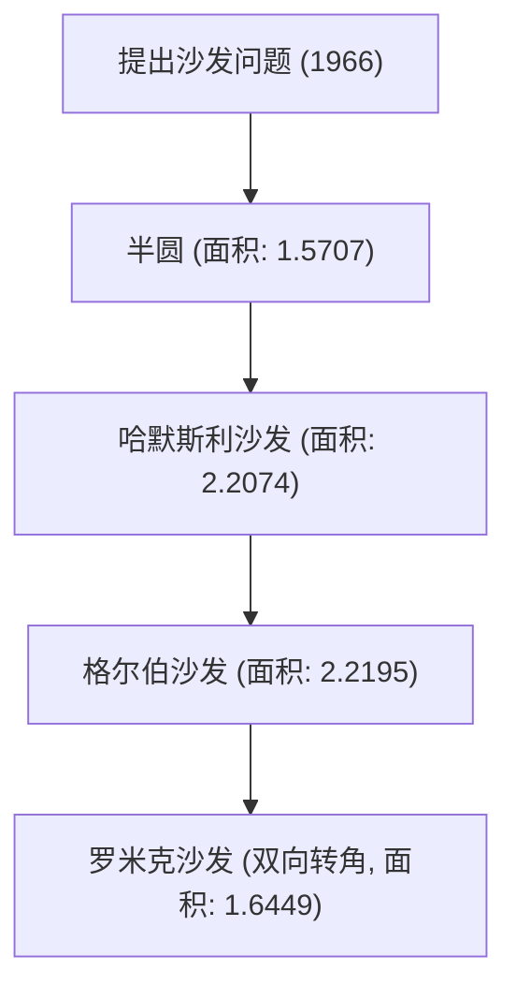

# 1. 简介：源自日常生活的终极难题

“能够拐过L型走廊直角的、面积最大的图形是什么？”
对于有过搬家搬沙发经历的人来说，这是一个极其现实的问题；但在数学界，它被称为“沙发问题（Moving sofa problem）”，是一个自1966年以来一直未解决的超级难题。

这个问题由奥地利裔加拿大数学家利奥·莫泽（Leo Moser）正式提出，乍一看简单到连中学生都能理解，但在半个多世纪里，它一次次击退了全世界天才数学家们的挑战。

本文将结合公式与图解，为你深入解析这个迷人几何问题的历史、迄今为止提出的各种方法，以及这个问题究竟难在哪里。

# 2. 问题的数学化表述

用严谨的数学语言来定义沙发问题，如下所述：

设 L 为两条宽度为 1 且成直角相交的走廊所构成的 L 型区域。假设平面内存在一个连通的闭区域 S（即沙发），它可以通过连续的刚体变换（平移和旋转）参数族，在不离开 L 内部的情况下，从一条走廊移动到另一条走廊。

在这种情况下，求 S 的最大面积（称为“沙发常数”）及其可实现的形状，这便是问题的核心所在。

### 2.1 约束条件的明确化
- **刚体**: 沙发在移动过程中不能变形。
- **连续移动**: 从初始位置到结束位置，沙发必须始终包含在走廊的内部。
- **二维问题**: 不考虑高度，将其视为二维平面上的问题。

# 3. 探索沙发常数：历史演变与下界的刷新

### 3.1 早期的尝试：半圆与正方形
最简单的形状是半径为 1 的半圆。其面积约为 1.5707。
另外，1×1 的正方形也可以拐过弯（面积为 1）。

### 3.2 约翰·哈默斯利的飞跃 (1968年)
英国数学家约翰·哈默斯利（John Hammersley）提出了一个突破性的想法：将半圆切开并在中间插入一个矩形，然后再挖去内部的一部分。这个“哈默斯利沙发”的面积为 $2/\pi + \pi/2 \approx 2.2074$，大幅提高了下界。

### 3.3 约瑟夫·格尔伯的优化 (1992年)
约瑟夫·格尔伯（Joseph Gerver）通过将哈默斯利沙发直线边界替换为平滑曲线，进一步扩大了面积。他推导出的面积约为 2.2195，并长期稳居已知最大面积（下界）的宝座。

# 4. 探索上界：沙发到底能有多大？

与刷新下界相反，想要证明“绝对不可能有比这更大的面积”即上界，则极其困难。

- **早期的上界**: 哈默斯利证明了面积的最大值不超过 $2\sqrt{2} \approx 2.8284$。
- **2017年的进展**: 通过加州大学戴维斯分校的丹·罗米克（Dan Romik）和尤夫·卡拉斯（Yoav Kallus）的研究，上界被降至 2.37。

目前的沙发常数被确认介于 2.2195 到 2.37 之间，但确切的数值至今仍未确定。

# 5. 罗米克的双向沙发 (2017年)

丹·罗米克提出了一种新的变体——“双向（ambidextrous）沙发”，它不仅能拐过 L 型走廊的一个角，还能适应左右两边的直角。经计算，这种情况下最大面积约为 1.6449，并且这一形状已被 3D 打印出的模型所证实。

# 6. 为什么沙发问题如此困难？

### 6.1 无限的自由度
由于需要同时优化形状和移动路径，计算机的搜索空间会变得无穷大。

### 6.2 缺乏解析解
目前已知的最优形状（格尔伯沙发）的边界并非简单的圆弧或抛物线，而是表现为非常复杂的非线性微分方程的解。因此，很难用解析法进行处理。

### 6.3 局部最优解的陷阱
在使用计算机进行数值优化时，很容易陷入无数的局部最优解（局部极小值），目前尚未建立能够找到真正全局最优解（全局极小值）的算法。

# 7. 未来展望

近年来，虽然已经开始尝试使用人工智能和机器学习来探索新的形状，但尚未达到数学上的严格证明。沙发问题是一个绝佳的例子，它向我们展示了人类直觉的不可靠性，以及简单的几何学是多么深奥。

如果在搬家时沙发卡在了转角处，请务必回想一下这个未解的数学问题。毕竟，你所经历的烦恼，与世界上最顶尖的数学家们都无法解决的永恒难题，有着相同的本质。
