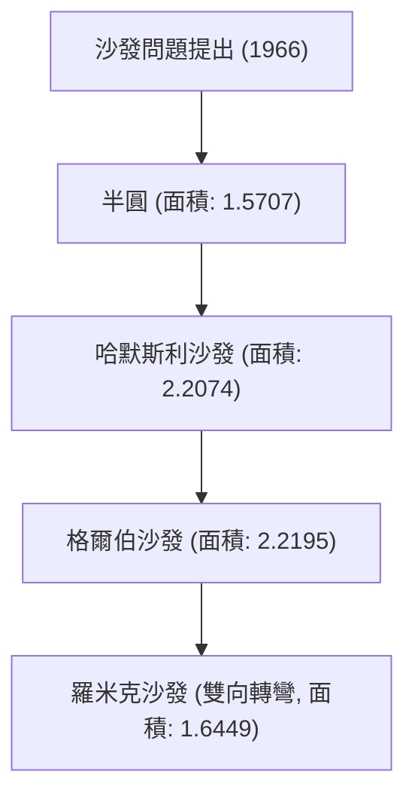

# 1. 簡介：誕生於日常生活的終極難題

「能夠轉過L型走廊直角的、面積最大的圖形是什麼？」
這是任何有過搬沙發經驗的人都會面臨的實際問題，但在數學世界中，這被稱為「沙發問題（Moving sofa problem）」，是一個自1966年以來懸而未決的超級難題。

這個問題由奧地利裔加拿大數學家李奧·莫澤（Leo Moser）正式提出，乍看之下連國中生都能理解，但半個多世紀以來，它持續擊退了世界各地天才數學家們的挑戰。

本文將透過數學公式和圖解，徹底解說這個迷人幾何問題的歷史、迄今為止提出的各種方法，以及這個問題為何如此困難。

# 2. 問題的數學公式化

將沙發問題進行嚴格的數學定義，如下所示。

假設 L 為寬度為 1 的兩條走廊成直角相交的 L 型區域。平面內的一個連通閉區域 S（這就是沙發），可以透過剛體變換（平移和旋轉）的連續參數族，穿過 L 的內部從一條走廊移動到另一條走廊。

此時，求 S 的面積最大值（稱之為「沙發常數」）以及能實現該面積的形狀，這便是問題的核心。

### 2.1 限制條件的明確化
- **剛體**: 沙發在移動過程中不能變形。
- **連續移動**: 從初始位置到結束位置，沙發必須始終保持在走廊內部。
- **二維問題**: 不考慮高度，作為二維平面上的問題來處理。

# 3. 尋找沙發常數：歷史演變與下限的更新

### 3.1 早期的挑戰：半圓與正方形
最簡單的形狀是半徑為 1 的半圓。其面積約為 1.5707。
此外，1×1 的正方形也能夠轉彎（面積 1）。

### 3.2 約翰·哈默斯利的突破 (1968年)
英國數學家約翰·哈默斯利（John Hammersley）提出了一個突破性的想法：將半圓切開，在中間插入一個矩形，並將內部挖空。這個「哈默斯利沙發」的面積為 $2/\pi + \pi/2 \approx 2.2074$，大幅提高了下限。

### 3.3 約瑟夫·格爾伯的最佳化 (1992年)
約瑟夫·格爾伯（Joseph Gerver）透過將哈默斯利沙發的直線邊界替換為平滑曲線，進一步擴大了面積。他導出的面積約為 2.2195，很長一段時間這都是已知最大的面積（下限）。

# 4. 尋找上限：沙發到底能有多大？

與更新下限形成鮮明對比的是，證明「絕對不可能有比這更大的面積」這個上限非常困難。

- **早期的上限**: 哈默斯利證明了面積的最大值不大於 $2\sqrt{2} \approx 2.8284$。
- **2017年的進展**: 根據加州大學戴維斯分校的丹·羅米克（Dan Romik）和尤夫·卡拉斯（Yoav Kallus）的研究，上限被降低到了 2.37。

目前已知沙發常數介於 2.2195 到 2.37 之間，但確切的值至今仍未被確定。

# 5. 羅米克的雙向沙發 (2017年)

丹·羅米克提出了一個新的變體「雙向沙發（Ambidextrous sofa）」，它不僅能轉過L型的一個角，還能轉過左右兩個角。在這種情況下，計算出的最大面積約為 1.6449，這個形狀也透過3D列印建立的模型得到了證實。

# 6. 為什麼沙發問題如此困難？

### 6.1 無限的自由度
由於必須同時最佳化形狀和移動路徑，因此電腦尋找的空間變得無限大。

### 6.2 缺乏解析解
目前已知最佳形狀（格爾伯沙發）的邊界並非簡單的圓弧或拋物線，而是表示為非常複雜的非線性微分方程式的解。因此，要進行解析處理極為困難。

### 6.3 局部最佳解的陷阱
在使用電腦進行數值最佳化時，很容易陷入無數的局部最佳解（Local minimum），目前尚未建立能找出真正全域最佳解（Global minimum）的演算法。

# 7. 未來展望

近年來，也開始嘗試使用人工智慧和機器學習來尋找新的形狀，但尚未達成數學上的嚴格證明。沙發問題是一個極佳的例子，說明了人類的直覺有多不可靠，以及簡單的幾何學可以有多麼深奧。

下次搬家時如果沙發卡在轉角，請回想起這個未解的數學難題。因為你的這份辛勞，與世界頂尖數學家們無法解決的永恆難題，有著相同的本質。
