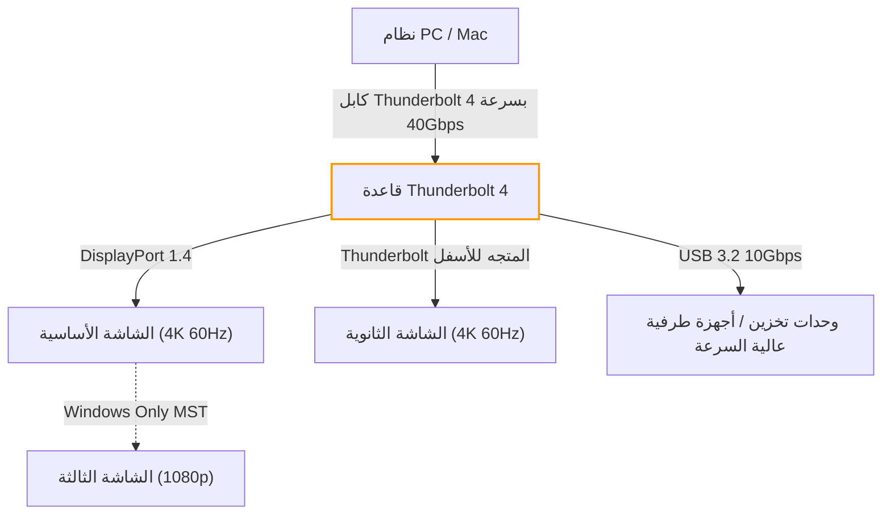
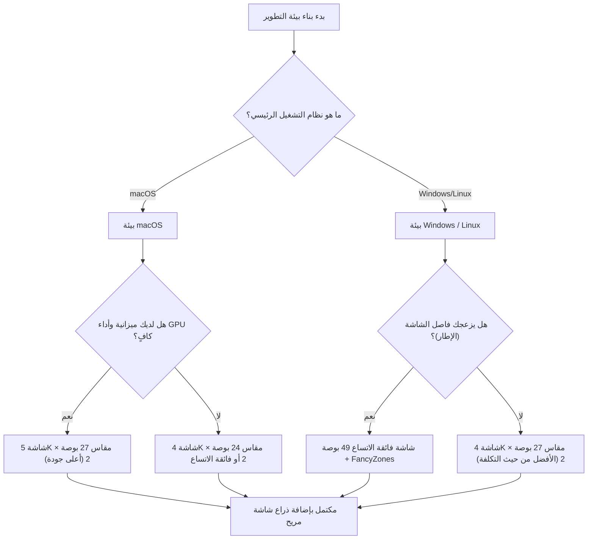

# الترتيب والحل الأمثل للشاشات المتعددة لزيادة كفاءة التطوير

في هندسة البرمجيات الحديثة، يرتبط تحسين بيئة التطوير مباشرة بزيادة الإنتاجية. على وجه الخصوص، "بيئة الشاشة" التي نقضي فيها معظم يومنا تتجاوز كونها مجرد جهاز لعرض المعلومات، وتعمل كـ "عقل خارجي" أو "مساحة عمل ممتدة" للمهندس. مع الانفجار في كمية المعلومات التي يجب الرجوع إليها في وقت واحد، مثل المحرر، سطر الأوامر، المتصفح، أدوات الدردشة، ومصحح الأخطاء، لا مفر من القول إن العمل بشاشة واحدة يعد إهداراً للموارد المعرفية.

ومع ذلك، لا يتعلق الأمر ببساطة بزيادة عدد الشاشات. من الضروري استنباط "الحل الأمثل" من وجهات نظر متعددة، بما في ذلك الترتيب المادي، هندسة الرؤية (بيئة العمل)، مواصفات التحجيم لكل نظام تشغيل، وحسابات النطاق الترددي لمعايير الاتصال. في هذه المقالة، سنقوم بتحليل كل هذه العناصر بالتفصيل ونقدم دليلاً كاملاً لبناء بيئة شاشات متعددة نهائية من منظور علمي وهندسي.

---

## 1. هندسة الرؤية وبيئة العمل: نهج من منظور مادي

عند التفكير في ترتيب الشاشات، أول ما يجب مراعاته هو الحدود الجسدية والفسيولوجية للإنسان. أثناء جلسات البرمجة الطويلة، يؤدي الترتيب غير المناسب للشاشات إلى إجهاد العين، تصلب الكتفين، واضطرابات خطيرة في العمود الفقري العنقي.

### 1.1 حركة العين السريعة (Saccade) والحمل المعرفي

عندما تنقل عين الإنسان بصرها من نقطة إلى أخرى، فإنها تقوم بحركة عين سريعة جداً تُعرف باسم "حركة العين السريعة" (Saccadic eye movement). خلال هذه الحركة، يقوم الدماغ فعلياً بإيقاف تشغيل المعلومات البصرية (كبت حركة العين السريعة)، وتتوقف معالجة المعلومات مؤقتاً.

الوقت المستغرق لحركة العين السريعة $T_{saccade}$ يعتمد على زاوية الحركة (Amplitude)، ويُعبر عنه تقريبياً بالمعادلة التالية:

$$ T_{saccade} = 2.2 \times \theta + 21 \text{ [ms]} $$

هنا، $\theta$ هي زاوية حركة خط الرؤية (بالدرجات). على سبيل المثال، عند نقل خط الرؤية من طرف إلى طرف آخر في شاشتين متباعدتين للغاية ($\theta = 40^\circ$)، يستغرق الأمر حوالي 109 مللي ثانية. هذا بحد ذاته جزء من الثانية، ولكن عندما يحدث آلاف المرات في اليوم، فإنه يؤدي إلى حمل معرفي وتراكم للإرهاق لا يمكن تجاهله.

لذلك، يجب دائماً وضع منطقة العمل الرئيسية (مثل المحرر) في الأمام (ضمن نطاق $\theta < 15^\circ$)، وتقليل سعة حركة العين السريعة إلى الحد الأدنى كأساس لهندسة الرؤية.

### 1.2 العبء على العمود الفقري العنقي وفيزياء ارتفاع وزاوية الشاشة

يزن رأس الإنسان حوالي 5 إلى 6 كجم. كلما زادت زاوية الرقبة (زاوية الانثناء)، زاد الحمل (عزم الدوران) على العمود الفقري العنقي بشكل هندسي. عندما تكون زاوية الرقبة $\phi$، يتم تقريب الحمل الفعال للوزن $W_{effective}$ على العمود الفقري العنقي من حساب العزم المادي على النحو التالي:

$$ W_{effective} \approx W_{head} + k \times \sin(\phi) $$

وفقاً للبحوث الطبية، عندما تكون زاوية الرقبة 0 درجة (مستقيمة)، يكون الحمل حوالي 5 كجم، ولكن عند إمالتها بمقدار 15 درجة يصبح الحمل حوالي 12 كجم، وعند 30 درجة حوالي 18 كجم، وعند 45 درجة يصل إلى 22 كجم من الحمل الواقع على العمود الفقري العنقي. هذا هو السبب في أن وضعية النظر إلى أسفل نحو شاشة الكمبيوتر المحمول تسبب ما يسمى بـ "الرقبة المستقيمة".

في بيئة الشاشات المتعددة، الحل الأمثل هو ضبط الحافة العلوية للشاشة الرئيسية باستخدام ذراع الشاشة لتكون في مستوى العين أو أسفل قليلاً (حوالي 0 إلى 5 درجات للأسفل). أيضاً، عند وضع شاشات جانبية، يجب أن تكون منحنية أو موضوعة بزاوية بحيث لا تتجاوز زاوية دوران الرقبة 30 درجة.

### 1.3 تحسين مجال الرؤية (FOV) وأهمية الشاشات المنحنية (Curvature)

يُقال إن مجال الرؤية الفعال للإنسان (النطاق الذي يمكن فيه معالجة المعلومات على الفور) يبلغ حوالي 30 درجة أفقياً. عند النظر إلى شاشة مسطحة كبيرة (مثل 32 بوصة أو أكبر) من مسافة قريبة (حوالي 60 سم)، يتغير البعد البؤري عند النظر إلى حواف الشاشة، مما يضع عبئاً كبيراً على عضلات التركيز في العين (العضلة الهدبية).

التغيير في المسافة من وسط الشاشة إلى الحافة $\Delta d$، بافتراض أن مسافة المشاهدة هي $D$ ونصف عرض الشاشة هو $w$، يكون على النحو التالي:

$$ \Delta d = \sqrt{D^2 + w^2} - D $$

الإجراء المتبع لتقريب $\Delta d$ إلى الصفر هو استخدام "الشاشة المنحنية" (Curved Monitor). عندما يتطابق نصف قطر الانحناء $R$ (مثال: 1500R = نصف قطر 1500 مم) مع مسافة المشاهدة $D$، تصبح جميع النقاط على الشاشة متساوية البعد عن العين، مما يقلل بشكل كبير من إجهاد العين.

---

## 2. دراسة مقارنة لتكوينات الشاشة: شاشتان مقابل ثلاث مقابل شاشة فائقة الاتساع

بناءً على فهمنا لبيئة العمل المادية، سنقوم بمقارنة وتقييم أنماط تكوينات الشاشة المناسبة للمطورين المعاصرين.

### 2.1 شاشتان (مثال: 27 بوصة 4K × 2)

هذا هو التكوين الأكثر شيوعاً. عند وضعهما جنباً إلى جنب، يأتي الإطار (bezel) في المنتصف، مما يتطلب إمالة الرقبة دائماً إما إلى اليسار أو اليمين. لتجنب ذلك، يوصى بوضع شاشة واحدة في الأمام (الرئيسية) والأخرى بزاوية (الفرعية)، أو تكديسهما رأسياً (تكوين مكدس).

- **المزايا:** تقسيم مادي واضح للشاشة. سهولة في إدارة تطبيقات ملء الشاشة.
- **العيوب:** الإطار المركزي يقسم مجال الرؤية. حمل دوراني عالي على الرقبة.

### 2.2 تكوين ثلاث شاشات

تكوين يتم فيه وضع الشاشة الرئيسية في الأمام والشاشات الفرعية على اليسار واليمين، أو تكوين تكون فيه إحدى الشاشات موضوعة بشكل عمودي (رأسي). يسمح ذلك بفصل مراقبة السجلات، التوثيق، والبرمجة بالكامل.

- **المزايا:** كمية هائلة من المعلومات. لا يوجد إطار في المنتصف.
- **العيوب:** يستهلك مساحة كبيرة من المكتب. أكثر عرضة لقيود منافذ الإخراج وعرض النطاق الترددي لبطاقة الرسوميات.

### 2.3 شاشة فائقة الاتساع (مثال: 49 بوصة 5120x1440)

تكوين يوفر نفس مساحة شاشتي 27 بوصة WQHD متصلتين أفقياً بدون إطار. هذا هو الاتجاه الحديث، ويحقق أفضل توازن بين بيئة العمل وكمية المعلومات.

فيما يلي مخطط جانت (Gantt chart) يوضح نموذج توفير الوقت عند استخدام شاشة فائقة الاتساع. إنه يصور تقليل الوقت المستغرق في تبديل النوافذ وتبديل السياق.

```mermaid
gantt
    title "مقارنة وقت تبديل السياق بين الشاشة فائقة الاتساع والشاشتين"
    dateFormat  s
    axisFormat  %S
    
    section "شاشتان"
    "المهمة أ (المحرر)"        :a1, 0, 5s
    "البحث/تبديل النافذة"     :a2, after a1, 2s
    "المهمة ب (الطرفية)"      :a3, after a2, 5s
    "البحث/تبديل النافذة"     :a4, after a3, 2s
    
    section "شاشة فائقة الاتساع 49 بوصة"
    "المهمة أ (المحرر)"        :b1, 0, 5s
    "لمحة (بدون تبديل)"     :b2, after b1, 0.5s
    "المهمة ب (الطرفية)"      :b3, after b2, 5s
```

---

## 3. رياضيات كثافة البكسل (PPI) ومواصفات التحجيم لنظام التشغيل

عند اختيار شاشة، من المهم للغاية فهم ليس فقط الدقة (مثل 4K) ولكن أيضاً "كثافة البكسل" (PPI: Pixels Per Inch). خاصة في بيئة macOS، يؤدي اختيار PPI الخاطئ إلى انخفاض الأداء وضبابية النص.

### 3.1 معادلة حساب كثافة البكسل (PPI)

يتم حساب PPI بالمعادلة التالية من الحجم المادي للشاشة (طول القطر $d$ بالبوصة) والدقة (أفقي $w$ بكسل، عمودي $h$ بكسل).

$$ PPI = \frac{\sqrt{w^2 + h^2}}{d} $$

على سبيل المثال، دعونا نحسب PPI لشاشة "27 بوصة 4K (3840x2160)" الشهيرة بين المطورين.

$$ PPI = \frac{\sqrt{3840^2 + 2160^2}}{27} = \frac{\sqrt{14745600 + 4665600}}{27} = \frac{\sqrt{19411200}}{27} \approx \frac{4405.8}{27} \approx 163.18 \text{ PPI} $$

### 3.2 الاختلافات في آلية التحجيم بين macOS و Windows

المشكلة هنا هي آلية تحجيم (تكبير/تصغير) واجهة المستخدم الخاصة بنظام التشغيل.

**في حالة Windows:**
يعتمد Windows تحجيم واجهة مستخدم مبني على المتجهات (DPI scaling)، ويعيد رسم عناصر واجهة المستخدم مباشرة وفقاً للنسبة المئوية المحددة (مثال: 150%). لذلك، حتى مع شاشة 27 بوصة 4K بكثافة 163 PPI، إذا قمت بتعيين التحجيم إلى 150%، فسيتم عرضها بوضوح نسبي وبأقل تأثير على الأداء.

**في حالة macOS:**
تم تصميم macOS تاريخياً لاستهداف 110 PPI (بدون Retina) أو 220 PPI (مع Retina). يعتمد تحجيم واجهة المستخدم (الدقة الزائفة) في macOS على رسم واجهة المستخدم في مخزن مؤقت (لوحة افتراضية) بدقة كبيرة جداً أولاً، ثم تقليص حجمها (downscaling) بواسطة وحدة معالجة الرسومات (GPU) وتعيينها على وحدات البكسل المادية.

على سبيل المثال، إذا اخترت دقة زائفة "مكافئة لـ WQHD (2560x1440)" على شاشة 27 بوصة 4K (163 PPI)، فإن macOS يقوم داخلياً بعرض الشاشة بضعف تلك الدقة، أي 5120x2880 بكسل (5K)، ثم يقوم بتقليصها (معامل التحجيم $\approx 0.75$) لإخراجها بدقة 3840x2160 (4K). تتسبب عملية الاستيفاء غير الصحيح للبكسل هذه في المشاكل التالية:

1. **إهدار موارد وحدة معالجة الرسومات (GPU):** نظراً لأنه يقوم دائماً بعرض 5K، فإنه يضع عبئاً كبيراً على وحدة معالجة الرسومات المدمجة في الكمبيوتر المحمول بشكل خاص، مما يزيد من توليد الحرارة واستهلاك البطارية.
2. **ضبابية النص (Blurriness):** نظراً لأنه ليس مضاعفاً صحيحاً كاملاً (مثل 2.0x)، فإن منع التعرج (anti-aliasing) على مستوى البكسل الفرعي يصبح غير دقيق، وتصبح حواف الخطوط ضبابية قليلاً.

لهذا السبب، للحصول على أفضل تجربة في macOS، فإن "الحل الأمثل" هو اختيار شاشة 5K مقاس 27 بوصة (5120x2880 = حوالي 218 PPI)، أو شاشة 4K مقاس 24 بوصة (حوالي 183 PPI، وهو أقرب إلى التحجيم الصحيح للدقة الزائفة).

---

## 4. النطاق الترددي للاتصال والسلسلة التعاقبية (Daisy Chain): حدود Thunderbolt 4 و DP MST

عند توصيل عدة شاشات عالية الدقة، تصبح سعة نقل البيانات (النطاق الترددي) للكابل عنق زجاجة. المشاكل مثل "اشتريت شاشة ولكن معدل التحديث يصل إلى 30 هرتز فقط" ناتجة عن حسابات غير كافية للنطاق الترددي.

### 4.1 نموذج حساب النطاق الترددي لإشارة الفيديو

يمكن تصميم معدل بيانات النطاق الترددي $R$ (بت في الثانية) المطلوب لإرسال إشارات الفيديو إلى الشاشة بالمعادلة التالية.

$$ R = W \times H \times F \times C \times B $$

هنا، المتغيرات هي كما يلي:
- $W$: الدقة الأفقية (Width)
- $H$: الدقة العمودية (Height)
- $F$: معدل التحديث (Hz, Frame rate)
- $C$: عمق اللون، عدد البتات لكل بكسل (Color depth, إذا كان 8-bit RGB فهو $8 \times 3 = 24$، وإذا كان 10-bit HDR فهو $10 \times 3 = 30$)
- $B$: العبء الإضافي لفترة الطمس (Blanking overhead, حوالي 1.05 إلى 1.15 في توقيت VESA القياسي)

كمثال، سنحسب معدل البيانات غير المضغوط المطلوب لشاشة واحدة بمواصفات "4K (3840x2160)، 60Hz، ألوان 10-bit" (بافتراض أن معامل العبء الإضافي $B = 1.05$).

$$ R = 3840 \times 2160 \times 60 \times 30 \times 1.05 \approx 15,676,416,000 \text{ bps} \approx 15.68 \text{ Gbps} $$

### 4.2 بناء بيئة باستخدام Thunderbolt 4 ومفتاح KVM

يبلغ الحد الأقصى للنطاق الترددي لـ Thunderbolt 4 مقدار 40 جيجابت في الثانية، ولكن نظراً لأنه يشارك أيضاً في اتصالات بيانات PCIe وغيرها، لا يمكن تخصيص النطاق الترددي بالكامل لإخراج الفيديو. عند بناء بيئة 4K 60Hz مزدوجة (حوالي 31.3 جيجابت في الثانية)، فإنك تدفع أداء قاعدة Thunderbolt 4 إلى أقصى حدوده.

في بيئة Windows، يمكنك استخدام ميزة MST (Multi-Stream Transport) الخاصة بـ DisplayPort لإرسال إشارات إلى شاشات متعددة في سلسلة تعاقبية (daisy chain) من منفذ واحد. ومع ذلك، فإن macOS لا يدعم الامتداد (Extend) بواسطة MST في مواصفاته، وإذا قمت بتوصيلها بسلسلة تعاقبية، فستكون جميعها "متطابقة (نفس الشاشة)". إذا كنت تريد إعداد شاشة مزدوجة على macOS، فيجب عليك دائماً توصيل كابلات من منافذ منفصلة على جهاز الكمبيوتر نفسه أو قاعدة Thunderbolt.

يوضح مخطط انسيابي Mermaid أدناه بنية توجيه الإشارة المثالية من جهاز كمبيوتر شخصي أو Mac عبر قاعدة Thunderbolt.

---

## 5. أتمتة إدارة النوافذ: دليل الإعداد حسب نظام التشغيل

بغض النظر عن مدى روعة بيئة الشاشة المادية التي تقوم ببنائها، إذا كنت تقوم بسحب النوافذ وتغيير حجمها بالماوس، فلن يتم تحقيق أقصى قدر من كفاءة التطوير. من الضروري تقديم "مدير نوافذ" يقسم مساحة الشاشة الشاسعة بشكل منطقي ويقوم بمحاذاة النوافذ على الفور باستخدام اختصارات لوحة المفاتيح.

### 5.1 Windows: PowerToys FancyZones

في Windows، تعد ميزة "FancyZones" المضمنة في الأداة الرسمية من Microsoft "PowerToys" هي الحل الأقوى. تتيح لك تحديد شبكات أكثر تعقيداً وقابلية للتخصيص من ميزة محاذاة Windows الافتراضية (Win + مفاتيح الأسهم).

بالنسبة للشاشات فائقة الاتساع (مثال: 32:9)، فإن التكوين الأمثل للمطورين هو تقسيم الشاشة إلى ثلاثة أجزاء "يسار 25٪، وسط 50٪، يمين 25٪" بدلاً من تقسيمها إلى نصفين بسيطين. يتم وضع المحرر والمتصفح الرئيسي في الوسط بنسبة 50٪ (16:9)، ويتم وضع سطر الأوامر وأدوات الدردشة والمراجع على اليسار واليمين.

باستخدام FancyZones، يمكنك سحب نافذة مع الاستمرار في الضغط على مفتاح Shift، أو تجاوز سلوك "Win + مفاتيح الأسهم" لوضع النوافذ في مناطق مخصصة في لمح البصر. يؤدي هذا إلى تقليل الوقت المستغرق في عمليات الماوس المرتبطة بتبديل السياق إلى الصفر تقريباً.

### 5.2 macOS: إدارة النوافذ المبلطة باستخدام Yabai و Amethyst

يحتوي macOS بشكل قياسي على ميزة محاذاة نوافذ ضعيفة (*على الرغم من تحسنها في macOS Sequoia*)، وهناك العديد من المستخدمين الذين يقدمون "مدير نوافذ مبلط" (Tiling Window Manager) يشبه Linux.

تشمل الأدوات التمثيلية "Yabai" و "Amethyst".

- **Amethyst:** يعمل بمجرد تثبيته ويوفر إدارة تلقائية للبلاط تشبه Xmonad. يوصى به إذا كنت تريد البدء بسهولة.
- **Yabai:** يسمح بتخصيص أكثر تقدماً، ولكنه يتطلب تعطيل جزء من SIP (حماية تكامل النظام). يمكنك التحكم الكامل في البيئة من خلال البرامج النصية (yabairc)، مثل إدارة المساحات (أجهزة سطح المكتب الافتراضية)، رسم حدود النوافذ، ومعالجة الشفافية.

عند استخدام Yabai، يتم تكوينه جنباً إلى جنب مع برنامج خفي (daemon) لمفاتيح الاختصار يسمى `skhd`. يوضح ما يلي تدفق العمليات المفاهيمي لنقل التركيز وتبديل النوافذ على الفور.

من خلال الاستفادة الكاملة من هذه الأدوات، يمكنك الوصول على الفور إلى أي مكان في مساحة الشاشة المتعددة الشاسعة والاستمرار في كتابة التعليمات البرمجية دون رفع يديك عن لوحة المفاتيح.

---

## 6. الخلاصة: ما هو "الحل الأمثل" بالنسبة لك

في بناء بيئة شاشات متعددة، لا توجد إجابة واحدة صحيحة تناسب الجميع. ومع ذلك، من خلال الرجوع إلى المخطط الانسيابي أدناه، يمكنك استنباط حل أمثل منطقي مصمم خصيصاً لأسلوب التطوير الخاص بك.

بمجرد شراء شاشة، فإنها تصبح بنية تحتية ستستمر في دعم إنتاجيتك لسنوات عديدة. يرجى دمج مبادئ هندسة الرؤية، رياضيات PPI، حدود النطاق الترددي، وإدارة النوافذ البرمجية المشروحة في هذه المقالة لبناء مساحة العمل النهائية دون مساومة. يجب أن يكون هذا، نتيجة لذلك، أقصر طريق لإنتاج أفضل كود برمجي.
