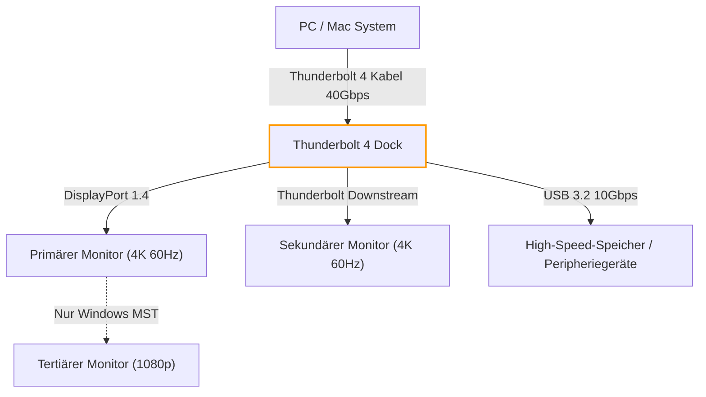
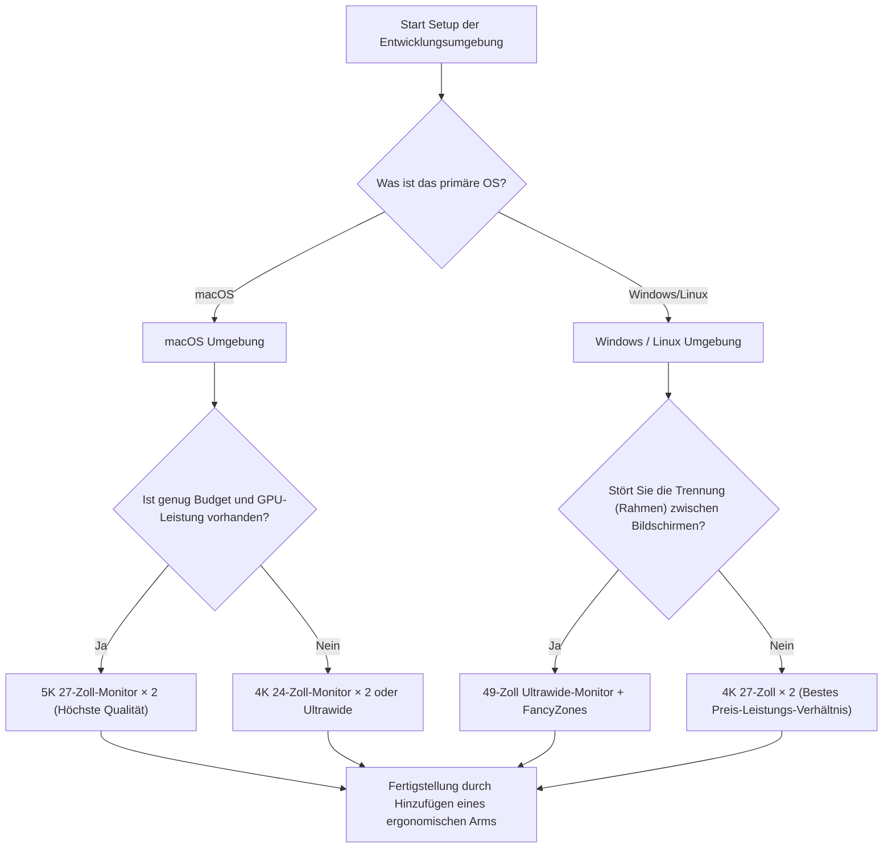

# Maximierung der Entwicklungseffizienz: Das optimale Multi-Display-Setup

In der modernen Softwareentwicklung führt die Optimierung der Entwicklungsumgebung direkt zu einer Steigerung der Produktivität. Insbesondere die "Display-Umgebung", in der wir den Großteil des Tages verbringen, fungiert über ein bloßes Informationsanzeigegerät hinaus als "externes Gehirn" oder "erweiterter Arbeitsbereich" des Ingenieurs. Da die Menge an Informationen, die gleichzeitig referenziert werden müssen – wie Editoren, Terminals, Browser, Chat-Tools und Debugger –, explosionsartig ansteigt, muss die Arbeit mit einem einzigen Display als Verschwendung kognitiver Ressourcen betrachtet werden.

Es reicht jedoch nicht aus, einfach die Anzahl der Displays zu erhöhen. Wir müssen die "optimale Lösung" aus mehreren Perspektiven ableiten: physische Anordnung, visuelle Ergonomie, OS-spezifische Skalierungsspezifikationen und Bandbreitenberechnungen für Verbindungsstandards. In diesem Artikel werden wir all diese Elemente im Detail aufschlüsseln und einen vollständigen Leitfaden zum Aufbau der ultimativen Multi-Display-Umgebung mit einem wissenschaftlichen und technischen Ansatz bieten.

---

## 1. Visuelle Ergonomie: Ein physikalischer Ansatz

Bei der Betrachtung der Display-Anordnung sind in erster Linie die physischen und physiologischen Grenzen des menschlichen Körpers zu berücksichtigen. In langen Coding-Sessions kann eine falsche Display-Anordnung zu Augenbelastung, steifen Schultern und schweren Halswirbelsäulenproblemen (Zervikalwirbelsäule) führen.

### 1.1 Sakkaden (schnelle Augenbewegungen) und kognitive Belastung

Wenn das menschliche Auge den Blick von einem Punkt zum anderen bewegt, führt es sehr schnelle Augenbewegungen aus, die "Sakkaden" genannt werden. Während dieser Sakkaden schaltet das Gehirn visuelle Informationen tatsächlich ab (sakkadische Suppression), und die Informationsverarbeitung wird vorübergehend gestoppt.

Die für eine Sakkade benötigte Zeit $T_{saccade}$ hängt vom Bewegungswinkel (Amplitude) ab und kann näherungsweise durch folgende Formel ausgedrückt werden:

$$ T_{saccade} = 2.2 \times \theta + 21 \text{ [ms]} $$

Hier ist $\theta$ der Blickbewegungswinkel (in Grad). Wenn Sie beispielsweise Ihren Blick von einem Ende eines extrem weit entfernten Dual-Displays zum anderen bewegen ($\theta = 40^\circ$), dauert dies etwa 109 ms. Dies an sich ist nur ein Moment, aber wenn es tausende Male am Tag auftritt, führt es zu einer nicht zu vernachlässigenden kognitiven Belastung und Ermüdung.

Daher ist es ein ergonomisches Grundprinzip, den Hauptarbeitsbereich (z. B. den Editor) immer direkt vor sich (im Bereich von $\theta < 15^\circ$) zu platzieren und die Amplitude der Sakkaden zu minimieren.

### 1.2 Belastung der Halswirbelsäule und die Physik von Displayhöhe und -winkel

Der menschliche Kopf wiegt etwa 5 bis 6 kg. Mit zunehmendem Nackenwinkel (Beugewinkel) steigt die Belastung (Drehmoment) auf die Halswirbelsäule exponentiell an. Wenn der Nackenwinkel $\phi$ ist, kann die effektive Gewichtsbelastung $W_{effective}$ auf die Halswirbelsäule aus der Berechnung des physikalischen Moments wie folgt approximiert werden:

$$ W_{effective} \approx W_{head} + k \times \sin(\phi) $$

Medizinischen Studien zufolge beträgt die Belastung bei einem Nackenwinkel von 0 Grad (aufrecht) etwa 5 kg. Wenn er jedoch um 15 Grad geneigt wird, beträgt die Belastung etwa 12 kg, bei 30 Grad etwa 18 kg und bei 45 Grad etwa 22 kg auf die Halswirbelsäule. Dies ist der Grund, warum die Haltung, bei der man auf einen Laptop-Bildschirm hinunterschaut, einen "Geierhals" (Straight Neck) verursacht.

In einer Multi-Display-Umgebung ist die optimale Lösung, den Monitorarm so einzustellen, dass sich die Oberkante des Hauptdisplays auf Augenhöhe oder leicht darunter (etwa 0 bis 5 Grad nach unten) befindet. Wenn Sie seitliche Monitore platzieren, sollten diese ebenfalls gebogen oder angewinkelt sein, damit der Drehwinkel des Halses 30 Grad nicht überschreitet.

### 1.3 Sichtfeldoptimierung (FOV) und die Bedeutung gebogener Displays (Curvature)

Das effektive menschliche Sichtfeld (der Bereich, in dem Informationen sofort verarbeitet werden können) soll horizontal etwa 30 Grad betragen. Wenn man einen großen flachen Bildschirm (z. B. 32 Zoll oder mehr) aus kurzer Entfernung (etwa 60 cm) betrachtet, ändert sich die Brennweite beim Blick auf die Ränder des Bildschirms, was eine starke Belastung der Fokussiermuskeln (Ziliarmuskeln) der Augen bedeutet.

Die Änderung der Entfernung $\Delta d$ von der Mitte zum Rand des Bildschirms, bei einer Betrachtungsentfernung $D$ und der halben Bildschirmbreite $w$, ist wie folgt:

$$ \Delta d = \sqrt{D^2 + w^2} - D $$

Die Maßnahme, um dieses $\Delta d$ nahe Null zu bringen, ist ein "gebogenes Display (Curved Monitor)". Wenn der Krümmungsradius $R$ (z. B. 1500R = 1500 mm Radius) mit der Betrachtungsentfernung $D$ übereinstimmt, sind alle Punkte auf dem Bildschirm gleich weit vom Auge entfernt, wodurch die Augenbelastung drastisch reduziert werden kann.

---

## 2. Vergleich von Display-Konfigurationen: Dual vs Triple vs Ultrawide

Nachdem wir die physische Ergonomie verstanden haben, wollen wir Muster von Display-Konfigurationen vergleichen und bewerten, die für moderne Entwickler geeignet sind.

### 2.1 Dual-Monitor (Beispiel: 27 Zoll 4K × 2)

Dies ist die Standardkonfiguration. Wenn sie nebeneinander platziert werden, befindet sich der Rahmen in der Mitte, sodass man den Kopf ständig nach links oder rechts neigen muss. Um dies zu vermeiden, empfiehlt es sich, einen direkt vor sich (Hauptmonitor) und den anderen diagonal (Nebenmonitor) zu platzieren oder sie vertikal zu stapeln (Stack-Konfiguration).

- **Vorteile:** Klare physische Bildschirmaufteilung. Einfache Verwaltung von Vollbildanwendungen.
- **Nachteile:** Der Rahmen in der Mitte teilt das Sichtfeld. Hohe Rotationsbelastung des Halses.

### 2.2 Triple-Monitor-Konfiguration

Eine Konfiguration, bei der der Hauptmonitor in der Mitte platziert wird und Nebenmonitore links und rechts, oder eine Konfiguration, bei der ein Monitor vertikal platziert wird (Hochformat). Die Protokollüberwachung, Dokumentation und Codierung können vollständig getrennt werden.

- **Vorteile:** Überwältigende Menge an Informationen. Kein Rahmen in der Mitte.
- **Nachteile:** Verbraucht viel Platz auf dem Schreibtisch. Anfällig für Einschränkungen bei Ausgangsanschlüssen und Bandbreite von Grafikkarten.

### 2.3 Ultrawide-Monitor (Beispiel: 49 Zoll 5120x1440)

Dies ist eine Konfiguration, die den gleichen Bereich wie zwei horizontal verbundene 27-Zoll-WQHD-Monitore bietet, aber ohne Rahmen (Bezel-less). Es ist der jüngste Trend und bietet die beste Balance zwischen Ergonomie und Informationsmenge.

Unten sehen Sie ein Gantt-Diagramm, das ein Modell zur Zeitersparnis durch die Einführung eines Ultrawide-Monitors zeigt. Es visualisiert die Reduzierung der Zeit, die für den Wechsel von Fenstern und Kontextwechsel aufgewendet wird.

```mermaid
gantt
    title "Vergleich der Kontextwechselzeit: Ultrawide vs. Dual Monitor"
    dateFormat  s
    axisFormat  %S
    
    section "Dual Monitor"
    "Aufgabe A (Editor)"        :a1, 0, 5s
    "Fenster finden/wechseln"   :a2, after a1, 2s
    "Aufgabe B (Terminal)"      :a3, after a2, 5s
    "Fenster finden/wechseln"   :a4, after a3, 2s
    
    section "49-Zoll Ultrawide"
    "Aufgabe A (Editor)"        :b1, 0, 5s
    "Blick (kein Wechsel)"      :b2, after b1, 0.5s
    "Aufgabe B (Terminal)"      :b3, after b2, 5s
```

---

## 3. Die Mathematik der Pixeldichte (PPI) und OS-Skalierungsspezifikationen

Bei der Auswahl eines Displays ist es äußerst wichtig, nicht nur die Auflösung (wie 4K), sondern auch die "Pixeldichte (PPI: Pixels Per Inch)" zu verstehen. Insbesondere in macOS-Umgebungen führt die Wahl des falschen PPI zu Leistungseinbußen und verschwommenem Text.

### 3.1 Berechnungsformel für Pixeldichte (PPI)

PPI wird aus der physischen Größe des Displays (diagonale Länge $d$ in Zoll) und der Auflösung (horizontal $w$ Pixel, vertikal $h$ Pixel) unter Verwendung der folgenden Formel berechnet.

$$ PPI = \frac{\sqrt{w^2 + h^2}}{d} $$

Lassen Sie uns beispielsweise den PPI eines unter Entwicklern beliebten "27-Zoll 4K-Monitors (3840x2160)" berechnen.

$$ PPI = \frac{\sqrt{3840^2 + 2160^2}}{27} = \frac{\sqrt{14745600 + 4665600}}{27} = \frac{\sqrt{19411200}}{27} \approx \frac{4405.8}{27} \approx 163.18 \text{ PPI} $$

### 3.2 Unterschiede in den Skalierungsmechanismen zwischen macOS und Windows

Das Problem hierbei ist, wie das Betriebssystem die UI-Skalierung handhabt.

**Unter Windows:**
Windows verwendet eine vektorbasierte UI-Skalierung (DPI-Skalierung) und zeichnet UI-Elemente direkt entsprechend dem angegebenen Prozentsatz (z. B. 150%) neu. Daher wird die Anzeige selbst bei einem 27-Zoll-4K-Monitor mit 163 PPI relativ sauber mit geringen Leistungseinbußen gerendert, wenn man eine 150%ige Skalierung einstellt.

**Unter macOS:**
macOS wurde historisch gesehen für 110 PPI (Nicht-Retina) oder 220 PPI (Retina) entwickelt. Die UI-Skalierung (Pseudo-Auflösung) in macOS verfolgt den Ansatz, die UI einmal in einen Puffer mit sehr hoher Auflösung (virtuelle Leinwand) zu rendern und ihn dann durch die GPU zu verkleinern (Downscaling), um ihn auf physische Pixel abzubilden.

Wenn Sie beispielsweise eine Pseudo-Auflösung wählen, die "WQHD (2560x1440) entspricht" auf einem 27-Zoll-4K (163 PPI), rendert macOS den Bildschirm intern in 5K (5120x2880 Pixel) – was der doppelten Größe entspricht – und verkleinert (Skalierungsfaktor $\approx 0.75$) ihn zur Ausgabe auf 3840x2160 (4K). Dieser nicht-ganzzahlige Pixelinterpolationsprozess verursacht die folgenden Probleme:

1. **Verschwendung von GPU-Ressourcen:** Da ständig 5K-Rendering durchgeführt wird, wird insbesondere die integrierte GPU in Laptops stark belastet, was die Wärmeentwicklung und den Akkuverbrauch erhöht.
2. **Verschwommener Text (Blurriness):** Da es kein perfektes ganzzahliges Vielfaches ist (wie 2,0x), wird das Anti-Aliasing auf Subpixel-Ebene ungenau und Schriftkanten erscheinen leicht unscharf.

Um das beste Erlebnis unter macOS zu erzielen, ist die "optimale Lösung" daher die Wahl eines 5K-Monitors bei 27 Zoll (5120x2880 = ca. 218 PPI) oder eines 4K-Monitors bei 24 Zoll (ca. 183 PPI, was einer ganzzahligen Skalierung der Pseudo-Auflösung näher kommt).

---

## 4. Verbindungsbandbreite und Daisy-Chaining: Die Grenzen von Thunderbolt 4 und DP MST

Beim Anschluss mehrerer hochauflösender Monitore wird die Datenübertragungskapazität (Bandbreite) des Kabels zum Flaschenhals. Probleme wie "Ich habe einen Monitor gekauft, aber die Bildwiederholfrequenz erreicht nur 30 Hz" werden durch unzureichende Bandbreitenberechnungen verursacht.

### 4.1 Berechnungsmodell für Videosignalbandbreite

Die Bandbreitendatenrate $R$ (bps), die zum Senden eines Videosignals an ein Display benötigt wird, kann mit der folgenden Formel modelliert werden:

$$ R = W \times H \times F \times C \times B $$

Hier sind die einzelnen Variablen:
- $W$: Horizontale Auflösung (Width)
- $H$: Vertikale Auflösung (Height)
- $F$: Bildwiederholfrequenz (Hz, Frame rate)
- $C$: Farbtiefe (Color depth, Anzahl der Bits pro Pixel. Bei 8-Bit RGB ist dies $8 \times 3 = 24$, bei 10-Bit HDR $10 \times 3 = 30$)
- $B$: Blanking-Overhead (Bei VESA-Standard-Timing etwa 1,05 bis 1,15)

Als Beispiel berechnen wir die unkomprimierte Datenrate, die für einen "4K (3840x2160), 60Hz, 10-Bit Farbe"-Monitor benötigt wird (unter der Annahme eines Overhead-Faktors $B = 1.05$).

$$ R = 3840 \times 2160 \times 60 \times 30 \times 1.05 \approx 15,676,416,000 \text{ bps} \approx 15.68 \text{ Gbps} $$

### 4.2 Aufbau einer Umgebung mit Thunderbolt 4 und KVM-Switches

Die maximale Bandbreite von Thunderbolt 4 beträgt 40 Gbps, aber da auch PCIe-Datenkommunikation darüber läuft, kann nicht die gesamte Bandbreite für die Videoausgabe genutzt werden. Beim Aufbau einer dualen 4K-60Hz-Umgebung (ca. 31,3 Gbps) reizen Sie die Leistung des Thunderbolt-4-Docks bis ans Limit aus.

In einer Windows-Umgebung können Sie die MST-Funktion (Multi-Stream Transport) von DisplayPort nutzen, um Signale von einem einzigen Port im Daisy-Chain-Verfahren an mehrere Monitore zu senden. Jedoch unterstützt macOS spezifikationsgemäß keine Erweiterung (Extend) über MST. Bei einer Daisy-Chain-Verbindung werden alle Bildschirme nur "gespiegelt (Mirroring)". Wenn Sie in macOS einen Dual-Monitor-Setup einrichten möchten, müssen Sie die Kabel von separaten Ports am PC oder Thunderbolt-Dock verlegen.

Das folgende Mermaid-Flussdiagramm zeigt die ideale Signalrouting-Struktur von einem PC/Mac über ein Thunderbolt-Dock.

---

## 5. Automatisierung der Fensterverwaltung: OS-spezifischer Einrichtungsleitfaden

Egal, wie gut die physische Display-Umgebung ist, die Entwicklungseffizienz wird nicht maximiert, wenn Sie Fenster immer noch mit der Maus ziehen und in der Größe verändern. Die Einführung eines "Window-Managers", der große Bildschirmbereiche logisch unterteilt und es ermöglicht, Fenster sofort über Tastenkombinationen einrasten zu lassen, ist unerlässlich.

### 5.1 Windows: PowerToys FancyZones

Unter Windows ist "FancyZones", das im offiziellen Microsoft-Tool "PowerToys" enthalten ist, die beste Lösung. Sie können komplexere und besser anpassbare Raster definieren als mit der Standard-Windows-Snap-Funktion (Win + Pfeiltasten).

Bei Ultrawide-Monitoren (z. B. 32:9) ist eine Konfiguration optimal für Entwickler, bei der der Bildschirm nicht einfach in zwei, sondern in drei Teile unterteilt wird: "Links 25 %, Mitte 50 %, Rechts 25 %". Der Haupteditor oder Browser wird in den mittleren 50 % (16:9) platziert, und Terminals, Chat-Tools und Referenzen werden auf der linken und rechten Seite platziert.

In FancyZones können Sie die Umschalt-Taste gedrückt halten, während Sie ein Fenster ziehen, oder das Verhalten von "Win + Pfeiltaste" überschreiben, um Fenster sofort in benutzerdefinierten Zonen zu platzieren. Dadurch wird die Zeit, die mit Mausbedienung für Kontextwechsel verbracht wird, auf nahezu null reduziert.

### 5.2 macOS: Kachel-Fensterverwaltung mit Yabai und Amethyst

macOS hat standardmäßig schwache Fenster-Snap-Funktionen (obwohl es in macOS Sequoia verbessert wird), und viele Benutzer installieren einen Linux-ähnlichen "Tiling Window Manager".

Typische Tools sind "Yabai" und "Amethyst".

- **Amethyst:** Funktioniert direkt nach der Installation und bietet eine automatische Kachelverwaltung ähnlich wie Xmonad. Empfohlen, wenn Sie einfach anfangen möchten.
- **Yabai:** Ermöglicht erweiterte Anpassungen, erfordert jedoch die Deaktivierung eines Teils der SIP (System Integrity Protection). Sie können die Umgebung über ein Skript (yabairc) vollständig steuern, einschließlich Raumverwaltung (virtuelle Desktops), Fensterrahmenzeichnung und Transparenzverarbeitung.

Bei der Verwendung von Yabai wird es in Kombination mit einem Hotkey-Daemon namens `skhd` konfiguriert. Nachfolgend sehen Sie einen konzeptionellen Arbeitsablauf für sofortige Fokusverschiebungen oder Fensterwechsel.

Durch die Beherrschung dieser Werkzeuge können Sie sofort auf jeden Bereich der großen Multi-Display-Fläche zugreifen und weiter Code schreiben, ohne die Hände von der Tastatur nehmen zu müssen.

---

## 6. Fazit: Was ist für Sie die "optimale Lösung"?

Es gibt keine einzelne richtige Antwort, die für jeden beim Aufbau einer Multi-Display-Umgebung gilt. Wenn Sie sich jedoch auf das folgende Flussdiagramm beziehen, können Sie eine logische, optimale Lösung finden, die zu Ihrem Entwicklungsstil passt.

Displays sind eine Infrastruktur, die Ihre Produktivität nach dem Kauf viele Jahre lang unterstützen wird. Bitte integrieren Sie die Prinzipien der visuellen Ergonomie, die Mathematik der PPI, Bandbreitengrenzen und softwarebasiertes Fenstermanagement, die in diesem Artikel erläutert wurden, um kompromisslos den bestmöglichen Arbeitsbereich zu schaffen. Letztendlich sollte dies der kürzeste Weg zur Erstellung des besten Codes sein.
