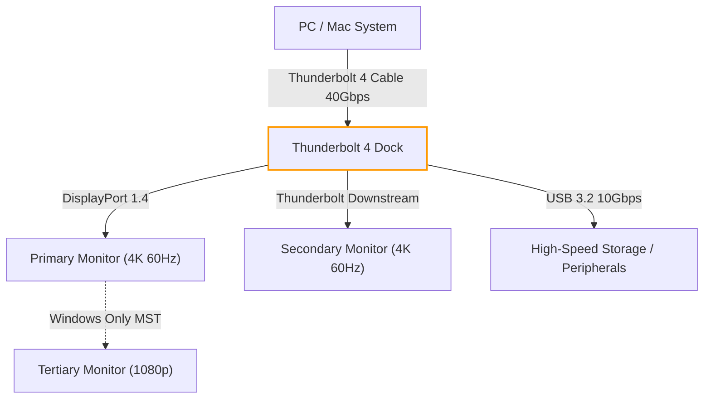
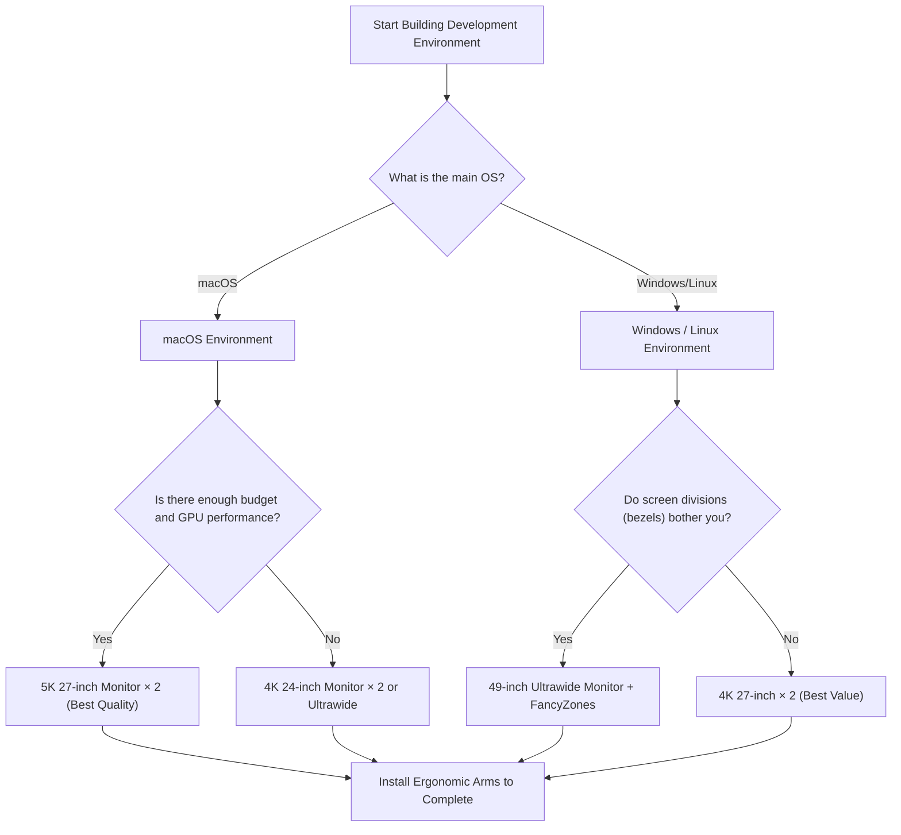

# Optimal Multi-Display Setup for Maximizing Development Efficiency

In modern software engineering, optimizing the development environment directly leads to improved productivity. In particular, the "display environment" where we spend most of our day functions as more than just an information display device; it acts as an engineer's "external brain" or "extended workspace." As the amount of information that needs to be referenced simultaneously—editors, terminals, browsers, chat tools, debuggers, etc.—explodes, working on a single display can only be described as a waste of cognitive resources.

However, simply increasing the number of displays is not the answer. It is necessary to derive the "optimal solution" from multiple perspectives, including physical arrangement, visual ergonomics, scaling specifications for each OS, and bandwidth calculations for connection standards. This article will thoroughly break down all of these elements and provide a complete guide to building the ultimate multi-display environment from a scientific and engineering approach.

---

## 1. Visual Ergonomics: A Physical Approach

When considering the arrangement of displays, the first thing to consider is the physical and physiological limits of the human body. During long coding sessions, an inappropriate display arrangement can cause eye strain, stiff shoulders, and serious cervical spine (neck) disorders.

### 1.1 Saccades (Rapid Eye Movements) and Cognitive Load

When human eyes move their gaze from one point to another, they perform very fast eye movements called "saccadic eye movements." During these saccades, the brain actually shuts down visual information (saccadic suppression), temporarily halting information processing.

The time $T_{saccade}$ required for a saccade depends on the angle of movement (Amplitude) and is approximately expressed by the following formula:

$$ T_{saccade} = 2.2 \times \theta + 21 \text{ [ms]} $$

Here, $\theta$ is the visual movement angle (degrees). For example, when moving the gaze from one end to the other of extremely distant dual displays ($\theta = 40^\circ$), it takes about 109ms. This itself is instantaneous, but when it happens thousands of times a day, it leads to cognitive load and fatigue accumulation that cannot be ignored.

Therefore, the visual ergonomic basic is to always place the main work area (such as the editor) in front (within the range of $\theta < 15^\circ$) and minimize the amplitude of the saccade.

### 1.2 Physics of Cervical Spine Load and Display Height/Angle

The human head weighs about 5 to 6 kg. As the neck angle (flexion angle) increases, the load (torque) on the cervical spine increases geometrically. Assuming the neck angle is $\phi$, the effective weight load $W_{effective}$ on the cervical spine is approximated from the calculation of physical moments as follows:

$$ W_{effective} \approx W_{head} + k \times \sin(\phi) $$

According to medical studies, when the neck angle is 0 degrees (upright), the load is about 5 kg, but when tilted 15 degrees, a load of about 12 kg is applied to the cervical spine, about 18 kg at 30 degrees, and about 22 kg at 45 degrees. This is the reason why looking down at a laptop screen causes "straight neck."

In a multi-display environment, the optimal solution is to adjust it with a monitor arm so that the top edge of the main display is at eye level or slightly below (about 0 to 5 degrees down). Also, when placing side monitors, they need to be curved or placed at an angle so that the neck rotation angle does not exceed 30 degrees.

### 1.3 Optimization of Field of View (FOV) and the Significance of Curved Monitors

The effective visual field of humans (the range where information processing can be performed instantly) is said to be about 30 degrees horizontally. When looking at a large flat display (e.g., 32 inches or more) from a very close distance (about 60 cm), the focal length changes when looking at the edge of the screen, placing a heavy burden on the eye's focus adjustment muscles (ciliary muscles).

The change in distance $\Delta d$ from the center of the screen to the edge is given by the following formula, where $D$ is the viewing distance and $w$ is half the width of the screen:

$$ \Delta d = \sqrt{D^2 + w^2} - D $$

A measure to bring this $\Delta d$ close to zero is the "Curved Monitor." When the radius of curvature $R$ (e.g., 1500R = radius of 1500mm) matches the viewing distance $D$, all points on the screen become equidistant from the eyes, dramatically reducing eye strain.

---

## 2. Comparison of Display Configurations: Dual vs Triple vs Ultrawide

Having understood physical ergonomics, we will compare and evaluate display configuration patterns suitable for modern developers.

### 2.1 Dual Monitors (e.g., 27-inch 4K × 2)

This is the most standard configuration. When placed side by side, the bezel is in the center, so you constantly need to tilt your neck to the left or right. To avoid this, it is recommended to place one directly in front (main) and the other diagonally (sub), or stack them vertically (stacked configuration).

- **Pros:** Clear physical screen division. Easy to manage full-screen apps.
- **Cons:** The center bezel divides the field of view. High rotational load on the neck.

### 2.2 Triple Monitor Configuration

A configuration with the main monitor in front and subs on the left and right, or a configuration with one monitor placed vertically (portrait). Log monitoring, documentation, and coding can be completely separated.

- **Pros:** Overwhelming amount of information. No bezel in the center.
- **Cons:** Consumes a lot of desk space. Susceptible to graphics board output terminal and bandwidth limitations.

### 2.3 Ultrawide Monitors (e.g., 49-inch 5120x1440)

A configuration that provides the same area as two 27-inch WQHD monitors connected horizontally, but seamlessly without bezels. It is a recent trend and strikes the best balance between ergonomics and information volume.

Below is a Gantt chart showing a model of time saved by introducing an ultrawide monitor. It visualizes the reduction in time spent switching windows and context switching.

```mermaid
gantt
    title "Context Switch Time Comparison: Ultrawide vs Dual Monitor"
    dateFormat  s
    axisFormat  %S
    
    section "Dual Monitor"
    "Task A (Editor)"        :a1, 0, 5s
    "Find/Switch Window"     :a2, after a1, 2s
    "Task B (Terminal)"      :a3, after a2, 5s
    "Find/Switch Window"     :a4, after a3, 2s
    
    section "49-inch Ultrawide"
    "Task A (Editor)"        :b1, 0, 5s
    "Glance (No Switch)"     :b2, after b1, 0.5s
    "Task B (Terminal)"      :b3, after b2, 5s
```

---

## 3. The Mathematics of Pixel Density (PPI) and OS Scaling Specifications

When choosing a display, it is extremely important to understand not only the resolution (such as 4K) but also the "Pixel Density (PPI: Pixels Per Inch)." Especially in a macOS environment, choosing the wrong PPI will cause performance degradation and blurry text.

### 3.1 Pixel Density (PPI) Calculation Formula

PPI is calculated from the physical size of the display (diagonal length $d$ inches) and resolution (horizontal $w$ pixels, vertical $h$ pixels) using the following formula:

$$ PPI = \frac{\sqrt{w^2 + h^2}}{d} $$

For example, let's calculate the PPI of a "27-inch 4K monitor (3840x2160)," which is popular among developers.

$$ PPI = \frac{\sqrt{3840^2 + 2160^2}}{27} = \frac{\sqrt{14745600 + 4665600}}{27} = \frac{\sqrt{19411200}}{27} \approx \frac{4405.8}{27} \approx 163.18 \text{ PPI} $$

### 3.2 Differences in Scaling Mechanisms Between macOS and Windows

The problem here is the OS's UI scaling mechanism.

**For Windows:**
Windows uses vector-based UI scaling (DPI scaling), directly redrawing UI elements to match the specified percentage (e.g., 150%). Therefore, even on a 163 PPI 27-inch 4K monitor, if you set the scaling to 150%, it will display relatively cleanly with little performance penalty.

**For macOS:**
Historically, macOS was designed targeting 110 PPI (non-Retina) or 220 PPI (Retina). The macOS UI scaling (pseudo-resolution) takes the approach of rendering the UI once to a very large resolution buffer (virtual canvas) and then reducing (downscaling) it via the GPU to map to the physical pixels.

For example, if you select a pseudo-resolution "equivalent to WQHD (2560x1440)" on a 27-inch 4K (163 PPI), macOS internally renders the screen at twice that, 5120x2880 pixels (5K), and outputs it by reducing it to 3840x2160 (4K) (scaling factor $\approx 0.75$). This non-integer pixel interpolation process causes the following problems:

1. **Wasted GPU Resources:** Because 5K rendering is constantly performed, a heavy load is placed on the integrated GPU of laptops in particular, increasing heat generation and battery consumption.
2. **Blurriness in Text:** Because it is not a perfect integer multiple (such as 2.0x), anti-aliasing becomes inaccurate at the subpixel level, making font edges slightly blurry.

For this reason, to get the best experience on macOS, the "optimal solution" is to choose a 5K monitor for 27 inches (5120x2880 = approx. 218 PPI), or a 4K monitor for 24 inches (approx. 183 PPI, close to integer scaling of the pseudo-resolution).

---

## 4. Connection Bandwidth and Daisy Chaining: Limits of Thunderbolt 4 and DP MST

When connecting multiple high-resolution monitors, the data transmission capacity (bandwidth) of the cables becomes a bottleneck. Problems like "I bought a monitor, but the refresh rate is only 30Hz" are caused by insufficient bandwidth calculations.

### 4.1 Video Signal Bandwidth Calculation Model

The bandwidth data rate $R$ (bps) required to send video signals to a display can be modeled with the following formula:

$$ R = W \times H \times F \times C \times B $$

Here, each variable is as follows:
- $W$: Horizontal resolution (Width)
- $H$: Vertical resolution (Height)
- $F$: Refresh rate (Hz, Frame rate)
- $C$: Color depth (bits per pixel, for 8-bit RGB $8 \times 3 = 24$, for 10-bit HDR $10 \times 3 = 30$)
- $B$: Blanking overhead (approx. 1.05 to 1.15 in VESA standard timing)

As an example, calculate the uncompressed data rate required for one "4K (3840x2160), 60Hz, 10-bit color" monitor (assuming overhead factor $B = 1.05$).

$$ R = 3840 \times 2160 \times 60 \times 30 \times 1.05 \approx 15,676,416,000 \text{ bps} \approx 15.68 \text{ Gbps} $$

### 4.2 Building an Environment with Thunderbolt 4 and KVM Switches

The maximum bandwidth of Thunderbolt 4 is 40 Gbps, but because PCIe data communication also shares this, not all the bandwidth can be allocated to video output. When building a dual 4K 60Hz environment (approx. 31.3 Gbps), you are pushing the performance of a Thunderbolt 4 dock to its limit.

In a Windows environment, you can use the DisplayPort MST (Multi-Stream Transport) feature to daisy-chain signals from one port to multiple monitors. However, macOS does not support extension via MST by design, so if you daisy-chain, they will all be "mirrored (same screen)." When setting up dual monitors on macOS, you must always route cables from separate ports on the PC or Thunderbolt dock.

The Mermaid flowchart below shows the ideal signal routing structure from a PC/Mac through a Thunderbolt dock.

---

## 5. Window Management Automation: OS-Specific Setup Guide

No matter how excellent a physical display environment you build, if you are dragging and resizing windows with a mouse, your development efficiency is not maximized. It is essential to introduce a "window manager" that logically divides the vast screen area and instantly snaps windows into place with shortcut keys.

### 5.1 Windows: PowerToys FancyZones

In Windows, "FancyZones," included in Microsoft's official tool "PowerToys," is the strongest solution. You can define grids that are more complex and customizable than the default Windows snap feature (Win + Arrow keys).

For an ultrawide monitor (e.g., 32:9), rather than simply dividing the screen in two, dividing it into three sections—"Left 25%, Center 50%, Right 25%"—is optimal for developers. Place the main editor or browser in the center 50% (16:9), and place terminals, chat tools, and references on the left and right.

With FancyZones, you can hold down the Shift key and drag a window, or override the "Win + Arrow keys" behavior, to instantly snap windows into custom zones. This can reduce the time spent on mouse operations associated with context switching to almost zero.

### 5.2 macOS: Tiling Window Management with Yabai and Amethyst

By default, macOS has weak window snapping features (though this is improving with macOS Sequoia), and many users introduce Linux-like "Tiling Window Managers."

Representative tools include "Yabai" and "Amethyst."

- **Amethyst:** Works just by installing it, providing husk/Xmonad-like automatic tile management. Recommended if you want to get started easily.
- **Yabai:** Allows for more advanced customization, but requires disabling a part of SIP (System Integrity Protection). You can fully control the environment through scripts (yabairc), such as managing spaces (virtual desktops), drawing window borders, and handling transparency.

When using Yabai, it is configured in combination with a hotkey daemon called `skhd`. Below is a conceptual operational flow for instantly shifting focus or swapping windows.

By mastering these tools, you can instantly access anywhere in your vast multi-display area without ever taking your hands off the keyboard, allowing you to continuously write code.

---

## 6. Conclusion: What is Your "Optimal Solution"?

There is no single correct answer for everyone when building a multi-display environment. However, by referring to the flowchart below, you can derive a logical optimal solution tailored to your development style.

A display is an infrastructure that will support your productivity for many years once purchased. Please integrate the principles of visual ergonomics, the math of PPI, the limits of bandwidth, and software-based window management explained in this article to build the ultimate uncompromising workspace. That should, as a result, become the shortest route to producing your best code.
