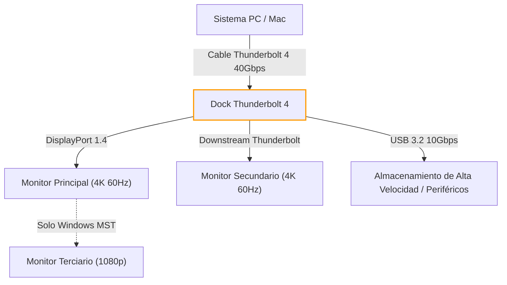
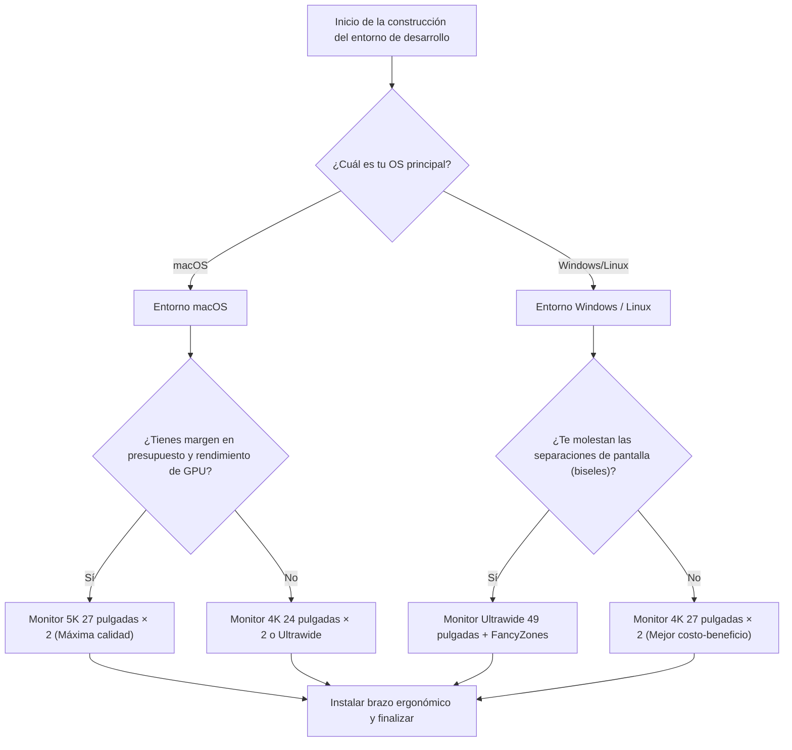

# Maximizando la eficiencia de desarrollo: disposición y solución óptima para múltiples pantallas

En la ingeniería de software moderna, la optimización del entorno de desarrollo se traduce directamente en una mejora de la productividad. En particular, el "entorno de visualización" donde pasamos la mayor parte del día funciona como un "cerebro externo" o "espacio de trabajo ampliado" del ingeniero, más allá de ser un simple dispositivo para mostrar información. Ante el aumento explosivo de la información que debemos consultar simultáneamente —como editores, terminales, navegadores, herramientas de chat, depuradores, etc.—, trabajar con una sola pantalla ya no puede considerarse más que un desperdicio de recursos cognitivos.

Sin embargo, no se trata simplemente de aumentar el número de pantallas. Es necesario encontrar la "solución óptima" desde múltiples perspectivas: disposición física, ergonomía visual, especificaciones de escalado de cada sistema operativo (OS) y cálculos del ancho de banda de los estándares de conexión. En este artículo, desglosaremos todos estos elementos a fondo y ofreceremos una guía completa para construir el entorno de múltiples pantallas definitivo, desde un enfoque científico y de ingeniería.

---

## 1. Ergonomía visual y física: Un enfoque desde la disposición

Al considerar la disposición de las pantallas, lo primero a tener en cuenta son los límites físicos y fisiológicos del cuerpo humano. En largas sesiones de programación, una mala disposición de la pantalla provoca fatiga visual, rigidez en los hombros y problemas cervicales graves.

### 1.1 Movimientos sacádicos y carga cognitiva

Cuando los ojos humanos mueven la mirada de un punto a otro, realizan un movimiento ocular extremadamente rápido llamado "movimiento sacádico" (Saccadic eye movement). Durante este movimiento sacádico, de hecho el cerebro "apaga" la información visual (supresión sacádica) y el procesamiento de información se detiene temporalmente.

El tiempo que toma el movimiento sacádico, $T_{saccade}$, depende de la amplitud del ángulo de movimiento (Amplitude) y se aproxima con la siguiente fórmula:

$$ T_{saccade} = 2.2 \times \theta + 21 \text{ [ms]} $$

Donde $\theta$ es el ángulo de movimiento de la mirada (en grados). Por ejemplo, al mover la vista de un extremo a otro en una configuración de monitores duales muy separados ($\theta = 40^\circ$), tarda aproximadamente 109 ms. Aunque esto es un instante en sí mismo, cuando ocurre miles de veces al día, se traduce en una carga cognitiva y una acumulación de fatiga que no se pueden ignorar.

Por lo tanto, la zona de trabajo principal (como el editor) debe colocarse siempre al frente (en un rango de $\theta < 15^\circ$), y minimizar la amplitud sacádica es la base de la ergonomía visual.

### 1.2 Carga sobre la columna cervical y física de la altura y el ángulo de la pantalla

La cabeza humana pesa alrededor de 5 a 6 kg. A medida que aumenta el ángulo del cuello (ángulo de flexión), la carga (torque) sobre la columna cervical se incrementa geométricamente. Si el ángulo del cuello es $\phi$, la carga de peso efectiva en la columna cervical $W_{effective}$ se aproxima mediante el cálculo del momento físico de la siguiente manera:

$$ W_{effective} \approx W_{head} + k \times \sin(\phi) $$

Según estudios médicos, la carga es de unos 5 kg cuando el cuello está a 0 grados (erguido), pero al inclinarlo 15 grados aumenta a unos 12 kg, a 30 grados unos 18 kg, y a 45 grados una carga de unos 22 kg recae sobre las cervicales. Esta es la razón por la que la postura de mirar hacia abajo a la pantalla de un portátil causa el "cuello recto" o síndrome del cuello de texto.

En un entorno de múltiples pantallas, la solución óptima es ajustar con un brazo de monitor para que el borde superior de la pantalla principal esté a la altura de los ojos, o ligeramente por debajo (aprox. 0 a 5 grados hacia abajo). Además, cuando se colocan monitores laterales, es necesario que estén curvados o colocados en un ángulo para que el ángulo de rotación del cuello no supere los 30 grados.

### 1.3 Optimización del campo de visión (FOV) y el significado de las pantallas curvas (Curvature)

Se dice que el campo de visión efectivo humano (el rango en el que la información puede ser procesada inmediatamente) es de unos 30 grados horizontalmente. Cuando se mira una pantalla plana y grande (ej.: 32 pulgadas o más) a corta distancia (aprox. 60 cm), la distancia focal cambia al mirar a los bordes de la pantalla, lo que ejerce una gran presión sobre los músculos de acomodación ocular (músculo ciliar).

El cambio en la distancia desde el centro de la pantalla hacia los bordes, $\Delta d$, se expresa como sigue, asumiendo la distancia de visualización $D$ y la mitad del ancho de la pantalla $w$:

$$ \Delta d = \sqrt{D^2 + w^2} - D $$

La estrategia para acercar este $\Delta d$ a cero es el "monitor curvo" (Curved Monitor). Cuando el radio de curvatura $R$ (ej.: 1500R = radio de 1500 mm) coincide con la distancia de visualización $D$, todos los puntos de la pantalla quedan a la misma distancia de los ojos, reduciendo drásticamente la fatiga visual.

---

## 2. Comparación de configuraciones de pantallas: Dual vs Triple vs Ultrawide

Una vez comprendida la ergonomía física, evaluaremos y compararemos los patrones de configuración de pantallas adecuados para los desarrolladores modernos.

### 2.1 Monitor dual (ej.: 27 pulgadas 4K × 2)

Es la configuración más estándar. Si se colocan uno al lado del otro, el bisel quedará en el centro, obligando a inclinar el cuello constantemente hacia la izquierda o la derecha. Para evitar esto, se recomienda colocar uno al frente (principal) y el otro en diagonal (secundario), o apilarlos verticalmente (configuración Stack).

- **Ventajas:** División física de pantallas clara. Fácil gestión de aplicaciones a pantalla completa.
- **Desventajas:** El bisel central divide la visión. Alta carga de rotación para el cuello.

### 2.2 Configuración de triple monitor

Configuración con el monitor principal al frente y monitores secundarios a izquierda y derecha, o una configuración donde un monitor se coloca verticalmente (retrato). Permite separar completamente el monitoreo de registros, la documentación y la programación.

- **Ventajas:** Cantidad abrumadora de información. No hay bisel en el centro.
- **Desventajas:** Consume mucho espacio en el escritorio. Sujeto a limitaciones de ancho de banda y puertos de salida de la tarjeta gráfica.

### 2.3 Monitor ultrapanorámico (Ultrawide) (ej.: 49 pulgadas 5120x1440)

Es una configuración sin biseles que proporciona el mismo espacio que conectar dos monitores WQHD de 27 pulgadas uno al lado del otro. Es la tendencia reciente y ofrece el mejor equilibrio entre ergonomía y cantidad de información.

A continuación se muestra un diagrama de Gantt que modela el ahorro de tiempo al adoptar un monitor ultrapanorámico. Visualiza la reducción en el tiempo necesario para cambiar de ventana y el cambio de contexto (context switch).

```mermaid
gantt
    title "Comparación de tiempo de cambio de contexto: Ultrawide vs Monitor Dual"
    dateFormat  s
    axisFormat  %S
    
    section "Monitor Dual"
    "Tarea A (Editor)"        :a1, 0, 5s
    "Buscar/Cambiar Ventana"  :a2, after a1, 2s
    "Tarea B (Terminal)"      :a3, after a2, 5s
    "Buscar/Cambiar Ventana"  :a4, after a3, 2s
    
    section "Ultrawide 49 pulgadas"
    "Tarea A (Editor)"        :b1, 0, 5s
    "Vistazo (Sin Cambio)"    :b2, after b1, 0.5s
    "Tarea B (Terminal)"      :b3, after b2, 5s
```

---

## 3. Matemáticas de la densidad de píxeles (PPI) y especificaciones de escalado del OS

Al elegir un monitor, es fundamental comprender no solo la resolución (como 4K), sino también la "densidad de píxeles" (PPI: Pixels Per Inch). Especialmente en el entorno de macOS, una elección incorrecta de PPI puede causar degradación del rendimiento o texto borroso.

### 3.1 Fórmula para calcular la densidad de píxeles (PPI)

El PPI se calcula con la siguiente fórmula a partir del tamaño físico de la pantalla (longitud diagonal en pulgadas $d$) y la resolución (horizontal $w$ píxeles, vertical $h$ píxeles).

$$ PPI = \frac{\sqrt{w^2 + h^2}}{d} $$

Por ejemplo, calculemos el PPI de un "monitor 4K de 27 pulgadas (3840x2160)", muy popular entre los desarrolladores.

$$ PPI = \frac{\sqrt{3840^2 + 2160^2}}{27} = \frac{\sqrt{14745600 + 4665600}}{27} = \frac{\sqrt{19411200}}{27} \approx \frac{4405.8}{27} \approx 163.18 \text{ PPI} $$

### 3.2 Diferencias en los mecanismos de escalado entre macOS y Windows

El problema aquí es el mecanismo de escalado de la interfaz de usuario (UI) del sistema operativo.

**En el caso de Windows:**
Windows adopta un escalado de UI basado en vectores (escalado DPI) y redibuja directamente los elementos de la UI para que coincidan con el porcentaje especificado (ej.: 150%). Por lo tanto, incluso en un monitor 4K de 27 pulgadas con 163 PPI, si configuras el escalado al 150%, se mostrará de manera relativamente nítida y con poca penalización de rendimiento.

**En el caso de macOS:**
Históricamente, macOS ha sido diseñado para apuntar a 110 PPI (no Retina) o 220 PPI (Retina). El escalado de UI de macOS (resolución pseudo/escalada) toma un enfoque donde primero dibuja la UI en un búfer de resolución gigantesca (lienzo virtual) y luego la GPU lo reduce (downscale) para mapearlo a los píxeles físicos.

Por ejemplo, si eliges una pseudo-resolución "equivalente a WQHD (2560x1440)" en un monitor 4K de 27 pulgadas (163 PPI), internamente macOS renderiza la pantalla al doble de eso, a 5120x2880 píxeles (5K), y luego la reduce a 3840x2160 (4K) (factor de escalado $\approx 0.75$) para la salida. Este proceso de interpolación de píxeles con un múltiplo no entero causa los siguientes problemas:

1. **Desperdicio de recursos de GPU:** Como siempre se renderiza en 5K, ejerce una gran carga, especialmente en la GPU integrada de los portátiles, aumentando el calor y el consumo de batería.
2. **Texto borroso (Blurriness):** Como no es un múltiplo entero perfecto (como 2.0x), el anti-aliasing a nivel de subpíxel se vuelve inexacto y los bordes de las fuentes se ven ligeramente borrosos.

Por lo tanto, para obtener la mejor experiencia en macOS, la "solución óptima" es elegir un monitor 5K de 27 pulgadas (5120x2880 = aprox. 218 PPI) o un monitor 4K de 24 pulgadas (aprox. 183 PPI, que se acerca a un escalado entero de la pseudo-resolución).

---

## 4. Ancho de banda de conexión y Daisy Chain: Los límites de Thunderbolt 4 y DP MST

Al conectar múltiples monitores de alta resolución, la capacidad de transmisión de datos (ancho de banda) del cable se convierte en un cuello de botella. Problemas como "Compré un monitor, pero la frecuencia de actualización solo alcanza 30Hz" se deben a una falta de cálculo del ancho de banda.

### 4.1 Modelo de cálculo del ancho de banda de la señal de video

La tasa de datos de ancho de banda $R$ (bps) necesaria para enviar una señal de video a una pantalla se puede modelar con la siguiente fórmula:

$$ R = W \times H \times F \times C \times B $$

Donde cada variable es como sigue:
- $W$: Resolución horizontal (Width)
- $H$: Resolución vertical (Height)
- $F$: Frecuencia de actualización (Hz, Frame rate)
- $C$: Profundidad de color, bits por píxel (Color depth, para RGB de 8 bits es $8 \times 3 = 24$, para HDR de 10 bits es $10 \times 3 = 30$)
- $B$: Sobrecarga del período de borrado (Blanking overhead, aproximadamente 1.05 a 1.15 con la sincronización estándar VESA)

Como ejemplo, calculemos la tasa de datos sin comprimir necesaria para un monitor de "4K (3840x2160), 60Hz, color de 10 bits" (asumiendo un coeficiente de sobrecarga $B = 1.05$).

$$ R = 3840 \times 2160 \times 60 \times 30 \times 1.05 \approx 15,676,416,000 \text{ bps} \approx 15.68 \text{ Gbps} $$

### 4.2 Construcción del entorno con Thunderbolt 4 y switches KVM

El ancho de banda máximo de Thunderbolt 4 es de 40 Gbps, pero debido a que la comunicación de datos PCIe también lo comparte, no todo el ancho de banda puede ser asignado a la salida de video. Al construir un entorno dual 4K 60Hz (aprox. 31.3 Gbps), estarás llevando el rendimiento del dock Thunderbolt 4 a su límite.

En un entorno Windows, puedes usar la función MST (Multi-Stream Transport) de DisplayPort para encadenar (Daisy Chain) señales a múltiples monitores desde un solo puerto. Sin embargo, por especificación, macOS no soporta la extensión (Extend) mediante MST, y si se usa una conexión Daisy Chain, todo será "espejado (la misma pantalla)". Para usar monitores duales en macOS, siempre debes conectar los cables desde puertos separados en la computadora o en el dock Thunderbolt.

El siguiente diagrama de flujo de Mermaid muestra la estructura ideal de enrutamiento de señal desde una PC/Mac a través de un dock Thunderbolt.

---

## 5. Automatización de la gestión de ventanas: Guía de configuración por OS

Por muy maravilloso que sea el entorno físico de visualización que hayas construido, si estás arrastrando y redimensionando ventanas con el ratón, no estás maximizando la eficiencia de desarrollo. Es indispensable introducir un "gestor de ventanas" (Window Manager) que divida lógicamente la vasta área de la pantalla y ajuste las ventanas instantáneamente usando atajos de teclado.

### 5.1 Windows: PowerToys FancyZones

En Windows, la solución definitiva es "FancyZones", incluido en la herramienta oficial de Microsoft "PowerToys". Permite definir cuadrículas más complejas y personalizables que la función de anclaje (Snap) predeterminada de Windows (Tecla Win + flechas).

Para monitores ultrapanorámicos (ej.: 32:9), la configuración óptima para desarrolladores es dividir la pantalla en tres zonas: "izquierda 25% - centro 50% - derecha 25%", en lugar de una simple división por la mitad. El 50% central (16:9) aloja el editor o navegador principal, y a los lados se colocan la terminal, herramientas de chat y referencias.

Con FancyZones, puedes arrastrar ventanas mientras mantienes presionada la tecla Shift o sobreescribir el comportamiento de "Win + flechas" para acomodar las ventanas en tus zonas personalizadas en un instante. Esto reduce a casi cero el tiempo de operación del ratón asociado con el cambio de contexto.

### 5.2 macOS: Gestión de ventanas en mosaico (Tiling) con Yabai y Amethyst

macOS tiene una función estándar de anclaje de ventanas bastante débil (※aunque está mejorando en macOS Sequoia), y hay muchos usuarios que adoptan un "gestor de ventanas en mosaico" (Tiling Window Manager) similar a Linux.

Herramientas representativas incluyen "Yabai" y "Amethyst".

- **Amethyst:** Funciona solo con instalarlo y ofrece una gestión automática en mosaico similar a Xmonad en Haskell. Se recomienda para quienes desean comenzar fácilmente.
- **Yabai:** Permite una personalización más avanzada, pero requiere deshabilitar parcialmente SIP (System Integrity Protection). A través de scripts (yabairc), puedes controlar completamente el entorno, como la gestión de espacios (escritorios virtuales), dibujo de bordes de ventanas, procesos de transparencia, etc.

Si usas Yabai, la configuración se realiza en combinación con un demonio de teclas de acceso rápido llamado `skhd`. A continuación se muestra un flujo operativo conceptual para cambiar el enfoque (focus) o intercambiar ventanas al instante.

Al dominar estas herramientas, podrás acceder instantáneamente a cualquier parte de tu vasto entorno de múltiples pantallas sin siquiera quitar las manos del teclado, lo que te permitirá seguir escribiendo código ininterrumpidamente.

---

## 6. Conclusión: Cuál es la "solución óptima" para ti

No existe una única respuesta correcta aplicable a todos al construir un entorno de múltiples pantallas. Sin embargo, haciendo referencia al siguiente diagrama de flujo, podrás encontrar la solución lógica óptima adaptada a tu estilo de desarrollo.

Un monitor es una infraestructura que, una vez comprada, continuará apoyando tu productividad durante muchos años. Integra los principios de ergonomía visual, las matemáticas de los PPI, los límites del ancho de banda y la gestión de ventanas por software explicados en este artículo para construir el mejor espacio de trabajo sin compromisos. Ese debería ser el camino más corto para, en última instancia, producir el mejor código.
