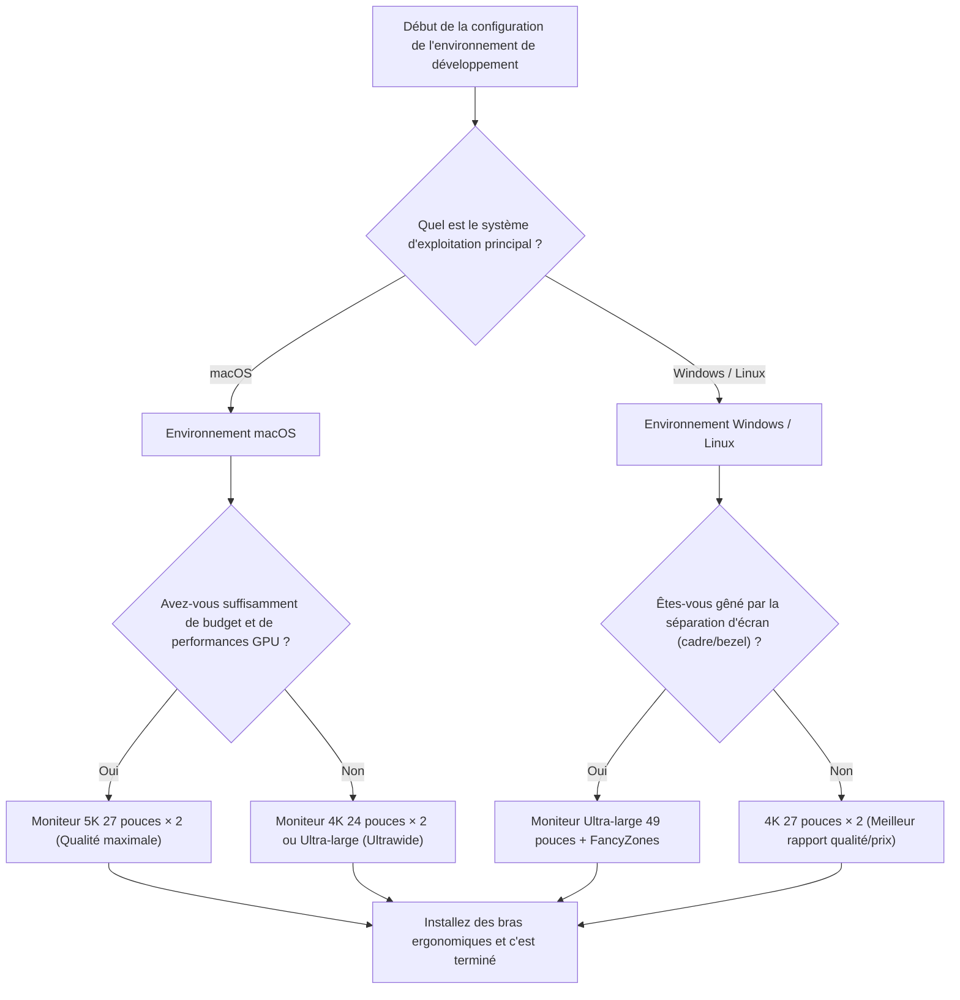

# Configuration et optimisation multi-écrans pour maximiser l'efficacité du développement

Dans l'ingénierie logicielle moderne, l'optimisation de l'environnement de développement est directement liée à l'amélioration de la productivité. En particulier, "l'environnement d'affichage" dans lequel nous passons la majeure partie de la journée va au-delà d'un simple dispositif d'affichage d'informations pour fonctionner comme le "cerveau externe" ou "l'espace de travail étendu" de l'ingénieur. Avec l'explosion des informations à consulter simultanément telles que les éditeurs, les terminaux, les navigateurs, les outils de discussion et les débogueurs, travailler avec un seul écran ne peut être qualifié que de gaspillage de ressources cognitives.

Cependant, il ne suffit pas de multiplier le nombre d'écrans. Il est nécessaire de trouver la "solution optimale" en abordant la question sous plusieurs angles : l'agencement physique, l'ergonomie visuelle, les spécifications de mise à l'échelle de chaque système d'exploitation et le calcul de la bande passante des normes de connexion. Cet article décompose tous ces éléments en détail et fournit un guide complet pour construire l'environnement multi-écrans ultime grâce à une approche scientifique et technique.

---

## 1. Ergonomie visuelle et physique de l'agencement

Lorsqu'on réfléchit à l'agencement des écrans, les limites physiques et physiologiques du corps humain doivent être prises en compte en premier lieu. Lors de longues sessions de codage, une mauvaise configuration des écrans peut provoquer une fatigue oculaire, des raideurs aux épaules et de graves troubles de la colonne cervicale.

### 1.1 Mouvement saccadé et charge cognitive

Lorsque l'œil humain déplace son regard d'un point à un autre, il effectue un mouvement oculaire très rapide appelé "mouvement saccadé" (Saccadic eye movement). Pendant cette saccade, le cerveau "éteint" en réalité les informations visuelles (suppression saccadique), et le traitement de l'information est temporairement suspendu.

Le temps requis pour une saccade, $T_{saccade}$, dépend de l'angle de mouvement (Amplitude) et est approximativement exprimé par la formule suivante :

$$ T_{saccade} = 2.2 \times \theta + 21 \text{ [ms]} $$

Ici, $\theta$ est l'angle de mouvement du regard (en degrés). Par exemple, déplacer le regard d'un bout à l'autre d'écrans doubles extrêmement espacés ($\theta = 40^\circ$) prend environ 109 ms. Bien que ce soit un instant, si cela se produit des milliers de fois par jour, cela entraîne une charge cognitive non négligeable et une accumulation de fatigue.

Par conséquent, la base de l'ergonomie visuelle est de toujours placer la zone de travail principale (comme l'éditeur) directement devant soi (dans une plage de $\theta < 15^\circ$) et de minimiser l'amplitude des saccades.

### 1.2 La charge sur la colonne cervicale et la physique de la hauteur et de l'angle de l'écran

La tête humaine pèse environ 5 à 6 kg. Plus l'angle du cou (angle de flexion) est grand, plus la charge (couple) sur la colonne cervicale augmente de manière géométrique. Si l'on désigne l'angle du cou par $\phi$, la charge de poids effective $W_{effective}$ sur la colonne cervicale est approximée par le calcul du moment physique suivant :

$$ W_{effective} \approx W_{head} + k \times \sin(\phi) $$

Selon des études médicales, lorsque l'angle du cou est de 0 degré (droit), la charge est d'environ 5 kg, mais si on l'incline de 15 degrés, elle passe à environ 12 kg, à 30 degrés, elle est d'environ 18 kg, et à 45 degrés, une charge de 22 kg pèse sur la colonne cervicale. C'est la raison pour laquelle la posture consistant à regarder l'écran d'un ordinateur portable vers le bas provoque le syndrome du "cou droit" (text neck).

Dans un environnement multi-écrans, la solution optimale consiste à utiliser un bras de moniteur pour ajuster le bord supérieur de l'écran principal afin qu'il soit au même niveau que les yeux ou légèrement en dessous (environ 0 à 5 degrés vers le bas). De plus, lors du positionnement des écrans latéraux, il est nécessaire de les incliner ou d'utiliser des écrans incurvés de sorte que l'angle de rotation du cou ne dépasse pas 30 degrés.

### 1.3 Optimisation du champ de vision (FOV) et importance des écrans incurvés (Curvature)

Le champ de vision effectif humain (la zone où les informations peuvent être traitées instantanément) serait d'environ 30 degrés horizontalement. Lorsque l'on regarde un grand écran plat (par ex. 32 pouces ou plus) à très courte distance (environ 60 cm), la distance focale change en regardant les bords de l'écran, ce qui impose une lourde charge aux muscles de l'accommodation (muscles ciliaires) de l'œil.

Le changement de distance entre le centre et le bord de l'écran, $\Delta d$, est calculé comme suit, où $D$ est la distance de visionnage et $w$ est la moitié de la largeur de l'écran :

$$ \Delta d = \sqrt{D^2 + w^2} - D $$

La stratégie pour rapprocher cette valeur $\Delta d$ de zéro est "l'écran incurvé" (Curved Monitor). Lorsque le rayon de courbure $R$ (par ex. 1500R = rayon de 1500 mm) correspond à la distance de visionnage $D$, tous les points de l'écran sont à égale distance des yeux, ce qui réduit considérablement la fatigue oculaire.

---

## 2. Comparaison des configurations d'écran : Dual vs Triple vs Ultrawide

Après avoir compris l'ergonomie physique, nous comparerons et évaluerons les modèles de configuration d'écran adaptés aux développeurs modernes.

### 2.1 Double écran (ex : 27 pouces 4K × 2)

Il s'agit de la configuration la plus standard. Si on les place côte à côte, le cadre central (bezel) se trouve au milieu, ce qui oblige à incliner le cou en permanence vers la gauche ou vers la droite. Pour éviter cela, il est recommandé d'en placer un de face (principal) et l'autre en diagonale (secondaire), ou de les empiler verticalement (configuration empilée).

- **Avantages :** La division physique de l'écran est claire. Gestion facile des applications en plein écran.
- **Inconvénients :** Le cadre central divise le champ de vision. Charge de rotation du cou élevée.

### 2.2 Configuration à trois écrans (Triple Monitor)

Une configuration où l'écran principal est placé de face et les écrans secondaires à gauche et à droite, ou bien une configuration où l'un des écrans est placé verticalement (portrait). Vous pouvez séparer complètement la surveillance des journaux, la documentation et le codage.

- **Avantages :** Quantité d'informations écrasante. Pas de cadre au centre.
- **Inconvénients :** Consomme beaucoup d'espace sur le bureau. Facilement limité par les ports de sortie et la bande passante de la carte graphique.

### 2.3 Écran ultra-large (Ultrawide) (ex : 49 pouces 5120x1440)

Une configuration qui offre la même surface que deux moniteurs WQHD de 27 pouces placés côte à côte, mais sans cadre (bezel-less). C'est la tendance récente, offrant le meilleur équilibre entre l'ergonomie et la quantité d'informations.

Voici un diagramme de Gantt montrant le modèle de gain de temps dû à l'introduction d'un écran ultra-large. Il visualise la réduction du temps consacré à la commutation de fenêtres et aux changements de contexte.

```mermaid
gantt
    title "Comparaison du temps de changement de contexte : Ultrawide vs Dual Monitor"
    dateFormat  s
    axisFormat  %S
    
    section "Dual Monitor"
    "Tâche A (Éditeur)"        :a1, 0, 5s
    "Trouver/Changer de fenêtre"     :a2, after a1, 2s
    "Tâche B (Terminal)"      :a3, after a2, 5s
    "Trouver/Changer de fenêtre"     :a4, after a3, 2s
    
    section "49-inch Ultrawide"
    "Tâche A (Éditeur)"        :b1, 0, 5s
    "Coup d'œil (Pas de changement)"     :b2, after b1, 0.5s
    "Tâche B (Terminal)"      :b3, after b2, 5s
```



---

## 3. Mathématiques de la densité de pixels (PPI) et spécifications de mise à l'échelle des OS

Lors du choix d'un écran, il est crucial de comprendre non seulement la résolution (comme 4K), mais aussi la "densité de pixels" (PPI : Pixels Per Inch). Surtout dans l'environnement macOS, un mauvais choix de PPI entraînera une baisse des performances et des textes flous.

### 3.1 Formule de calcul de la densité de pixels (PPI)

Le PPI est calculé à partir de la taille physique de l'écran (longueur de la diagonale en pouces, $d$) et de la résolution (pixels horizontaux $w$, pixels verticaux $h$) avec la formule suivante :

$$ PPI = \frac{\sqrt{w^2 + h^2}}{d} $$

Par exemple, calculons le PPI du très populaire "moniteur 27 pouces 4K (3840x2160)" parmi les développeurs :

$$ PPI = \frac{\sqrt{3840^2 + 2160^2}}{27} = \frac{\sqrt{14745600 + 4665600}}{27} = \frac{\sqrt{19411200}}{27} \approx \frac{4405.8}{27} \approx 163.18 \text{ PPI} $$

### 3.2 Différences entre les mécanismes de mise à l'échelle de macOS et Windows

Le problème ici est le mécanisme de mise à l'échelle de l'interface utilisateur (UI) par l'OS.

**Pour Windows :**
Windows adopte une mise à l'échelle de l'UI basée sur les vecteurs (DPI scaling) et redessine directement les éléments de l'UI en fonction du pourcentage spécifié (par exemple, 150 %). Ainsi, même sur un écran 27 pouces 4K de 163 PPI, s'il est réglé sur une mise à l'échelle de 150 %, l'affichage sera relativement net avec une pénalité de performance minime.

**Pour macOS :**
macOS est historiquement conçu pour cibler 110 PPI (non Retina) ou 220 PPI (Retina). La mise à l'échelle de l'UI de macOS (résolution pseudo-adaptée) adopte une approche consistant à dessiner d'abord l'UI sur un tampon (canevas virtuel) à une résolution très élevée, puis à la réduire (downscale) par le GPU pour la mapper sur les pixels physiques.

Par exemple, si vous sélectionnez une pseudo-résolution "équivalente au WQHD (2560x1440)" sur un écran 27 pouces 4K (163 PPI), macOS générera en interne l'écran à une résolution double de 5120x2880 pixels (5K), puis le réduira pour l'afficher à 3840x2160 (4K) (facteur de mise à l'échelle $\approx 0.75$). Ce processus d'interpolation de pixels non entière pose les problèmes suivants :

1. **Gaspillage des ressources du GPU :** Étant donné qu'un rendu 5K est constamment effectué, cela impose une lourde charge, en particulier sur les GPU intégrés des ordinateurs portables, augmentant la génération de chaleur et la consommation de la batterie.
2. **Textes flous (Blurriness) :** Puisqu'il ne s'agit pas d'un multiple entier parfait (comme 2.0x), l'anticrénelage (anti-aliasing) au niveau des sous-pixels devient imprécis, rendant les bords des polices légèrement flous.

Pour cette raison, afin d'obtenir la meilleure expérience sur macOS, la "solution optimale" est de choisir un moniteur 5K s'il fait 27 pouces (5120x2880 = environ 218 PPI), ou un moniteur 4K s'il fait 24 pouces (environ 183 PPI, ce qui se rapproche de la mise à l'échelle entière de la pseudo-résolution).

---

## 4. Bande passante de connexion et chaînage (Daisy Chain) : Les limites de Thunderbolt 4 et DP MST

Lors de la connexion de plusieurs moniteurs haute résolution, la capacité de transmission de données (bande passante) du câble devient le goulot d'étranglement. Les problèmes tels que "J'ai acheté un moniteur mais le taux de rafraîchissement ne dépasse pas 30 Hz" sont dus à un mauvais calcul de la bande passante.

### 4.1 Modèle de calcul de la bande passante du signal vidéo

Le débit de données $R$ (bps) de la bande passante requis pour envoyer un signal vidéo à un écran peut être modélisé avec la formule suivante :

$$ R = W \times H \times F \times C \times B $$

Ici, chaque variable est la suivante :
- $W$ : Résolution horizontale (Width)
- $H$ : Résolution verticale (Height)
- $F$ : Taux de rafraîchissement (Hz, Frame rate)
- $C$ : Profondeur des couleurs / Nombre de bits par pixel (Color depth, pour du RVB 8 bits $8 \times 3 = 24$, pour du HDR 10 bits $10 \times 3 = 30$)
- $B$ : Surcharge de la période de suppression (Blanking overhead, environ 1,05 à 1,15 selon les normes de synchronisation VESA)

Par exemple, calculons le débit de données non compressé requis par un seul écran "4K (3840x2160), 60Hz, couleurs 10 bits" (en supposant un coefficient de surcharge $B = 1.05$) :

$$ R = 3840 \times 2160 \times 60 \times 30 \times 1.05 \approx 15,676,416,000 \text{ bps} \approx 15.68 \text{ Gbps} $$

### 4.2 Configuration de l'environnement avec Thunderbolt 4 et un commutateur KVM

La bande passante maximale de Thunderbolt 4 est de 40 Gbps, mais comme il partage également la communication de données PCIe, toute la bande passante ne peut pas être allouée à la sortie vidéo. Lors de la construction d'un environnement double 4K à 60 Hz (environ 31,3 Gbps), les performances du dock Thunderbolt 4 seront poussées à leurs limites.

Dans un environnement Windows, vous pouvez utiliser la fonction MST (Multi-Stream Transport) de DisplayPort pour envoyer des signaux à plusieurs moniteurs en guirlande (chaînage, daisy chain) à partir d'un seul port. Cependant, macOS ne prend pas en charge l'extension (Extend) via MST par conception, et en cas de connexion en guirlande, ils seront tous "en miroir" (la même image). Pour utiliser deux écrans avec macOS, vous devez toujours acheminer les câbles à partir de ports distincts du PC ou du dock Thunderbolt.

L'organigramme Mermaid suivant montre la structure idéale de routage des signaux depuis un PC/Mac via un dock Thunderbolt.

```mermaid
flowchart TD
    A["Système PC / Mac"] -->|Câble Thunderbolt 4 40Gbps| B["Dock Thunderbolt 4"]
    B -->|DisplayPort 1.4| C["Moniteur Principal (4K 60Hz)"]
    B -->|Thunderbolt Downstream| D["Moniteur Secondaire (4K 60Hz)"]
    B -->|USB 3.2 10Gbps| E["Stockage Haute Vitesse / Périphériques"]
    
    C -.->|MST (Windows Uniquement)| F["Moniteur Tertiaire (1080p)"]
    
    classDef highlight stroke:#f90,stroke-width:2px;
    class B highlight;
```

---

## 5. Automatisation de la gestion des fenêtres : Guide de configuration par OS

Quelle que soit la qualité de l'environnement physique des écrans que vous créez, l'efficacité de votre développement ne sera pas maximisée si vous devez glisser et redimensionner les fenêtres avec votre souris. L'introduction d'un "gestionnaire de fenêtres" (window manager) qui divise logiquement la vaste zone d'écran et accroche instantanément les fenêtres à l'aide de raccourcis clavier est essentielle.

### 5.1 Windows : PowerToys FancyZones

Sur Windows, "FancyZones", inclus dans l'outil officiel de Microsoft "PowerToys", est la solution ultime. Il vous permet de définir des grilles plus complexes et plus personnalisables que la fonction d'ancrage par défaut de Windows (Touche Win + Flèches directionnelles).

Dans le cas d'un écran ultra-large (ex : 32:9), la configuration optimale pour les développeurs n'est pas une simple division en deux, mais une division en trois zones : "Gauche 25 %, Centre 50 %, Droite 25 %". L'éditeur principal et le navigateur sont placés au centre (50 %, soit 16:9), tandis que le terminal, les outils de discussion et les références sont placés à gauche et à droite.

Avec FancyZones, vous pouvez faire glisser une fenêtre tout en maintenant la touche Maj (Shift) enfoncée, ou remplacer l'action de "Touche Win + Flèches directionnelles" pour placer instantanément la fenêtre dans une zone personnalisée. Cela réduit à près de zéro le temps de manipulation de la souris associé au changement de contexte.

### 5.2 macOS : Gestion des fenêtres en mosaïque avec Yabai et Amethyst

La fonction d'ancrage des fenêtres standard de macOS est faible (bien que cela s'améliore avec macOS Sequoia), et de nombreux utilisateurs installent un "gestionnaire de fenêtres en mosaïque" (Tiling Window Manager) de type Linux.

Les outils représentatifs sont "Yabai" et "Amethyst".

- **Amethyst :** Fonctionne simplement en l'installant et fournit une gestion automatisée des mosaïques de type xmonad/haskell. Recommandé si vous souhaitez vous lancer facilement.
- **Yabai :** Offre une personnalisation plus avancée, mais vous oblige à désactiver partiellement le SIP (System Integrity Protection). Vous pouvez contrôler totalement votre environnement par le biais de scripts (yabairc), notamment la gestion des espaces (bureaux virtuels), le tracé des bordures de fenêtres et la transparence.

Lors de l'utilisation de Yabai, sa configuration est associée à un démon de raccourcis clavier appelé `skhd`. Voici un flux d'opérations conceptuel permettant de déplacer le focus ou de permuter des fenêtres instantanément :


En maîtrisant ces outils, vous pourrez accéder instantanément à n'importe quel endroit de votre vaste zone d'écrans multiples et continuer à écrire du code sans jamais lâcher votre clavier.

---

## 6. Conclusion : Quelle est "votre solution optimale" ?

Lorsqu'il s'agit de mettre en place un environnement multi-écrans, il n'existe pas de réponse unique et correcte qui convienne à tout le monde. Cependant, en vous référant à l'organigramme ci-dessous, vous pouvez obtenir une solution logique et optimale adaptée à votre propre style de développement.



Un écran est une infrastructure qui soutiendra votre productivité pendant de nombreuses années après son achat. Intégrez les principes de l'ergonomie visuelle, les mathématiques du PPI, les limites de la bande passante et la gestion logicielle des fenêtres abordés dans cet article pour créer le meilleur espace de travail possible, sans compromis. Ce sera la voie la plus rapide vers la production du meilleur code.
