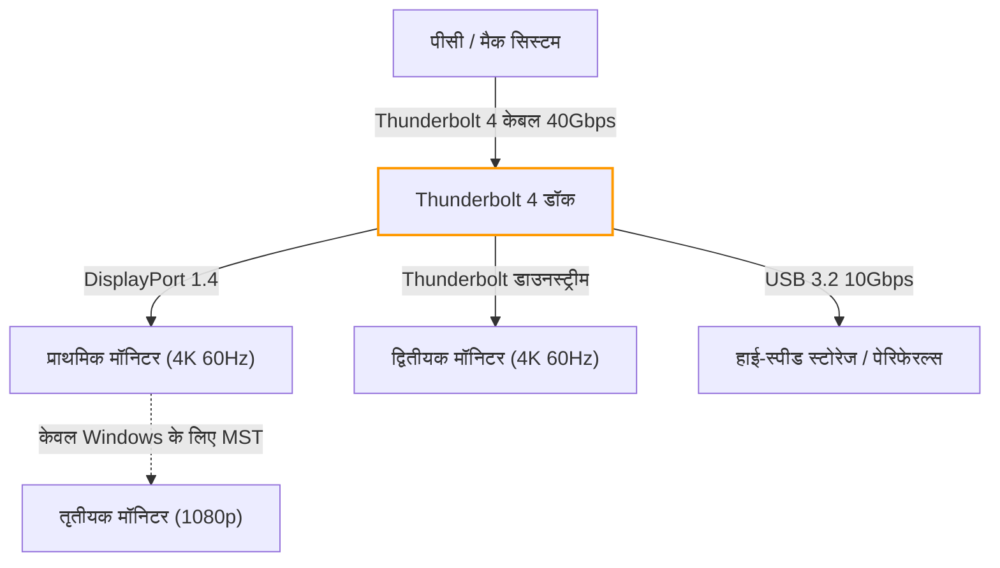
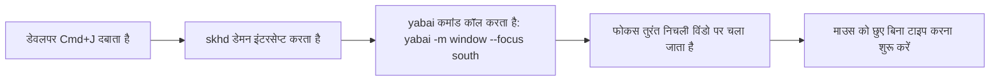
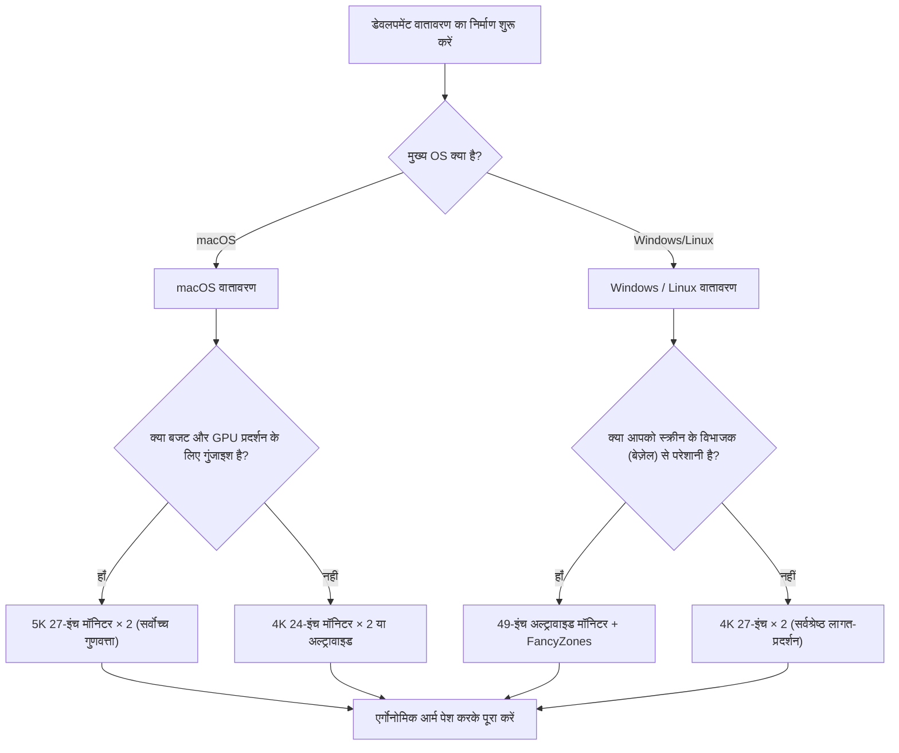

# डेवलपमेंट दक्षता को अधिकतम करने के लिए मल्टी-डिस्प्ले सेटअप और इष्टतम समाधान

आधुनिक सॉफ्टवेयर इंजीनियरिंग में, डेवलपमेंट वातावरण का अनुकूलन सीधे उत्पादकता में वृद्धि से जुड़ा है। विशेष रूप से, "डिस्प्ले वातावरण" जहां हम अपना अधिकांश दिन बिताते हैं, वह केवल एक सूचना प्रदर्शन उपकरण से कहीं अधिक है; यह इंजीनियरों के लिए एक "बाहरी मस्तिष्क" या "विस्तारित कार्यक्षेत्र" के रूप में कार्य करता है। ऐसे समय में जब एक साथ संदर्भित की जाने वाली जानकारी जैसे संपादक (एडिटर), टर्मिनल, ब्राउज़र, चैट टूल और डिबगर में विस्फोटक वृद्धि हो रही है, सिंगल डिस्प्ले पर काम करना संज्ञानात्मक संसाधनों (cognitive resources) की बर्बादी ही कहा जा सकता है।

हालाँकि, केवल डिस्प्ले की संख्या बढ़ाना पर्याप्त नहीं है। भौतिक लेआउट, विज़न एर्गोनॉमिक्स (vision ergonomics), ओएस-विशिष्ट स्केलिंग विनिर्देशों और कनेक्शन मानकों की बैंडविड्थ गणना जैसे कई दृष्टिकोणों से "इष्टतम समाधान" खोजना आवश्यक है। इस लेख में, हम इन सभी तत्वों का पूरी तरह से विश्लेषण करेंगे और वैज्ञानिक और इंजीनियरिंग दृष्टिकोण से अंतिम मल्टी-डिस्प्ले वातावरण बनाने के लिए एक संपूर्ण मार्गदर्शिका प्रदान करेंगे।

---

## 1. विज़न एर्गोनॉमिक्स और एर्गोनॉमिक्स: एक भौतिक दृष्टिकोण

डिस्प्ले प्लेसमेंट पर विचार करते समय, सबसे पहले विचार करने वाली बात मानवीय शारीरिक और कार्यिकीय सीमाएँ हैं। लंबे कोडिंग सत्रों के दौरान, अनुचित डिस्प्ले प्लेसमेंट से आंखों में तनाव, कंधे में अकड़न और गंभीर सर्वाइकल स्पाइन (गर्दन) की समस्याएं हो सकती हैं।

### 1.1 सैकैड (Saccade: तीव्र नेत्र गति) और संज्ञानात्मक भार

जब मानव आँखें एक बिंदु से दूसरे बिंदु पर जाती हैं, तो वे बहुत तेज़ गति करती हैं जिसे "सैकैडिक आई मूवमेंट (Saccadic eye movement)" कहा जाता है। इस सैकैड के दौरान, मस्तिष्क वास्तव में दृश्य जानकारी (सैकैडिक दमन) को बंद कर देता है, और सूचना प्रसंस्करण अस्थायी रूप से रुक जाता है।

सैकैड के लिए लगने वाला समय $T_{saccade}$ गति के कोण (आयाम) पर निर्भर करता है और इसे लगभग निम्नलिखित सूत्र द्वारा दर्शाया जा सकता है:

$$ T_{saccade} = 2.2 \times \theta + 21 \text{ [ms]} $$

यहाँ, $\theta$ दृष्टि के हिलने का कोण (डिग्री) है। उदाहरण के लिए, यदि आप अपनी दृष्टि को दूर स्थित दोहरे डिस्प्ले के एक छोर से दूसरे छोर तक ले जाते हैं ($\theta = 40^\circ$), तो इसमें लगभग 109ms का समय लगता है। हालांकि यह एक पल है, अगर यह दिन में हजारों बार होता है, तो इससे संज्ञानात्मक भार और थकान जमा हो सकती है जिसे नजरअंदाज नहीं किया जा सकता।

इसलिए, मुख्य कार्य क्षेत्र (जैसे एडिटर) को हमेशा सामने (आदर्श रूप से $\theta < 15^\circ$ की सीमा में) रखना और सैकैड के आयाम को न्यूनतम करना विज़न एर्गोनॉमिक्स का मूल आधार है।

### 1.2 सर्वाइकल स्पाइन पर भार और डिस्प्ले की ऊंचाई व कोण की भौतिकी

मानव सिर का वजन लगभग 5 से 6 किलोग्राम होता है। जैसे-जैसे गर्दन का कोण (मोड़ का कोण) बढ़ता है, सर्वाइकल स्पाइन पर भार (टॉर्क) घातांकीय (exponentially) रूप से बढ़ता है। मान लें कि गर्दन का कोण $\phi$ है, तो सर्वाइकल स्पाइन पर प्रभावी वजन भार $W_{effective}$ को भौतिक क्षण (physical moment) की गणना से इस प्रकार दर्शाया जा सकता है:

$$ W_{effective} \approx W_{head} + k \times \sin(\phi) $$

चिकित्सा अनुसंधान के अनुसार, जब गर्दन का कोण 0 डिग्री (सीधा) होता है, तो भार लगभग 5 किलोग्राम होता है। लेकिन अगर इसे 15 डिग्री झुकाया जाए, तो सर्वाइकल स्पाइन पर भार लगभग 12 किलोग्राम हो जाता है, 30 डिग्री पर यह लगभग 18 किलोग्राम और 45 डिग्री पर लगभग 22 किलोग्राम हो जाता है। यही कारण है कि लैपटॉप स्क्रीन को नीचे की ओर देखने से "स्ट्रेट नेक (straight neck)" की समस्या होती है।

मल्टी-डिस्प्ले वातावरण में, सबसे अच्छा समाधान मॉनिटर आर्म का उपयोग करके डिस्प्ले को इस तरह समायोजित करना है कि मुख्य डिस्प्ले का ऊपरी किनारा आंखों के स्तर पर हो या थोड़ा नीचे (लगभग 0-5 डिग्री नीचे) हो। इसके अलावा, साइड मॉनिटर लगाते समय, उन्हें इस तरह से घुमावदार या कोण पर रखना आवश्यक है कि गर्दन के घूमने का कोण 30 डिग्री से अधिक न हो।

### 1.3 दृश्य क्षेत्र (FOV) का अनुकूलन और कर्व्ड डिस्प्ले (Curvature) का महत्व

मानव का प्रभावी दृश्य क्षेत्र (वह सीमा जहाँ सूचना प्रसंस्करण तुरंत हो सकता है) क्षैतिज रूप से लगभग 30 डिग्री माना जाता है। जब आप एक बड़े फ्लैट डिस्प्ले (जैसे: 32 इंच या अधिक) को करीब से (लगभग 60 सेमी) देखते हैं, तो स्क्रीन के किनारों को देखने पर फोकल लंबाई बदल जाती है, जिससे आंखों की फोकस करने वाली मांसपेशियों (सिलिअरी मांसपेशी) पर बहुत अधिक दबाव पड़ता है।

स्क्रीन के केंद्र से किनारे तक की दूरी में परिवर्तन $\Delta d$ इस प्रकार है, जहाँ $D$ देखने की दूरी है और $w$ स्क्रीन की आधी चौड़ाई है:

$$ \Delta d = \sqrt{D^2 + w^2} - D $$

इस $\Delta d$ को शून्य के करीब लाने का उपाय "कर्व्ड मॉनिटर (Curved Monitor)" है। जब वक्रता त्रिज्या $R$ (उदाहरण: 1500R = 1500mm त्रिज्या) देखने की दूरी $D$ से मेल खाती है, तो स्क्रीन के सभी बिंदु आंखों से समान दूरी पर होते हैं, जिससे आंखों का तनाव नाटकीय रूप से कम हो सकता है।

---

## 2. डिस्प्ले कॉन्फ़िगरेशन की तुलना: Dual vs Triple vs Ultrawide

भौतिक एर्गोनॉमिक्स को समझने के बाद, आइए आधुनिक डेवलपर्स के लिए उपयुक्त डिस्प्ले कॉन्फ़िगरेशन पैटर्न की तुलना और मूल्यांकन करें।

### 2.1 डुअल मॉनिटर (उदाहरण: 27 इंच 4K × 2)

यह सबसे मानक (standard) कॉन्फ़िगरेशन है। जब अगल-बगल रखा जाता है, तो बेज़ेल केंद्र में होता है, जिससे आपको अपनी गर्दन को हमेशा बाएँ या दाएँ झुकाना पड़ता है। इससे बचने के लिए, एक मॉनिटर को सीधे सामने (मुख्य) और दूसरे को एक कोण पर (उप/sub) रखने या उन्हें लंबवत (स्टैक्ड कॉन्फ़िगरेशन) स्टैक करने की अनुशंसा की जाती है।

- **फायदे:** भौतिक स्क्रीन विभाजन स्पष्ट है। फुल-स्क्रीन ऐप्स का प्रबंधन करना आसान है।
- **नुकसान:** केंद्र का बेज़ेल दृश्य को विभाजित करता है। गर्दन को घुमाने का भार अधिक होता है।

### 2.2 ट्रिपल मॉनिटर कॉन्फ़िगरेशन

इसमें मुख्य मॉनिटर सामने और उप (sub) मॉनिटर बाएं और दाएं रखे जाते हैं, या एक मॉनिटर को लंबवत (पोर्ट्रेट) रखा जाता है। यह लॉग मॉनिटरिंग, दस्तावेज़ीकरण और कोडिंग को पूरी तरह से अलग कर सकता है।

- **फायदे:** अत्यधिक मात्रा में जानकारी। केंद्र में कोई बेज़ेल नहीं होता।
- **नुकसान:** डेस्क पर बहुत अधिक जगह घेरता है। ग्राफिक कार्ड के आउटपुट पोर्ट और बैंडविड्थ द्वारा सीमित होने की संभावना अधिक होती है।

### 2.3 अल्ट्रावाइड मॉनिटर (उदाहरण: 49 इंच 5120x1440)

यह कॉन्फ़िगरेशन दो 27-इंच WQHD मॉनिटर को अगल-बगल जोड़ने के समान क्षेत्र को बिना किसी बेज़ेल के प्रदान करता है। यह एक हालिया प्रवृत्ति है जो एर्गोनॉमिक्स और सूचना की मात्रा के बीच सबसे अच्छा संतुलन बनाती है।

नीचे एक गैंट चार्ट दिया गया है जो अल्ट्रावाइड मॉनिटर का उपयोग करने से समय की बचत का मॉडल दिखाता है। यह विंडो स्विचिंग और कॉन्टेक्स्ट स्विचिंग में लगने वाले समय में कमी को दर्शाता है।

```mermaid
gantt
    title "अल्ट्रावाइड बनाम डुअल मॉनिटर कॉन्टेक्स्ट स्विच टाइम तुलना"
    dateFormat  s
    axisFormat  %S
    
    section "डुअल मॉनिटर"
    "कार्य A (एडिटर)"        :a1, 0, 5s
    "विंडो ढूंढें/स्विच करें"     :a2, after a1, 2s
    "कार्य B (टर्मिनल)"      :a3, after a2, 5s
    "विंडो ढूंढें/स्विच करें"     :a4, after a3, 2s
    
    section "49-इंच अल्ट्रावाइड"
    "कार्य A (एडिटर)"        :b1, 0, 5s
    "एक नज़र देखें (नो स्विच)"     :b2, after b1, 0.5s
    "कार्य B (टर्मिनल)"      :b3, after b2, 5s
```

---

## 3. पिक्सेल घनत्व (PPI) का गणित और OS स्केलिंग विनिर्देश

डिस्प्ले चुनते समय, न केवल रिज़ॉल्यूशन (जैसे 4K) को समझना आवश्यक है, बल्कि "पिक्सेल घनत्व (PPI: Pixels Per Inch)" को समझना भी अत्यंत महत्वपूर्ण है। विशेष रूप से macOS वातावरण में, गलत PPI का चयन करने से प्रदर्शन में गिरावट हो सकती है और टेक्स्ट धुंधला दिख सकता है।

### 3.1 पिक्सेल घनत्व (PPI) का गणना सूत्र

PPI की गणना डिस्प्ले के भौतिक आकार (विकर्ण (diagonal) की लंबाई $d$ इंच) और रिज़ॉल्यूशन (क्षैतिज $w$ पिक्सेल, ऊर्ध्वाधर $h$ पिक्सेल) से निम्नलिखित सूत्र द्वारा की जाती है:

$$ PPI = \frac{\sqrt{w^2 + h^2}}{d} $$

उदाहरण के लिए, आइए डेवलपर्स के बीच लोकप्रिय "27-इंच 4K मॉनिटर (3840x2160)" के PPI की गणना करें।

$$ PPI = \frac{\sqrt{3840^2 + 2160^2}}{27} = \frac{\sqrt{14745600 + 4665600}}{27} = \frac{\sqrt{19411200}}{27} \approx \frac{4405.8}{27} \approx 163.18 \text{ PPI} $$

### 3.2 macOS और Windows के स्केलिंग तंत्र के बीच अंतर

यहाँ समस्या यह है कि OS UI को कैसे स्केल (ज़ूम इन/आउट) करता है।

**Windows के मामले में:**
Windows वेक्टर-आधारित UI स्केलिंग (DPI स्केलिंग) का उपयोग करता है और निर्दिष्ट प्रतिशत (उदाहरण के लिए: 150%) के अनुसार UI तत्वों को सीधे फिर से आरेखित (redraw) करता है। इसलिए, 163 PPI वाले 27-इंच 4K मॉनिटर पर भी, अगर 150% स्केलिंग सेट की जाती है, तो यह अपेक्षाकृत स्पष्ट दिखाई देता है और प्रदर्शन पर प्रभाव (performance penalty) भी कम होता है।

**macOS के मामले में:**
ऐतिहासिक रूप से, macOS को 110 PPI (नॉन-रेटिना) या 220 PPI (रेटिना) को लक्षित करके डिज़ाइन किया गया है। macOS की UI स्केलिंग (छद्म रिज़ॉल्यूशन या pseudo-resolution) पहले एक बहुत बड़े रिज़ॉल्यूशन बफर (वर्चुअल कैनवास) पर UI को आरेखित (draw) करती है, और फिर इसे भौतिक पिक्सेल में मैप करने के लिए GPU का उपयोग करके इसे कम (डाउनस्केल) करती है।

उदाहरण के लिए, यदि आप 27-इंच 4K (163 PPI) पर "WQHD (2560x1440) के बराबर" छद्म रिज़ॉल्यूशन चुनते हैं, तो macOS आंतरिक रूप से स्क्रीन को 5120x2880 पिक्सेल (5K) पर दोगुने रिज़ॉल्यूशन पर रेंडर करता है और आउटपुट देने के लिए इसे 3840x2160 (4K) में सिकोड़ देता है (स्केलिंग फैक्टर $\approx 0.75$)। पिक्सेल इंटरपोलेशन की यह गैर-पूर्णांक बहु (non-integer multiple) प्रक्रिया निम्नलिखित समस्याओं का कारण बनती है:

1. **GPU संसाधनों की बर्बादी:** 5K रेंडरिंग लगातार की जाती है, जो विशेष रूप से लैपटॉप के अंतर्निहित (integrated) GPU पर भारी भार डालती है, जिससे गर्मी और बैटरी की खपत बढ़ जाती है।
2. **टेक्स्ट का धुंधलापन (Blurriness):** चूंकि यह पूर्ण रूप से पूर्णांक गुणज (integer multiple) (जैसे 2.0x) नहीं है, इसलिए सबपिक्सेल स्तर पर एंटी-अलियासिंग (anti-aliasing) अशुद्ध हो जाता है और फॉन्ट के किनारे थोड़े धुंधले हो जाते हैं।

इसलिए, macOS पर सर्वश्रेष्ठ अनुभव प्राप्त करने के लिए, "इष्टतम समाधान" 27-इंच के लिए 5K मॉनिटर (5120x2880 = लगभग 218 PPI) या 24-इंच के लिए 4K मॉनिटर (लगभग 183 PPI, जो छद्म रिज़ॉल्यूशन के पूर्णांक स्केलिंग के करीब है) चुनना है।

---

## 4. कनेक्शन बैंडविड्थ और डेज़ी चेन: Thunderbolt 4 और DP MST की सीमाएं

एकाधिक उच्च-रिज़ॉल्यूशन वाले मॉनिटर को जोड़ते समय, केबल की डेटा ट्रांसमिशन क्षमता (बैंडविड्थ) एक बाधा बन जाती है। "मैंने एक मॉनिटर खरीदा, लेकिन रिफ्रेश रेट केवल 30Hz मिल रहा है" जैसी समस्याएं बैंडविड्थ की कम गणना के कारण होती हैं।

### 4.1 वीडियो सिग्नल बैंडविड्थ का गणना मॉडल

डिस्प्ले को वीडियो सिग्नल भेजने के लिए आवश्यक बैंडविड्थ डेटा दर $R$ (bps) को निम्नलिखित सूत्र के साथ मॉडल किया जा सकता है:

$$ R = W \times H \times F \times C \times B $$

यहाँ, प्रत्येक चर इस प्रकार है:
- $W$: क्षैतिज रिज़ॉल्यूशन (Width)
- $H$: ऊर्ध्वाधर रिज़ॉल्यूशन (Height)
- $F$: रिफ्रेश रेट (Hz, Frame rate)
- $C$: रंग की गहराई (Color depth) / प्रति पिक्सेल बिट्स (8-bit RGB के लिए $8 \times 3 = 24$, 10-bit HDR के लिए $10 \times 3 = 30$)
- $B$: ब्लैंकिंग ओवरहेड (Blanking overhead, VESA मानक समय के अनुसार लगभग 1.05-1.15)

उदाहरण के लिए, आइए एक "4K (3840x2160), 60Hz, 10-bit कलर" मॉनिटर द्वारा आवश्यक असंपीड़ित (uncompressed) डेटा दर की गणना करें (मान लें कि ओवरहेड गुणांक $B = 1.05$ है):

$$ R = 3840 \times 2160 \times 60 \times 30 \times 1.05 \approx 15,676,416,000 \text{ bps} \approx 15.68 \text{ Gbps} $$

### 4.2 Thunderbolt 4 और KVM स्विच का उपयोग करके वातावरण निर्माण

Thunderbolt 4 की अधिकतम बैंडविड्थ 40 Gbps है, लेकिन चूंकि PCIe डेटा संचार भी इसके साथ साझा किया जाता है, इसलिए पूरी बैंडविड्थ को वीडियो आउटपुट के लिए आवंटित नहीं किया जा सकता है। डुअल 4K 60Hz वातावरण (लगभग 31.3 Gbps) बनाते समय, Thunderbolt 4 डॉक का प्रदर्शन अपनी अधिकतम सीमा तक पहुँच जाता है।

Windows वातावरण में, आप DisplayPort की MST (Multi-Stream Transport) सुविधा का उपयोग करके एक पोर्ट से कई मॉनिटर को (डेज़ी चेन) सिग्नल भेज सकते हैं। हालाँकि, macOS डिज़ाइन के आधार पर MST के माध्यम से एक्सटेंशन (Extend) का समर्थन नहीं करता है, और यदि इसे डेज़ी-चेन किया जाता है, तो सब कुछ "मिररिंग (एक ही स्क्रीन)" हो जाएगा। macOS पर डुअल मॉनिटर का उपयोग करने के लिए, आपको पीसी (PC) या Thunderbolt डॉक के अलग-अलग पोर्ट से केबल को रूट करना होगा।

निम्नलिखित Mermaid फ्लोचार्ट PC/Mac से Thunderbolt डॉक के माध्यम से आदर्श सिग्नल रूटिंग संरचना को दर्शाता है।

---

## 5. विंडो प्रबंधन का स्वचालन: OS-विशिष्ट सेटअप गाइड

चाहे आप कितना भी अच्छा भौतिक डिस्प्ले वातावरण बना लें, यदि आप विंडोज़ को खींचने और उनका आकार बदलने के लिए माउस का उपयोग कर रहे हैं तो विकास दक्षता को अधिकतम नहीं किया जा सकता है। एक "विंडो मैनेजर" पेश करना आवश्यक है जो तार्किक रूप से विशाल स्क्रीन क्षेत्र को विभाजित करता है और शॉर्टकट कुंजियों के साथ तुरंत विंडोज़ को स्नैप करता है।

### 5.1 Windows: PowerToys FancyZones

Windows में, Microsoft के आधिकारिक टूल "PowerToys" में शामिल "FancyZones" सबसे शक्तिशाली समाधान है। यह आपको डिफ़ॉल्ट Windows स्नैप सुविधा (Win + Arrow कुंजियाँ) की तुलना में अधिक जटिल और अनुकूलन योग्य (customizable) ग्रिड परिभाषित करने की अनुमति देता है।

अल्ट्रावाइड मॉनिटर (उदाहरण: 32:9) के मामले में, डेवलपर्स के लिए स्क्रीन को साधारण 2 भागों के बजाय 3 भागों "बाएं 25%, मध्य 50%, दाएं 25%" में विभाजित करना सबसे अच्छा है। मध्य 50% (16:9) में मुख्य एडिटर या ब्राउज़र रखें, और टर्मिनल, चैट टूल और संदर्भ दस्तावेज़ों को बाएँ और दाएँ रखें।

FancyZones आपको Shift कुंजी को दबाए रखते हुए विंडोज़ को खींचने, या तुरंत कस्टम ज़ोन में विंडोज़ को रखने के लिए "Win + Arrow कुंजी" व्यवहार को ओवरराइड करने की अनुमति देता है। यह कॉन्टेक्स्ट स्विच के कारण माउस संचालन समय को लगभग शून्य तक कम कर सकता है।

### 5.2 macOS: Yabai और Amethyst का उपयोग करके टाइलिंग विंडो प्रबंधन

macOS में डिफ़ॉल्ट रूप से विंडो स्नैपिंग कार्यक्षमता कमजोर होती है (हालाँकि macOS Sequoia में इसमें सुधार हो रहा है), और ऐसे कई उपयोगकर्ता हैं जो Linux जैसे "टाइलिंग विंडो मैनेजर (Tiling Window Manager)" का उपयोग करते हैं।

प्रतिनिधि उपकरणों (representative tools) में "Yabai" और "Amethyst" शामिल हैं।

- **Amethyst:** यह सिर्फ इंस्टॉल करने से काम करता है और Husk/Xmonad जैसा स्वचालित टाइल प्रबंधन प्रदान करता है। यदि आप आसानी से शुरुआत करना चाहते हैं तो अनुशंसित है।
- **Yabai:** यह अधिक उन्नत अनुकूलन की अनुमति देता है, लेकिन आपको SIP (System Integrity Protection) के कुछ हिस्से को अक्षम करना होगा। आप स्क्रिप्ट (yabairc) के माध्यम से रिक्त स्थान (वर्चुअल डेस्कटॉप) के प्रबंधन, विंडो बॉर्डर ड्राइंग, पारदर्शिता प्रसंस्करण आदि सहित पूरे वातावरण को पूरी तरह से नियंत्रित कर सकते हैं।

Yabai का उपयोग करते समय, सेटिंग्स `skhd` नामक हॉटकी डेमन के साथ संयोजन में कॉन्फ़िगर की जाती हैं। नीचे फोकस को स्थानांतरित करने और विंडोज़ को तुरंत स्वैप करने के लिए एक वैचारिक (conceptual) ऑपरेशन प्रवाह दिया गया है।

इन उपकरणों का पूरा उपयोग करके, आप कीबोर्ड से हाथ हटाए बिना विशाल मल्टी-डिस्प्ले क्षेत्र में कहीं भी तुरंत पहुंच सकते हैं और कोड लिखना जारी रख सकते हैं।

---

## 6. निष्कर्ष: आपके लिए "इष्टतम समाधान" क्या है?

मल्टी-डिस्प्ले वातावरण बनाने का कोई एक सही उत्तर नहीं है जो सभी पर लागू हो। हालाँकि, नीचे दिए गए फ्लोचार्ट का संदर्भ लेकर, आप एक तार्किक इष्टतम समाधान प्राप्त कर सकते हैं जो आपकी विकास शैली (development style) के अनुकूल हो।

एक बार खरीदने के बाद, डिस्प्ले एक ऐसा बुनियादी ढाँचा (इंफ्रास्ट्रक्चर) है जो कई वर्षों तक आपकी उत्पादकता का समर्थन करता रहेगा। इस लेख में बताए गए विज़न एर्गोनॉमिक्स सिद्धांतों, PPI गणित, बैंडविड्थ सीमाओं और सॉफ़्टवेयर-आधारित विंडो प्रबंधन को एकीकृत करके एक समझौता-रहित, सर्वश्रेष्ठ कार्यक्षेत्र बनाएं। नतीजतन, यह सर्वोत्तम कोड बनाने का सबसे छोटा रास्ता होगा。
