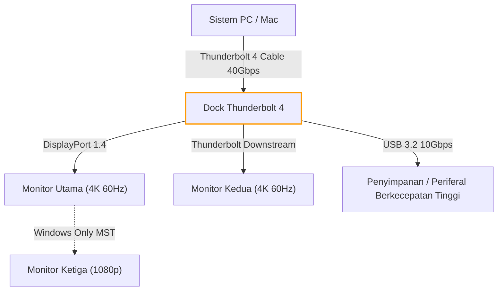
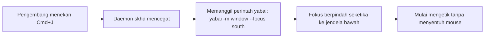
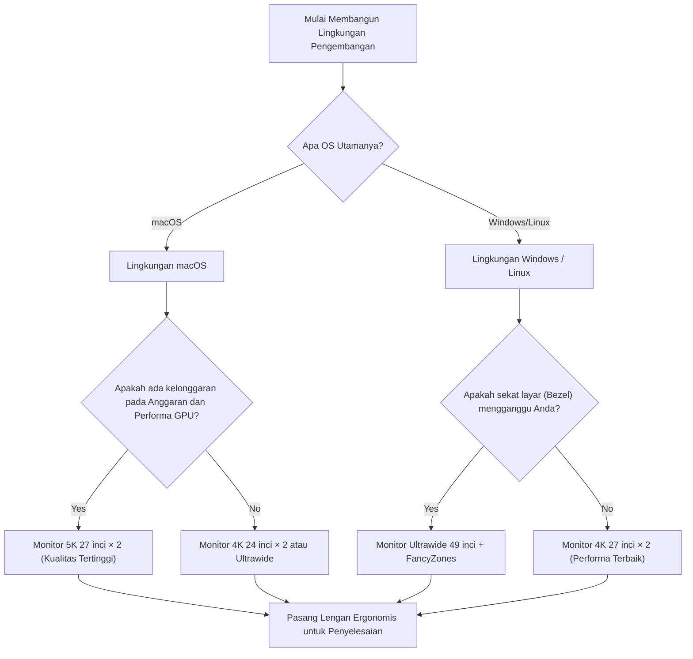

# Mengoptimalkan Efisiensi Pengembangan dengan Penempatan dan Solusi Optimal Multi-Layar

Dalam rekayasa perangkat lunak modern, optimalisasi lingkungan pengembangan secara langsung berdampak pada peningkatan produktivitas. Secara khusus, "lingkungan tampilan" di mana kita menghabiskan sebagian besar hari, berfungsi melampaui sekadar perangkat penampil informasi, melainkan sebagai "otak eksternal" atau "ruang kerja yang diperluas" bagi seorang engineer. Dengan ledakan jumlah informasi yang harus dirujuk secara bersamaan—seperti editor, terminal, browser, alat obrolan, dan debugger—bekerja dengan layar tunggal tidak dapat disangkal lagi merupakan pemborosan sumber daya kognitif.

Namun, ini bukan sekadar masalah memperbanyak jumlah layar. Kita perlu menemukan "solusi optimal" dari berbagai perspektif: penempatan fisik, rekayasa bidang pandang (ergonomi), spesifikasi penskalaan dari masing-masing sistem operasi, serta perhitungan bandwidth dari standar koneksi. Artikel ini akan membedah semua elemen tersebut secara menyeluruh, dan memberikan panduan lengkap untuk membangun lingkungan multi-layar yang mutakhir dari pendekatan ilmiah dan rekayasa.

---

## 1. Rekayasa Bidang Pandang dan Ergonomi: Pendekatan dari Sudut Pandang Fisik

Saat mempertimbangkan penempatan layar, hal pertama yang harus diperhitungkan adalah batasan fisik dan fisiologis manusia. Dalam sesi pengkodean yang panjang, penempatan layar yang tidak tepat dapat menyebabkan kelelahan mata, leher kaku, dan gangguan tulang belakang leher (serviks) yang serius.

### 1.1 Saccade (Gerakan Mata Impulsif) dan Beban Kognitif

Ketika mata manusia menggeser pandangan dari satu titik ke titik lain, mata melakukan gerakan yang sangat cepat yang disebut "saccade (Saccadic eye movement)". Selama saccade ini, otak sebenarnya mematikan input visual (penekanan saccadic), dan pemrosesan informasi berhenti sejenak.

Waktu yang dibutuhkan untuk saccade, $T_{saccade}$, bergantung pada sudut pergerakan (Amplitude), dan secara perkiraan dinyatakan dengan rumus berikut:

$$ T_{saccade} = 2.2 \times \theta + 21 \text{ [ms]} $$

Di sini, $\theta$ adalah sudut pergerakan pandangan (derajat). Misalnya, memindahkan pandangan dari satu ujung layar ganda ke ujung lainnya yang berjauhan ekstrem ($\theta = 40^\circ$), membutuhkan waktu sekitar 109 ms. Waktu ini mungkin terlihat hanya sekejap, tetapi jika terjadi ribuan kali dalam sehari, hal ini akan menyebabkan akumulasi beban kognitif dan kelelahan yang tidak dapat diabaikan.

Oleh karena itu, sebagai prinsip dasar rekayasa bidang pandang, area kerja utama (seperti editor) harus selalu ditempatkan tepat di depan (dalam rentang $\theta < 15^\circ$) untuk meminimalkan amplitudo saccade.

### 1.2 Fisika pada Beban Tulang Belakang Leher serta Tinggi/Sudut Layar

Kepala manusia memiliki berat sekitar 5-6 kg. Semakin besar sudut leher (sudut fleksi), maka beban (torsi) pada tulang belakang leher meningkat secara eksponensial. Jika sudut leher adalah $\phi$, beban berat efektif pada tulang belakang leher, $W_{effective}$, dapat diperkirakan dari perhitungan momen fisik sebagai berikut:

$$ W_{effective} \approx W_{head} + k \times \sin(\phi) $$

Menurut studi medis, saat sudut leher adalah 0 derajat (tegak), beban yang ditanggung sekitar 5 kg. Namun, saat dimiringkan 15 derajat, bebannya menjadi sekitar 12 kg; pada 30 derajat sekitar 18 kg; dan pada 45 derajat beban luar biasa sekitar 22 kg ditempatkan pada tulang belakang leher. Inilah alasan mengapa postur menunduk melihat layar laptop menyebabkan "leher lurus (straight neck)".

Dalam lingkungan multi-layar, solusi optimalnya adalah mengatur lengan monitor (monitor arm) sehingga tepi atas layar utama sejajar dengan ketinggian mata, atau sedikit di bawahnya (sekitar 0 hingga 5 derajat di bawah). Selain itu, saat menempatkan monitor samping, monitor tersebut harus dilengkungkan atau diberi sudut sehingga sudut rotasi leher tidak melebihi 30 derajat.

### 1.3 Optimalisasi Field of View (FOV) dan Pentingnya Layar Melengkung (Curvature)

Bidang pandang efektif manusia (area di mana pemrosesan informasi dapat langsung dilakukan) dikatakan sekitar 30 derajat horizontal. Ketika melihat layar besar yang datar (misal: 32 inci atau lebih) dari jarak dekat (sekitar 60 cm), jarak fokus berubah saat melihat bagian tepi layar, yang menempatkan beban besar pada otot siliaris yang mengatur fokus mata.

Perubahan jarak $\Delta d$ dari tengah layar ke tepinya diberikan oleh rumus di bawah ini, di mana $D$ adalah jarak pandang dan $w$ adalah setengah dari lebar layar:

$$ \Delta d = \sqrt{D^2 + w^2} - D $$

Strategi untuk mendekatkan nilai $\Delta d$ ini menjadi nol adalah "Layar Melengkung (Curved Monitor)". Ketika jari-jari kelengkungan $R$ (misal: 1500R = radius 1500 mm) sesuai dengan jarak pandang $D$, semua titik di layar berjarak sama dari mata, sehingga secara drastis mengurangi kelelahan mata.

---

## 2. Pemeriksaan dan Perbandingan Konfigurasi Layar: Dual vs Triple vs Ultrawide

Setelah memahami ergonomi fisik, mari kita membandingkan dan mengevaluasi pola konfigurasi layar yang cocok untuk para pengembang modern.

### 2.1 Monitor Ganda (Contoh: 27 inci 4K × 2)

Ini adalah konfigurasi yang paling standar. Bila ditempatkan berdampingan, bezel akan berada di tengah, memaksa Anda untuk terus memiringkan leher ke kiri atau ke kanan. Untuk menghindarinya, disarankan untuk menempatkan satu layar tepat di depan (utama) dan yang lainnya secara diagonal (tambahan), atau menumpuknya secara vertikal (konfigurasi stack).

- **Kelebihan:** Pembagian fisik layar yang jelas. Mudah untuk mengelola aplikasi layar penuh.
- **Kekurangan:** Bezel di tengah membelah pandangan. Beban rotasi pada leher cukup tinggi.

### 2.2 Konfigurasi Monitor Triple

Konfigurasi di mana layar utama berada di depan dan layar tambahan ditempatkan di kiri dan kanan, atau konfigurasi dengan satu monitor dalam orientasi vertikal (potret). Pemantauan log, dokumen, dan pengkodean dapat dipisahkan sepenuhnya.

- **Kelebihan:** Volume informasi yang sangat besar. Tidak ada bezel di tengah.
- **Kekurangan:** Memakan banyak ruang meja. Rentan terhadap batasan dari port output atau bandwidth kartu grafis.

### 2.3 Monitor Ultrawide (Contoh: 49 inci 5120x1440)

Konfigurasi yang mewujudkan area yang sama dengan dua monitor 27 inci WQHD berdampingan secara mulus (tanpa bezel). Ini adalah tren saat ini dan memberikan keseimbangan terbaik antara ergonomi dan volume informasi.

Berikut adalah diagram Gantt yang menunjukkan model penghematan waktu berkat pengenalan monitor ultrawide. Diagram ini memvisualisasikan pengurangan waktu yang dihabiskan untuk mengganti jendela atau melakukan context switch.

```mermaid
gantt
    title "Perbandingan Waktu Konteks Switch antara Ultrawide vs Monitor Ganda"
    dateFormat  s
    axisFormat  %S
    
    section "Monitor Ganda"
    "Tugas A (Editor)"        :a1, 0, 5s
    "Cari/Ganti Jendela"     :a2, after a1, 2s
    "Tugas B (Terminal)"      :a3, after a2, 5s
    "Cari/Ganti Jendela"     :a4, after a3, 2s
    
    section "Ultrawide 49 inci"
    "Tugas A (Editor)"        :b1, 0, 5s
    "Lirik (Tanpa Ganti)"     :b2, after b1, 0.5s
    "Tugas B (Terminal)"      :b3, after b2, 5s
```

---

## 3. Matematika Kerapatan Piksel (PPI) dan Spesifikasi Penskalaan OS

Saat memilih layar, sangat penting untuk tidak hanya memahami resolusi (seperti 4K) tetapi juga "Kerapatan Piksel (PPI: Pixels Per Inch)". Terutama pada lingkungan macOS, memilih PPI yang salah dapat menyebabkan penurunan kinerja atau teks yang buram.

### 3.1 Rumus Perhitungan Kerapatan Piksel (PPI)

PPI dihitung dengan menggunakan rumus berikut yang melibatkan ukuran fisik layar (panjang diagonal $d$ dalam inci) dan resolusi (piksel horizontal $w$ dan piksel vertikal $h$).

$$ PPI = \frac{\sqrt{w^2 + h^2}}{d} $$

Sebagai contoh, mari kita hitung PPI dari "Monitor 27 inci 4K (3840x2160)", yang populer di kalangan pengembang.

$$ PPI = \frac{\sqrt{3840^2 + 2160^2}}{27} = \frac{\sqrt{14745600 + 4665600}}{27} = \frac{\sqrt{19411200}}{27} \approx \frac{4405.8}{27} \approx 163.18 \text{ PPI} $$

### 3.2 Perbedaan Mekanisme Penskalaan antara macOS dan Windows

Masalahnya di sini adalah bagaimana OS menangani mekanisme penskalaan UI (memperbesar/memperkecil).

**Pada Windows:**
Windows menggunakan penskalaan UI berbasis vektor (DPI scaling), yang merender ulang elemen UI secara langsung agar sesuai dengan persentase yang ditentukan (misal: 150%). Oleh karena itu, bahkan pada monitor 4K 27 inci dengan 163 PPI, mengatur skala ke 150% akan menampilkan tampilan yang cukup jelas dengan sedikit penalti performa.

**Pada macOS:**
Secara historis, macOS didesain dengan target 110 PPI (Non-Retina) atau 220 PPI (Retina). Penskalaan UI di macOS (resolusi semu) bekerja dengan menggambar UI di buffer resolusi yang sangat besar (kanvas virtual) dan kemudian menggunakan GPU untuk memperkecilnya (downscale) agar dapat dipetakan ke dalam piksel fisik.

Misalnya, jika Anda memilih resolusi semu "setara WQHD (2560x1440)" pada monitor 27 inci 4K (163 PPI), macOS secara internal merender layar pada resolusi 5120x2880 piksel (5K) yaitu dua kali lipat dari resolusinya, dan kemudian memperkecilnya ke 3840x2160 (4K) (dengan faktor penskalaan $\approx 0.75$) untuk di-output. Proses interpolasi piksel kelipatan non-integer ini menyebabkan masalah berikut:

1. **Pemborosan Sumber Daya GPU:** Karena selalu merender dalam 5K, ini memberikan beban besar, terutama pada GPU terintegrasi laptop, yang meningkatkan panas dan konsumsi baterai.
2. **Tulisan Buram (Blurriness):** Karena bukan merupakan kelipatan bilangan bulat sempurna (seperti 2.0x), anti-aliasing di tingkat sub-piksel menjadi tidak akurat, membuat tepi font sedikit mengabur.

Karena itu, untuk mendapatkan pengalaman terbaik di macOS, memilih monitor 5K pada ukuran 27 inci (5120x2880 = sekitar 218 PPI), atau monitor 4K pada ukuran 24 inci (sekitar 183 PPI, yang mana mendekati penskalaan resolusi semu integer), merupakan "solusi optimal".

---

## 4. Bandwidth Koneksi dan Daisy Chain: Keterbatasan Thunderbolt 4 dan DP MST

Saat menghubungkan beberapa monitor beresolusi tinggi, kapasitas transmisi data (bandwidth) kabel dapat menjadi hambatan (bottleneck). Masalah seperti "sudah beli monitor tapi refresh rate mentok di 30Hz" seringkali diakibatkan oleh kurangnya perhitungan terhadap bandwidth.

### 4.1 Model Perhitungan Bandwidth Sinyal Video

Kapasitas data bandwidth $R$ (bps) yang diperlukan untuk mengirim sinyal video ke layar dapat dimodelkan menggunakan rumus berikut:

$$ R = W \times H \times F \times C \times B $$

Di mana masing-masing variabel tersebut adalah:
- $W$: Resolusi horizontal (Width)
- $H$: Resolusi vertikal (Height)
- $F$: Refresh rate (Hz, Frame rate)
- $C$: Kedalaman warna, bit per piksel (jika 8-bit RGB maka $8 \times 3 = 24$, jika 10-bit HDR maka $10 \times 3 = 30$)
- $B$: Overhead periode Blanking (sekitar 1.05 hingga 1.15 menurut waktu standar VESA)

Sebagai contoh, mari kita hitung laju data tanpa kompresi yang dibutuhkan untuk 1 monitor "4K (3840x2160), 60Hz, warna 10-bit" (dengan asumsi koefisien overhead $B = 1.05$).

$$ R = 3840 \times 2160 \times 60 \times 30 \times 1.05 \approx 15,676,416,000 \text{ bps} \approx 15.68 \text{ Gbps} $$

### 4.2 Membangun Lingkungan dengan Thunderbolt 4 dan Switch KVM

Bandwidth maksimal dari Thunderbolt 4 adalah 40 Gbps, namun hal ini dibagi dengan komunikasi data PCIe dll, sehingga seluruh bandwidth tidak bisa dialokasikan sepenuhnya untuk output video. Jika Anda membuat konfigurasi ganda 4K 60Hz (sekitar 31.3 Gbps), Anda akan memacu performa dock Thunderbolt 4 hingga batas maksimalnya.

Pada lingkungan Windows, Anda dapat memanfaatkan fitur DisplayPort MST (Multi-Stream Transport) untuk mengirim sinyal secara berantai (daisy chain) dari satu port ke beberapa monitor. Namun, macOS secara spesifik tidak mendukung ekstensi (Extend) via MST, sehingga setiap koneksi daisy chain hanya akan menghasilkan "mirroring (layar yang sama)". Jika Anda menggunakan monitor ganda di macOS, Anda harus merutekan kabel dari port yang berbeda secara langsung pada PC Anda atau dock Thunderbolt.

Bagan alir (flowchart) Mermaid di bawah ini menunjukkan struktur routing sinyal yang ideal dari PC/Mac melalui dock Thunderbolt.

---

## 5. Otomatisasi Manajemen Jendela: Panduan Pengaturan Berdasarkan OS

Tak peduli seberapa mengagumkan pengaturan layar fisik yang telah Anda bangun, efisiensi pengembangan tidak akan bisa dimaksimalkan apabila Anda masih menyeret dan mengubah ukuran jendela dengan mouse. Pengenalan "Manajer Jendela (Window Manager)" sangatlah penting, di mana ia secara logis membagi area layar yang luas dan menempelkan jendela secara instan menggunakan pintasan keyboard.

### 5.1 Windows: PowerToys FancyZones

Di Windows, "FancyZones" yang termasuk dalam utilitas resmi Microsoft yaitu "PowerToys", merupakan solusi paling kuat. Program ini dapat menentukan grid (kisi-kisi) yang jauh lebih kompleks dan bisa dikustomisasi daripada fungsi snap bawaan Windows (Tombol Win + Panah).

Dalam monitor ultrawide (misalnya, rasio 32:9), bagi pengembang, lebih optimal untuk membaginya menjadi tiga bagian: "Kiri 25%, Tengah 50%, Kanan 25%" ketimbang sekadar dibagi 2 secara sederhana. Anda dapat menempatkan editor atau browser utama di tengah dengan proporsi 50% (16:9), sementara layar kiri dan kanan ditempati oleh terminal, alat obrolan, dan referensi.

Di FancyZones, Anda dapat menyeret jendela sambil menekan tombol Shift, atau mengesampingkan perilaku "Win + Panah" untuk menempatkan jendela di dalam area khusus dalam sekejap. Dengan melakukan ini, Anda dapat mengurangi waktu yang terbuang saat menggerakkan mouse selama perpindahan konteks menjadi nyaris nol.

### 5.2 macOS: Manajemen Jendela Tile dengan Yabai dan Amethyst

Secara bawaan, fitur snap jendela di macOS cukup lemah (meski perlahan diperbaiki di macOS Sequoia), sehingga banyak pengguna memilih untuk memasang "Tiling Window Manager" yang mirip dengan Linux.

Alat perwakilan yang umum adalah "Yabai" dan "Amethyst".

- **Amethyst:** Langsung beroperasi hanya dengan pemasangan, menghadirkan manajemen tile otomatis ala xmonad. Ini direkomendasikan jika Anda ingin memulai dengan mudah.
- **Yabai:** Memungkinkan penyesuaian yang jauh lebih matang, tetapi memerlukan penonaktifan sebagian dari SIP (System Integrity Protection). Anda dapat mengendalikan lingkungan sepenuhnya melalui skrip (yabairc) seperti manajemen ruang (desktop virtual), gambar batas jendela, dan proses transparansi.

Ketika menggunakan Yabai, konfigurasinya digabungkan dengan daemon hotkey bernama `skhd`. Berikut ini adalah alur operasi konseptual untuk memindahkan fokus atau menukar jendela secara instan.

Dengan memanfaatkan sepenuhnya alat-alat ini, Anda bisa mengakses seluruh area di lingkungan multi-layar yang luas secara instan tanpa pernah melepaskan tangan dari keyboard, dan dapat terus menulis kode.

---

## 6. Kesimpulan: Apa "Solusi Optimal" bagi Anda?

Dalam membangun lingkungan multi-layar, tidak ada satu jawaban tunggal yang cocok untuk semua orang. Namun, dengan merujuk pada bagan alir berikut, Anda dapat memperoleh solusi logis teroptimal yang sejalan dengan gaya pengembangan Anda.

Layar adalah infrastruktur yang akan terus menopang produktivitas Anda selama bertahun-tahun setelah dibeli. Silakan padukan prinsip-prinsip rekayasa bidang pandang, matematika PPI, batasan bandwidth, dan manajemen jendela perangkat lunak yang dijelaskan dalam artikel ini untuk membangun ruang kerja terbaik tanpa kompromi. Pada akhirnya, hal itu akan menjadi rute terpendek untuk menghasilkan kode terbaik.
