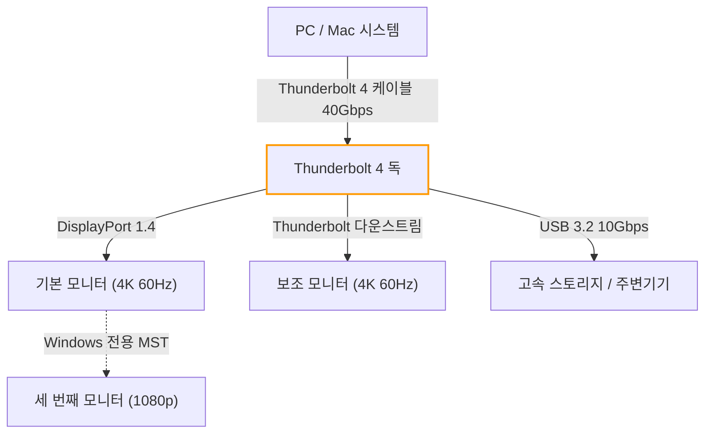
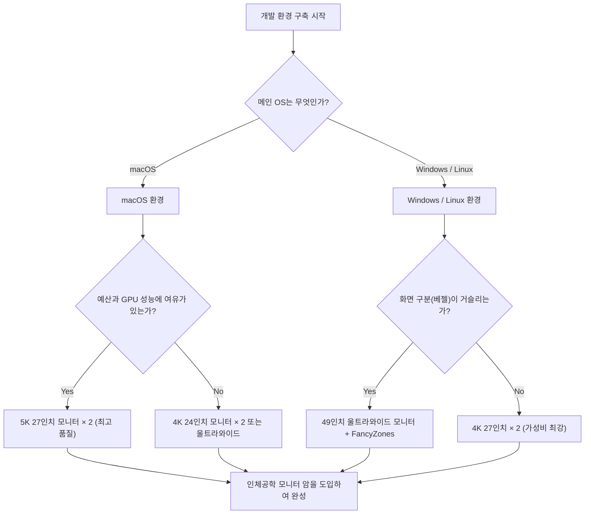

# 개발 효율을 극대화하는 멀티 디스플레이 배치와 최적의 솔루션

현대 소프트웨어 엔지니어링에서 개발 환경의 최적화는 곧장 생산성 향상으로 직결됩니다. 특히 우리가 하루의 대부분을 보내는 '디스플레이 환경'은 단순한 정보 표시 장치를 넘어 엔지니어의 '외부 뇌' 또는 '확장 워크스페이스'로 기능합니다. 에디터, 터미널, 브라우저, 채팅 툴, 디버거 등 동시에 참조해야 할 정보가 폭발적으로 증가하는 가운데, 싱글 디스플레이에서의 작업은 이제 인지 리소스의 낭비라고 할 수밖에 없습니다.

그러나 단순히 디스플레이 수만 늘린다고 좋은 것은 아닙니다. 물리적 배치, 시야 공학(인체공학), OS별 스케일링 사양, 그리고 연결 규격의 대역폭 계산 등 다각적인 관점에서 '최적의 솔루션'을 도출해야 합니다. 본 기사에서는 이 모든 요소를 철저히 분해하여, 과학적이고 공학적인 접근을 통해 궁극의 멀티 디스플레이 환경을 구축하기 위한 완벽한 가이드를 제공합니다.

---

## 1. 시야 공학과 인체공학: 물리적 관점에서의 접근

디스플레이 배치를 생각할 때 가장 먼저 고려해야 할 것은 인간의 신체적, 생리적 한계입니다. 장시간의 코딩 세션에서 부적절한 디스플레이 배치는 눈의 피로, 어깨 결림, 그리고 심각한 경추 장애를 유발합니다.

### 1.1 단속성 안구 운동(Saccade)과 인지 부하

인간의 눈은 한 점에서 다른 점으로 시선을 이동할 때 '단속성 안구 운동(Saccadic eye movement)'이라고 불리는 매우 고속의 안구 운동을 합니다. 이 안구 운동이 일어나는 동안 뇌는 시각 정보를 차단하며(단속성 억제), 정보 처리가 일시적으로 중단됩니다.

단속성 안구 운동에 걸리는 시간 $T_{saccade}$ 는 이동하는 각도(Amplitude)에 의존하며, 근사적으로 다음과 같은 수식으로 표현됩니다.

$$ T_{saccade} = 2.2 \times \theta + 21 \text{ [ms]} $$

여기서 $\theta$ 는 시선의 이동 각도(도)입니다. 예를 들어, 극단적으로 멀리 떨어진 듀얼 디스플레이의 끝에서 끝으로 시선을 이동할 경우($\theta = 40^\circ$), 약 109ms의 시간이 걸립니다. 이것 자체는 눈 깜짝할 순간이지만, 하루에 수천 번 발생하면 무시할 수 없는 인지 부하와 피로의 축적으로 이어집니다.

따라서 주요 작업 영역(에디터 등)은 항상 정면($\theta < 15^\circ$ 범위)에 배치하여 단속성 안구 운동의 진폭을 최소화하는 것이 시야 공학의 기본입니다.

### 1.2 경추에 가해지는 부담과 디스플레이 높이·각도의 물리학

인간의 머리는 약 5~6kg의 무게가 있습니다. 목의 각도(굴곡각)가 커질수록 경추에 가해지는 부하(토크)는 기하급수적으로 증가합니다. 목의 각도를 $\phi$ 라고 할 때, 경추에 가해지는 실효적인 무게 부하 $W_{effective}$ 는 물리적인 모멘트 계산으로부터 다음과 같이 근사됩니다.

$$ W_{effective} \approx W_{head} + k \times \sin(\phi) $$

의학적 연구에 따르면 목의 각도가 0도(직립)일 때는 약 5kg의 부하가 걸리지만, 15도 기울이면 약 12kg, 30도에서 약 18kg, 45도에서 약 22kg의 부하가 경추에 가해집니다. 노트북 화면을 내려다보는 자세가 '거북목(일자목)'을 유발하는 원인이 바로 여기에 있습니다.

멀티 디스플레이 환경에서는 메인 디스플레이의 상단이 시선과 같거나 약간 아래(약 0~5도 아래)가 되도록 모니터 암으로 조정하는 것이 최적의 솔루션입니다. 또한 서브 모니터를 배치할 때도 목의 회전 각도가 30도를 넘지 않도록 곡면 모니터를 사용하거나 각도를 주어 배치해야 합니다.

### 1.3 시야각(FOV) 최적화와 곡면 디스플레이(Curvature)의 의의

인간의 유효 시야(정보 처리가 즉각적으로 이루어지는 범위)는 수평 약 30도라고 알려져 있습니다. 평면 대형 디스플레이(예: 32인치 이상)를 가까운 거리(약 60cm)에서 보면, 화면 가장자리를 볼 때 초점 거리가 변하여 눈의 초점 조절 근육(모양체근)에 큰 부담이 가해집니다.

화면 중앙에서 가장자리까지의 거리 변화 $\Delta d$ 는, 시청 거리를 $D$, 화면 너비의 절반을 $w$ 라고 할 때 다음과 같습니다.

$$ \Delta d = \sqrt{D^2 + w^2} - D $$

이 $\Delta d$ 를 0에 가깝게 만들기 위한 방안이 '곡면 디스플레이(Curved Monitor)'입니다. 곡률 반경 $R$ (예: 1500R = 1500mm 반경)이 시청 거리 $D$ 와 일치할 때, 화면상의 모든 점이 눈에서 같은 거리에 있게 되어 눈의 피로를 극적으로 줄일 수 있습니다.

---

## 2. 디스플레이 구성 비교 검토: Dual vs Triple vs Ultrawide

물리적인 인체공학을 이해한 바탕 위에서, 현대 개발자에게 적합한 디스플레이 구성 패턴을 비교하고 평가합니다.

### 2.1 듀얼 모니터 (예: 27인치 4K × 2)

가장 표준적인 구성입니다. 가로로 나란히 배치할 경우 베젤이 중앙에 오기 때문에 목을 항상 좌우 어느 한쪽으로 기울여야 합니다. 이를 피하기 위해서는 한 대를 정면(메인), 다른 한 대를 대각선(서브)에 배치하거나 세로로 쌓는(스택 구성) 것이 권장됩니다.

- **장점:** 물리적인 화면 분할이 명확함. 전체 화면 앱 관리가 용이함.
- **단점:** 중앙의 베젤이 시야를 분할함. 목의 회전 부하가 높음.

### 2.2 트리플 모니터 구성

메인을 정면에 두고 좌우에 서브를 배치하는 구성, 혹은 한 대를 세로(포트레이트)로 배치하는 구성입니다. 로그 모니터링, 문서, 코딩을 완전히 분리할 수 있습니다.

- **장점:** 압도적인 정보량. 중앙에 베젤이 오지 않음.
- **단점:** 책상 공간을 많이 차지함. 그래픽 카드의 출력 단자나 대역폭 제한을 받기 쉬움.

### 2.3 울트라와이드 모니터 (예: 49인치 5120x1440)

27인치 WQHD 모니터 두 대를 가로로 연결한 것과 동일한 영역을 베젤 없이 구현하는 구성입니다. 최근의 트렌드이며, 인체공학과 정보량의 균형이 가장 잘 맞습니다.

다음은 울트라와이드 모니터 도입에 따른 시간 절약 모델을 보여주는 간트 차트입니다. 창 전환이나 컨텍스트 스위칭에 걸리는 시간의 감소를 시각화했습니다.

```mermaid
gantt
    title "울트라와이드 vs 듀얼 모니터의 컨텍스트 스위칭 시간 비교"
    dateFormat  s
    axisFormat  %S
    
    section "듀얼 모니터"
    "작업 A (에디터)"        :a1, 0, 5s
    "창 찾기/전환"     :a2, after a1, 2s
    "작업 B (터미널)"      :a3, after a2, 5s
    "창 찾기/전환"     :a4, after a3, 2s
    
    section "49인치 울트라와이드"
    "작업 A (에디터)"        :b1, 0, 5s
    "눈길 돌리기 (전환 없음)"     :b2, after b1, 0.5s
    "작업 B (터미널)"      :b3, after b2, 5s
```

---

## 3. 픽셀 밀도(PPI)의 수학과 OS의 스케일링 사양

디스플레이를 선택할 때 해상도(4K 등)뿐만 아니라 '픽셀 밀도(PPI: Pixels Per Inch)'를 이해하는 것이 매우 중요합니다. 특히 macOS 환경에서는 PPI 선택을 잘못하면 성능 저하나 글씨 번짐 현상을 초래합니다.

### 3.1 픽셀 밀도(PPI) 계산식

PPI는 디스플레이의 물리적 크기(대각선 길이 $d$ 인치)와 해상도(가로 $w$ 픽셀, 세로 $h$ 픽셀)로부터 다음 수식으로 계산됩니다.

$$ PPI = \frac{\sqrt{w^2 + h^2}}{d} $$

예를 들어, 개발자에게 인기 있는 '27인치 4K 모니터(3840x2160)'의 PPI를 계산해 보겠습니다.

$$ PPI = \frac{\sqrt{3840^2 + 2160^2}}{27} = \frac{\sqrt{14745600 + 4665600}}{27} = \frac{\sqrt{19411200}}{27} \approx \frac{4405.8}{27} \approx 163.18 \text{ PPI} $$

### 3.2 macOS와 Windows의 스케일링 메커니즘 차이

여기서 문제가 되는 것은 OS에 의한 UI 스케일링(확대 및 축소) 방식입니다.

**Windows의 경우:**
Windows는 벡터 기반의 UI 스케일링(DPI 스케일링)을 채택하고 있어 지정한 비율(예: 150%)에 맞춰 UI 요소를 직접 다시 그립니다. 그래서 163 PPI인 27인치 4K 모니터라도 150% 스케일링을 설정하면 비교적 깨끗하게 표시되며 성능 페널티도 적습니다.

**macOS의 경우:**
macOS는 역사적으로 110 PPI(비 Retina) 또는 220 PPI(Retina)를 타깃으로 설계되었습니다. macOS의 UI 스케일링(의사 해상도)은 먼저 매우 거대한 해상도의 버퍼(가상 캔버스)에 UI를 그리고, 이를 GPU로 축소(다운스케일)하여 물리 픽셀에 매핑하는 방식을 취합니다.

예를 들어, 27인치 4K(163 PPI)에서 'WQHD(2560x1440) 상당'의 의사 해상도를 선택한 경우, macOS는 내부적으로 그 2배인 5120x2880 픽셀(5K)로 화면을 렌더링하고, 이를 3840x2160(4K)으로 축소(스케일링 계수 $\approx 0.75$)하여 출력합니다. 이러한 비정수배 픽셀 보간 프로세스는 다음과 같은 문제를 발생시킵니다.

1. **GPU 리소스 낭비:** 항상 5K 렌더링을 수행하기 때문에 특히 노트북의 내장 GPU에 큰 부하가 걸리며 발열과 배터 소모가 증가합니다.
2. **글씨 번짐(Blurriness):** 완벽한 정수배(2.0x 등)가 아니기 때문에 서브 픽셀 수준에서 안티앨리어싱이 부정확해져 폰트의 가장자리가 약간 흐릿해집니다.

따라서 macOS에서 최고의 경험을 얻으려면 27인치라면 5K 모니터(5120x2880 = 약 218 PPI), 혹은 24인치 4K 모니터(약 183 PPI로 의사 해상도의 정수 스케일링에 가까움)를 선택하는 것이 '최적의 솔루션'이 됩니다.

---

## 4. 연결 대역폭과 데이지 체인: Thunderbolt 4와 DP MST의 한계

여러 대의 고해상도 모니터를 연결할 경우, 케이블의 데이터 전송 용량(대역폭)이 병목 현상을 일으킵니다. "모니터를 샀는데 주사율이 30Hz밖에 나오지 않는다"와 같은 문제는 대역폭 계산 부족이 원인입니다.

### 4.1 영상 신호 대역폭의 계산 모델

디스플레이에 영상 신호를 보내는 데 필요한 대역폭 데이터 레이트 $R$ (bps)은 다음과 같은 수식으로 모델화할 수 있습니다.

$$ R = W \times H \times F \times C \times B $$

여기서 각 변수는 다음과 같습니다.
- $W$: 가로 해상도 (Width)
- $H$: 세로 해상도 (Height)
- $F$: 주사율 (Hz, Frame rate)
- $C$: 색 심도·픽셀당 비트 수 (Color depth, 8-bit RGB라면 $8 \times 3 = 24$, 10-bit HDR이라면 $10 \times 3 = 30$)
- $B$: 블랭킹 기간 오버헤드 (Blanking overhead, VESA 표준 타이밍으로 약 1.05~1.15)

예를 들어 '4K(3840x2160), 60Hz, 10-bit 컬러' 모니터 한 대가 필요로 하는 비압축 데이터 레이트를 계산해 보겠습니다(오버헤드 계수 $B = 1.05$ 로 가정).

$$ R = 3840 \times 2160 \times 60 \times 30 \times 1.05 \approx 15,676,416,000 \text{ bps} \approx 15.68 \text{ Gbps} $$

### 4.2 Thunderbolt 4와 KVM 스위치를 이용한 환경 구축

Thunderbolt 4의 최대 대역폭은 40 Gbps이지만, PCIe 데이터 통신 등도 함께 사용하기 때문에 영상 출력에 전체 대역폭을 할당할 수 있는 것은 아닙니다. 듀얼 4K 60Hz 환경(약 31.3 Gbps)을 구축할 경우, Thunderbolt 4 독의 성능을 한계까지 끌어내게 됩니다.

Windows 환경에서는 DisplayPort의 MST(Multi-Stream Transport) 기능을 이용해 하나의 포트에서 여러 모니터로 데이지 체인 방식으로 신호를 보낼 수 있습니다. 하지만 macOS는 사양상 MST에 의한 확장(Extend)을 지원하지 않으며, 데이지 체인 연결 시 모두 '미러링(같은 화면)'이 되어 버립니다. macOS에서 듀얼 모니터를 사용하려면 반드시 PC 본체나 Thunderbolt 독의 각각 다른 포트에서 케이블을 배선해야 합니다.

다음 Mermaid 플로우차트는 PC/Mac에서 Thunderbolt 독을 거치는 이상적인 신호 라우팅 구조를 보여줍니다.

---

## 5. 창 관리 자동화: OS별 설정 가이드

아무리 훌륭한 물리적 디스플레이 환경을 구축하더라도, 마우스로 창을 드래그해서 크기를 조절하고 있다면 개발 효율은 극대화되지 않습니다. 광활한 화면 영역을 논리적으로 분할하고, 단축키로 순식간에 창을 스냅시키는 '창 관리자(Window Manager)'의 도입이 필수적입니다.

### 5.1 Windows: PowerToys FancyZones

Windows에서는 Microsoft 공식 도구인 'PowerToys'에 포함된 'FancyZones'가 최고의 솔루션입니다. 기본 Windows 스냅 기능(Win + 방향키)보다 복잡하고 커스터마이징이 가능한 그리드를 정의할 수 있습니다.

울트라와이드 모니터(예: 32:9)의 경우 화면을 단순한 2분할이 아니라 '좌측 25%, 중앙 50%, 우측 25%'의 3분할로 구성하는 것이 개발자에게 최적입니다. 중앙의 50%(16:9)에 메인 에디터나 브라우저를 배치하고, 좌우에 터미널, 채팅 툴, 레퍼런스를 배치합니다.

FancyZones에서는 Shift 키를 누른 채 창을 드래그하거나 'Win + 방향키' 동작을 오버라이드하여 사용자 정의 영역에 순식간에 창을 배치할 수 있습니다. 이를 통해 컨텍스트 스위칭에 수반되는 마우스 조작 시간을 거의 0으로 줄일 수 있습니다.

### 5.2 macOS: Yabai와 Amethyst를 통한 타일형 창 관리

macOS는 기본적으로 창 스냅 기능이 약해(※macOS Sequoia에서 개선되고 있지만), Linux 스타일의 '타일형 창 관리자(Tiling Window Manager)'를 도입하는 사용자가 많습니다.

대표적인 도구로는 'Yabai'와 'Amethyst'를 들 수 있습니다.

- **Amethyst:** 설치만 하면 작동하며, xmonad와 유사한 자동 타일 관리를 제공합니다. 손쉽게 시작하고 싶은 경우에 추천합니다.
- **Yabai:** 보다 고급스러운 커스터마이징이 가능하지만, SIP(System Integrity Protection)의 일부를 비활성화해야 합니다. 스페이스(가상 데스크톱) 관리, 창 테두리 그리기, 투명도 처리 등 스크립트(yabairc)를 통해 환경을 완벽하게 제어할 수 있습니다.

Yabai를 사용할 경우 `skhd`라는 핫키 데몬과 조합하여 설정합니다. 다음은 포커스 이동이나 창 스와프를 즉시 수행하기 위한 개념적인 조작 흐름입니다.

이러한 도구들을 구사함으로써, 키보드에서 손을 떼지 않고도 광활한 멀티 디스플레이 영역의 모든 곳에 즉각적으로 접근하여 코드를 계속 작성할 수 있게 됩니다.

---

## 6. 결론: 당신을 위한 '최적의 솔루션'이란

멀티 디스플레이 환경 구축에 있어 모든 사람에게 들어맞는 단일한 정답은 없습니다. 그러나 아래의 플로우차트를 참고함으로써 당신의 개발 스타일에 맞춘 논리적인 최적의 솔루션을 도출해 낼 수 있습니다.

디스플레이는 한 번 구입하면 오랜 기간 동안 당신의 생산성을 뒷받침할 인프라입니다. 본 기사에서 해설한 시야 공학의 원칙, PPI의 수학, 대역폭의 한계, 그리고 소프트웨어를 통한 창 관리를 통합하여 타협 없는 최고의 워크스페이스를 구축하십시오. 그것이 결과적으로 최고의 코드를 만들어내는 가장 빠른 지름길이 될 것입니다.
