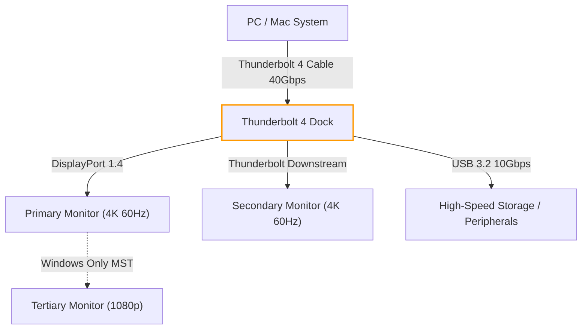
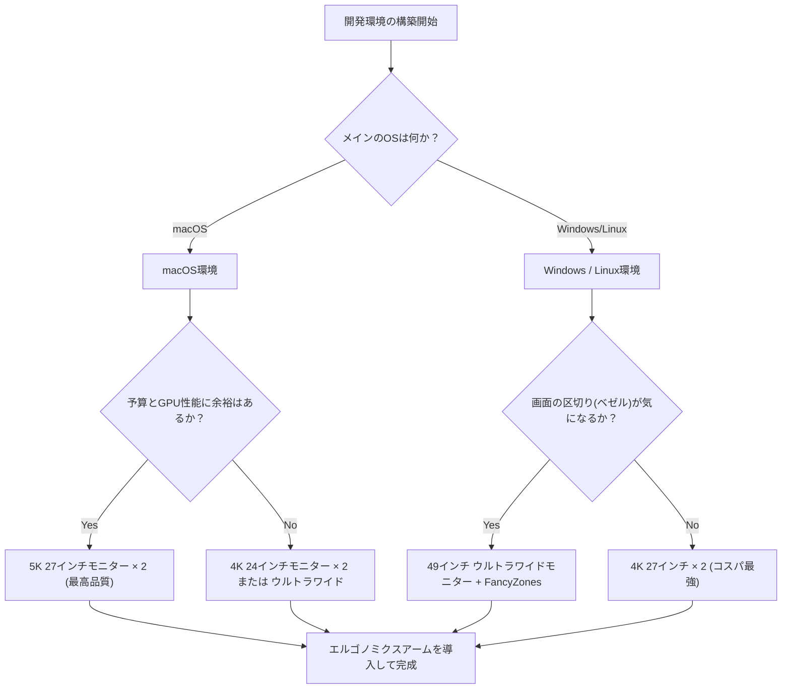

# 開発効率を最大化するマルチディスプレイの配置と最適解

現代のソフトウェアエンジニアリングにおいて、開発環境の最適化はそのまま生産性の向上に直結します。特に、私たちが1日の大半を過ごす「ディスプレイ環境」は、単なる情報の表示装置を超えて、エンジニアの「外部脳」あるいは「拡張ワークスペース」として機能します。エディタ、ターミナル、ブラウザ、チャットツール、デバッガなど、同時に参照すべき情報が爆発的に増加する中、シングルディスプレイでの作業はもはや認知リソースの無駄遣いと言わざるを得ません。

しかし、単にディスプレイの数を増やせば良いというものではありません。物理的な配置、視界工学（エルゴノミクス）、OSごとのスケーリング仕様、そして接続規格の帯域幅計算など、多角的な視点から「最適解」を導き出す必要があります。本記事では、これらすべての要素を徹底的に分解し、科学的かつ工学的なアプローチから究極のマルチディスプレイ環境を構築するための完全なガイドを提供します。

---

## 1. 視界工学とエルゴノミクス：物理的な観点からのアプローチ

ディスプレイの配置を考える際、最初に考慮すべきは人間の身体的・生理的な限界です。長時間のコーディングセッションにおいて、不適切なディスプレイ配置は眼精疲労、肩こり、そして深刻な頸椎（けいつい）の障害を引き起こします。

### 1.1 サッカード（衝動性眼球運動）と認知負荷

人間の目は、ある点から別の点へと視線を移動させる際、「サッカード（Saccadic eye movement）」と呼ばれる非常に高速な眼球運動を行います。このサッカードの間、実は脳は視覚情報をシャットダウンしており（サッカード抑制）、情報処理が一時的に停止します。

サッカードにかかる時間 $T_{saccade}$ は、移動する角度（Amplitude）に依存し、近似的に以下の数式で表されます。

$$ T_{saccade} = 2.2 \times \theta + 21 \text{ [ms]} $$

ここで、$\theta$ は視線の移動角度（度）です。例えば、極端に離れたデュアルディスプレイの端から端へ視線を移動させる場合（$\theta = 40^\circ$）、約109msの時間がかかります。これ自体は一瞬ですが、1日に何千回も発生すると、無視できない認知負荷と疲労の蓄積につながります。

したがって、主要な作業領域（エディタなど）は常に正面（$\theta < 15^\circ$の範囲）に配置し、サッカードの振幅を最小限に抑えることが視界工学的な基本となります。

### 1.2 頸椎への負担とディスプレイの高さ・角度の物理学

人間の頭部は約5〜6kgの重量があります。首の角度（屈曲角）が大きくなるほど、頸椎にかかる負荷（トルク）は幾何級数的に増加します。首の角度を $\phi$ としたとき、頸椎にかかる実効的な重量負荷 $W_{effective}$ は、物理的なモーメントの計算から以下のように近似されます。

$$ W_{effective} \approx W_{head} + k \times \sin(\phi) $$

医学的な研究によれば、首の角度が0度（直立）のときは約5kgの負荷ですが、15度傾けると約12kg、30度で約18kg、45度で約22kgもの負荷が頸椎にかかります。ノートパソコンの画面を見下ろす姿勢が「ストレートネック」を引き起こす原因はここにあります。

マルチディスプレイ環境においては、メインディスプレイの上端が目線と同じか、わずかに下（約0〜5度下）になるようにモニターアームで調整するのが最適解です。また、サイドモニターを配置する場合も、首の回旋角度が30度を超えないように湾曲させるか、角度をつけて配置する必要があります。

### 1.3 視野角（FOV）の最適化と湾曲ディスプレイ（Curvature）の意義

人間の有効視野（情報処理が即座に行える範囲）は水平約30度と言われています。フラットな大型ディスプレイ（例：32インチ以上）を至近距離（約60cm）で見ると、画面の端を見る際に焦点距離が変わり、眼のピント調節筋（毛様体筋）に大きな負担がかかります。

画面の中央から端までの距離の変化 $\Delta d$ は、視聴距離を $D$、画面の幅の半分を $w$ とすると以下のようになります。

$$ \Delta d = \sqrt{D^2 + w^2} - D $$

この $\Delta d$ をゼロに近づけるための方策が「湾曲ディスプレイ（Curved Monitor）」です。曲率半径 $R$ （例：1500R = 1500mmの半径）が視聴距離 $D$ と一致するとき、画面上のすべての点が目から等距離になり、眼精疲労を劇的に軽減できます。

---

## 2. ディスプレイ構成の比較検討：Dual vs Triple vs Ultrawide

物理的なエルゴノミクスを理解した上で、現代の開発者に適したディスプレイ構成のパターンを比較・評価します。

### 2.1 デュアルモニター（例：27インチ 4K × 2）

最もスタンダードな構成です。横に並べる場合、ベゼルが中央に来るため、首を常に左右どちらかに傾ける必要があります。これを回避するためには、1台を正面（メイン）、もう1台を斜め（サブ）に配置するか、縦に積む（スタック構成）のが推奨されます。

- **メリット:** 物理的な画面分割が明確。フルスクリーンアプリの管理が容易。
- **デメリット:** 中央のベゼルが視界を分断する。首の回旋負荷が高い。

### 2.2 トリプルモニター構成

メインを正面に据え、左右にサブを配置する構成、あるいは1台を縦置き（ポートレート）にする構成です。ログ監視、ドキュメント、コーディングを完全に分離できます。

- **メリット:** 圧倒的な情報量。中央にベゼルが来ない。
- **デメリット:** 机のスペースを大量に消費。グラフィックボードの出力端子や帯域幅の制限を受けやすい。

### 2.3 ウルトラワイドモニター（例：49インチ 5120x1440）

27インチWQHDモニターを2台横につなげたのと同じ領域を、ベゼルレスで実現する構成です。最近のトレンドであり、エルゴノミクスと情報量のバランスが最も取れています。

以下は、ウルトラワイドモニター導入による時間節約のモデルを示すガントチャートです。ウィンドウの切り替えやコンテキストスイッチにかかる時間の削減を視覚化しています。

```mermaid
gantt
    title "ウルトラワイド vs デュアルモニターのコンテキストスイッチ時間比較"
    dateFormat  s
    axisFormat  %S
    
    section "Dual Monitor"
    "Task A (Editor)"        :a1, 0, 5s
    "Find/Switch Window"     :a2, after a1, 2s
    "Task B (Terminal)"      :a3, after a2, 5s
    "Find/Switch Window"     :a4, after a3, 2s
    
    section "49-inch Ultrawide"
    "Task A (Editor)"        :b1, 0, 5s
    "Glance (No Switch)"     :b2, after b1, 0.5s
    "Task B (Terminal)"      :b3, after b2, 5s
```

---

## 3. ピクセル密度（PPI）の数学とOSのスケーリング仕様

ディスプレイを選ぶ際、解像度（4Kなど）だけでなく「ピクセル密度（PPI：Pixels Per Inch）」を理解することが極めて重要です。特にmacOS環境では、PPIの選択を誤るとパフォーマンスの低下や文字の滲みを引き起こします。

### 3.1 ピクセル密度（PPI）の計算式

PPIは、ディスプレイの物理的なサイズ（対角線の長さ $d$ インチ）と解像度（水平 $w$ ピクセル、垂直 $h$ ピクセル）から以下の数式で計算されます。

$$ PPI = \frac{\sqrt{w^2 + h^2}}{d} $$

例えば、開発者に人気の「27インチ 4Kモニター（3840x2160）」のPPIを計算してみましょう。

$$ PPI = \frac{\sqrt{3840^2 + 2160^2}}{27} = \frac{\sqrt{14745600 + 4665600}}{27} = \frac{\sqrt{19411200}}{27} \approx \frac{4405.8}{27} \approx 163.18 \text{ PPI} $$

### 3.2 macOSとWindowsのスケーリング機構の違い

ここで問題になるのが、OSによるUIのスケーリング（拡大縮小）の仕組みです。

**Windowsの場合:**
WindowsはベクターベースのUIスケーリング（DPIスケーリング）を採用しており、指定したパーセンテージ（例：150%）に合わせてUI要素を直接再描画します。そのため、163 PPIの27インチ4Kモニターでも、150%スケーリングを設定すれば比較的綺麗に表示され、パフォーマンスのペナルティも少なくなっています。

**macOSの場合:**
macOSは歴史的に、110 PPI（非Retina）または220 PPI（Retina）をターゲットに設計されています。macOSのUIスケーリング（擬似解像度）は、一度非常に巨大な解像度のバッファ（仮想キャンバス）にUIを描画し、それをGPUで縮小（ダウンスケール）して物理ピクセルにマッピングするというアプローチを取ります。

例えば、27インチ4K（163 PPI）で「WQHD（2560x1440）相当」の疑似解像度を選択した場合、macOSは内部的にその2倍の5120x2880ピクセル（5K）で画面をレンダリングし、それを3840x2160（4K）に縮小（スケーリング係数 $\approx 0.75$）して出力します。この非整数倍のピクセル補間プロセスは、以下の問題を発生させます。

1. **GPUリソースの浪費:** 常に5Kのレンダリングを行うため、特にラップトップの内蔵GPUに大きな負荷がかかり、発熱やバッテリー消費が増大します。
2. **文字の滲み（Blurriness）:** 完璧な整数倍（2.0xなど）ではないため、サブピクセルレベルでアンチエイリアスが不正確になり、フォントのエッジがわずかにぼやけます。

このため、macOSで最高の体験を得るには、27インチであれば5Kモニター（5120x2880 = 約218 PPI）、あるいは24インチで4Kモニター（約183 PPIで、擬似解像度の整数スケーリングに近い）を選択することが「最適解」となります。

---

## 4. 接続帯域幅とデイジーチェーン：Thunderbolt 4とDP MSTの限界

複数の高解像度モニターを接続する場合、ケーブルのデータ伝送容量（帯域幅）がボトルネックになります。「モニターを買ったのにリフレッシュレートが30Hzしか出ない」といったトラブルは、帯域幅の計算不足が原因です。

### 4.1 映像信号帯域幅の計算モデル

ディスプレイに映像信号を送るために必要な帯域幅データレート $R$ (bps) は、以下の数式でモデル化できます。

$$ R = W \times H \times F \times C \times B $$

ここで、各変数は以下の通りです。
- $W$: 水平解像度 (Width)
- $H$: 垂直解像度 (Height)
- $F$: リフレッシュレート (Hz, Frame rate)
- $C$: 色深度・ピクセルあたりのビット数 (Color depth, 8-bit RGBなら $8 \times 3 = 24$, 10-bit HDRなら $10 \times 3 = 30$)
- $B$: ブランキング期間オーバーヘッド (Blanking overhead, VESA標準タイミングで約1.05〜1.15)

例として、「4K（3840x2160）、60Hz、10-bitカラー」のモニター1台が必要とする非圧縮データレートを計算します（オーバーヘッド係数 $B = 1.05$ と仮定）。

$$ R = 3840 \times 2160 \times 60 \times 30 \times 1.05 \approx 15,676,416,000 \text{ bps} \approx 15.68 \text{ Gbps} $$

### 4.2 Thunderbolt 4とKVMスイッチによる環境構築

Thunderbolt 4の最大帯域幅は40 Gbpsですが、PCIeデータ通信なども相乗りするため、映像出力に全帯域を割り当てられるわけではありません。デュアル4K 60Hz環境（約31.3 Gbps）を構築する場合、Thunderbolt 4ドックの性能を限界まで引き出すことになります。

Windows環境では、DisplayPortのMST（Multi-Stream Transport）機能を利用して、1つのポートから複数のモニターへ数珠つなぎ（デイジーチェーン）に信号を送ることができます。しかし、macOSは仕様上MSTによる拡張（Extend）をサポートしておらず、デイジーチェーン接続した場合はすべて「ミラーリング（同じ画面）」になってしまいます。macOSでデュアルモニターにする場合は、必ずPC本体またはThunderboltドックの別々のポートからケーブルを配線する必要があります。

以下のMermaidフローチャートは、PC/MacからThunderboltドックを介した理想的なシグナル・ルーティングの構造を示しています。

---

## 5. ウィンドウ管理の自動化：OS別セットアップガイド

どんなに素晴らしい物理的ディスプレイ環境を構築しても、ウィンドウをマウスでドラッグしてリサイズしているようでは、開発効率は最大化されません。広大な画面領域を論理的に分割し、ショートカットキーで瞬時にウィンドウをスナップさせる「ウィンドウマネージャー」の導入が不可欠です。

### 5.1 Windows: PowerToys FancyZones

Windowsにおいては、Microsoft公式ツールである「PowerToys」に含まれる「FancyZones」が最強のソリューションです。デフォルトのWindowsスナップ機能（Win + 矢印キー）よりも複雑でカスタマイズ性の高いグリッドを定義できます。

ウルトラワイドモニター（例：32:9）の場合、画面を単純な2分割ではなく「左25%・中央50%・右25%」の3分割にする構成が開発者には最適です。中央の50%（16:9）にメインのエディタやブラウザを配置し、左右にターミナル、チャットツール、リファレンスを配置します。

FancyZonesではShiftキーを押しながらウィンドウをドラッグするか、「Win + 矢印キー」の動作をオーバーライドして、カスタムゾーンに一瞬でウィンドウを配置できるようになります。これにより、コンテキストスイッチに伴うマウス操作の時間をほぼゼロに削減できます。

### 5.2 macOS: YabaiとAmethystによるタイル型ウィンドウ管理

macOSは標準ではウィンドウのスナップ機能が弱く（※macOS Sequoiaで改善されつつありますが）、Linuxライクな「タイル型ウィンドウマネージャー（Tiling Window Manager）」を導入するユーザーが多く存在します。

代表的なツールとしては「Yabai」と「Amethyst」が挙げられます。

- **Amethyst:** インストールするだけで動作し、ハスク・Xmonadライクな自動タイル管理を提供します。手軽に始めたい場合におすすめです。
- **Yabai:** より高度なカスタマイズが可能ですが、SIP（System Integrity Protection）の一部を無効化する必要があります。スペース（仮想デスクトップ）の管理、ウィンドウのボーダー描画、透過処理など、スクリプト（yabairc）を通じて完全に環境を制御できます。

Yabaiを使用する場合、`skhd` というホットキー・デーモンと組み合わせて設定を行います。以下は、フォーカス移動やウィンドウのスワップを瞬時に行うための概念的な操作フローです。

これらのツールを駆使することで、キーボードから一切手を離すことなく、広大なマルチディスプレイ領域のあらゆる場所へ瞬時にアクセスし、コードを記述し続けることが可能になります。

---

## 6. 結論：あなたにとっての「最適解」とは

マルチディスプレイ環境の構築において、万人に当てはまる単一の正解はありません。しかし、以下のフローチャートを参考にすることで、あなたの開発スタイルに合わせた論理的な最適解を導き出すことができます。

ディスプレイは一度購入すれば長年にわたってあなたの生産性を支え続けるインフラストラクチャです。本記事で解説した視界工学の原則、PPIの数学、帯域幅の限界、そしてソフトウェアによるウィンドウ管理を統合し、妥協のない最高のワークスペースを構築してください。それが、結果として最高のコードを生み出す最短ルートとなるはずです。
