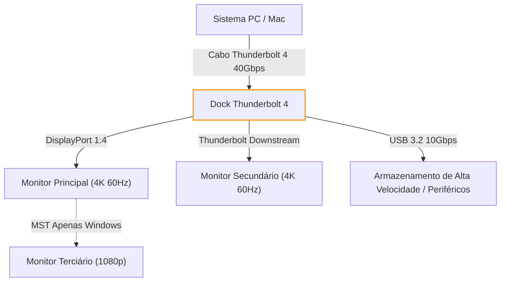
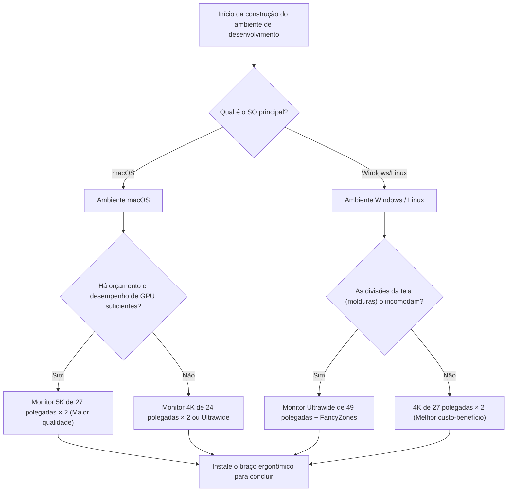

# Configuração de Múltiplos Monitores e Soluções Ideais para Maximizar a Eficiência de Desenvolvimento

Na engenharia de software moderna, a otimização do ambiente de desenvolvimento está diretamente ligada ao aumento da produtividade. Em particular, o "ambiente de exibição", onde passamos a maior parte do dia, funciona além de um mero dispositivo de exibição de informações; ele atua como o "cérebro externo" ou "espaço de trabalho estendido" de um engenheiro. Com o aumento explosivo de informações que precisam ser consultadas simultaneamente — como editores, terminais, navegadores, ferramentas de chat e depuradores — trabalhar com um único monitor tornou-se um desperdício de recursos cognitivos.

No entanto, simplesmente aumentar o número de monitores não é suficiente. É necessário encontrar a "solução ideal" de várias perspectivas, como layout físico, engenharia visual (ergonomia), especificações de dimensionamento (scaling) de cada SO e cálculos de largura de banda para padrões de conexão. Neste artigo, desconstruímos minuciosamente todos esses elementos e fornecemos um guia completo para construir o ambiente de múltiplos monitores definitivo a partir de uma abordagem científica e de engenharia.

---

## 1. Engenharia Visual e Ergonomia: Uma Abordagem a Partir da Perspectiva Física

Ao considerar a disposição dos monitores, a primeira coisa a ter em mente são os limites físicos e fisiológicos do ser humano. Durante longas sessões de codificação, uma disposição inadequada dos monitores pode causar fadiga ocular, rigidez nos ombros e graves distúrbios cervicais.

### 1.1 Sacadas (Movimentos Oculares Rápidos) e Carga Cognitiva

Quando o olho humano move o olhar de um ponto para outro, ele realiza movimentos oculares extremamente rápidos chamados de "sacadas" (Saccadic eye movement). Durante essas sacadas, o cérebro na verdade desliga a entrada visual (supressão sacádica) e o processamento de informações é temporariamente pausado.

O tempo necessário para uma sacada, $T_{saccade}$, depende do ângulo de movimento (Amplitude) e é aproximadamente expresso pela seguinte fórmula:

$$ T_{saccade} = 2.2 \times \theta + 21 \text{ [ms]} $$

Aqui, $\theta$ é o ângulo de movimento do olhar (em graus). Por exemplo, mover o olhar de uma extremidade a outra de um sistema de dois monitores extremamente distantes ($\theta = 40^\circ$) leva cerca de 109 ms. Embora seja apenas um instante, quando ocorre milhares de vezes por dia, resulta em uma carga cognitiva e acúmulo de fadiga que não podem ser ignorados.

Portanto, a base da engenharia visual é manter a área de trabalho principal (como o editor) sempre de frente (na faixa de $\theta < 15^\circ$) para minimizar a amplitude das sacadas.

### 1.2 Carga na Coluna Cervical e a Física da Altura e do Ângulo do Monitor

A cabeça humana pesa cerca de 5 a 6 kg. Quanto maior o ângulo do pescoço (ângulo de flexão), a carga (torque) aplicada à coluna cervical aumenta exponencialmente. Assumindo que o ângulo do pescoço é $\phi$, a carga efetiva de peso na coluna cervical, $W_{effective}$, é aproximada do cálculo do momento físico da seguinte forma:

$$ W_{effective} \approx W_{head} + k \times \sin(\phi) $$

De acordo com pesquisas médicas, a carga é de cerca de 5 kg quando o ângulo do pescoço é de 0 graus (ereto), mas ao inclinar 15 graus, sobe para cerca de 12 kg, a 30 graus é de cerca de 18 kg, e a 45 graus atinge cerca de 22 kg de carga sobre a coluna cervical. É por isso que olhar para a tela do laptop pode causar a "síndrome do pescoço de texto" (straight neck).

Em um ambiente de múltiplos monitores, a solução ideal é ajustar a tela com um braço articulado para que a borda superior do monitor principal fique no nível dos olhos ou um pouco abaixo (cerca de 0 a 5 graus abaixo). Além disso, ao posicionar monitores laterais, eles devem ser curvados ou inclinados para que o ângulo de rotação do pescoço não exceda 30 graus.

### 1.3 Otimização do Campo de Visão (FOV) e o Significado dos Monitores Curvos

Diz-se que o campo de visão efetivo humano (o alcance onde as informações podem ser processadas instantaneamente) é de cerca de 30 graus horizontalmente. Olhar para uma tela grande e plana (por exemplo, 32 polegadas ou mais) a uma curta distância (cerca de 60 cm) altera a distância focal ao olhar para as bordas da tela, o que coloca uma grande pressão no músculo de ajuste de foco do olho (músculo ciliar).

A variação de distância do centro para a borda da tela $\Delta d$, dada uma distância de visualização $D$ e metade da largura da tela $w$, é a seguinte:

$$ \Delta d = \sqrt{D^2 + w^2} - D $$

Uma medida para aproximar esse $\Delta d$ de zero é o "Monitor Curvo" (Curved Monitor). Quando o raio de curvatura $R$ (ex: 1500R = raio de 1500 mm) coincide com a distância de visualização $D$, todos os pontos da tela ficam equidistantes do olho, o que pode reduzir drasticamente a fadiga ocular.

---

## 2. Estudo Comparativo de Configurações de Monitores: Duplo vs Triplo vs Ultrawide

Compreendendo a ergonomia física, vamos comparar e avaliar os padrões de configuração de monitores adequados para desenvolvedores modernos.

### 2.1 Monitores Duplos (Ex: 27 polegadas 4K × 2)

É a configuração mais padrão. Quando colocados lado a lado, as molduras (bezels) ficam no centro, exigindo que o pescoço esteja sempre inclinado para a esquerda ou para a direita. Para evitar isso, recomenda-se colocar um na frente (principal) e o outro em ângulo (secundário), ou empilhá-los verticalmente (configuração stack).

- **Vantagens:** A divisão física da tela é clara. Fácil gerenciamento de aplicativos em tela cheia.
- **Desvantagens:** As molduras centrais dividem o campo de visão. Alta carga rotacional no pescoço.

### 2.2 Configuração de Três Monitores

Uma configuração com o principal no centro e os secundários à esquerda e à direita, ou um colocado verticalmente (retrato). Permite a separação completa entre monitoramento de logs, documentação e codificação.

- **Vantagens:** Quantidade esmagadora de informações. Nenhuma moldura no centro.
- **Desvantagens:** Consome muito espaço na mesa. Facilmente sujeito a limitações nas portas de saída e na largura de banda da placa de vídeo.

### 2.3 Monitor Ultrawide (Ex: 49 polegadas 5120x1440)

Esta configuração fornece a mesma área de dois monitores WQHD de 27 polegadas lado a lado, mas sem molduras. É a tendência recente e oferece o melhor equilíbrio entre ergonomia e densidade de informações.

Abaixo está um gráfico de Gantt que modela a economia de tempo ao adotar um monitor ultrawide. Ele visualiza a redução do tempo gasto em trocas de janelas e trocas de contexto.

```mermaid
gantt
    title "Comparação do tempo de troca de contexto: Ultrawide vs Duplo"
    dateFormat  s
    axisFormat  %S
    
    section "Monitor Duplo"
    "Tarefa A (Editor)"        :a1, 0, 5s
    "Encontrar/Trocar Janela"     :a2, after a1, 2s
    "Tarefa B (Terminal)"      :a3, after a2, 5s
    "Encontrar/Trocar Janela"     :a4, after a3, 2s
    
    section "Ultrawide de 49 pol."
    "Tarefa A (Editor)"        :b1, 0, 5s
    "Olhar (Sem Troca)"     :b2, after b1, 0.5s
    "Tarefa B (Terminal)"      :b3, after b2, 5s
```

---

## 3. A Matemática da Densidade de Pixels (PPI) e Especificações de Dimensionamento do SO

Ao escolher um monitor, é extremamente importante entender não apenas a resolução (como 4K), mas também a "Densidade de Pixels" (PPI: Pixels Per Inch). Especialmente em ambientes macOS, a escolha incorreta do PPI pode causar degradação de desempenho e fontes borradas.

### 3.1 Fórmula de Cálculo da Densidade de Pixels (PPI)

O PPI é calculado usando o tamanho físico da tela (comprimento diagonal $d$ polegadas) e a resolução (pixels horizontais $w$, pixels verticais $h$) com a seguinte fórmula:

$$ PPI = \frac{\sqrt{w^2 + h^2}}{d} $$

Por exemplo, vamos calcular o PPI de um popular "Monitor 4K de 27 polegadas (3840x2160)" para desenvolvedores:

$$ PPI = \frac{\sqrt{3840^2 + 2160^2}}{27} = \frac{\sqrt{14745600 + 4665600}}{27} = \frac{\sqrt{19411200}}{27} \approx \frac{4405.8}{27} \approx 163.18 \text{ PPI} $$

### 3.2 Diferenças nos Mecanismos de Dimensionamento entre macOS e Windows

A questão aqui é como o SO lida com o dimensionamento da IU (scaling).

**No Windows:**
O Windows usa um dimensionamento da IU baseado em vetores (DPI scaling) que redesenha diretamente os elementos da IU para corresponder à porcentagem especificada (por exemplo, 150%). Portanto, mesmo um monitor 4K de 27 polegadas a 163 PPI será exibido de forma relativamente nítida se o dimensionamento for definido para 150%, incorrendo em menos penalidades de desempenho.

**No macOS:**
O macOS foi historicamente projetado para atingir 110 PPI (não Retina) ou 220 PPI (Retina). O dimensionamento da IU do macOS (resoluções pseudo-escalonadas) emprega uma abordagem em que desenha a IU num buffer de altíssima resolução (uma tela virtual) e a reduz (downscale) com a GPU para mapeá-la em pixels físicos.

Por exemplo, se escolher uma resolução pseudo-escalonada "equivalente a WQHD (2560x1440)" num monitor 4K de 27 polegadas (163 PPI), o macOS renderizará a tela internamente ao dobro disso em 5120x2880 pixels (5K), diminuirá a resolução para 3840x2160 (4K) (fator de escala $\approx 0.75$) e a emitirá. Esse processo de interpolação de pixels não integrais causa os seguintes problemas:

1. **Desperdício de recursos de GPU:** Renderizar sempre em 5K coloca uma carga pesada nas GPUs integradas, em particular em laptops, o que aumenta o calor e o consumo da bateria.
2. **Textos borrados (Blurriness):** Como não é um múltiplo inteiro perfeito (como 2.0x), o anti-aliasing no nível do subpixel torna-se impreciso, e as bordas das fontes ficam levemente borradas.

Portanto, para ter a melhor experiência no macOS, a "solução ideal" é selecionar um monitor 5K (5120x2880 = aprox. 218 PPI) se for de 27 polegadas, ou um monitor 4K (aprox. 183 PPI, o que se aproxima do dimensionamento inteiro nas resoluções virtuais) se for de 24 polegadas.

---

## 4. Largura de Banda de Conexão e Daisy Chain: Limitações do Thunderbolt 4 e DP MST

Ao conectar vários monitores de alta resolução, a capacidade de transmissão de dados (largura de banda) dos cabos torna-se um gargalo. Problemas como "Comprei um monitor, mas a taxa de atualização é de apenas 30Hz" são causados por cálculos incorretos de largura de banda.

### 4.1 Modelo de Cálculo da Largura de Banda do Sinal de Vídeo

A taxa de dados de largura de banda $R$ (bps) necessária para enviar sinais de vídeo para o monitor pode ser modelada pela seguinte fórmula:

$$ R = W \times H \times F \times C \times B $$

Onde cada variável é a seguinte:
- $W$: Resolução horizontal (Width)
- $H$: Resolução vertical (Height)
- $F$: Taxa de atualização (Hz, Frame rate)
- $C$: Profundidade de cor, bits por pixel (Color depth, se for RGB de 8 bits $8 \times 3 = 24$, se for HDR de 10 bits $10 \times 3 = 30$)
- $B$: Sobrecarga de período de apagamento (Blanking overhead, aprox. 1.05 a 1.15 nos padrões de tempo da VESA)

Como exemplo, vamos calcular a taxa de dados não comprimidos exigida por um único monitor "4K (3840x2160), 60Hz, cor de 10 bits" (assumindo um fator de sobrecarga $B = 1.05$).

$$ R = 3840 \times 2160 \times 60 \times 30 \times 1.05 \approx 15,676,416,000 \text{ bps} \approx 15.68 \text{ Gbps} $$

### 4.2 Construção de Ambiente com Thunderbolt 4 e Switches KVM

A largura de banda máxima do Thunderbolt 4 é de 40 Gbps, mas como a comunicação de dados PCIe também a compartilha, toda a largura de banda não pode ser alocada apenas para a saída de vídeo. Ao construir um ambiente duplo 4K a 60Hz (aprox. 31,3 Gbps), você leva o desempenho de uma dock Thunderbolt 4 ao seu limite.

No ambiente Windows, você pode usar a função MST (Multi-Stream Transport) do DisplayPort para enviar sinais de uma única porta para vários monitores de forma encadeada (daisy chain). No entanto, de acordo com suas especificações, o macOS não suporta a extensão (Extend) via MST, e a conexão daisy chain resultará apenas em "espelhamento (mesma tela)". No caso de configurar monitores duplos no macOS, certifique-se sempre de rotear os cabos de portas separadas no próprio PC ou na dock Thunderbolt.

O fluxograma Mermaid abaixo ilustra a estrutura de roteamento de sinal ideal de um PC/Mac por meio de uma dock Thunderbolt.

---

## 5. Automação do Gerenciamento de Janelas: Guia de Configuração por SO

Não importa quão fantástico seja o ambiente físico do monitor que você construa, se você estiver arrastando e redimensionando janelas com o mouse, a eficiência do desenvolvimento não será maximizada. A introdução de um "gerenciador de janelas" que divide logicamente as vastas áreas da tela e fixa (snaps) as janelas instantaneamente com atalhos de teclado é essencial.

### 5.1 Windows: PowerToys FancyZones

No Windows, a solução mais poderosa é o "FancyZones", incluído na ferramenta oficial da Microsoft "PowerToys". Permite definir grades mais complexas e personalizáveis do que o recurso de snap padrão do Windows (Win + Setas).

Para monitores ultrawide (ex: 32:9), em vez de simplesmente dividi-los em duas metades, dividi-los em três seções "25% à esquerda, 50% no centro, 25% à direita" é o ideal para desenvolvedores. Coloque o editor principal e o navegador nos 50% centrais (16:9) e coloque o terminal, as ferramentas de bate-papo e as referências à esquerda e à direita.

Com o FancyZones, ao arrastar uma janela enquanto segura a tecla Shift ou substituir o comportamento de "Win + Setas", as janelas podem ser instantaneamente colocadas em zonas personalizadas. Isso reduz o tempo gasto na operação do mouse devido a trocas de contexto para quase zero.

### 5.2 macOS: Gerenciamento de Janelas Lado a Lado (Tiling) com Yabai e Amethyst

O macOS tem fracos recursos nativos de snap de janelas (embora esteja sendo melhorado no macOS Sequoia), e muitos usuários instalam "Gerenciadores de Janelas Lado a Lado" (Tiling Window Managers) parecidos com os do Linux.

Ferramentas representativas incluem "Yabai" e "Amethyst".

- **Amethyst:** Funciona logo após a instalação e oferece gerenciamento automático de janelas lado a lado no estilo Xmonad / Haskell. Recomendado se você quiser começar de forma rápida e fácil.
- **Yabai:** Oferece personalização muito mais avançada, mas requer desativar parcialmente o SIP (System Integrity Protection). Por meio de scripts (yabairc), é possível controlar totalmente o ambiente, como o gerenciamento de espaços (desktops virtuais), desenho de bordas de janelas, transparências, etc.

Ao usar o Yabai, você o configura em combinação com um daemon de teclas de atalho (hotkey) chamado `skhd`. A seguir está um fluxo operacional conceitual para realizar movimentos de foco e trocas de janelas instantaneamente.

Ao aproveitar essas ferramentas, é possível acessar instantaneamente qualquer área dos vastos displays múltiplos e continuar escrevendo códigos sem nunca tirar as mãos do teclado.

---

## 6. Conclusão: Qual é a Sua "Solução Ideal"?

Na construção de um ambiente de múltiplos monitores, não há uma resposta única que se aplique a todos. No entanto, consultando o fluxograma a seguir, você pode derivar uma solução ideal lógica adaptada ao seu estilo de desenvolvimento.

Os monitores são uma infraestrutura que, uma vez comprados, continuarão a apoiar sua produtividade por muitos anos. Integre os princípios da engenharia visual, a matemática de PPI, os limites da largura de banda e o gerenciamento de janelas por software discutidos neste artigo para construir o melhor espaço de trabalho sem compromissos. Isso deve, no final, tornar-se o caminho mais curto para produzir o melhor código.
