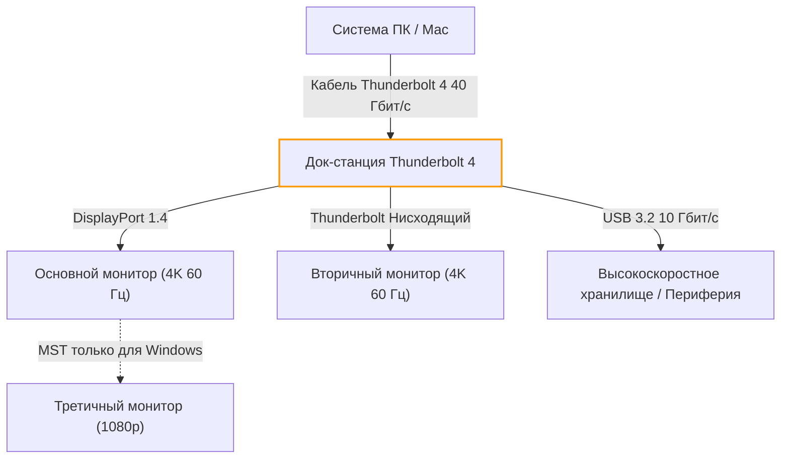
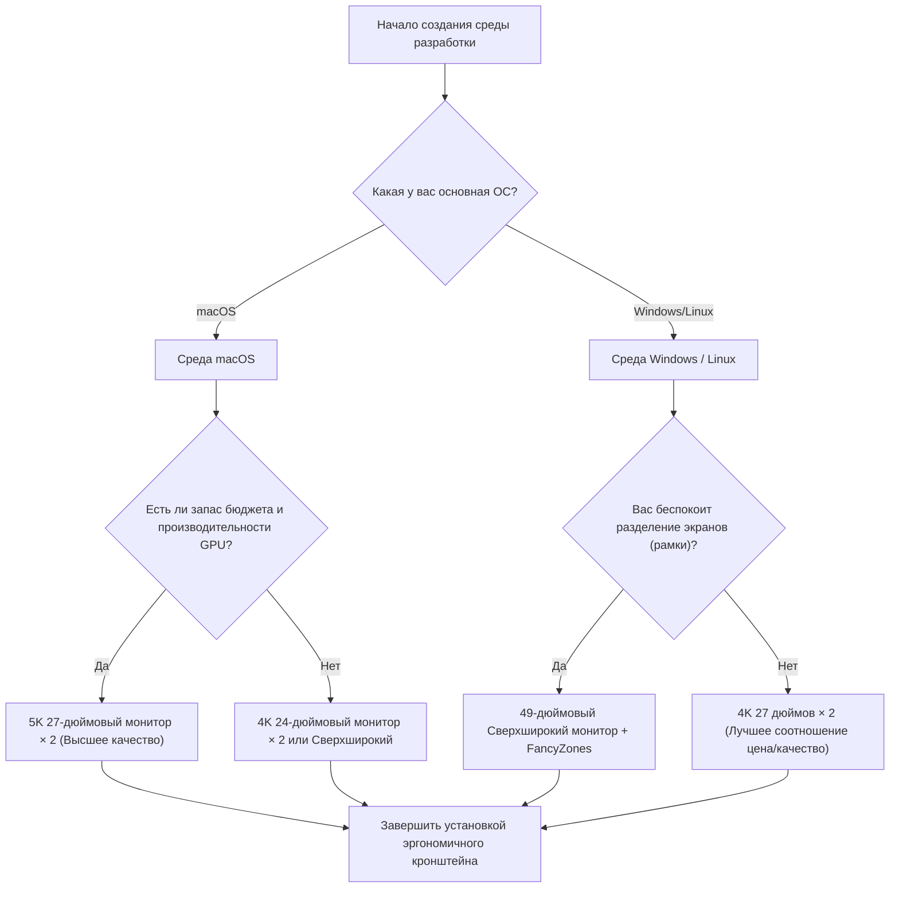

# Максимальная эффективность разработки: оптимальное расположение и настройка нескольких мониторов

В современной инженерии программного обеспечения оптимизация среды разработки напрямую ведет к повышению производительности. В частности, «среда мониторов», в которой мы проводием большую часть дня, выходит за рамки простого устройства отображения информации и функционирует как «внешний мозг» или «расширенное рабочее пространство» инженера. Поскольку объем информации, к которой необходимо обращаться одновременно, такой как редакторы, терминалы, браузеры, чат-инструменты и отладчики, стремительно растет, работа с одним монитором уже стала пустой тратой когнитивных ресурсов.

Однако просто увеличить количество дисплеев недостаточно. Необходимо найти «оптимальное решение» с различных точек зрения: физического расположения, эргономики зрения, спецификаций масштабирования каждой операционной системы и расчета пропускной способности стандартов подключения. В этой статье мы подробно разберем все эти элементы и предоставим полное руководство по созданию идеальной среды с несколькими мониторами на основе научного и инженерного подходов.

---

## 1. Эргономика зрения и физическое расположение: физический подход

При рассмотрении расположения дисплеев в первую очередь следует учитывать физические и физиологические ограничения человеческого тела. Неправильное расположение монитора во время длительных сессий кодирования может вызвать напряжение глаз, ригидность мышц шеи и плеч, а также серьезные повреждения шейного отдела позвоночника.

### 1.1 Саккады (быстрые движения глаз) и когнитивная нагрузка

Когда человеческий глаз переводит взгляд с одной точки на другую, он совершает очень быстрое движение глаз, называемое «саккадой». Во время этой саккады мозг фактически отключает визуальную информацию (саккадическое подавление), и обработка информации временно приостанавливается.

Время, затрачиваемое на саккаду $T_{saccade}$, зависит от угла перемещения (амплитуды) и приблизительно выражается следующей формулой:

$$ T_{saccade} = 2.2 \times \theta + 21 \text{ [ms]} $$

Здесь $\theta$ — угол перемещения линии взгляда (в градусах). Например, если вы переводите взгляд от одного края к другому на очень удаленном двойном дисплее ($\theta = 40^\circ$), это займет около 109 мс. Это лишь мгновение, но если это происходит тысячи раз в день, это приводит к значительному накоплению когнитивной нагрузки и усталости.

Поэтому основной принцип эргономики зрения заключается в том, чтобы всегда размещать основную рабочую область (например, редактор) прямо перед собой (в диапазоне $\theta < 15^\circ$) и сводить амплитуду саккады к минимуму.

### 1.2 Нагрузка на шейный отдел позвоночника и физика высоты и угла наклона монитора

Голова человека весит около 5-6 кг. Чем больше угол наклона шеи (угол сгибания), тем экспоненциальнее увеличивается нагрузка (крутящий момент) на шейный отдел позвоночника. Если угол шеи обозначить как $\phi$, то эффективная весовая нагрузка на шейный отдел $W_{effective}$ аппроксимируется на основе расчета физического момента следующим образом:

$$ W_{effective} \approx W_{head} + k \times \sin(\phi) $$

Согласно медицинским исследованиям, когда угол шеи равен 0 градусам (в прямом положении), нагрузка составляет около 5 кг, но если наклонить ее на 15 градусов, на шейный отдел ложится нагрузка около 12 кг, на 30 градусов — около 18 кг, а на 45 градусов — около 22 кг. В этом и кроется причина «синдрома прямой шеи», вызванного привычкой смотреть вниз на экран ноутбука.

В среде с несколькими мониторами оптимальным решением является использование кронштейна для монитора, чтобы настроить верхний край главного дисплея на уровне глаз или чуть ниже (около 0-5 градусов вниз). При размещении дополнительных боковых мониторов их также следует изогнуть или расположить под углом, чтобы угол поворота шеи не превышал 30 градусов.

### 1.3 Оптимизация поля зрения (FOV) и значение изогнутых дисплеев (Curvature)

Считается, что эффективное поле зрения человека (область, где информация может обрабатываться мгновенно) составляет около 30 градусов по горизонтали. Если смотреть на плоский большой дисплей (например, 32 дюйма и более) с близкого расстояния (около 60 см), фокусное расстояние будет изменяться при взгляде на края экрана, что создает большую нагрузку на мышцы глаз, регулирующие фокус (ресничную мышцу).

Изменение расстояния $\Delta d$ от центра к краю экрана можно выразить следующим образом, где $D$ — расстояние просмотра, а $w$ — половина ширины экрана:

$$ \Delta d = \sqrt{D^2 + w^2} - D $$

Мерой, позволяющей свести это $\Delta d$ к нулю, является «изогнутый дисплей» (Curved Monitor). Когда радиус кривизны $R$ (например: 1500R = радиус 1500 мм) совпадает с расстоянием просмотра $D$, все точки на экране находятся на равном расстоянии от глаз, что может значительно снизить утомляемость глаз.

---

## 2. Сравнение конфигураций дисплеев: Dual vs Triple vs Ultrawide

Понимая физическую эргономику, мы сравним и оценим паттерны конфигураций дисплеев, подходящие для современных разработчиков.

### 2.1 Два монитора (Dual Monitor, пример: 27 дюймов 4K × 2)

Это самая стандартная конфигурация. При размещении рядом рамки оказываются посередине, поэтому необходимо постоянно наклонять шею влево или вправо. Чтобы избежать этого, рекомендуется разместить один прямо перед собой (основной), а другой под углом (дополнительный) или установить их вертикально один над другим (конфигурация в виде стека).

- **Плюсы:** Четкое физическое разделение экрана. Легко управлять полноэкранными приложениями.
- **Минусы:** Рамки по центру разделяют поле зрения. Высокая нагрузка на шею из-за поворота.

### 2.2 Три монитора (Triple Monitor)

Конфигурация, в которой основной монитор расположен спереди, а дополнительные — слева и справа, или когда один установлен вертикально (портретный режим). Можно полностью разделить мониторинг логов, документацию и написание кода.

- **Плюсы:** Огромный объем информации. В центре нет рамок.
- **Минусы:** Занимает много места на столе. Часто ограничивается количеством выходных портов видеокарты и пропускной способностью.

### 2.3 Сверхширокий монитор (Ultrawide Monitor, пример: 49 дюймов 5120x1440)

Эта конфигурация обеспечивает ту же область без рамок, что и два 27-дюймовых монитора WQHD, расположенных рядом. Это современный тренд, который обеспечивает наилучший баланс между эргономикой и объемом информации.

Ниже представлена диаграмма Ганта, показывающая модель экономии времени за счет внедрения сверхширокого монитора. Она визуализирует сокращение времени, затрачиваемого на переключение окон и контекста.

```mermaid
gantt
    title "Сравнение времени переключения контекста: Сверхширокий монитор vs Два монитора"
    dateFormat  s
    axisFormat  %S
    
    section "Два монитора"
    "Задача A (Редактор)"        :a1, 0, 5s
    "Поиск/переключение окна"    :a2, after a1, 2s
    "Задача B (Терминал)"        :a3, after a2, 5s
    "Поиск/переключение окна"    :a4, after a3, 2s
    
    section "49-дюймовый сверхширокий"
    "Задача A (Редактор)"        :b1, 0, 5s
    "Взгляд (без переключения)"  :b2, after b1, 0.5s
    "Задача B (Терминал)"        :b3, after b2, 5s
```

---

## 3. Математика плотности пикселей (PPI) и спецификации масштабирования ОС

При выборе монитора критически важно понимать не только разрешение (например, 4K), но и «плотность пикселей» (PPI: Pixels Per Inch). Особенно в среде macOS неправильный выбор PPI приводит к снижению производительности и размытию текста.

### 3.1 Формула расчета плотности пикселей (PPI)

PPI рассчитывается на основе физического размера дисплея (длина диагонали $d$ в дюймах) и разрешения (горизонтальное $w$ пикселей, вертикальное $h$ пикселей) по следующей формуле:

$$ PPI = \frac{\sqrt{w^2 + h^2}}{d} $$

Для примера рассчитаем PPI популярного среди разработчиков «27-дюймового 4K монитора (3840x2160)».

$$ PPI = \frac{\sqrt{3840^2 + 2160^2}}{27} = \frac{\sqrt{14745600 + 4665600}}{27} = \frac{\sqrt{19411200}}{27} \approx \frac{4405.8}{27} \approx 163.18 \text{ PPI} $$

### 3.2 Различия в механизмах масштабирования между macOS и Windows

Здесь возникает проблема механизма масштабирования UI (увеличения/уменьшения) операционной системой.

**В случае Windows:**
Windows использует векторное масштабирование UI (DPI scaling) и перерисовывает элементы UI непосредственно в соответствии с заданным процентом (например, 150%). Таким образом, даже на 27-дюймовом 4K мониторе со 163 PPI установка масштабирования на 150% обеспечит относительно четкое отображение с минимальным падением производительности.

**В случае macOS:**
macOS исторически разрабатывалась с расчетом на 110 PPI (не-Retina) или 220 PPI (Retina). Механизм масштабирования UI в macOS (псевдоразрешение) использует подход, при котором UI сначала отрисовывается в буфер с очень большим разрешением (виртуальный холст), а затем графический процессор (GPU) уменьшает его (downscaling) и отображает на физических пикселях.

Например, если вы выберете псевдоразрешение «эквивалент WQHD (2560x1440)» на 27-дюймовом 4K (163 PPI) мониторе, macOS внутренне будет рендерить экран в двукратном разрешении 5120x2880 пикселей (5K), а затем уменьшит его (коэффициент масштабирования $\approx 0.75$) для вывода в 3840x2160 (4K). Этот процесс интерполяции нецелочисленного количества пикселей вызывает следующие проблемы:

1. **Растрата ресурсов GPU:** Поскольку рендеринг постоянно происходит в 5K, это сильно нагружает встроенный GPU ноутбука, увеличивая тепловыделение и энергопотребление батареи.
2. **Размытие текста (Blurriness):** Поскольку это не идеальное целое число (не 2.0x), сглаживание на субпиксельном уровне становится неточным, а края шрифтов слегка размываются.

По этой причине для получения лучшего опыта на macOS «оптимальным решением» будет выбор 5K монитора на 27 дюймов (5120x2880 = около 218 PPI) или 4K монитора на 24 дюйма (около 183 PPI, что близко к целочисленному масштабированию псевдоразрешения).

---

## 4. Пропускная способность соединения и Daisy Chain (гирляндное подключение): Ограничения Thunderbolt 4 и DP MST

При подключении нескольких мониторов с высоким разрешением емкость передачи данных (пропускная способность) кабеля становится узким местом. Такие проблемы, как «Я купил монитор, но частота обновления составляет всего 30 Гц», вызваны недостаточным расчетом пропускной способности.

### 4.1 Модель расчета пропускной способности видеосигнала

Необходимую пропускную способность, скорость передачи данных $R$ (бит/с) для отправки видеосигнала на дисплей можно смоделировать с помощью следующей формулы:

$$ R = W \times H \times F \times C \times B $$

Где каждая переменная означает следующее:
- $W$: Горизонтальное разрешение (Width)
- $H$: Вертикальное разрешение (Height)
- $F$: Частота обновления (Hz, Frame rate)
- $C$: Глубина цвета / количество бит на пиксель (Color depth, для 8-битного RGB $8 \times 3 = 24$, для 10-битного HDR $10 \times 3 = 30$)
- $B$: Издержки периода гашения (Blanking overhead, около 1.05-1.15 для стандартных таймингов VESA)

В качестве примера рассчитаем скорость передачи несжатых данных, необходимую для одного монитора «4K (3840x2160), 60 Гц, 10-битный цвет» (предполагая коэффициент издержек $B = 1.05$).

$$ R = 3840 \times 2160 \times 60 \times 30 \times 1.05 \approx 15,676,416,000 \text{ бит/с} \approx 15.68 \text{ Гбит/с} $$

### 4.2 Создание среды с использованием Thunderbolt 4 и KVM-переключателя

Максимальная пропускная способность Thunderbolt 4 составляет 40 Гбит/с, но поскольку она используется совместно с передачей данных PCIe и другими, невозможно выделить всю пропускную способность только на видеовыход. При создании среды с двумя мониторами 4K 60 Гц (около 31.3 Гбит/с) производительность док-станции Thunderbolt 4 будет использоваться на пределе возможностей.

В среде Windows можно использовать функцию MST (Multi-Stream Transport) DisplayPort для отправки сигналов с одного порта на несколько мониторов, подключенных последовательно (Daisy Chain). Однако macOS не поддерживает расширение через MST, поэтому при гирляндном подключении все мониторы будут показывать одно и то же («зеркалирование»). Для создания двойного монитора в macOS кабели обязательно должны быть подключены к разным портам на самом ПК или док-станции Thunderbolt.

Следующая блок-схема Mermaid иллюстрирует идеальную структуру маршрутизации сигналов от ПК/Mac через док-станцию Thunderbolt.

---

## 5. Автоматизация управления окнами: руководство по настройке для разных ОС

Независимо от того, насколько прекрасную физическую среду мониторов вы создали, ваша эффективность разработки не будет максимальной, если вы продолжаете перетаскивать и изменять размеры окон с помощью мыши. Крайне важно внедрить «оконный менеджер» (Window Manager), который логически разделяет огромное пространство экрана и позволяет мгновенно привязывать окна с помощью горячих клавиш.

### 5.1 Windows: PowerToys FancyZones

В Windows «FancyZones», входящая в официальный набор инструментов Microsoft «PowerToys», является лучшим решением. Это позволяет задавать более сложные и настраиваемые сетки, чем стандартная функция привязки Windows (Win + стрелки).

В случае сверхширокого монитора (например, 32:9) для разработчиков оптимальной является конфигурация с разделением экрана не просто пополам, а на 3 части: «левая 25% · центральная 50% · правая 25%». Основной редактор или браузер располагаются по центру на 50% (16:9), а терминал, чаты и справочные материалы — слева и справа.

С помощью FancyZones вы можете мгновенно размещать окна в пользовательских зонах, перетаскивая их с нажатой клавишей Shift или переопределив сочетание «Win + стрелки». Это может сократить время на манипуляции мышью, связанные с переключением контекста, почти до нуля.

### 5.2 macOS: Плиточное управление окнами с помощью Yabai и Amethyst

По умолчанию в macOS функция привязки окон слабая (хотя это улучшается в macOS Sequoia), поэтому многие пользователи устанавливают Linux-подобные «плиточные оконные менеджеры» (Tiling Window Managers).

В качестве типичных инструментов можно назвать «Yabai» и «Amethyst».

- **Amethyst:** Работает сразу после установки и предоставляет автоматическое плиточное управление, подобное xmonad в Haskell. Рекомендуется, если вы хотите начать с чего-то простого.
- **Yabai:** Допускает более тонкую настройку, но требует отключения части SIP (System Integrity Protection). Позволяет полностью контролировать среду через скрипт (yabairc), включая управление пространствами (виртуальными рабочими столами), отрисовку границ окон, прозрачность и т. д.

При использовании Yabai он настраивается в сочетании с демоном горячих клавиш `skhd`. Ниже представлена концептуальная схема операций для мгновенного перемещения фокуса или обмена окнами.

Полностью используя эти инструменты, вы сможете мгновенно получать доступ к любому месту огромной области из нескольких мониторов и продолжать писать код, даже не отрывая рук от клавиатуры.

---

## 6. Заключение: Что является «оптимальным решением» для вас?

При создании среды с несколькими мониторами не существует единого правильного ответа, подходящего всем. Однако, опираясь на следующую блок-схему, вы сможете найти логически обоснованное оптимальное решение, соответствующее вашему стилю разработки.

Дисплеи — это инфраструктура, которая после покупки будет поддерживать вашу производительность на протяжении многих лет. Объедините принципы эргономики зрения, математику PPI, ограничения пропускной способности и программное управление окнами, описанные в этой статье, чтобы создать лучшее рабочее пространство без компромиссов. Это, в конечном итоге, должно стать кратчайшим путем к написанию отличного кода.
