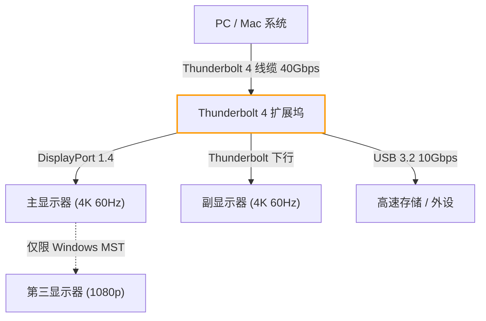
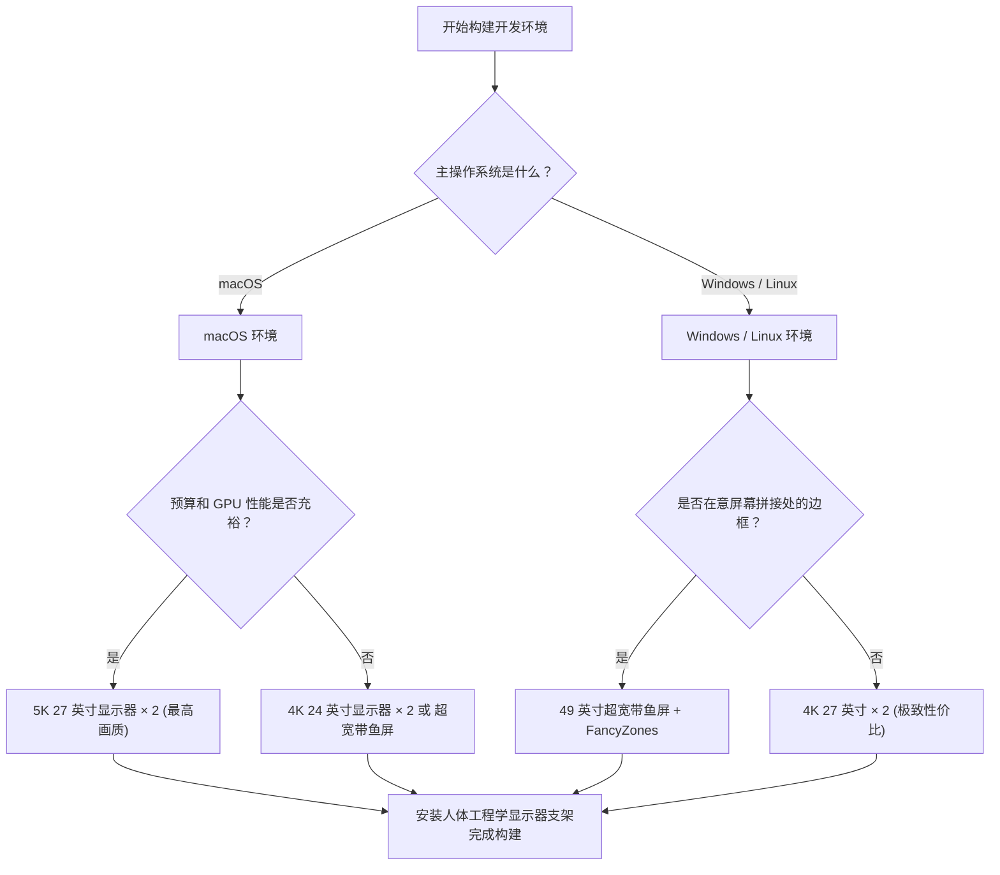

# 最大化开发效率的多显示器配置与最优解

在现代软件工程中，开发环境的优化直接关系到生产力的提升。尤其是我们每天大部分时间都在面对的“显示器环境”，它早已超越了单纯的信息显示设备的范畴，成为了工程师的“外部大脑”或“扩展工作区”。随着需要同时参考的信息（如编辑器、终端、浏览器、聊天工具、调试器等）呈爆炸式增长，使用单显示器进行工作已不得不说是对认知资源的浪费。

然而，仅仅增加显示器的数量并非万能之策。我们需要从物理布局、视觉工程学（人体工程学）、不同操作系统的缩放规范，以及连接标准的带宽计算等多个维度出发，推导出“最优解”。本文将彻底剖析所有这些要素，从科学与工程学的角度，为您提供构建终极多显示器环境的完全指南。

---

## 1. 视觉工程学与人体工程学：基于物理视角的探讨

在考虑显示器布局时，首先应当考虑的是人类身体与生理的极限。在长时间的编码过程中，不当的显示器布局会引发眼部疲劳、肩颈酸痛，甚至导致严重的颈椎损伤。

### 1.1 扫视（扫视眼球运动）与认知负荷

当人类的视线从一点移动到另一点时，会进行一种被称为“扫视（Saccadic eye movement）”的极高速眼球运动。实际上，在扫视期间，大脑会屏蔽视觉信息（扫视抑制），信息处理会暂时停止。

扫视所需的时间 $T_{saccade}$ 取决于移动的角度（Amplitude），近似可以用以下公式表示：

$$ T_{saccade} = 2.2 \times \theta + 21 \text{ [ms]} $$

其中，$\theta$ 是视线移动的角度（度）。例如，在距离极远的双显示器两端移动视线时（$\theta = 40^\circ$），大约需要 109 毫秒。虽然这只是一瞬间，但如果每天发生数千次，就会累积成无法忽视的认知负荷与疲劳。

因此，将主要的工作区域（如编辑器）始终放置在正前方（$\theta < 15^\circ$ 的范围内），尽可能减小扫视的幅度，这是视觉工程学的基本原则。

### 1.2 颈椎的负担与显示器高度、角度的物理学

人类的头部重量约为 5 至 6 公斤。颈部角度（屈曲角）越大，颈椎承受的负荷（力矩）就会呈几何级数增加。假设颈部角度为 $\phi$，颈椎承受的有效重量负荷 $W_{effective}$ 可以通过物理力矩计算近似得出：

$$ W_{effective} \approx W_{head} + k \times \sin(\phi) $$

医学研究表明，当颈部角度为 0 度（直立）时，负荷约为 5 公斤；但倾斜 15 度时负荷约为 12 公斤，30 度时约为 18 公斤，45 度时更是高达约 22 公斤。这就是低头看笔记本电脑屏幕容易导致“直颈病（颈椎曲度变直）”的原因。

在多显示器环境中，最优解是使用显示器支架进行调整，使主显示器的上边缘与视线平齐，或略低于视线（约向下 0 至 5 度）。此外，在配置副显示器时，必须使用曲面屏或调整一定角度摆放，以确保颈部的旋转角度不超过 30 度。

### 1.3 视野角（FOV）的优化与曲面显示器（Curvature）的意义

人类的有效视野（能够瞬间处理信息的范围）水平方向约为 30 度。如果在近距离（约 60 厘米）观看扁平的大型显示器（如 32 英寸以上），在看屏幕边缘时焦距会发生变化，给眼部的睫状肌带来巨大的调节负担。

假设观看距离为 $D$，屏幕一半的宽度为 $w$，则从屏幕中央到边缘的距离变化 $\Delta d$ 如下：

$$ \Delta d = \sqrt{D^2 + w^2} - D $$

为了使这个 $\Delta d$ 趋近于零，“曲面显示器（Curved Monitor）”应运而生。当曲率半径 $R$（例如：1500R = 1500 毫米半径）与观看距离 $D$ 一致时，屏幕上的所有点到眼睛的距离都相等，能够显著减轻眼部疲劳。

---

## 2. 显示器配置的对比与评估：双屏 vs 三屏 vs 带鱼屏

在理解了物理人体工程学之后，我们来对比和评估适合现代开发者的几种显示器配置方案。

### 2.1 双显示器（例：27 英寸 4K × 2）

这是最标准的配置。如果横向并排摆放，由于边框位于正中央，你的脖子必须始终向左或向右倾斜。为了避免这种情况，建议将一台放在正前方（主屏），另一台放在斜侧方（副屏），或者上下堆叠摆放（Stack 布局）。

- **优点:** 物理屏幕分割清晰。易于管理全屏应用。
- **缺点:** 中央的边框会割裂视野。颈部旋转负荷较大。

### 2.2 三显示器配置

主屏位于正前方，左右各放置一台副屏，或者将其中一台竖放（人像模式）。可以完全分离日志监控、文档和编码区域。

- **优点:** 拥有压倒性的信息量。正中央没有边框。
- **缺点:** 占用极大的桌面空间。容易受到显卡输出接口或带宽的限制。

### 2.3 超宽带鱼屏（例：49 英寸 5120x1440）

在没有边框的情况下，实现了相当于将两台 27 英寸 WQHD 显示器横向拼接的区域。这是近期的趋势，也是人体工程学与信息量平衡得最好的方案。

以下是一个甘特图，展示了引入超宽带鱼屏后节省时间的模型，可视化了切换窗口或进行上下文切换所节省的时间。

```mermaid
gantt
    title "超宽带鱼屏 vs 双显示器的上下文切换时间对比"
    dateFormat  s
    axisFormat  %S
    
    section "双显示器"
    "任务 A (编辑器)"        :a1, 0, 5s
    "寻找/切换窗口"     :a2, after a1, 2s
    "任务 B (终端)"      :a3, after a2, 5s
    "寻找/切换窗口"     :a4, after a3, 2s
    
    section "49 英寸超宽带鱼屏"
    "任务 A (编辑器)"        :b1, 0, 5s
    "瞥一眼 (无需切换)"     :b2, after b1, 0.5s
    "任务 B (终端)"      :b3, after b2, 5s
```

---

## 3. 像素密度（PPI）的数学与操作系统的缩放机制

在选择显示器时，理解“像素密度（PPI：Pixels Per Inch）”不仅与分辨率（如 4K）同样重要，甚至更为关键。尤其是在 macOS 环境下，选择错误的 PPI 会导致性能下降或字体发虚。

### 3.1 像素密度（PPI）的计算公式

PPI 是通过显示器的物理尺寸（对角线长度 $d$ 英寸）和分辨率（水平 $w$ 像素、垂直 $h$ 像素）使用以下公式计算得出的：

$$ PPI = \frac{\sqrt{w^2 + h^2}}{d} $$

例如，我们来计算一下备受开发者欢迎的“27 英寸 4K 显示器（3840x2160）”的 PPI：

$$ PPI = \frac{\sqrt{3840^2 + 2160^2}}{27} = \frac{\sqrt{14745600 + 4665600}}{27} = \frac{\sqrt{19411200}}{27} \approx \frac{4405.8}{27} \approx 163.18 \text{ PPI} $$

### 3.2 macOS 与 Windows 缩放机制的差异

这里的问题在于操作系统对 UI 进行缩放（放大或缩小）的机制。

**对于 Windows：**
Windows 采用基于矢量的 UI 缩放（DPI 缩放），根据指定的百分比（如 150%）直接重绘 UI 元素。因此，即使是 163 PPI 的 27 英寸 4K 显示器，只要设置 150% 的缩放，也能显示得比较清晰，且性能损耗较小。

**对于 macOS：**
从历史上看，macOS 一直是针对 110 PPI（非 Retina）或 220 PPI（Retina）进行设计的。macOS 的 UI 缩放（伪分辨率）采用了一种方法：首先在一个极大分辨率的缓冲区（虚拟画布）中渲染 UI，然后通过 GPU 将其缩小（Downscale）并映射到物理像素上。

例如，如果在 27 英寸 4K（163 PPI）下选择“相当于 WQHD（2560x1440）”的伪分辨率，macOS 在内部会以两倍的 5120x2880 像素（5K）渲染屏幕，然后将其缩小（缩放系数 $\approx 0.75$）为 3840x2160（4K）输出。这种非整数倍的像素插值过程会导致以下问题：

1. **GPU 资源浪费：** 由于始终进行 5K 渲染，对笔记本的集成显卡负荷极大，导致发热和电池消耗增加。
2. **文字发虚（Blurriness）：** 由于不是完美的整数倍（如 2.0x），子像素级别的抗锯齿处理不准确，导致字体边缘略显模糊。

因此，为了在 macOS 上获得最佳体验，如果是 27 英寸，选择 5K 显示器（5120x2880 = 约 218 PPI）；如果是 24 英寸，选择 4K 显示器（约 183 PPI，接近伪分辨率的整数缩放），才是真正的“最优解”。

---

## 4. 连接带宽与菊花链：Thunderbolt 4 和 DP MST 的极限

当连接多台高分辨率显示器时，线缆的数据传输容量（带宽）会成为瓶颈。“明明买了新显示器，刷新率却只有 30Hz”之类的故障，通常是因为带宽计算不足导致的。

### 4.1 视频信号带宽的计算模型

向显示器发送视频信号所需的带宽数据率 $R$ (bps) 可以用以下公式建模：

$$ R = W \times H \times F \times C \times B $$

其中，各个变量代表：
- $W$: 水平分辨率 (Width)
- $H$: 垂直分辨率 (Height)
- $F$: 刷新率 (Hz, Frame rate)
- $C$: 色彩深度・每像素位数 (Color depth, 8-bit RGB 为 $8 \times 3 = 24$, 10-bit HDR 为 $10 \times 3 = 30$)
- $B$: 消隐期开销 (Blanking overhead, 在 VESA 标准时序下约为 1.05 至 1.15)

举个例子，计算一台“4K（3840x2160）、60Hz、10-bit 色彩”显示器所需的未压缩数据率（假设开销系数 $B = 1.05$）：

$$ R = 3840 \times 2160 \times 60 \times 30 \times 1.05 \approx 15,676,416,000 \text{ bps} \approx 15.68 \text{ Gbps} $$

### 4.2 通过 Thunderbolt 4 和 KVM 切换器构建环境

Thunderbolt 4 的最大带宽为 40 Gbps，但由于还要承载 PCIe 数据通信等，并不能将所有带宽分配给视频输出。在构建双 4K 60Hz 环境（约 31.3 Gbps）时，基本上已经逼近了 Thunderbolt 4 扩展坞的性能极限。

在 Windows 环境下，可以利用 DisplayPort 的 MST（Multi-Stream Transport）功能，从一个端口向多台显示器进行串联传输（菊花链）。但是，macOS 在规范上不支持通过 MST 进行扩展（Extend），如果是菊花链连接，所有的屏幕都将是“镜像（相同画面）”。因此在 macOS 上配置双屏时，必须从 PC 主机或 Thunderbolt 扩展坞的不同端口分别接线。

以下的 Mermaid 流程图展示了从 PC/Mac 通过 Thunderbolt 扩展坞进行理想信号路由的结构：

---

## 5. 窗口管理的自动化：不同操作系统的设置指南

无论你构建了多么出色的物理显示器环境，如果还在用鼠标拖拽和调整窗口大小，开发效率也无法达到最大化。必须引入“窗口管理器”，将广阔的屏幕区域进行逻辑分割，并使用快捷键瞬间让窗口贴靠。

### 5.1 Windows: PowerToys FancyZones

在 Windows 中，Microsoft 官方工具“PowerToys”中包含的“FancyZones”是最强的解决方案。它比默认的 Windows 贴靠功能（Win + 方向键）允许定义更复杂、更具定制性的网格。

对于超宽带鱼屏（例：32:9），不要简单地一分为二，而是配置为“左 25%・中 50%・右 25%”的三分屏，这对开发者来说是最优的。在中间的 50%（16:9）放置主编辑器或浏览器，左右两侧放置终端、聊天工具和参考文档。

在 FancyZones 中，只需按住 Shift 键拖动窗口，或覆盖“Win + 方向键”的默认行为，就能在一瞬间将窗口放置到自定义区域内。这使得由于上下文切换带来的鼠标操作时间几乎缩减为零。

### 5.2 macOS: 使用 Yabai 和 Amethyst 进行平铺式窗口管理

macOS 默认的窗口贴靠功能较弱（※虽在 macOS Sequoia 中有所改善），因此许多用户会引入类似 Linux 的“平铺式窗口管理器（Tiling Window Manager）”。

代表性的工具有“Yabai”和“Amethyst”。

- **Amethyst:** 安装即用，提供类似 xmonad 的自动平铺管理。推荐想要轻松上手的用户使用。
- **Yabai:** 支持更高级的定制，但需要禁用部分 SIP（系统完整性保护）。它允许你通过脚本（yabairc）完全控制环境，例如空间（虚拟桌面）的管理、窗口边框渲染、透明处理等。

当使用 Yabai 时，通常会结合名为 `skhd` 的快捷键守护程序进行配置。以下是瞬间完成焦点移动或窗口交换的概念操作流程图：

熟练运用这些工具，你就能在双手不离开键盘的情况下，瞬间访问广阔的多显示器区域中的任何角落，保持心流状态持续编写代码。

---

## 6. 结论：对你而言的“最优解”是什么

在构建多显示器环境时，并没有一个适用于所有人的单一正确答案。但是，参考以下的流程图，你可以推导出适合自己开发风格的逻辑最优解。

显示器一旦购买，将作为你的基础设施，在未来的许多年中持续支撑你的生产力。结合本文讲解的视觉工程学原则、PPI 的数学计算、带宽的极限，以及通过软件进行的窗口管理，打造一个毫不妥协的顶级工作区吧。这终将成为你写出最优秀代码的最短路径。
