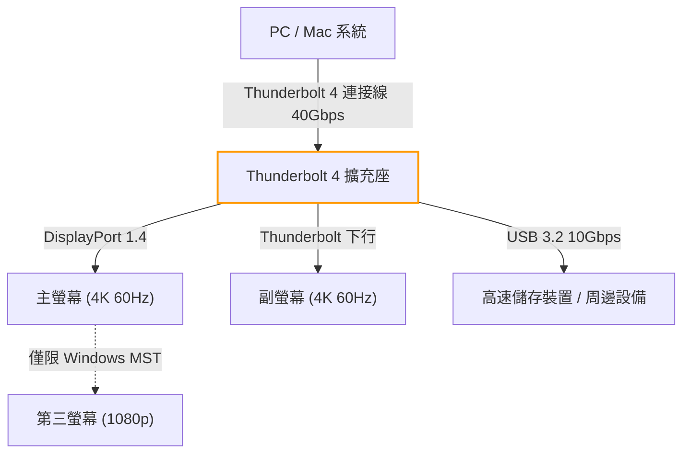

# 最大化開發效率的多螢幕配置與最佳解

在現代的軟體工程中，開發環境的最佳化直接關乎生產力的提升。特別是我們一天中花費大半時間的「螢幕環境」，早已超越單純的資訊顯示裝置，成為工程師的「外部大腦」或「擴充工作區」。隨著編輯器、終端機、瀏覽器、通訊軟體、除錯器等需要同時參考的資訊呈爆炸性增長，單一螢幕的作業環境可以說是在浪費我們的認知資源。

然而，這並非單純增加螢幕數量就能解決的。我們必須從實體配置、視界工學（人體工學）、各作業系統的縮放規格，以及連接規格的頻寬計算等多個角度，來導出「最佳解」。本文將徹底拆解這些要素，提供一份基於科學與工程方法的完整指南，助你建構終極的多螢幕環境。

---

## 1. 視界工學與人體工學：基於實體層面的探討

在考慮螢幕配置時，首先要顧及人類身體與生理的極限。在長時間的寫程式過程中，不當的螢幕配置會導致眼睛疲勞、肩頸痠痛，甚至是嚴重的頸椎損傷。

### 1.1 掃視（跳躍性眼球運動）與認知負荷

人類的眼睛在將視線從一點移動到另一點時，會進行被稱為「掃視（Saccadic eye movement）」的極高速眼球運動。在掃視期間，大腦其實會暫時關閉視覺資訊（掃視抑制），資訊處理也會暫時停止。

掃視所需的時間 $T_{saccade}$ 取決於移動的角度（Amplitude），並可透過以下公式近似計算：

$$ T_{saccade} = 2.2 \times \theta + 21 \text{ [ms]} $$

其中，$\theta$ 是視線的移動角度（度）。例如，將視線從相距極遠的雙螢幕的一端移動到另一端（$\theta = 40^\circ$），大約需要花費 109 毫秒的時間。雖然這只是一瞬間，但如果一天發生數千次，就會導致無法忽視的認知負荷與疲勞累積。

因此，將主要作業區域（如編輯器）始終配置在正前方（$\theta < 15^\circ$ 的範圍內），並將掃視的幅度降至最低，是視界工學的基本原則。

### 1.2 頸椎的負擔與螢幕高度、角度的物理學

人類的頭部重量大約為 5 到 6 公斤。當頸部角度（屈曲角）越大時，頸椎所承受的負荷（力矩）就會呈幾何級數增加。假設頸部角度為 $\phi$，頸椎所承受的有效重量負荷 $W_{effective}$ 可以透過物理力矩的計算近似得出：

$$ W_{effective} \approx W_{head} + k \times \sin(\phi) $$

根據醫學研究，當頸部角度為 0 度（直立）時，負荷約為 5 公斤；但傾斜 15 度時約為 12 公斤，30 度時約為 18 公斤，45 度時更高達 22 公斤。這正是低頭看筆記型電腦螢幕會引發「頸椎直化（烏龜頸）」的原因所在。

在多螢幕環境中，最佳解是使用螢幕支架進行調整，讓主螢幕的上緣與視線齊平，或稍微低於視線（約 0 到 5 度）。此外，在配置側邊螢幕時，也必須使用曲面螢幕或調整角度，確保頸部的旋轉角度不超過 30 度。

### 1.3 視角（FOV）的最佳化與曲面螢幕（Curvature）的意義

人類的有效視野（能立即進行資訊處理的範圍）水平約為 30 度。當我們在極近距離（約 60 公分）觀看平面的大型螢幕（例如：32 吋以上）時，看螢幕邊緣的焦距會發生變化，給眼睛的睫狀肌帶來龐大的負擔。

螢幕中心到邊緣距離的變化量 $\Delta d$，在觀看距離為 $D$、螢幕寬度的一半為 $w$ 時，公式如下：

$$ \Delta d = \sqrt{D^2 + w^2} - D $$

為了讓這個 $\Delta d$ 接近於零，解決方案便是「曲面螢幕（Curved Monitor）」。當曲率半徑 $R$（例如：1500R = 1500 毫米的半徑）與觀看距離 $D$ 一致時，螢幕上的所有點與眼睛的距離都會相等，從而大幅減輕眼睛的疲勞。

---

## 2. 螢幕組合比較：雙螢幕 vs 三螢幕 vs 超寬螢幕

在了解實體人體工學之後，我們來比較並評估適合現代開發者的螢幕配置模式。

### 2.1 雙螢幕（例如：27 吋 4K × 2）

這是最標準的配置。若是並排橫放，由於邊框位於中央，頸部必須始終向左或向右傾斜。為了避免這種情況，建議將一台放在正前方（主螢幕），另一台放在斜側邊（副螢幕），或者是採用上下堆疊的配置。

- **優點:** 實體畫面分割明確。容易管理全螢幕應用程式。
- **缺點:** 中央的邊框會阻斷視線。頸部旋轉的負擔較大。

### 2.2 三螢幕配置

主螢幕放在正前方，左右各放置一台副螢幕，或是其中一台採用直立配置。可將日誌監控、文件與寫程式的區域完全分離。

- **優點:** 壓倒性的資訊量。中央不會有邊框。
- **缺點:** 佔用大量桌面空間。容易受到顯示卡輸出端子或頻寬的限制。

### 2.3 超寬螢幕（例如：49 吋 5120x1440）

這種配置能實現無邊框的視覺體驗，其顯示區域相當於兩台 27 吋 WQHD 螢幕並排。這是近期的趨勢，也是人體工學與資訊量之間最平衡的選擇。

以下是顯示導入超寬螢幕後節省時間模型的甘特圖。我們將切換視窗或進行上下文切換（Context Switch）所節省的時間視覺化：

```mermaid
gantt
    title "超寬螢幕 vs 雙螢幕的上下文切換時間比較"
    dateFormat  s
    axisFormat  %S
    
    section "雙螢幕 (Dual Monitor)"
    "任務 A (編輯器)"        :a1, 0, 5s
    "尋找/切換視窗"     :a2, after a1, 2s
    "任務 B (終端機)"      :a3, after a2, 5s
    "尋找/切換視窗"     :a4, after a3, 2s
    
    section "49 吋超寬螢幕 (49-inch Ultrawide)"
    "任務 A (編輯器)"        :b1, 0, 5s
    "瞥一眼 (無需切換)"     :b2, after b1, 0.5s
    "任務 B (終端機)"      :b3, after b2, 5s
```

---

## 3. 像素密度（PPI）的數學與 OS 的縮放機制

在挑選螢幕時，不只是解析度（如 4K），了解「像素密度（PPI：Pixels Per Inch）」也極為重要。特別是在 macOS 環境中，選錯 PPI 會導致效能下降或文字模糊。

### 3.1 像素密度（PPI）的計算公式

PPI 可透過螢幕的實體尺寸（對角線長度 $d$ 吋）與解析度（水平 $w$ 像素，垂直 $h$ 像素），以下列公式計算得出：

$$ PPI = \frac{\sqrt{w^2 + h^2}}{d} $$

例如，我們來計算深受開發者喜愛的「27 吋 4K 螢幕（3840x2160）」的 PPI：

$$ PPI = \frac{\sqrt{3840^2 + 2160^2}}{27} = \frac{\sqrt{14745600 + 4665600}}{27} = \frac{\sqrt{19411200}}{27} \approx \frac{4405.8}{27} \approx 163.18 \text{ PPI} $$

### 3.2 macOS 與 Windows 縮放機制的差異

這裡會出現的問題，是作業系統對 UI 縮放（放大縮小）的處理方式。

**在 Windows 中：**
Windows 採用基於向量的 UI 縮放（DPI 縮放），並直接根據指定的百分比（例如：150%）重新繪製 UI 元素。因此，即使是 163 PPI 的 27 吋 4K 螢幕，只要設定 150% 縮放，顯示效果也會相對清晰，且對效能的影響較小。

**在 macOS 中：**
macOS 在設計上，歷史以來一直是以 110 PPI（非 Retina）或 220 PPI（Retina）為目標。macOS 的 UI 縮放（擬似解析度）採取的方法是：先在一個極大解析度的緩衝區（虛擬畫布）中繪製 UI，再由 GPU 將其縮小（Downscale）並對應到實體像素上。

例如，如果在 27 吋 4K 螢幕（163 PPI）上選擇「相當於 WQHD（2560x1440）」的擬似解析度，macOS 內部會先以兩倍的 5120x2880 像素（5K）進行畫面渲染，再將其縮小至 3840x2160（4K）（縮放係數 $\approx 0.75$）後輸出。這種非整數倍的像素插值過程會產生以下問題：

1. **浪費 GPU 資源:** 由於總是進行 5K 渲染，會給顯示卡（特別是筆電的內建 GPU）帶來很大的負擔，導致發熱與耗電量增加。
2. **文字模糊 (Blurriness):** 因為不是完美的整數倍（如 2.0x），次像素級別的反鋸齒處理會變得不精確，導致字體邊緣有些微模糊。

因此，若要在 macOS 上獲得最佳體驗，對於 27 吋螢幕而言，「最佳解」是選擇 5K 螢幕（5120x2880 = 約 218 PPI），或者選擇 24 吋的 4K 螢幕（約 183 PPI，較接近擬似解析度的整數縮放）。

---

## 4. 連接頻寬與菊鏈連接：Thunderbolt 4 與 DP MST 的極限

連接多台高解析度螢幕時，連接線的資料傳輸容量（頻寬）往往會成為瓶頸。「明明買了新螢幕，更新率卻只有 30Hz」這類問題，原因通常在於頻寬計算不足。

### 4.1 影像訊號頻寬的計算模型

傳送影像訊號至螢幕所需的頻寬資料傳輸率 $R$ (bps)，可以透過以下公式進行模型化：

$$ R = W \times H \times F \times C \times B $$

其中，各變數的意義如下：
- $W$: 水平解析度 (Width)
- $H$: 垂直解析度 (Height)
- $F$: 更新率 (Hz, Frame rate)
- $C$: 色彩深度、每像素位元數 (Color depth，若是 8-bit RGB 則為 $8 \times 3 = 24$，10-bit HDR 則為 $10 \times 3 = 30$)
- $B$: 遮沒期間的開銷 (Blanking overhead，VESA 標準時序下約為 1.05 到 1.15)

以一台「4K（3840x2160）、60Hz、10-bit 色彩」的螢幕為例，計算其所需的未壓縮資料傳輸率（假設開銷係數 $B = 1.05$）：

$$ R = 3840 \times 2160 \times 60 \times 30 \times 1.05 \approx 15,676,416,000 \text{ bps} \approx 15.68 \text{ Gbps} $$

### 4.2 透過 Thunderbolt 4 與 KVM 切換器建構環境

Thunderbolt 4 的最大頻寬為 40 Gbps，但因為 PCIe 資料傳輸等也會共用通道，因此無法將所有頻寬都分配給影像輸出。若要建構雙 4K 60Hz 環境（約 31.3 Gbps），將會逼近 Thunderbolt 4 擴充座的效能極限。

在 Windows 環境中，可以利用 DisplayPort 的 MST（Multi-Stream Transport）功能，透過單一連接埠將訊號串聯（菊鏈連接，Daisy Chain）至多台螢幕。然而，macOS 在規格上不支援透過 MST 進行延伸（Extend），若是使用菊鏈連接，所有的螢幕都將變成「鏡像（相同的畫面）」。因此，在 macOS 上若要使用雙螢幕，必須從 PC 主機或 Thunderbolt 擴充座的不同連接埠接線。

以下 Mermaid 流程圖展示了從 PC/Mac 經過 Thunderbolt 擴充座的理想訊號繞徑架構。

---

## 5. 視窗管理的自動化：各作業系統的設定指南

無論建構了多麼完美的實體螢幕環境，如果還需要用滑鼠拖曳來調整視窗大小，開發效率就無法最大化。因此，導入「視窗管理員（Window Manager）」，將廣大的螢幕區域進行邏輯分割，並透過快捷鍵瞬間吸附視窗，是不可或缺的。

### 5.1 Windows: PowerToys FancyZones

在 Windows 中，Microsoft 官方工具「PowerToys」內含的「FancyZones」是最強的解決方案。它能定義比預設 Windows 吸附功能（Win + 方向鍵）更複雜且更具自訂性的網格。

以超寬螢幕（例如：32:9）為例，比起單純將畫面一分為二，將其劃分為「左 25%、中央 50%、右 25%」的三等分，對開發者來說最為理想。將主要的編輯器或瀏覽器配置在中央的 50%（16:9），而左右兩側則配置終端機、通訊軟體與參考資料。

透過 FancyZones，只要按住 Shift 鍵拖曳視窗，或是覆寫「Win + 方向鍵」的操作，就能瞬間將視窗配置到自訂的區域內。如此一來，就能將伴隨上下文切換而來的滑鼠操作時間幾乎降至為零。

### 5.2 macOS: 透過 Yabai 與 Amethyst 進行平鋪式視窗管理

macOS 內建的視窗吸附功能較弱（※雖然在 macOS Sequoia 中有所改善），因此有許多使用者會導入類似 Linux 的「平鋪式視窗管理員（Tiling Window Manager）」。

代表性的工具包括「Yabai」與「Amethyst」。

- **Amethyst:** 安裝後即可運作，提供類似 xmonad 的自動平鋪管理功能。適合想要輕鬆入門的使用者。
- **Yabai:** 提供更進階的自訂功能，但必須停用部分 SIP（系統整合保護）。你可以透過指令碼（yabairc）完全控制環境，包含空間（虛擬桌面）管理、視窗邊框繪製、透明度處理等。

如果使用 Yabai，通常會搭配名為 `skhd` 的快捷鍵守護行程來進行設定。以下是瞬間切換焦點或交換視窗的概念性操作流程：

透過善用這些工具，你的雙手可以完全不離開鍵盤，瞬間存取廣大多螢幕區域的任何地方，持續專注於程式碼的編寫。

---

## 6. 結論：屬於你的「最佳解」是什麼？

在建構多螢幕環境時，並沒有一體適用的標準答案。但透過參考以下的流程圖，你可以根據自己的開發風格，推導出合乎邏輯的最佳解。

螢幕是長年支撐你生產力的基礎設施，一旦購買便會陪伴你許久。請將本文所解說的視界工學原則、PPI 數學、頻寬極限，以及軟體層面的視窗管理加以整合，為自己打造一個毫不妥協的最佳工作區。最終，這將成為你寫出頂尖程式碼的最短捷徑。
