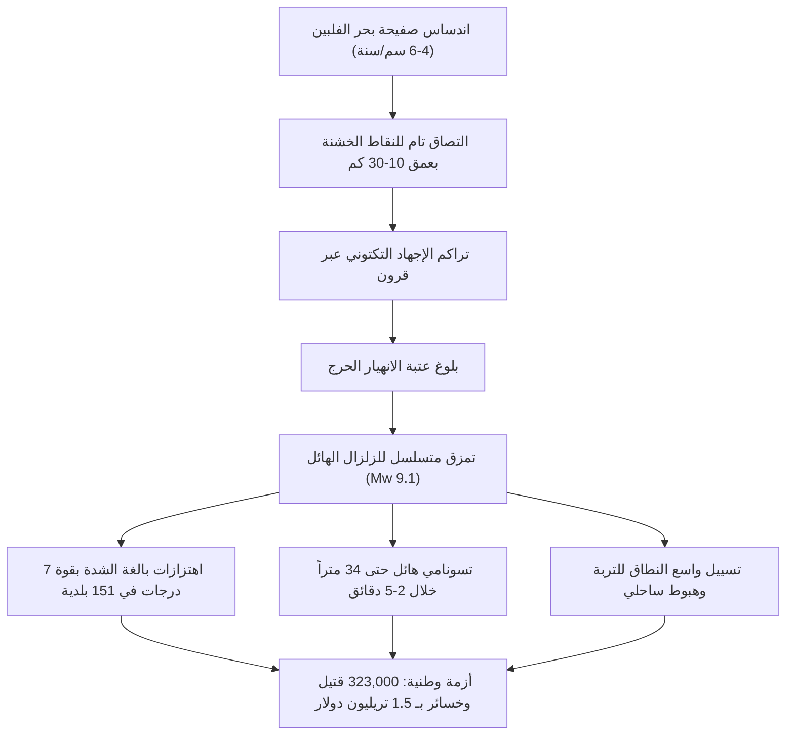

## مقدمة: أعظم أزمة وجودية تواجه اليابان

يمتد **أخدود نانكاي (Nankai Trough)** على مسافة تتراوح بين 700 و800 كيلومتر تحت المحيط الهادئ قبالة جنوب غرب اليابان، من خليج سوروغا إلى بحر هيوغا-نادا. في هذا النطاق الاندساسي المتقارب، تغوص صفيحة بحر الفلبين المحيطية تحت الصفيحة الأوراسية بسرعة تتراوح بين 4.0 و6.5 سم سنوياً.

على مدى 1400 عام من التاريخ المدون، شهد هذا الفالق زلازل هائلة بقوة 8 إلى 9 درجات كل 100 إلى 150 عاماً. ومع مرور ما يقرب من 80 عاماً على زلزالي شوا-تونانكاي (1944) وشوا-نانكاي (1946)، تراكم إجهاد القص المرن بشكل حرج. تقدر لجنة أبحاث الزلازل اليابانية احتمال وقوع زلزال هائل خلال الـ 30 عاماً القادمة بنسبة **70% إلى 80%**، وترتفع إلى **نحو 90% خلال 40 عاماً**.

تتوقع نماذج الكوارث الحكومية الرسمية (Mw 9.1):
- شدة زلزالية قصوى تبلغ 7 درجات (مقياس وكالة الأرصاد اليابانية) في 151 بلدية عبر 10 محافظات.
- موجات تسونامي مدمرة يصل ارتفاعها إلى **34 متراً**، وتصل إلى السواحل في غضون دقيقتين إلى 5 دقائق.
- ما يصل إلى **323,000 قتيل ومفقود**، و623,000 مصاب بجروح خطيرة، وتدمير 2.38 مليون مبنى.
- أضرار اقتصادية تتجاوز **220 تريليون ين (~1.5 تريليون دولار أمريكي)**، أي ضعف الميزانية السنوية لليابان.

---

## 1. الجيوفيزياء وتكتونيكا أخدود نانكاي

تخضع حركة الفالق لقانون الاحتكاك المعتمد على السرعة والحالة:
$$\tau = \sigma_n \left[ \mu_0 + a \ln\left(\frac{V}{V_0}\right) + b \ln\left(\frac{V_0 \theta}{L}\right) \right]$$
يسود نظام إضعاف السرعة ($a - b < 0$) في النطاق الزلزالي (بعمق 10-30 كم)، مما يراكم إجهاد القص. تؤكد شبكة القياس الصوتية تحت البحر GNSS-A وجود **انغلاق تام بنسبة 100%**.

---

## 2. تاريخ 1400 عام من الزلازل القديمة

- **684 م (زلزال هاكوهو، M8.4)**: أقدم سجل مؤكد في *نيهون شوكي*، غرق 12 كم² من أراضي توزا.
- **1707 م (زلزال هوي، M8.6-8.7)**: تمزق متزامن لكامل الأخدود؛ أكثر من 20,000 قتيل؛ **أدى إلى ثوران بركان جبل فوجي بعد 49 يوماً**.
- **1854 م (أنزي توكاي ونانكاي، M8.4)**: تمزق متعاقب بفارق 32 ساعة.
- **قطاع توكاي**: ظل مقفلاً دون تمزق لأكثر من **170 عاماً**.

---

## 3. نماذج الدمار والخسائر البشرية

- نموذج Mw 9.1: تتأرجح ناطحات السحاب في طوكيو وناغويا وأوساكا لمسافة 2 إلى 3 أمتار بفعل الموجات طويلة المدى.
- الخسائر البشرية: **323,000 قتيل** (71% غرقاً بالتسونامي، 25% انهيار مبانٍ، 4% حرائق).
- المهجرون: ما يصل إلى **9.5 مليون لاجئ**.

---

## 4. هيدروديناميكا تسونامي بارتفاع 34 متراً

- إزاحة 20 إلى 30 متراً في قاع البحر تدفع مليارات الأمتار المكعبة من الماء للأعلى.
- ظاهرة التركيز الطبوغرافي للخلجان الضيقة ترفع الأمواج إلى **34.4 متراً في كروشيو-تشو**.
- **الوصول في غضون 2 إلى 5 دقائق**: الإخلاء الفوري سيراً على الأقدام دون انتظار تراجع البحر.

---

## 5. الكوارث الثانوية المتتالية

1. تسييل واسع النطاق للتربة في الأراضي المستصلحة في طوكيو وأوساكا.
2. عواصف نارية حضرية تلتهم 750,000 منزل خشبي.
3. انفجارات في المجمعات البتروكيماوية الساحلية.
4. انهيارات جبلية عميقة تعزل مئات القرى في كيي وشيكوكو.
5. خطر حقيقي لـ **ثوران بركاني تضامني في جبل فوجي**.

---

## 6. شلل البنية التحتية وخسارة 1.5 تريليون دولار

- **27.1 مليون منزل بدون كهرباء**، و**34.4 مليون شخص بدون مياه**.
- قطع شريان توكايدو (القطار فائق السرعة والطرق السريعة)، مما يقسم اليابان إلى نصفين.
- شلل سلاسل التوريد العالمية للسيارات وأشباه الموصلات.
- إجمالي الخسائر 220 تريليون ين (13 ضعف كارثة 2011).

---

## 7. نظام المعلومات الاستثنائية لزلزال نانكاي

- **【تحذير من زلزال هائل (انقسام نصفي M8+)】**: إخلاء وقائي إلزامي لمدة أسبوع للمناطق الساحلية.
- **【تنبيه لزلزال هائل (انقسام جزئي / انزلاق بطيء)】**: رفع الجاهزية والتحقق من حقائب الطوارئ.
- اختُبر عملياً في أغسطس 2024 عقب زلزال هيوغا-نادا (M7.1).

---

## 8. مراصد قاع البحر (DONET) والحاسوب الخارق فوغاكو

ترصد الكابلات البحرية تغيرات ضغط المياه وتطلق إنذارات التسونامي **قبل السواحل بـ 20 دقيقة**. يقوم الحاسوب الخارق فوغاكو بنمذجة الغمر ثلاثي الأبعاد في أقل من 3 دقائق.

---

## 9. دليل البقاء والاستقلالية لمدة 14 يوماً

- مبانٍ بمقاومة زلزالية من الدرجة 3 وقواطع كهربائية زلزالية تلقائية (>250 غيغا غال).
- مؤن عائلة من 4 أفراد لمدة 14 يوماً: **168 لتراً من مياه الشرب**، و**112,000 سعرة حرارية**، و**280 كيس مرحاض كيميائي**، ومحطة طاقة شمسية 2,000 واط/ساعة.
- تدابير صحية: تجنب تفريغ المراحيض؛ استخدام أكياس مانعة للروائح (BOS) لمنع الأوبئة.

---

## 10. التخطيط المسبق لإعادة الإعمار (PDRP)

إعداد الأطر القانونية وتخطيط الأراضي المرتفعة قبل وقوع الكارثة لإعادة بناء سريعة ومنظمة.

---

## خاتمة: درع العلم

زلزال أخدود نانكاي حتمية جيولوجية لا مفر منها. التسلح بالمعرفة الفيزيائية والاستعداد المسبق هو الضمان الأوحد لحماية المجتمع والحفاظ على الحياة.
