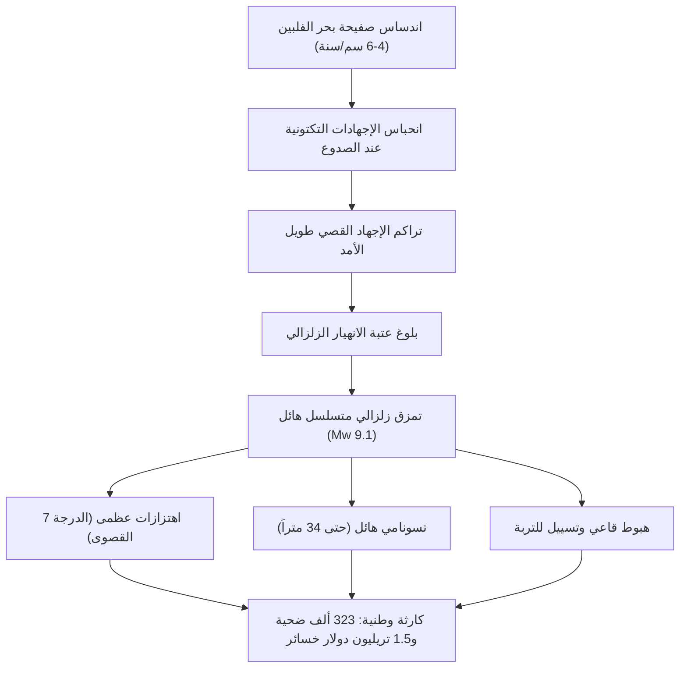

## مقدمة: أخطر أزمة وجودية تواجه اليابان
يمتد أخدود نانكاي (Nankai Trough) بطول يتراوح بين 700 إلى 800 كيلومتر قبالة السواحل الجنوبية الغربية لليابان. تنزلق صفيحة بحر الفلبين تحت الصفيحة الأوراسية بمعدل يتراوح بين 4 إلى 6 سنتيمترات سنوياً. تشير التقديرات العلمية إلى أن احتمال وقوع زلزال هائل بقوة تتراوح بين 8 و9 درجات خلال الثلاثين عاماً القادمة يبلغ 70% إلى 80%، مما قد يتسبب في موجات تسونامي بارتفاع 34 متراً، ووفاة 323 ألف شخص، وخسائر اقتصادية تتجاوز 220 تريليون ين (1.5 تريليون دولار).

## الفصل 1: الجيوفيزياء وديناميكية الصفائح في أخدود نانكاي
يخضع سلوك الانزلاق لقانون الاحتكاك المعتمد على السرعة والحالة. تقوم النطاقات المقفلة على عمق 10 إلى 30 كم بتخزين الطاقة، بينما تفرز مناطق الانتقال زلازل بطيئة (SSE). تؤكد القياسات الصوتية في قاع المحيط (GNSS-A) أن الصفائح مقفلة بنسبة 100%.

## الفصل 2: علم الزلازل القديمة وتاريخ يمتد لـ 1400 عام
توثق المخطوطات والطبقات الرسوبية دورة زلزالية كل 100-150 عاماً: زلزال هاكوهو (684)، نينّا (887)، هوئي (1707، تسبب في ثوران جبل فوجي بعد 49 يوماً)، أنسي (1854)، وشوا (1944/1946).

## الفصل 3: نمذجة الصدع وتوقعات الدمار الشامل
يتوقع نموذج Mw 9.1 أقصى شدة اهتزاز (درجة 7) في 151 بلدية، ورنيناً زلزالياً طويل المدى يهز ناطحات السحاب في طوكيو وناغويا وأوساكا، مع تدمير 2.38 مليون مبنى.

## الفصل 4: ديناميكا تسونامي بارتفاع 34 متراً
تؤدي إزاحة قاع المحيط الرأسية بمقدار 20-30 متراً إلى توليد تسونامي يصل إلى شواطئ شيزوكا وميي وكوتشي خلال 2 إلى 5 دقائق فقط، متضخماً إلى 34 متراً في الخلجان الضيقة.

## الفصل 5: الكوارث الثانوية المتتابعة
تسييل واسع النطاق للتربة، وحرائق تدمر 750 ألف منزل خشبي، وانفجارات في المصافي الساحلية، وانهيارات طينية في الجبال.

## الفصل 6: انهيار المرافق الحيوية وخسائر 220 تريليون ين
انقطاع المياه عن 34 مليون شخص والكهرباء عن 27 مليون منزل، وشلل شرايين النقل الصناعية في توكايدو مما يهدد الاقتصاد العالمي.

## الفصل 7: نظام المعلومات الطارئة لأخدود نانكاي
بروتوكول رسمي يفرض إخلاءً وقائياً لمدة أسبوع لسكان السواحل عند حدوث زلزال تمهيدي بقوة 8 درجات فما فوق.

## الفصل 8: شبكات الاستشعار البحرية (DONET) وحاسوب فوغاكو الخارق
كابلات ألياف بصرية في قاع البحر ترسل إنذارات مبكرة، ويقوم الحاسوب الخارق "فوغاكو" بمحاكاة الغمر الحضري ثلاثي الأبعاد في دقائق.

## الفصل 9: دليل البقاء الشامل والاكتفاء الذاتي لمدة 14 يوماً
مبانٍ مقاومة للزلازل من الدرجة 3، قواطع كهربائية زلزالية، مخزون 14 يوماً (3 لتر ماء/يوم/شخص، 70 طقم مرحاض طوارئ مع أكياس مانعة للروائح BOS)، وإنترنت فضائي (ستارلينك).

## الفصل 10: التخطيط المسبق لإعادة الإعمار
إعادة تخطيط المدن مسبقاً وتأمين طرق بديلة لحماية مستقبل الأمة.
