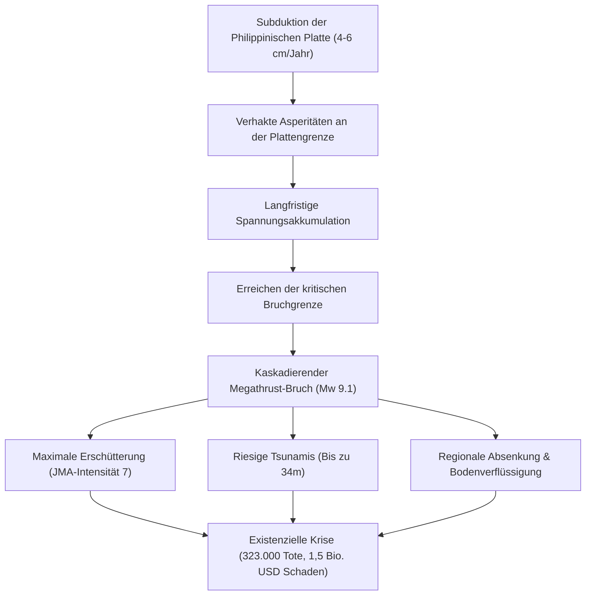

## Einleitung: Japans größte existenzielle Bedrohung
Der Nankai-Graben (Nankai Trough) erstreckt sich über rund 700 bis 800 Kilometer entlang der Pazifikküste von Honshu, Shikoku und Kyushu. Entlang dieser Subduktionszone taucht die Philippinische Meeresplatte mit einer jährlichen Geschwindigkeit von 4 bis 6 Zentimetern unter die Eurasische Platte ab. Mit einer Wahrscheinlichkeit von 70–80 % innerhalb der nächsten 30 Jahre wird ein Megathrust-Beben der Stärke M8–M9 erwartet, das katastrophale Zerstörungen, bis zu 34 Meter hohe Tsunamis und über 320.000 Todesopfer fordern könnte.

## Kapitel 1: Geophysik und Plattenkinematik des Nankai-Grabens
Das Reibungsverhalten entlang der Verwerfung wird durch das geschwindigkeits- und zustandsabhängige Reibungsgesetz (Rate- and State-Dependent Friction) bestimmt. Asperitäten (Bereiche mit $a - b < 0$) speichern seismische Energie über Jahrzehnte, während Übergangszonen periodische Slow-Slip-Ereignisse (SSE) und tiefe tektonische Erschütterungen aufweisen. GNSS-Akustik-Messungen am Meeresboden beweisen eine nahezu 100-prozentige Verkoppelung der Platten.

## Kapitel 2: Paläoseismologie und 1.400 Jahre Erdbebenzyklen
Historische Dokumente (Nihon Shoki) und Sedimentproben belegen wiederkehrende Großbeben:
- **684 Hakuho (M8.4)** & **887 Ninna (M8.6)**: Historisch dokumentierte Katastrophen.
- **1707 Hoei (M8.6–8.7)**: Vollständiger Simultanbruch aller Segmente; Auslöser des Vulkanausbruchs des Fuji 49 Tage später.
- **1854 Ansei Tokai & Nankai (M8.4)**: Zeitversetzter Bruch nach 32 Stunden.
- **1944/1946 Showa-Beben**: Hinterließen das Tokai-Segment seit über 170 Jahren ungebrochen.

## Kapitel 3: Bruchmodelle und Schadensprojektionen
Das Maximalmodell (Mw 9.1) prognostiziert:
- JMA-Intensität 7 in 151 Gemeinden.
- Langperiodische Bodenbewegungen (Kategorie 4), die Wolkenkratzer in Tokio, Nagoya und Osaka in minutenlange Resonanzschwingungen versetzen.
- Bis zu 323.000 Todesopfer (71 % durch Tsunamis, 25 % durch Gebäudeeinsturz).

## Kapitel 4: Tsunami-Hydrodynamik und Küstenüberflutung
Durch die Verflüssigung und thermische Druckbeaufschlagung der Verwerfung im seichten Grabenbereich entsteht eine vertikale Hebung des Meeresbodens um 20–30 Meter. Wellenhöhen von bis zu 34 Metern treffen Buchten in Kochi und Wakayama bereits 2 bis 5 Minuten nach dem Beben.

## Kapitel 5: Kaskadierende Sekundärkatastrophen
Bodenverflüssigung in künstlichen Aufschüttungen, Brandkatastrophen mit 750.000 niedergebrannten Holzbauten, Havarien petrochemischer Komplexe in Küstennähe und das Risiko induzierter Vulkanausbrüche (Fuji).

## Kapitel 6: Ausfall kritischer Infrastruktur und wirtschaftlicher Schock
34 Millionen Menschen ohne Trinkwasser, 27 Millionen Haushalte ohne Strom. Die Unterbrechung der Tokaido-Verkehrsachse spaltet Japan wirtschaftlich und verursacht Gesamtschäden von über 220 Billionen Yen.

## Kapitel 7: Das Nankai-Trough-Notfall-Informationssystem
Das 2019 eingeführte Warnsystem definiert Verhaltensregeln: Bei einer Teilruptur (M8+) gilt eine einwöchige Evakuierungspflicht für gefährdete Küstengemeinden.

## Kapitel 8: Hochmoderne Sensornetzwerke (DONET, N-net & Fugaku)
Kabelgebundene Ozeanboden-Observatorien ermöglichen Frühwarnungen vor Erdbeben (10–20 Sekunden Vorsprung) und Tsunamis (bis zu 20 Minuten). Der Supercomputer Fugaku liefert 3D-Überflutungssimulationen in Echtzeit.

## Kapitel 9: Vollständiger 14-Tage-Überlebensleitfaden
- Erdbebenresistentes Bauen (Standard Level 3) und automatische Schutzschalter gegen Strombrände.
- 14-Tage-Vorräte: 3 Liter Wasser/Tag/Person, 70 Notfalltoiletten-Sets mit geruchsdichten Spezialbeuteln (BOS).
- Satellitenkommunikation (Starlink) und Vorbeugung von sekundären Todesfällen durch Unterkühlung und Thrombosen.

## Kapitel 10: Prä-Katastrophen-Wiederaufbau und Resilienz
Strategische Stadtplanung, Redundanz der nationalen Verkehrsachsen und aktive Risikovorsorge sichern das Überleben der Gesellschaft.
