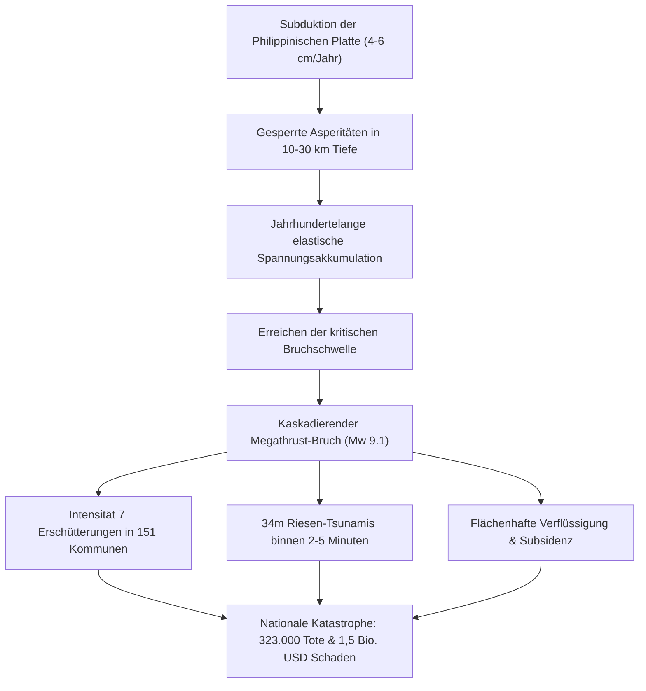

## Einleitung: Japans Größte Existenzielle Krise

Vor der pazifischen Küste Südwestjapans erstreckt sich über 700 bis 800 Kilometer von der Suruga-Bucht bis zur Hyuga-nada der **Nankai-Graben (Nankai Trough)**. Hier subduziert die ozeanische Philippinische Lithosphärenplatte mit 4 bis 6,5 cm pro Jahr unter die Eurasische Platte.

Historische Aufzeichnungen über 1.400 Jahre belegen wiederkehrende M8- bis M9-Megathrust-Beben alle 100 bis 150 Jahre. Seit den letzten Ereignissen von 1944 (Showa-Tonankai, M7.9) und 1946 (Showa-Nankai, M8.0) sind fast 80 Jahre vergangen; die Wahrscheinlichkeit eines Megabebens in den nächsten 30 Jahren liegt bei **70% bis 80%**, binnen 40 Jahren bei **rund 90%**.

Die Extremmodelle des japanischen Kabinettsbüros prognostizieren bei einer kaskadierenden Gesamtfrakturen (Mw 9.1):
- Maximale seismische Intensität 7 (JMA-Skala) in 151 Gemeinden über 10 Präfekturen.
- Bis zu **34 Meter hohe Riesen-Tsunamis**, die binnen 2 bis 5 Minuten die Küsten erreichen.
- Bis zu **323.000 Todesopfer**, 623.000 Schwerverletzte und 2,38 Millionen zerstörte Gebäude.
- Gesamtwirtschaftliche Schäden von über **220 Billionen Yen (~1,5 Billionen USD)** — das Zweifache des japanischen Jahreshaushalts.

---

## 1. Geophysik und Plattentektonik des Nankai-Grabens

### 1.1 Struktur der Subduktionszone
Der Nankai-Graben ist gekennzeichnet durch einen sehr flachen Subduktionswinkel (<10° im flachen Grabenbereich <10 km Tiefe), der sich in der seismogenen Zone (10–30 km) versteilt. Gewaltige Akkretionskeile (Shimanto-Gürtel) überlagern die Oberplatte und beeinflussen seismische Überhöhungen und Tsunami-Hebungen maßgeblich.

### 1.2 Asperitäten und Geschwindigkeits-Zustands-Reibungsgesetz
Das Bruchverhalten folgt dem Dieterich-Ruina-Gesetz:
$$\tau = \sigma_n \left[ \mu_0 + a \ln\left(\frac{V}{V_0}\right) + b \ln\left(\frac{V_0 \theta}{L}\right) \right]$$
In der seismogenen Zone (10–30 km Tiefe) dominiert **Geschwindigkeitsschwächung ($a - b < 0$)**, wodurch akkumulierte Scherspannung in instabilem Stick-Slip-Versagen entladen wird.

| Tiefenzone | Tiefenbereich | Reibungsregime | Mechanik | Seismische Phänomene |
| :--- | :--- | :--- | :--- | :--- |
| **Flachgraben** | 0 – 10 km | $a - b > 0$ (konditionell) | Hoher Porendruck, geringe Reibung | Tsunami-Erdbeben, VLF-Ereignisse |
| **Seismogene Zone** | 10 – 30 km | $a - b < 0$ (Schwächung) | Voll gesperrte Asperitäten | M8-M9 Megathrust-Beben |
| **Tiefenübergang** | 30 – 35 km | $a - b \approx 0$ | Thermische Reibungstransition | Tiefenmikrobeben, Slow Slip (SSE) |
| **Duktile Zone** | > 35 km | $a - b > 0$ (Stärkung) | Plastisches Fließen | Aseismisches Kriechen |

---

## 2. 1.400 Jahre Historische Seismizität

Historische Chronologie vom Hakuho-Beben 684 n. Chr. bis zu den Showa-Beben:
- **684 (Hakuho, M8.4)**: Früheste verlässliche Aufzeichnung im *Nihon Shoki*, 12 km² Landabsenkung in Tosa.
- **887 (Ninna, M8.6)**, **1096/1099 (Eicho & Kowa, M8.0-8.5)**, **1361 (Shohei, M8.5)**, **1498 (Meio, M8.6)**: Durchbruch des Hamana-Sees.
- **1605 (Keicho, M7.9)**: Tsunami-Erdbeben mit schwachen Erschütterungen, aber über 10.000 Ertrunkenen.
- **1707 (Hoei, M8.6-8.7)**: Vollständiger Simultanbruch; **Löste 49 Tage später den Hoei-Ausbruch des Fuji aus**.
- **1854 (Ansei Tokai & Nankai, M8.4)**: Zeitversetzter Bruch mit 32 Stunden Abstand.
- **1944/1946 (Showa Tonankai & Nankai, M7.9/8.0)**: Tokai-Segment blieb seit 1854 über **170 Jahre ungebrochen gesperrt**.

---

## 3. Bruchmodelle und Nationale Schadensprojektionen

- **Mw 9.1 Großmodell**: JMA-Intensität 7 in 151 Gemeinden.
- **Langperiodische Bodenbewegung (Klasse 4)**: 2 bis 3 Meter Pendelausschlag in Hochhäusern in Tokio, Nagoya und Osaka.
- **Opfer- und Schadensbilanz**:
 - **Todesopfer**: bis zu **323.000** (71% Tsunami, 25% Gebäudeeinsturz, 4% Brand).
 - **Zerstörte Gebäude**: bis zu **2.386.000 Einheiten**.
 - **Evakuierte**: bis zu **9.500.000 Menschen**.

---

## 4. Hydrodynamik des 34-Meter-Tsunamis

- Seewärtige Verschiebung von 20 bis 30 Metern im flachen Graben hebt Milliarden Kubikmeter Wasser an.
- Rias-Küsten-Topographie (Kuroshio-cho) fokussiert Energie auf **bis zu 34,4 Meter Auflaufhöhe**.
- **Erste Welle in 2 bis 5 Minuten**: Evakuierung muss unmittelbar nach der Erschütterung ohne Verzug erfolgen.
- Zweistufiges Schutzkonzept: L1 (Küstenschutzbauwerke für 50-100-jährliche Tsunamis) vs. L2 (Multi-Barrieren-Evakuierung für Mega-Tsunamis).

---

## 5. Kaskadierende Sekundärkatastrophen

1. Massenhafte Bodenverflüssigung in den Küstenniederungen von Tokio, Nagoya und Osaka.
2. Feuerstürme in dichten Holzhaussiedlungen (750.000 abgebrannte Gebäude).
3. Explosionen und Giftgasfreisetzung in petrochemischen Großkomplexen.
4. Tiefgründige Bergstürze auf Kii und Shikoku mit Isolierung hunderter Ortschaften.
5. Reaktivierung von Magmakammern und möglicher **Ausbruch des Vulkans Fuji**.

---

## 6. Infrastrukturkollaps und 1,5 Billionen USD Schaden

- **27,1 Millionen Haushalte ohne Strom**, **34,4 Millionen Menschen ohne Trinkwasser**.
- Zerschneidung des Tokaido-Korridors teilt Japan infrastrukturell in Ost und West.
- Unterbrechung globaler Automobil- und Halbleiter-Lieferketten.
- **169,5 Billionen Yen Sachschäden + 44,7 Billionen Yen Ausfallschäden = 220 Billionen Yen Gesamtschaden**.

---

## 7. Das Nankai-Graben-Extra-Informationssystem

Das 2019 eingeführte System:
- **【Megathrust-Warnung (Halbbruch)】**: M8.0+ in einer Grabenhälfte; **1 Woche gesetzliche Vorab-Evakuierung** für Küstenbewohner.
- **【Megathrust-Hinweis (Teilbruch / Slow Slip)】**: M7.0–7.9 oder ungewöhnlicher Slow Slip; erhöhte Alarmbereitschaft.
- Erste Bewährungsprobe im August 2024 nach dem Hyuga-nada-Beben (M7.1).

---

## 8. Seeboden-Messnetze (DONET / N-net) und Fugaku-Simulation

- **DONET 1 & 2 und N-net**: Glasfasernetzwerke auf dem Tiefseeboden erfassen Drucksprünge und geben Frühwarnungen **Dutzende Sekunden schneller** und Tsunamiwarnungen **bis zu 20 Minuten früher**.
- Supercomputer **Fugaku**: Errechnet 3D-Überflutungssimulationen auf Straßenebene in unter 3 Minuten.

---

## 9. 14-Tage-Autonomie-Überlebenshandbuch

- **Erdbebenresistenz Grad 3** und mechanische L-Winkel-Möbelverankerung.
- **Kanshin-Schutzschalter**: Automatische Stromabschaltung bei >250 Gal zur Verhinderung von Wiedereinspeisungsbränden.
- **14-Tage-Vorräte (4-Personen-Haushalt)**: Trinkwasser **168 Liter (84 Flaschen)**, Nahrung **112.000 kcal**, Gaskartuschen **28–42 Stück**, Notfalltoiletten **280 Sets (70 pro Person)**, 2.000 Wh Solargenerator.
- Notfall-Hygieneprotokoll: Toilettenspülverbot, Super-Geruchsbeutel (BOS) zur Vermeidung von Seuchen.

---

## 10. Vorab-Wiederaufbauplanung (PDRP)

Rechtliche und stadtplanerische Vorab-Ausweisung sicherer Bauzonen vor der Katastrophe zur Vermeidung jahrelanger bürokratischer Lähmung.

---

## Fazit: Schutzschild der Wissenschaft

Das Megathrust-Erdbeben im Nankai-Graben ist eine unvermeidbare geophysikalische Gewissheit. Durch die Verbindung aus wissenschaftlicher Analyse und konsequenter Vorbereitung sichern wir das Überleben moderner Gesellschaften.
