## Introduction: The Nature of Japan's Greatest Existential Crisis

Stretching approximately 700 to 800 kilometers beneath the Pacific Ocean off southwestern Honshu, Shikoku, and Kyushu—from Suruga Bay in Shizuoka Prefecture to the Hyuga-nada Sea off Miyazaki Prefecture—lies the **Nankai Trough**. This deep oceanic trench marks a convergent subduction boundary where the oceanic Philippine Sea Plate plunges northwestward beneath the continental Eurasian Plate (Southwest Japan Arc) at a relentless velocity of 4.0 to 6.5 centimeters per year.

Over the past 1,400 years of recorded history, this megathrust fault system has produced massive magnitude 8 to 9 class earthquakes on a recurring cycle of approximately 100 to 150 years. Nearly eight decades have elapsed since the last ruptures—the 1944 Showa-Tonankai (M7.9) and 1946 Showa-Nankai (M8.0) earthquakes. Consequently, enormous elastic shear strain has accumulated along the locked plate interface. Japan's national Earthquake Research Committee estimates the probability of an M8 to M9 megathrust earthquake occurring within the next 30 years at **70% to 80%**, escalating to approximately **90% within 40 years**.

According to worst-case disaster assessments released by the Cabinet Office's Central Disaster Management Council, a unified megathrust rupture (Mw 9.1) would unleash:
- Maximum seismic intensity 7 on the JMA scale across 151 municipalities in 10 prefectures.
- Catastrophic tsunamis with maximum run-up heights reaching **34 meters**, striking coastal communities within 2 to 5 minutes of fault rupture.
- A staggering death toll of up to **323,000 people**, with 623,000 injured and up to 2.38 million buildings completely destroyed or incinerated.
- Direct asset losses of 169.5 trillion yen, coupled with nationwide supply-chain interruptions yielding total economic damages exceeding **220 trillion yen (~$1.5 trillion USD)** —more than double Japan's annual national budget and 13 times the damage of the 2011 Great East Japan Earthquake.

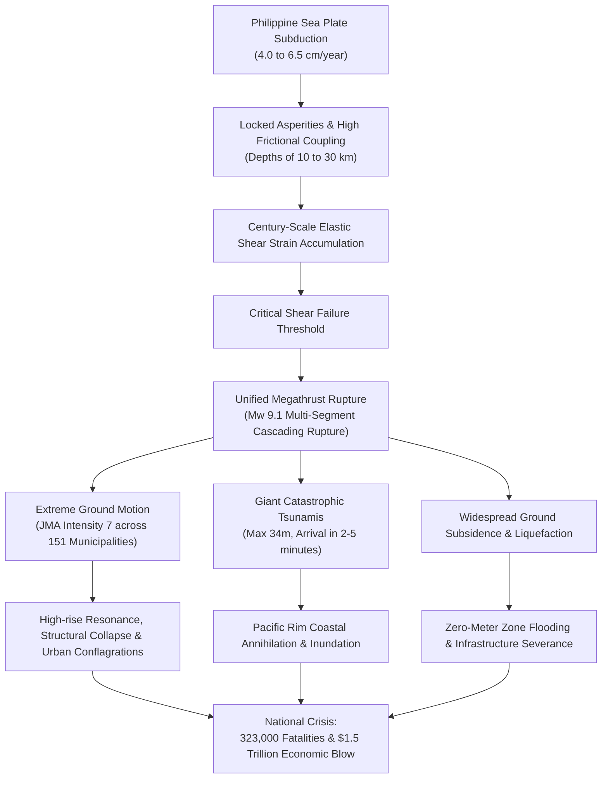

This treatise presents a definitive, multidisciplinary synthesis spanning geophysics, paleoseismology, hydrodynamic modeling, structural engineering, macroeconomic forecasting, governmental early-warning protocols, and actionable survival doctrines.

---

## Chapter 1: Geophysics and Plate Kinematics of the Nankai Trough

### 1.1 Subduction Zone Architecture and Philippine Sea Plate Dynamics
The Nankai Trough is an active convergent plate margin formed by the northwestward subduction of the young, relatively warm Shikoku Basin (part of the Philippine Sea Plate) beneath the Southwest Japan Arc. The subduction dip angle is remarkably shallow near the trench axis (less than 10 degrees at depths shallower than 10 km), progressively steepening through the seismogenic zone (10–30 km depth) and into the ductile mantle wedge (>40 km depth). 

Thick accretionary prisms, formed by millions of years of terrigenous sediment scraped from the oceanic crust, overlay the overriding plate. This geological architecture profoundly dictates seismic wave amplification, dynamic rupture overshoot, and shallow tsunami generation.

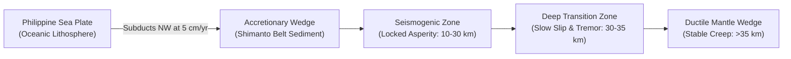

---

### 1.2 Asperities and Rate-and-State Friction
Fault slip behavior along the subduction interface is quantitatively governed by the Dieterich-Ruina rate- and state-dependent friction formulation:

$$\tau = \sigma_n \left[ \mu_0 + a \ln\left(\frac{V}{V_0}\right) + b \ln\left(\frac{V_0 \theta}{L}\right) \right]$$

where $\tau$ is shear stress, $\sigma_n$ is effective normal stress, $V$ is slip velocity, $\theta$ is the state variable representing fault contact maturity, $L$ is critical slip distance, and $a, b$ are constitutive empirical parameters.

| Zonal Classification | Depth Range | Frictional Regime | Mechanical Behavior | Characteristic Seismic Phenomena |
| :--- | :--- | :--- | :--- | :--- |
| **Shallow Trench** | 0 – 10 km | $a - b > 0$ (Conditionally Unstable) | Low friction, elevated pore fluid pressures | Tsunami earthquakes, Very Low Frequency (VLF) events |
| **Seismogenic Zone** | 10 – 30 km | $a - b < 0$ (Velocity-Weakening) | Strongly locked asperities, rapid shear accumulation | M8–M9 megathrust stick-slip ruptures |
| **Deep Transition Zone**| 30 – 35 km | $a - b \approx 0$ | Temperature-dependent frictional transition | Deep Non-Volcanic Tremors, Short-term Slow Slip (SSE) |
| **Ductile Mantle** | > 35 km | $a - b > 0$ (Velocity-Strengthening) | Plastic shear flow, steady aseismic creep | Continuous silent tectonic slip |

In the velocity-weakening seismogenic zone ($a - b < 0$), accelerating slip reduces frictional resistance, precipitating catastrophic dynamic instability.

---

### 1.3 Slow Slip Events (SSE) and Deep Low-Frequency Tremors
Discovered in the early 2000s by Japan's Hi-net tiltmeter network, the transition zone at 30 to 35 km depth hosts Episodic Tremor and Slip (ETS):
- **Short-term SSEs**: Accompany deep non-volcanic low-frequency tremors, recurring every 3 to 6 months with durations of several days and equivalent magnitudes of Mw 5.5 to 6.0.
- **Long-term SSEs**: Occur beneath the Bungo Channel and Tokai region every 6 to 7 years, quietly releasing elastic strain over months or years (Mw 6.5 to 7.0) without radiating high-frequency seismic waves.
These slow slip events act as thermodynamic barometers, redistributing shear stress upward onto the locked megathrust asperities.

---

### 1.4 Seafloor Geodetic Networks (GNSS-A) and Interplate Coupling
While terrestrial GNSS stations (GEONET) measure land subsidence and horizontal displacement, they lose spatial resolution toward offshore subduction zones. To overcome this, the Hydrographic and Oceanographic Department of the Japan Coast Guard deployed **GNSS-Acoustic (GNSS-A)** seafloor geodetic transponders.

GNSS-A observations have verified that the plate interface beneath Suruga Bay, the Enshu-nada Sea, the Kumano Basin, and the Tosa-bae is **100% strongly locked**, accumulating strain deficits of 4 to 6 centimeters every year.

---

### 1.5 Dynamic Rupture Propagation Simulation
Supercomputer numerical models solving the 3D elastodynamic wave equations show that once dynamic rupture initiates in one segment (e.g., Tonankai), dynamic stress transfer can trigger adjacent segments within tens of seconds. If the rupture cascades across Tokai, Tonankai, Nankai, and Hyuga-nada simultaneously, it generates an **Mw 9.1 megathrust super-event**.

---

## Chapter 2: Paleoseismology and Historical Seismic Cycles

### 2.1 The 1,400-Year Chronology of Nankai Megathrust Earthquakes
Japan possesses the world's most meticulous historical earthquake archives. The past 14 centuries demonstrate that Nankai Trough megathrust ruptures occur in distinct temporal patterns: single-segment ruptures, time-lagged domino ruptures, or simultaneous full-trench ruptures.

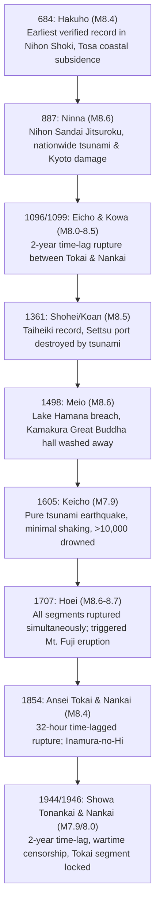

| Year | Historical Name | Estimated M | Rupture Mode | Key Historical Records and Impacts |
| :--- | :--- | :--- | :--- | :--- |
| **684** | Hakuho | M8.4 | Full trench (?) | *Nihon Shoki*: ~12 km² of the Kochi plain submerged into the sea; massive tsunami. |
| **887** | Ninna | M8.6 | Full trench | *Nihon Sandai Jitsuroku*: Government buildings in Kyoto collapsed; devastating tsunami across western Japan. |
| **1096** | Eicho | M8.0–8.5 | Tokai/Tonankai | *Chuyuki*: Great Bell of Todaiji temple fell; giant waves swept Ise Bay. |
| **1099** | Kowa | M8.0–8.3 | Nankai | Struck 2 years and 2 months after Eicho; coastal farmland in Tosa drowned. |
| **1361** | Shohei / Koan | M8.2–8.5 | Time-lag / Full | *Taiheiki*: Ports of Settsu (Osaka) devastated; hot springs at Yunomine ceased flowing. |
| **1498** | Meio | M8.4–8.6 | Full trench | Breached Lake Hamana into the open sea; swept away the Great Buddha Hall at Kamakura. |
| **1605** | Keicho | M7.9–8.0 | Tsunami Earthquake | Weak shaking but catastrophic tsunamis; over 10,000 fatalities from Boso to Kyushu. |
| **1707** | Hoei | M8.6–8.7 | Simultaneous Full | Entire rupture from Suruga Bay to Kyushu; 20,000+ dead; triggered Mt. Fuji's Hoei eruption 49 days later. |
| **1854** | Ansei Tokai | M8.4 | Tokai/Tonankai | Dec 23; Russian frigate Diana wrecked at Shimoda; giant tsunamis along Tokaido. |
| **1854** | Ansei Nankai | M8.4 | Nankai (32h lag) | Dec 24 (32 hours later); Goryo Hamaguchi's "Inamura no Hi" (burning rice sheaves) saved Hiro village. |
| **1944** | Showa Tonankai| M7.9 | Tonankai | Dec 7; struck wartime aircraft production plants; suppressed under strict military censorship; 1,223 dead. |
| **1946** | Showa Nankai | M8.0 | Nankai (2yr lag) | Dec 21; struck post-war ruins; 1,330 fatalities, 11,591 houses completely destroyed. |

---

### 2.2 Paleoseismic Geomorphology and Tsunami Deposits
Sediment core analyses conducted at Lake Hamana, the Shirasuka lowlands (Shizuoka), Oku-ike (Kochi), and coastal marshes across Shikoku validate these historical texts. Radiocarbon dating of marine sand intercalations confirms that giant tsunamis exceeding the scale of the Showa earthquakes have struck the Pacific coast regularly every 100 to 150 years.

---

### 2.3 Rupture Modalities: Hoei vs. Ansei vs. Showa
- **Hoei Type (Simultaneous Megathrust)**: All asperities from Suruga Bay to Hyuga-nada rupture synchronously within 5 minutes, maximizing tsunami amplitude and seismic energy release (Mw 8.7+).
- **Ansei Type (Time-Lagged Cascading)**: Eastern segments rupture first, transferring Coulomb stress westwards, causing a secondary rupture 32 hours later.
- **Showa Type (Partial Segment Rupture)**: Tonankai ruptured in 1944, followed by Nankai in 1946, leaving the easternmost **Tokai segment completely unruptured for over 170 years** since 1854.

---

### 2.4 Mathematical Recurrence Models and the "Time-Predictable" Trap
For decades, seismologists relied on the Shimazaki and Nakata (1980) "time-predictable model," which posited that recurrence intervals are proportional to the slip of the preceding earthquake. However, paleoseismic evidence demonstrates that subduction segments interact nonlinearly. Variable slip deficits and stress shadows make simple periodic forecasting unreliable, underscoring the urgent necessity of preparing for a multi-segment worst-case scenario.

---

## Chapter 3: Rupture Models and National Damage Forecasts

### 3.1 Mw 9.1 Megathrust Fault Model and Intensity 7 Distributions
The Cabinet Office Committee of Experts formulated a comprehensive 3D rupture model incorporating deep asperities and shallow near-trench mega-slip zones:
- **Maximum Seismic Intensity 7 (JMA Scale)**: Projected to encompass 151 municipalities across 10 prefectures: Shizuoka, Aichi, Mie, Wakayama, Tokushima, Kagawa, Ehime, Kochi, Oita, and Miyazaki.
- **Seismic Intensity 6-Upper / 6-Lower**: Projected to strike broad swaths of the Kanto, Chubu, Kinki, and Kyushu regions, spanning Tokyo, Nagoya, and Osaka.

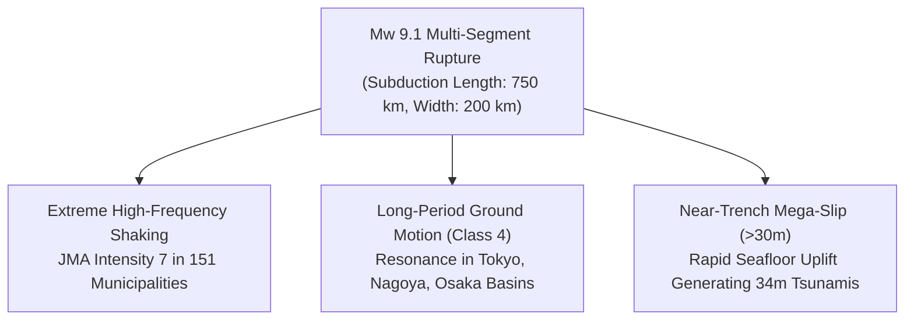

---

### 3.2 Long-Period Ground Motion and Skyscraper Resonance
Thick sedimentary basins beneath the Kanto, Nobi, and Osaka plains trap and amplify seismic shear waves with periods of 2 to 10 seconds.
- **Class 4 Long-Period Ground Motion** (highest JMA category): Induces horizontal floor displacements of **2 to 3 meters** at the tops of high-rise skyscrapers (towers exceeding 100–200 meters in height), shearing elevator cables, fracturing non-structural interior walls, and toppling unsecured equipment.
- **Sloshing in Petrochemical Storage Tanks**: Low-frequency resonance causes liquid fuel in large oil reservoirs to slosh violently, damaging floating roofs and triggering massive refinery fires.

---

### 3.3 Casualties and Structural Destruction Estimates
The official disaster mitigation report details the catastrophic impact:

| Casualty & Damage Metric | Worst-Case Projection | Primary Failure Mechanisms |
| :--- | :--- | :--- |
| **Total Fatalities & Missing** | **Up to 323,000** | Tsunami drowning: ~230,000 (71%) Structural collapse: ~82,000 (25%) Post-earthquake fire: ~10,000 (4%) |
| **Severely Injured** | **Approx. 623,000** | Crush injuries, asphyxiation, high-velocity tsunami debris impacts |
| **Completely Destroyed Buildings** | **Up to 2,386,000 units** | Seismic shaking collapse: ~1,340,000 Tsunami washout: ~160,000 Urban fire destruction: ~750,000 |
| **Persons Requiring Rescue** | **Approx. 340,000** | Trapped beneath collapsed structures, landslides, or stranded by floods |
| **Displaced Evacuees (Peak)** | **Up to 9,500,000** | Displaced population one week post-event in shelters, vehicles, or relatives' homes |

---

### 3.4 Metropolitan Subsoil Amplification: Tokyo, Nagoya, Osaka
- **Nagoya (Nobi Plain)**: Vast zero-meter sea-level zones formed by alluvial silt face extreme soil liquefaction and lateral spreading.
- **Osaka (Osaka Basin)**: Low-lying ground surrounding Umeda and coastal reclaimed lands around Osaka Bay are vulnerable to simultaneous river breaches and seismic shaking.
- **Tokyo (Kanto Plain)**: Deep alluvial valleys (e.g., Koto, Edogawa) amplify seismic accelerations, compounding high-density wooden neighborhood conflagrations.

---

## Chapter 4: Hydrodynamics of 34-Meter Tsunamis and Coastal Destruction

### 4.1 Shallow Near-Trench Slip and 34-Meter Run-up Physics
During an Mw 9.1 megathrust event, dynamic fault rupture propagates all the way to the shallow trench axis, displacing poorly consolidated accretionary prism sediments by **20 to 30 meters horizontally and vertically**. This instantaneous seafloor deformation elevates billions of cubic meters of water, generating catastrophic tsunamis.

In coastal rias topographies where V-shaped bays focus hydrodynamic wave energy (e.g., Kuroshio Town and Tosashimizu in Kochi Prefecture), maximum tsunami run-up heights are projected to reach **34.4 meters**.

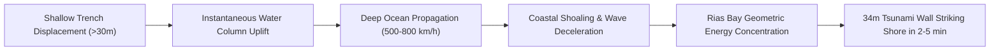

---

### 4.2 Arrival Times and Leading-Wave Physics
Due to the close proximity of the Nankai Trough fault trace to the Japanese coastline (only 50 to 100 km offshore), arrival times are perilously short:
- **2 to 5 minutes post-rupture**: First tsunami waves strike the coasts of Shizuoka, Mie, Wakayama, and Kochi.
- **Leading Depression Wave vs. Elevation Wave**: Depending on coastal geometry relative to the seafloor tilt axis, areas may experience an immediate massive water surge without any preceding retreat (leading depression wave). Evacuation must initiate purely on the basis of seismic shaking, without waiting for visual cues.

---

### 4.3 Submarine Landslides and Localized Mega-Tsunamis
Seismic shaking can destabilize sediment accumulations along submarine canyon walls (e.g., Kumano Basin, Tosa Bay), triggering secondary submarine debris avalanches. These undersea landslides produce intense, localized tsunami waves with run-up heights exceeding primary tectonic predictions.

---

### 4.4 Coastal Defense Limits: Level 1 vs. Level 2 Tsunamis
Modern Japanese coastal engineering distinguishes between two design thresholds:
- **Level 1 Tsunami (L1)**: Frequency of once every 50 to 100 years (heights of 5 to 10 meters). Mitigated via physical coastal defenses (seawalls, floodgates, breakwaters).
- **Level 2 Tsunami (L2)**: Maximum conceivable megathrust tsunamis occurring every several centuries or millennia (heights of 10 to 34 meters).
L2 tsunamis will overtop and structurally undermine conventional concrete seawalls. Therefore, mitigation relies on **comprehensive multi-layered defense (evacuation towers, elevated highways, high-ground retreat)**.

| Coastal Protection & Evacuation Measures | Engineering Advantages | Operational Limits & Failure Risks |
| :--- | :--- | :--- |
| **Tsunami Evacuation Towers** | Immediate vertical refuge in flat coastal plains; saves non-ambulatory elderly. | Impact damage from drifting cargo ships/containers; prolonged isolation without water or heat. |
| **High-Ground Relocation** | Eliminates inundation risk entirely; permanent community safety. | Multi-billion-dollar costs; disruption of coastal fishing/maritime economies; community dissent. |
| **Evacuation Stairs & Forest Paths** | Rapid pedestrian access to coastal bluffs; solar guidance lighting. | Blocked by earthquake-triggered landslides, fallen trees, or liquefaction scarps. |

---

## Chapter 5: Cascading and Secondary Multi-Hazard Disasters

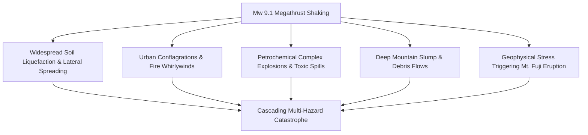

### 5.1 Liquefaction and Lateral Spreading in Coastal Reclaimed Land
Pore water pressure will spike instantly across coastal landfills and delta basins in Tokyo Bay, Ise Bay, and Osaka Bay. Underground utilities (water mains, gas conduits, telecom conduits) will fracture en masse. Heavy concrete quay walls will experience lateral spreading, sliding meters toward the sea and disabling maritime relief berthing.

### 5.2 Dense Urban Wooden Districts and Fire Whirlwinds
Thousands of concurrent ignitions from electrical short-circuits, toppled heaters, and industrial gas leaks will overwhelm municipal firefighting brigades. In dense wooden urban clusters (e.g., Tokyo's Jonan/Joto districts, Osaka's inner suburbs), independent blazes will merge into towering **firestorms and fire whirlwinds**, incinerating an estimated 750,000 structures.

### 5.3 Industrial Complex Explosions and Hazardous Material Releases
Coastal petrochemical complexes lining Suruga Bay, the Chukyo Industrial Zone, and Sakai-Senboku (Osaka) house pressurized hydrocarbons and volatile chemicals. Damaged storage spheres, cracked pipelines, and sloshing crude tanks will trigger vapor cloud explosions and toxic gas dispersals.

### 5.4 Mountain Slumps and Isolation of Inland Communities
The steep, geologically fractured terrain of the Kii Peninsula, Shikoku Mountains, and Southern Alps will suffer thousands of deep-seated landslides (landslide dams). Highway tunnels, bridges, and mountain passes will be cut, trapping tens of thousands of residents in isolated valleys without power, water, or medical access.

### 5.5 Potential Eruption of Mount Fuji
Historical geophysics demonstrates dynamic coupling: the October 28, 1707 Hoei megathrust earthquake altered the regional tectonic stress field around the magma chamber of Mount Fuji, triggering its violent **Hoei Plinian eruption 49 days later** (December 16, 1707). An eruption today would shower metropolitan Tokyo with centimeters to decimeters of volcanic ash, shutting down air traffic, derailing electric rail transport, and crippling drainage networks.

---

## Chapter 6: Lifeline Severance and $1.5 Trillion Economic Collapse

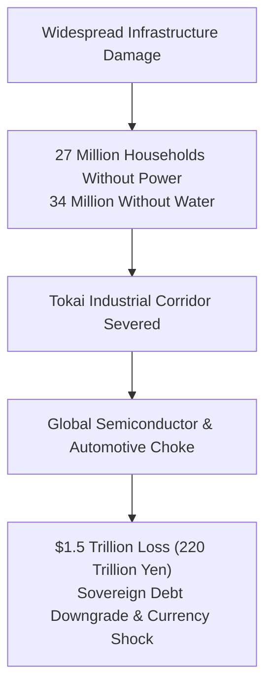

### 6.1 Blackout, Water Outage, and Communications Collapse
- **Electrical Grid**: Immediate tripping of thermal and nuclear power plants along the Pacific rim will plunge **27.1 million households** into blackout.
- **Water & Sewage**: Ruptured pipelines will deprive **34.4 million residents** of running water for weeks or months.
- **Telecom**: Flooded battery vaults and severed fiber-optic backbones will paralyze cellular and data communications across central Japan.

### 6.2 Severance of the Tokaido Arteries
The Tokaido Shinkansen, Tomei Expressway, Shin-Tomei Expressway, and National Route 1 run parallel through a narrow corridor along Suruga Bay. High-intensity shaking and coastal tsunamis will sever this terrestrial lifeline simultaneously, effectively **cleaving the Japanese archipelago into east and west halves** and preventing overland relief from reaching Kansai.

### 6.3 Global Supply Chain Paralysis
The Pacific Belt is the beating heart of Japanese manufacturing, producing automobiles, precision robotics, machine tools, and advanced semiconductor components. The shutdown of ports (Nagoya, Shimizu, Osaka, Kobe) and industrial parks will immediately ripple through North American and European manufacturing assembly lines.

### 6.4 The $1.5 Trillion Economic Blow
The Cabinet Office estimates macroeconomic damages at **214.2 to 220.3 trillion yen**:

| Damage Classification | Projected Loss | Primary Economic Breakdown |
| :--- | :--- | :--- |
| **Direct Asset Losses (Stock Damage)** | **Approx. 169.5 Trillion Yen** | Buildings: ~107.1T yen Lifeline & transport facilities: ~32.2T yen Industrial plants & capital equipment: ~20.3T yen |
| **Economic Disruption Losses (Flow Damage)** | **Approx. 44.7 Trillion Yen** | 1-year nationwide manufacturing stoppage, transaction reduction, and supply severance |
| **Total Economic Impact** | **Approx. 214.2 – 220.3 Trillion Yen** | **13 times the 2011 Tohoku disaster; double Japan's national budget; ~42% of GDP** |

This unprecedented fiscal drain risks triggering severe sovereign credit downgrades, hyper-depreciation of the yen, and protracted international financial instability.

### 6.5 Evacuee Overcrowding and Disaster-Related Deaths
Up to 9.5 million evacuees will pack into damaged emergency shelters, cars, and makeshift camps. Overcrowding, lack of clean water, hypothermia, and deep vein thrombosis (economy class syndrome) threaten to trigger a secondary epidemic of **disaster-related deaths**, rivaling direct tsunami casualties.

---

## Chapter 7: The Nankai Trough Earthquake Extra Information System

In 2019, Japan implemented the **Nankai Trough Earthquake Extra Information (Extra Info)** operational advisory framework to replace obsolete binary earthquake prediction doctrines.

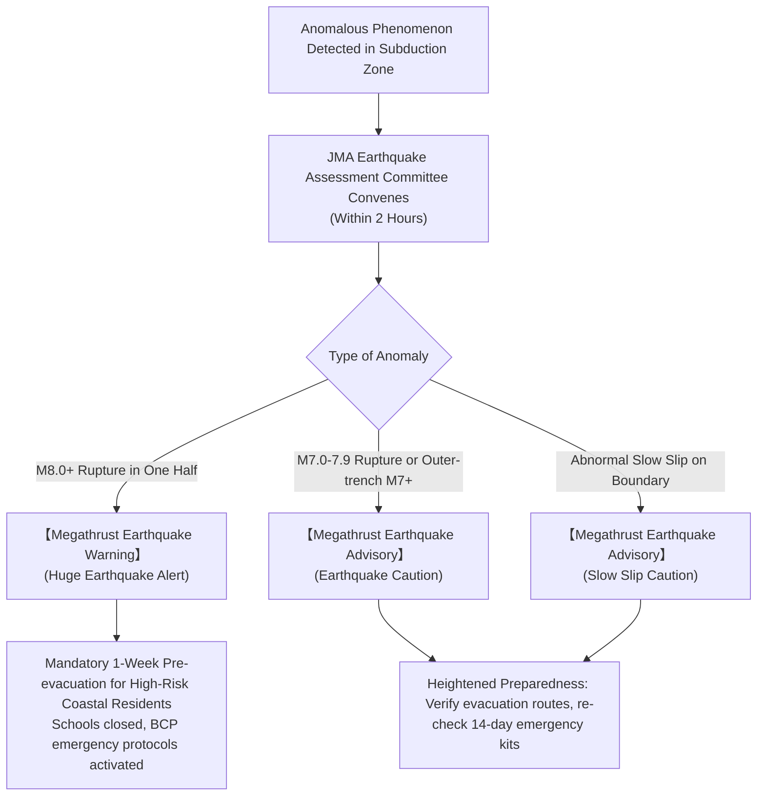

| Advisory Scenario | Trigger Criteria & Physics | Issued Category | Mandated Societal Response |
| :--- | :--- | :--- | :--- |
| **Half-Rupture (Han-ware)** | **M8.0 or greater** interplate earthquake in one half of the trough (e.g., eastern Tonankai ruptures). | **【Megathrust Earthquake Warning】** *(Kyodai Jishin Keikai)* | Coastal residents unable to evacuate within 30 min must **pre-evacuate for 1 full week**; schools close; business BCP halts non-essential operations. |
| **Partial Rupture (Ichibu-ware)** | **M7.0 to M7.9** interplate event, or **M7.0+** oceanic intraplate / outer-trench event. | **【Megathrust Earthquake Advisory】** *(Kyodai Jishin Chui)* | Daily life continues with heightened readiness: furniture secured, emergency kits verified, ready to evacuate immediately. |
| **Slow Slip (Yukkuri-suberi)** | Strainmeters detect anomalous slow fault slip at unprecedented velocity/scale. | **【Megathrust Earthquake Advisory】** *(Kyodai Jishin Chui)* | Monitor official broadcasts, inspect emergency packs, maintain situational vigilance. |

### 7.2 The August 2024 Hyuga-nada M7.1 Milestone
On August 8, 2024, an M7.1 earthquake struck the Hyuga-nada Sea off Miyazaki. Within 2.5 hours, the JMA issued its first-ever **Nankai Trough Earthquake Extra Information (Advisory)**. Over the subsequent 7 days, millions of citizens restocked emergency supplies, bullet trains operated at reduced speeds, and coastal hotels saw wave-cancellations. This real-world test demonstrated the viability of the advisory system while exposing challenges in risk communication.

### 7.3 Corporate Business Continuity Planning (BCP)
Under an official "Warning" alert, corporate leadership must execute pre-scripted BCP protocols: halt hazardous manufacturing lines, relocate critical digital servers, send remote personnel home, and verify supply-chain buffer inventories.

---

## Chapter 8: Frontline Telemetry, Supercomputing, and AI Innovation

### 8.1 Seafloor Cable Observatories: DONET, S-net, and N-net
Japan has encircled the plate boundary with the world's dense real-time subsea monitoring network:
- **DONET 1 & 2** (Dense Oceanfloor Network for Earthquakes and Tsunamis): 50 seafloor sensor nodes deployed across the Tonankai and Nankai basins in water depths up to 4,000 meters.
- **S-net**: 150 fiber-optic stations spanning the Japan Trench off Tohoku and Kanto.
- **N-net** (Nankai Trough Tsunami Cable Network): Covering the Kochi-to-Hyuga-nada gap, completing a seamless real-time seafloor fiber array.
These networks detect seafloor pressure steps directly above the epicenter, issuing **earthquake early warnings tens of seconds faster** and **tsunami early warnings up to 20 minutes earlier** than shore-based seismometers.

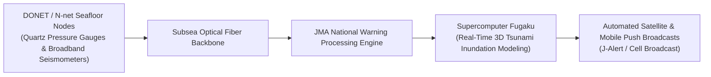

### 8.2 Real-Time Inundation Simulations with Supercomputer "Fugaku"
Leveraging the massive parallel processing of RIKEN's supercomputer "Fugaku," researchers can ingest real-time DONET seafloor pressure changes and compute high-resolution 3D coastal inundation simulations in **under 3 minutes**, projecting specific street-level flood depths before the first wave arrives on shore.

---

## Chapter 9: The Comprehensive Survival Strategy (Action Manual)

### 9.1 Structural Resilience: Grade 3 Seismic Design & Seismic Breakers
- **Seismic Resistance Grade 3 (Taishin-Tokyu 3)**: Certified via allowable stress engineering calculations, ensuring structures survive multiple repetitive M8–9 shakes without structural collapse.
- **Mechanical Furniture Anchoring**: L-brackets bolted directly into wall studs prevent heavy furniture from transforming into deadly projectiles.
- **Seismic Circuit Breakers (Kanshin Breaker)**: Automatically cut residential electrical power when sensing seismic accelerations exceeding 250 gals, preventing conflagrations when municipal power re-energizes.

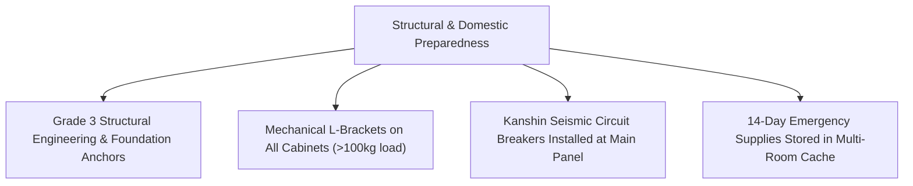

---

### 9.2 The 14-Day Extended Stockpile Matrix
With national logistics paralyzed for at least two weeks, households and businesses must achieve absolute autonomous self-sufficiency.

| Emergency Supply Item | Individual Requirement | 4-Person Family (14-Day Stock) | Selection Standards & Practical Knowledge |
| :--- | :--- | :--- | :--- |
| **Drinking & Cooking Water** | 3 Liters / day | **168 Liters** (84 × 2L bottles / 14 cases) | Long-life water (5–10 year shelf life). Augment with active rolling stock method. |
| **Emergency Rations (Calories)** | 2,000 kcal / day | **112,000 kcal total** | Alpha-rice packs, canned protein (fish, poultry), retort meals, energy gel packs. |
| **Portable Gas Canisters** | 0.5 – 1 canister / day | **28 to 42 canisters** (10–14 three-packs) | Critical for boiling water, warming rations, and heating under power/gas outages. |
| **Emergency Chemical Toilets** | 5 usages / day | **280 total kits** (70 per person) | Coagulant polymer powder + high-density polyethylene odor-proof bags (BOS). |
| **Off-Grid Power Storage** | 500 – 1000 Wh | **2,000 Wh+ Power Station + 200W Solar** | LiFePO4 chemistry for longevity; runs satellite terminals, medical equipment, radios. |

---

### 9.3 The Emergency Sanitary Imperative: The 70-Pack Toilet Protocol
When municipal sewer mains rupture or backflow under river flood levels, flushing toilets causes biohazard wastewater to erupt into ground-floor homes.
- **Strict Protocol**: Tape toilet bowls shut immediately. Install disposable emergency toilet liners with antimicrobial coagulants.
- **BOS Odor-Sealing Bags**: Utilize medical-grade barrier plastics to trap toxic hydrogen sulfide and fecal bacteria within living quarters for up to 30 days.

### 9.4 Family Disaster Timelines and Redundant Satellite Comms
- Establish predefined family reunion criteria using JMA's "Disaster Emergency Message Dial 171" and web portal Web171.
- Procure emergency satellite transceivers (e.g., Starlink, Garmin inReach) to bypass collapsed terrestrial cellular networks.

---

## Chapter 10: Pre-Disaster Recovery and National Resilience

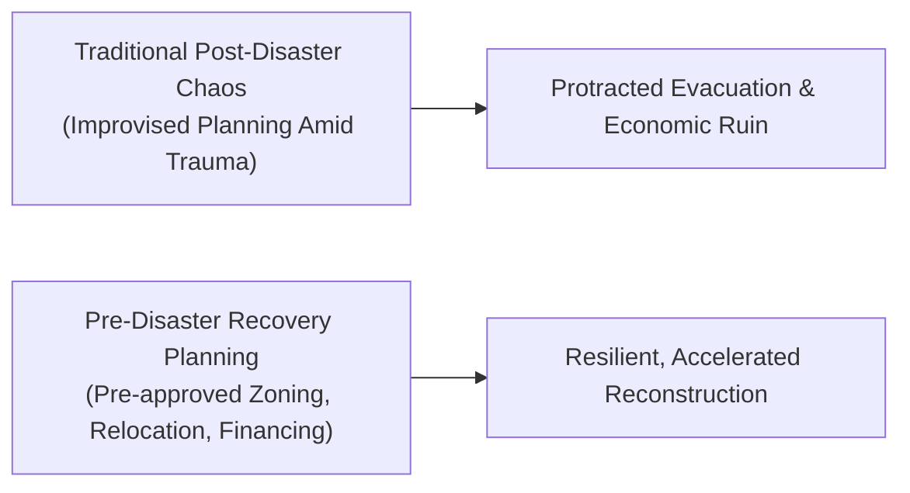

### 10.1 Pre-Disaster Recovery Planning (PDRP)
Post-disaster reconstruction frequently stalls for years due to property boundary disputes, zoning gridlocks, and administrative paralysis. **Pre-Disaster Recovery Planning (PDRP)** establishes legal frameworks, zoning redesigns, and high-ground residential blueprints *before* catastrophe strikes, enabling rapid, organized reconstruction within hours of an event.

### 10.2 Urban Restructuring and Infrastructure Redundancy
Creating "compact cities plus networked hubs" moves hospitals, schools, and civic centers out of low-lying floodplains while reinforcing elevated expressways to act as secondary seawalls and dry evacuation spines.

### 10.3 Synthesis of Historical Lessons: 3.11, Hanshin-Awaji, and Noto
Integrating the structural lessons of the 1995 Kobe earthquake (building collapse and fire), the 2011 Great East Japan earthquake (tsunami overtopping and nuclear vulnerability), and the 2024 Noto Peninsula earthquake (road isolation and water restoration bottlenecks) forms the bedrock of national resilience.

---

## Conclusion: Science, Foresight, and the Path to Resilience

The impending Nankai Trough megathrust earthquake is not a matter of "if," but "when." In confronting this planetary seismic engine, fatalism is the ultimate vulnerability. By understanding the rigorous fluid dynamics, frictional mechanics, and historical precedents of this convergent boundary, human society can erect a **shield of science** and a **fortress of foresight**. Proactive, timeline-driven preparedness will determine the survival and continuity of modern Japan.
