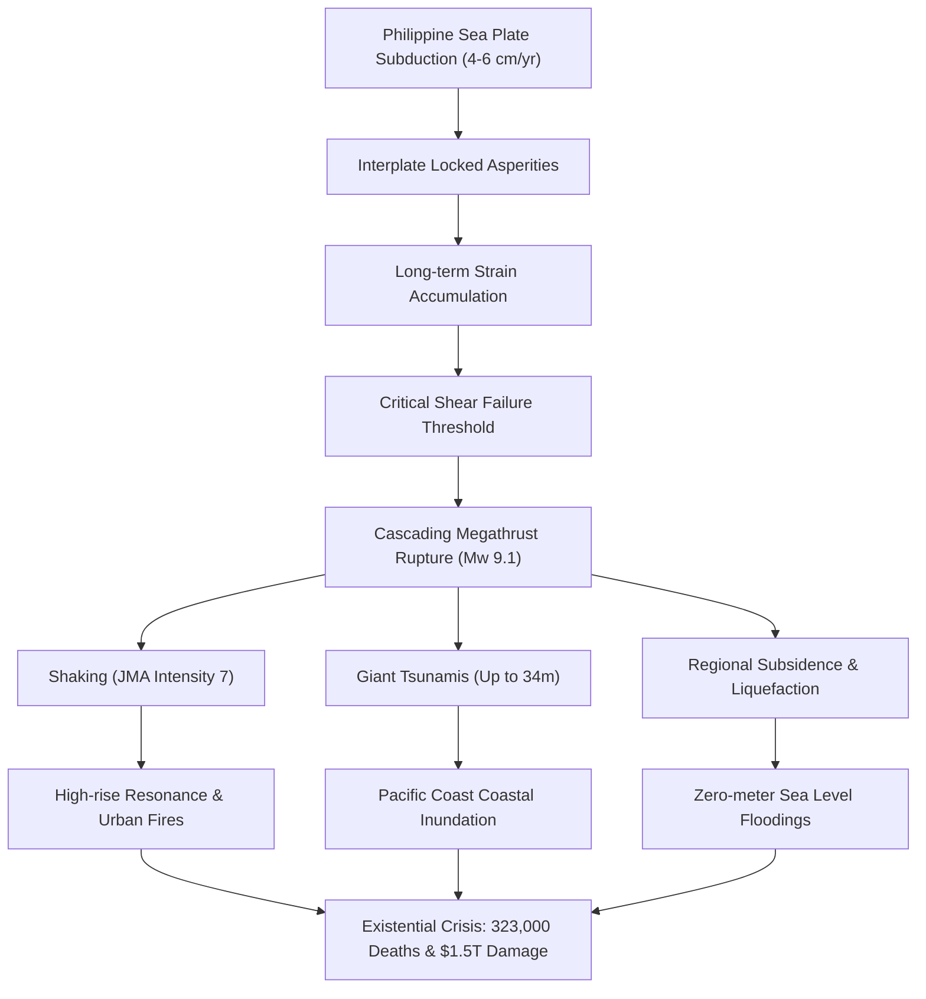
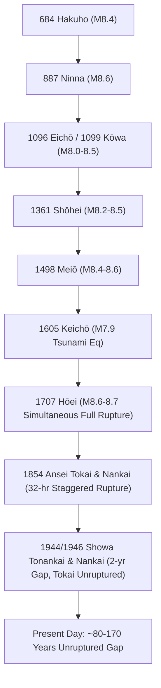

## Introduction: The Nature of Japan's Greatest Existential Crisis

Stretching approximately 700 to 800 kilometers beneath the Pacific Ocean off southwestern Honshu, Shikoku, and Kyushu—from Suruga Bay to the Hyuga-nada Sea—lies the **Nankai Trough**. This oceanic trench marks a subduction zone where the oceanic Philippine Sea Plate subducts beneath the continental Eurasian Plate (Southwest Japan Arc) at a rate of 4.0 to 6.5 centimeters per year.

Over the past 1,400 years of recorded history, this megathrust fault has produced magnitude 8 to 9 class earthquakes on a recurring cycle of approximately 100 to 150 years. With nearly 80 years having elapsed since the 1944 Showa-Tonankai (M7.9) and 1946 Showa-Nankai (M8.0) events, critical shear stress has accumulated along the plate interface. Japan's Earthquake Research Committee estimates the probability of an M8 to M9 earthquake occurring within the next 30 years at 70% to 80%, rising to approximately 90% within 40 years.

According to disaster models published by the Cabinet Office's Central Disaster Management Council, a worst-case megathrust event could generate maximum seismic intensities of 7 (JMA scale) across 151 municipalities, trigger catastrophic tsunamis up to 34 meters high striking the coast within minutes, claim up to 323,000 lives, destroy 2.38 million buildings, and inflict direct and indirect economic damages exceeding 220 trillion yen (~$1.5 trillion USD).

---

## Chapter 1: Geophysics and Plate Kinematics of the Nankai Trough

### 1.1 Subduction Zone Architecture and Philippine Sea Plate Dynamics
The Nankai Trough represents an active convergent plate boundary where the young, warm oceanic lithosphere of the Philippine Sea Plate plunges northwestward beneath southwest Japan. The subduction dip angle is remarkably shallow near the trench axis (less than 10 degrees at depths <10 km), steepening across the seismogenic zone (10–30 km depth) and into the ductile mantle wedge (>40 km depth). Accretionary prisms, formed by millions of years of terrigenous sediment scrapings (e.g., the Shimanto Belt), overlay the upper plate, profoundly influencing dynamic rupture propagation and tsunami generation.

### 1.2 Asperities and Rate-and-State Friction
Fault slip behavior along the subduction interface is governed by the Dieterich-Ruina rate- and state-dependent friction formulation:

$$\tau = \sigma_n \left[ \mu_0 + a \ln\left(\frac{V}{V_0}\right) + b \ln\left(\frac{V_0 \theta}{L}\right) \right]$$

- **Rate-Weakening Zones ($a - b < 0$): Locked Asperities**
  Located between 10 km and 30 km depth, these zones exhibit decreasing frictional resistance with accelerating slip, resulting in unstable, dynamic stick-slip seismic ruptures that produce M8–9 megathrust events.
- **Rate-Strengthening Zones ($a - b > 0$): Stable Creep**
  Prevailing at shallow depths near the trench axis (<10 km) and ductile regions (>35 km depth), friction increases with velocity, facilitating stable, aseismic sliding.
- **Transition Zones ($a - b \approx 0$)**
  Bordering the asperities at 30–35 km depth, these zones host episodic slow-slip events (SSE) and tectonic tremors.

| Zonal Classification | Depth Range | Frictional Regime | Mechanics | Characteristic Phenomena |
| :--- | :--- | :--- | :--- | :--- |
| **Shallow Trench** | 0 – 10 km | $a - b > 0$ (conditionally unstable) | Low friction, high fluid pore pressure | Tsunami earthquakes, VLF events |
| **Seismogenic Zone** | 10 – 30 km | $a - b < 0$ (Rate-weakening) | Fully locked asperities | M8–9 Megathrust ruptures |
| **Transition Zone** | 30 – 35 km | $a - b \approx 0$ | Thermally controlled transition | Deep tectonic tremor, short-term SSE |
| **Ductile Shear Zone**| > 35 km | $a - b > 0$ (Rate-strengthening) | Plastic shear flow | Continuous aseismic creep |

### 1.3 Slow Earthquakes and Stress Redistribution
High-sensitivity seismograph networks (Hi-net) and borehole tiltmeters have revealed an extensive family of slow earthquakes at the downdip edge of the seismogenic zone. Deep low-frequency tremors (1–8 Hz) and short-term slow-slip events (ETS) occur cyclically every 3 to 6 months, modulated by high-pressure metamorphic fluids. Long-term SSEs in the Bungo Channel and Tokai region release strain over months. While releasing modest strain aseismically, these slow slips transfer shear stress directly onto adjacent locked asperities, potentially serving as nucleation triggers for megathrust ruptures.

### 1.4 Seafloor Geodetic Insights (GNSS-A)
The deployment of GNSS-Acoustic seafloor geodetic arrays by the Japan Coast Guard and universities has eliminated historical terrestrial blind spots. Precise acoustic transponders on the deep seafloor reveal that the plate interface from Enshu-nada to Hyuga-nada is coupled at nearly 100% (full interplate locking), with the upper plate dragged downward at several centimeters per year, confirming extreme strain accumulation along offshore patches.

---

## Chapter 2: Paleoseismology and Historical Recurrence

### 2.1 1,400 Years of Historical Megathrust Events
Historical documents, temple chronicles, and geological tsunami sediment cores document a remarkably consistent yet diverse 1,400-year history of megathrust ruptures:

- **684 Hakuho Earthquake (M8.4)**: Earliest documented event in *Nihon Shoki*; catastrophic coastal subsidence in Kochi.
- **887 Ninna Earthquake (M8.6)**: Documented in *Nihon Sandai Jitsuroku*; widespread tsunami devastation across Western Japan.
- **1498 Meiō Earthquake (M8.4)**: Severed Lake Hamana from the mainland; tsunami breached the Kamakura Great Buddha hall.
- **1707 Hōei Earthquake (M8.6–8.7)**: The largest full-margin rupture; triggered the catastrophic explosive eruption of Mount Fuji 49 days later.
- **1854 Ansei Tokai & Nankai Earthquakes (M8.4)**: A classic 32-hour staggered rupture scenario; birthplace of the celebrated *Inamura no Hi* (The Fire of Rice Sheaves) tsunami evacuation story.
- **1944/1946 Showa Earthquakes (M7.9 / M8.0)**: Wartime and post-war events that left the easternmost Tokai (Suruga Bay) segment unruptured for over 170 years.

---

## Chapter 3: Rupture Modeling and Disaster Projections

### 3.1 Maximum Credible Rupture Scenario (Mw 9.1)
The Cabinet Office's rupture model spans 750 km by 200 km, generating unprecedented strong ground motions:
- **JMA Intensity 7**: Projected across 151 municipalities in Shizuoka, Aichi, Mie, Wakayama, Tokushima, Kochi, and Miyazaki prefectures.
- **JMA Intensity 6 Upper**: Covering 21 prefectures across Tokyo, Kanagawa, Osaka, Hyogo, and beyond.

### 3.2 Long-Period Ground Motion and Skyscraper Resonance
Sedimentary basins in Tokyo, Nagoya, and Osaka trap seismic shear and surface waves, inducing resonant oscillations lasting 10+ minutes. High-rise structures (100–300m) will experience lateral displacements of 2 to 3 meters on upper floors (Category 4 long-period motion). Industrial oil storage tanks will undergo severe liquid sloshing, rupturing floating roofs and triggering massive petroleum fires.

### 3.3 Casualty and Structural Damage Metrics
- **Fatalities**: Up to **323,000 deaths** (71% from tsunamis, 25% from structural collapse, 4% from fires).
- **Severe Injuries**: Approximately **623,000**.
- **Building Destructions**: Up to **2,386,000 structures** completely collapsed or incinerated.

---

## Chapter 4: Tsunami Hydrodynamics and Coastal Inundation

### 4.1 Shallow Slip Physics and 34-Meter Wave Heights
Dynamic thermal pressurization near the trench axis enables massive shallow seafloor slip of 20 to 30 meters, generating devastating tsunamis. Under Green's Law ($H \propto h^{-1/4}$), open-ocean tsunami speeds ($c = \sqrt{gh}$) exceeding 700 km/h compress into towering 34-meter surges in V-shaped coastal embayments such as Kuroshio Town, Kochi.

### 4.2 Arrival Times and Multiple Defenses
- **Shortest First-Wave Arrivals**: 2 to 5 minutes in Shizuoka, Mie, Wakayama, and Kochi.
- **First Wave Profile**: Direct positive surge (crest) rather than initial recession (trough).
- **Coastal Subsidence**: 1 to 2 meters of coseismic tectonic downdrop, crippling sea walls and rendering low-lying zones permanently submerged.

---

## Chapter 5: Multi-Hazard Cascades and Secondary Disasters
1. **Severe Soil Liquefaction**: Lateral spreading throughout reclaimed bays (Tokyo, Nagoya, Osaka).
2. **Urban Conflagrations**: Post-earthquake electrical fires consuming 750,000 homes in dense wooden neighborhoods.
3. **Deep-Seated Landslides**: Mountainous valleys in the Kii and Shikoku ranges dammed by massive debris flows.
4. **Volcanic Coupling**: High risk of triggered explosive eruptions (e.g., Mount Fuji), causing regional power grid blackouts via ash contamination.

---

## Chapter 6: Critical Lifeline Collapse and $1.5 Trillion Economic Shock
- **Water Outages**: 34.4 million people without potable water.
- **Power Blackouts**: 27.1 million households plunged into darkness.
- **Supply Chain Disruption**: Paralyzation of the Tokaido industrial corridor, idling global automotive and electronics manufacturing.
- **Economic Loss**: Direct and indirect damages of **214 to 220 trillion yen**, threatening national fiscal stability.

---

## Chapter 7: The Nankai Trough Earthquake Extra Information System
Established in 2019, this advisory system issues actionable alerts based on physical triggers:
1. **Megathrust Rupture Alert (Half-Rupture / M8.0+)**: Mandates a 1-week pre-evacuation for vulnerable coastal populations.
2. **Megathrust Rupture Advisory (Partial-Rupture / M7.0+ or Slow Slip)**: Requires vigilance and immediate readiness.

---

## Chapter 8: Advanced Sensor Networks and Computational Foresight
- **DONET & N-net**: Seafloor fiber-optic seismic and pressure sensor networks providing up to 20-second earthquake and 20-minute tsunami early detection.
- **Supercomputer Fugaku**: High-performance real-time data assimilation forecasting 3D urban inundation within minutes of offshore detection.

---

## Chapter 9: Comprehensive Survival Framework (14-Day Blueprint)
- **Structural Integrity**: Seismic Grade 3 construction with structural calculations; L-bracket furniture anchoring; seismic circuit breakers.
- **14-Day Self-Sustained Stockpiles**: 3L/day/person water (168L for 4 people); 2,000 kcal/day nutrition; 70 emergency toilet kits per person with polymer coagulants and odor-proof barrier bags (BOS).
- **Communication Protocols**: Satellite internet (Starlink), disaster voicemail (171), and prevention of secondary evacuation fatalities.

---

## Chapter 10: Pre-Disaster Recovery and National Resilience
- **Pre-Disaster Recovery Planning (PDRP)**: Pre-negotiated land zoning and digital property registries.
- **Infrastructure Redundancy**: Dual national transport corridors (Linear Chuo Shinkansen, Sea of Japan highway network).
- **Conclusion**: Disaster resilience is not fatalistic surrender, but an active, scientifically grounded national imperative.
