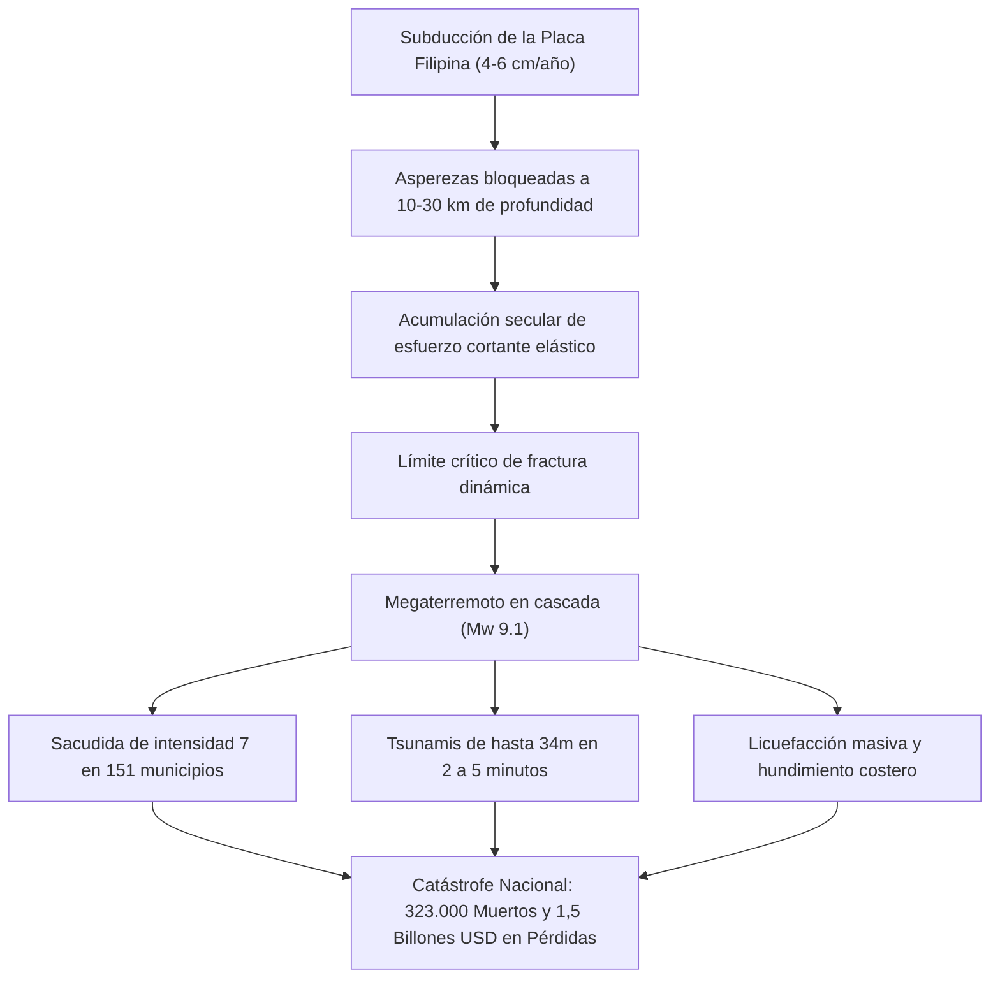

## Introducción: La Mayor Crisis Existencial de Japón

Frente a la costa pacífica del suroeste de Japón, extendiéndose entre 700 y 800 kilómetros desde la bahía de Suruga hasta el mar de Hyuga-nada, yace la **fosa de Nankai (Nankai Trough)**. En este límite convergente, la placa del mar de Filipinas subduce bajo la placa euroasiática a una velocidad de 4 a 6,5 cm al año.

A lo largo de 1.400 años de historia registrada, esta falla ha liberado megaterremotos de magnitud 8 a 9 en ciclos recurrentes de 100 a 150 años. Habiendo transcurrido casi 80 años desde las rupturas de Showa-Tonankai (1944, M7.9) y Showa-Nankai (1946, M8.0), la probabilidad de un megasismo en los próximos 30 años se sitúa en un **70% a 80%**, alcanzando cerca del **90% en 40 años**.

Las simulaciones de los comités de expertos del gobierno japonés proyectan ante una ruptura total (Mw 9.1):
- Intensidad sísmica máxima de 7 (escala JMA) en 151 municipios de 10 prefecturas.
- Tsunamis gigantescos con alturas de hasta **34 metros**, alcanzando la costa en 2 a 5 minutos.
- Hasta **323.000 fallecidos y desaparecidos**, 623.000 heridos graves y 2,38 millones de edificios colapsados o calcinados.
- Pérdidas económicas totales superiores a **220 billones de yenes (~1,5 billones de USD)**.

---

## 1. Geofísica y Tectónica de la Fosa de Nankai

La sismicidad está regida por la ley de fricción dependiente de velocidad y estado:
$$\tau = \sigma_n \left[ \mu_0 + a \ln\left(\frac{V}{V_0}\right) + b \ln\left(\frac{V_0 \theta}{L}\right) \right]$$
En la zona sismogénica (10–30 km), el régimen de debilitamiento por velocidad ($a - b < 0$) acumula energía que se libera mediante fractura inestable stick-slip. El sistema geodésico submarino GNSS-A confirma un **acoplamiento del 100%** a lo largo de toda la falla.

---

## 2. 1.400 Años de Historia Paleosísmica

- **684 (Hakuho, M8.4)**: Primer registro en el *Nihon Shoki*, 12 km² de tierra sumergidos en Tosa.
- **1707 (Terremoto de Hoei, M8.6-8.7)**: Ruptura simultánea total, más de 20.000 muertos, **provocó la erupción del monte Fuji 49 días después**.
- **1854 (Ansei Tokai y Nankai, M8.4)**: Ruptura escalonada con 32 horas de diferencia; historia de "Inamura no Hi".
- **Segmento Tokai**: Permanece bloqueado sin fracturar desde hace más de **170 años**.

---

## 3. Modelos de Ruptura y Estimación de Daños

- Ruptura Mw 9.1: Ondas de período largo (Clase 4) generan oscilaciones de 2 a 3 metros en rascacielos de Tokio, Nagoya y Osaka.
- Estimación de víctimas: **323.000 muertos** (71% por tsunami, 25% por colapso estructural, 4% por fuego).
- Refugiados: hasta **9,5 millones de evacuados**.

---

## 4. Dinámica del Tsunami de 34 Metros

- Desplazamiento de 20 a 30 metros en la fosa eleva miles de millones de metros cúbicos de agua.
- Concentración de energía en costas en ría: **34,4 metros en Kuroshio-cho** (Kochi).
- **Llegada en 2 a 5 minutos**: La evacuación debe ser inmediata tras la sacudida sin esperar confirmaciones.
- Defensas costeras Nivel 1 (diques) frente a estrategias Nivel 2 (torres de evacuación y relocalización a cotas altas).

---

## 5. Peligros Múltiples y Daños Secundarios

1. Licuefacción generalizada en terrenos ganados al mar en Tokio, Ise y Osaka.
2. Torbellinos de fuego en barrios densos de madera (750.000 casas incendiadas).
3. Explosiones en complejos petroquímicos costeros.
4. Deslizamientos masivos que aislarán comunidades montañosas en Kii y Shikoku.
5. Peligro geofísico real de **erupción reactivada en el monte Fuji**.

---

## 6. Colapso de Servicios y Pérdidas de 1,5 Billones USD

- **27,1 millones de hogares sin electricidad**, **34,4 millones de personas sin agua**.
- Fractura del corredor Tokaido (Shinkansen y autopistas), partiendo a Japón en dos mitades.
- Parálisis de cadenas globales de suministro automotriz y de semiconductores.
- Daños de 220 billones de yenes (13 veces el desastre de Tohoku de 2011).

---

## 7. Sistema de Información Extraordinaria de Nankai

- **Alerta de Megaterremoto (Ruptura Parcial M8+)**: Evacuación preventiva obligatoria de 1 semana en zonas costeras críticas.
- **Aviso de Megaterremoto (M7+ o deslizamiento lento)**: Alerta reforzada y revisión de planes de emergencia.
- Probado operativamente con éxito en agosto de 2024 tras el sismo de Hyuga-nada (M7.1).

---

## 8. Redes Submarinas (DONET/N-net) y Supercomputación Fugaku

Cables de fibra óptica en el fondo marino detectan anomalías de presión anticipando tsunamis hasta 20 minutos antes. La supercomputadora Fugaku procesa simulaciones de inundación 3D en menos de 3 minutos.

---

## 9. Manual de Autonomía y Supervivencia de 14 Días

- Construcción antisísmica Grado 3 y disyuntores eléctricos automáticos (>250 gal).
- Provisiones familiares (4 personas, 14 días): **168 L de agua**, **112.000 kcal**, **280 bolsas de inodoro químico**, batería solar de 2.000 Wh.
- Protocolo higiénico: Sellado de inodoros domésticos para evitar reflujo de aguas residuales; uso de bolsas antibacterianas BOS.

---

## 10. Reconstrucción Previa al Desastre (PDRP)

Diseño legal y urbanístico anticipado para reconstruir sobre terreno elevado de forma ágil y coordinada.

---

## Conclusión: El Escudo de la Ciencia

El megaterremoto de Nankai es un hecho geológico inevitable. Enfrentarlo con rigor científico y preparación proactiva salvará millones de vidas.
