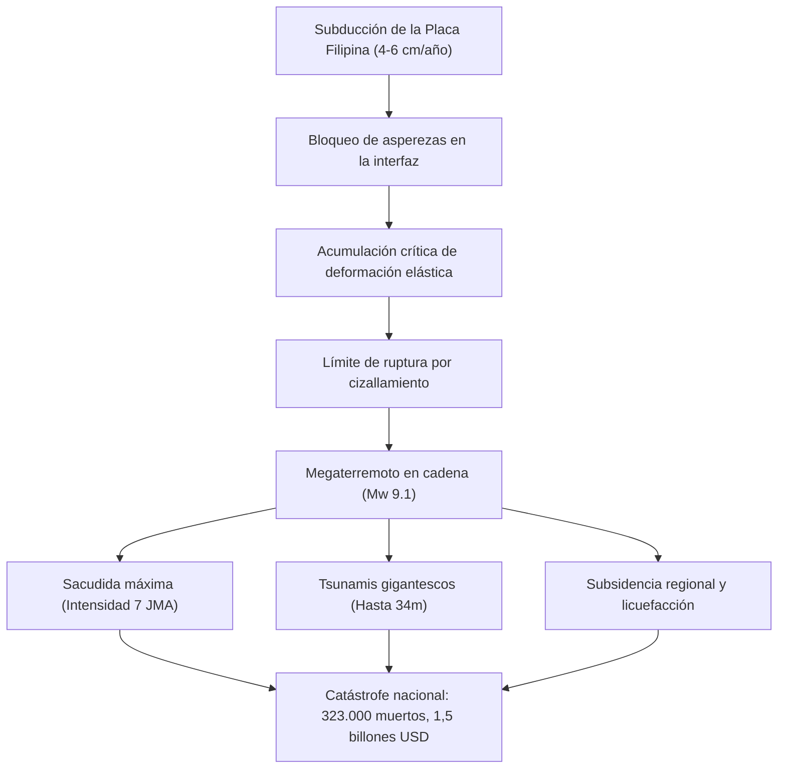

## Introducción: La mayor crisis existencial de Japón
La fosa de Nankai (Nankai Trough) es una trinchera submarina de 700 a 800 km donde la placa marina de Filipinas subduce bajo la placa Euroasiática a razón de 4 a 6 cm por año. Con una probabilidad del 70-80 % en los próximos 30 años, se anticipa un megaterremoto de magnitud 8 a 9 capaz de provocar olas de tsunami de hasta 34 metros, 323.000 víctimas fatales y pérdidas económicas de 220 billones de yenes.

## Capítulo 1: Geofísica y cinemática de placas en la fosa de Nankai
El comportamiento de fricción sigue la formulación de Dieterich-Ruina (Rate- and State-Dependent Friction). Las asperezas bloqueadas acumulan esfuerzos elásticos, liberados bruscamente en megaterremotos. Los eventos de deslizamiento lento (SSE) y temblores tectónicos profundos redistribuyen tensiones en los bordes de la falla.

## Capítulo 2: Paleosismicidad y recurrencia histórica de 1.400 años
Los registros documentales y sedimentológicos revelan un patrón recurrente cada 100-150 años: terremotos de Hakuho (684), Ninna (887), Meio (1498), Hoei (1707, ruptura total que desencadenó la erupción del Monte Fuji 49 días después), Ansei (1854, ruptura escalonada con 32 horas de diferencia) y Showa (1944/1946).

## Capítulo 3: Modelado de fuentes sísmicas e impacto estructural
Un evento de magnitud Mw 9.1 provocará intensidad sísmica máxima 7 en 151 municipios y movimientos de período largo (Categoría 4) que causarán resonancia destructiva en rascacielos de Tokio, Nagoya y Osaka. Se proyectan hasta 323.000 fallecidos y la destrucción de 2,38 millones de edificaciones.

## Capítulo 4: Hidrodinámica de tsunamis de 34 metros y colapso costero
El deslizamiento superficial de 20 a 30 metros en el lecho marino generará tsunamis masivos que impactarán las costas de Shizuoka, Mie, Wakayama y Kochi en tan solo 2 a 5 minutos, amplificándose a 34 metros en bahías cerradas.

## Capítulo 5: Multirriesgos y catástrofes secundarias
Licuefacción masiva de suelos en áreas portuarias, incendios urbanos devastadores en vecindarios de madera (750.000 viviendas quemadas), explosiones en refinerías costeras y deslizamientos catastróficos en zonas de montaña.

## Capítulo 6: Colapso de servicios vitales y shock económico
34 millones de personas sin suministro de agua potable, 27 millones de hogares sin electricidad y la parálisis de los corredores industriales del Tokaido, con pérdidas estimadas en 220 billones de yenes.

## Capítulo 7: Sistema de información extraordinaria de la fosa de Nankai
Mecanismo oficial que dicta evacuación preventiva inmediata durante una semana en áreas costeras críticas tras producirse una media ruptura (terremoto precursor M8+).

## Capítulo 8: Redes de observación marina (DONET, N-net) y supercomputación
Sensores submarinos de fibra óptica que adelantan la alerta sísmica en decenas de segundos y permiten al supercomputador Fugaku simular inundaciones urbanas en tiempo real.

## Capítulo 9: Guía práctica de supervivencia y autosuficiencia de 14 días
- Estructuras sismorresistentes Grado 3 y disyuntores sísmicos para evitar fuegos eléctricos.
- Almacenamiento esencial para 14 días: 3 litros de agua/día/persona, 70 kits de inodoro químico por persona con polímeros y bolsas antiolor (BOS).
- Comunicaciones por satélite (Starlink) y mitigación de muertes secundarias en refugios.

## Capítulo 10: Reconstrucción preventiva y resiliencia territorial
Rediseño urbano preventivo, redundancia en las arterias nacionales y cultura de preparación activa.
