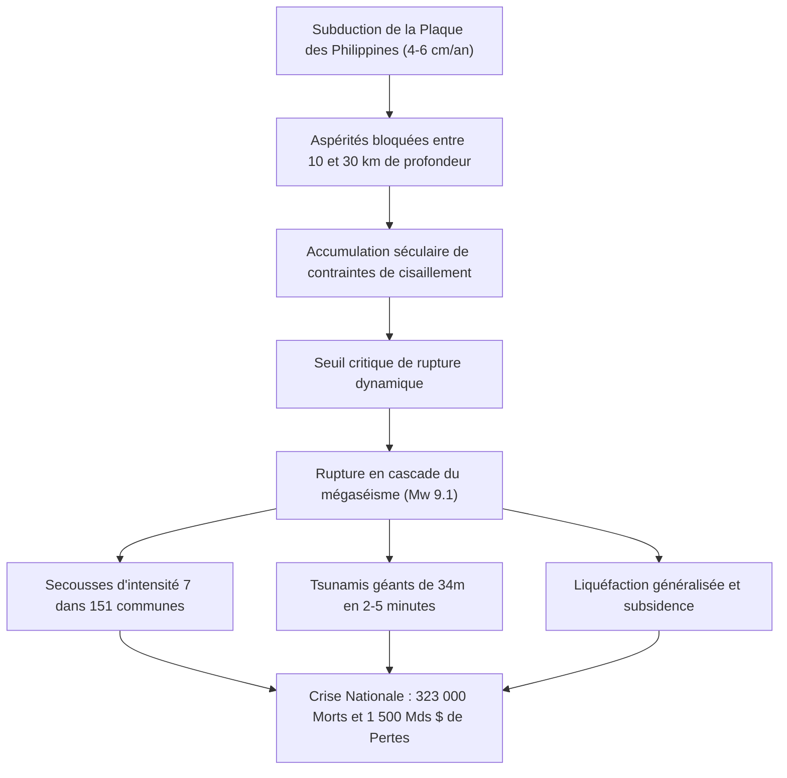

## Introduction : La Plus Grande Menace Existentielle du Japon

S'étendant sur 700 à 800 kilomètres au large des côtes pacifiques du sud-ouest du Japon, de la baie de Suruga à la mer de Hyuga-nada, la **fosse de Nankai (Nankai Trough)** est une zone de subduction majeure où la plaque de la mer des Philippines plonge sous la plaque eurasienne à une vitesse de 4 à 6,5 cm par an.

Sur 1 400 ans d'histoire documentée, cette faille a engendré des mégaséismes de magnitude 8 à 9 tous les 100 à 150 ans. Près de 80 ans s'étant écoulés depuis les séismes de Showa-Tonankai (1944, M7.9) et Showa-Nankai (1946, M8.0), la probabilité d'un séisme majeur dans les 30 ans atteint **70% à 80%**, et **environ 90% dans les 40 ans**.

Les scénarios officiels du gouvernement japonais prévoient en cas de rupture multi-segments (Mw 9.1) :
- Une intensité sismique maximale de 7 (échelle JMA) dans 151 municipalités de 10 préfectures.
- Des tsunamis cataclysmiques culminant à **34 mètres**, frappant le littoral en 2 à 5 minutes.
- Jusqu'à **323 000 morts et disparus**, 623 000 blessés graves et 2,38 millions de bâtiments détruits.
- Un impact économique total dépassant **220 000 milliards de yens (~1 500 milliards USD)**.

---

## 1. Géophysique et Cinématique des Plaques

La zone sismogène (10–30 km) est régie par la loi de friction vitesse-état :
$$\tau = \sigma_n \left[ \mu_0 + a \ln\left(\frac{V}{V_0}\right) + b \ln\left(\frac{V_0 \theta}{L}\right) \right]$$
Le régime d'affaiblissement par la vitesse ($a - b < 0$) accumule les contraintes cisaillantes jusqu'au glissement instable stick-slip. Le réseau de géodésie sous-marine GNSS-A confirme un **blocage interplaque à 100%**.

---

## 2. 1 400 Ans de Chronologie Paléosismique

De Hakuho (684) à Showa (1944/1946) :
- **1707 (Séisme de Hoei, M8.6-8.7)** : Rupture synchrone intégrale, 20 000 morts, **déclenchement de l'éruption du mont Fuji 49 jours plus tard**.
- **1854 (Séismes d'Ansei, M8.4)** : Rupture échelonnée en 32 heures d'intervalle.
- **Segment de Tokai** : Bloqué sans rupture depuis plus de **170 ans**.

---

## 3. Modèles de Rupture et Estimations des Pertes

- Modèle Mw 9.1 : Résonance des gratte-ciel à Tokyo, Nagoya et Osaka (mouvements de 2 à 3 mètres au sommet).
- Bilan humain : **323 000 morts** (71% par tsunami, 25% par écrasement, 4% par incendie).
- Sinistrés : jusqu'à **9,5 millions de réfugiés**.

---

## 4. Hydrodynamique des Tsunamis de 34 Mètres

- Déplacement vertical et horizontal de 20 à 30 mètres au niveau de la fosse.
- Amplification par les baies en rias : **34,4 mètres à Kuroshio-cho** (Kochi).
- **Arrivée en 2 à 5 minutes** : Évacuation réflexe sans attendre de confirmation visuelle.
- Protection L1 (digues) contre défense multibarrière L2 (tours de refuge, relocalisation).

---

## 5. Effets Secondaires et Catastrophes Multiples

- Liquéfaction massive dans les baies de Tokyo, Ise et Osaka.
- Tourbillons de feu urbains dévorant 750 000 habitations.
- Rupture des complexes pétrochimiques côtiers.
- Glissements de terrain géants isolant les vallées de Kii et Shikoku.
- Risque accru d'**éruption volcanique du mont Fuji**.

---

## 6. Paralysie des Réseaux et Choc Économique de 1 500 Milliards $

- **27,1 millions de foyers sans électricité**, **34,4 millions de personnes privées d'eau**.
- Coupure du corridor du Tokaido (Shinkansen et autoroutes), sectionnant le Japon en deux.
- Rupture des chaînes logistiques automobiles et semi-conducteurs mondiales.
- Dommages de 220 000 milliards de yens (13 fois le séisme de 2011).

---

## 7. Système d'Information Extraordinaire de Nankai

- **Alerte Mégaséisme (Demi-rupture M8+)** : Évacuation préventive légale d'une semaine pour les zones littorales vulnérables.
- **Avis Mégaséisme (M7+ ou glissement lent)** : Vigilance accrue et vérification des kits de secours.
- Première application réelle en août 2024 après le séisme de Hyuga-nada (M7.1).

---

## 8. Réseaux Fond de Mer (DONET/N-net) et Supercalculateur Fugaku

Les capteurs sous-marins à fibre optique détectent les tsunamis jusqu'à 20 minutes avant la côte. Le supercalculateur Fugaku modélise l'inondation 3D en moins de 3 minutes.

---

## 9. Manuel de Survie et d'Autonomie sur 14 Jours

- Norme parasismique Niveau 3 et disjoncteurs sismiques automatiques (coupure >250 gal).
- Stocks pour 4 personnes : **168 L d'eau potable**, **112 000 kcal de nourriture**, **280 kits de toilettes d'urgence**, station électrique solaire 2 000 Wh.
- Protocole sanitaire : Interdiction formelle de chasser l'eau dans les toilettes d'immeubles, utilisation obligatoire de sacs polymères hermétiques anti-odeurs (BOS).

---

## 10. Planification Pré-Désastreuse de Reconstruction (PDRP)

Législation et aménagement préventifs des zones de relocalisation sur les hauteurs avant la survenue du séisme.

---

## Conclusion : Le Bouclier de la Science

La survenue du séisme de Nankai est une certitude géologique. Seule une anticipation rigoureuse fondée sur la physique et une préparation minutieuse permettront d'assurer la survie et la continuité de la société.
