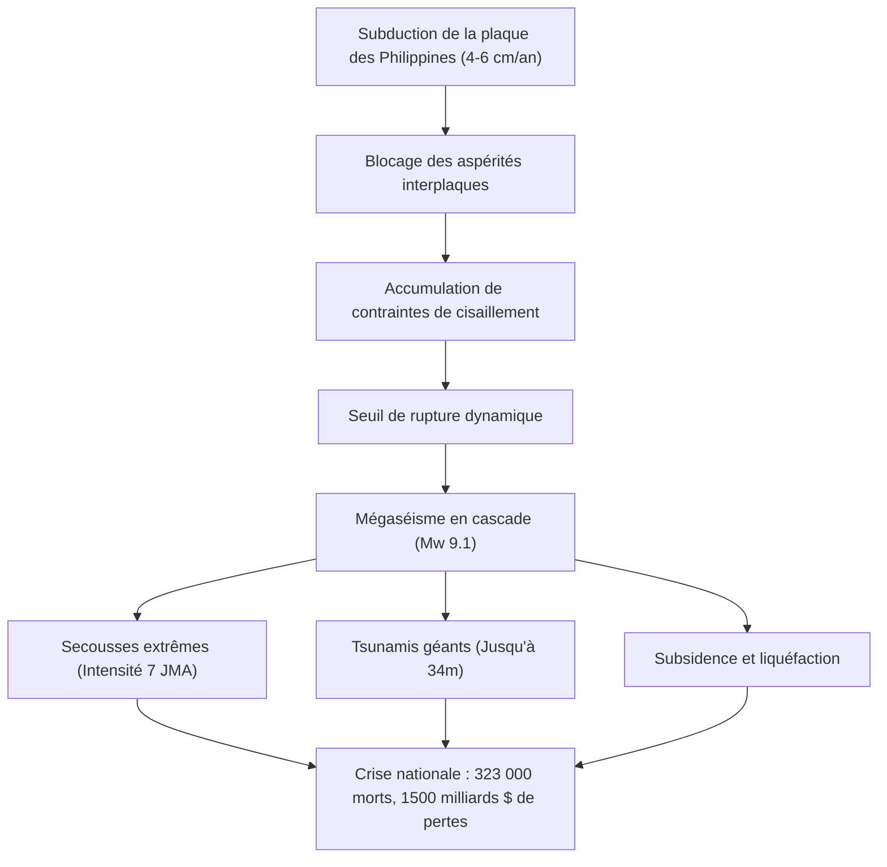

## Introduction : La plus grande crise existentielle du Japon
La fosse de Nankai (Nankai Trough) est une zone de subduction sous-marine de 700 à 800 kilomètres où la plaque de la mer des Philippines s'enfonce sous la plaque eurasienne à une vitesse de 4 à 6 cm par an. Avec une probabilité estimée à 70-80 % dans les 30 prochaines années, un mégaséisme de magnitude 8 à 9 menace de provoquer un tsunami de 34 mètres, jusqu'à 323 000 décès et 220 000 milliards de yens de dégâts.

## Chapitre 1 : Géophysique et dynamique des plaques
Le comportement de glissement de la faille est décrit par la loi de frottement dépendante de la vitesse et de l'état (Dieterich-Ruina). Les aspérités bloquées ($a - b < 0$) accumulent l'énergie sismique, tandis que les zones de transition hébergent des séismes lents et des trémors tectoniques. Les mesures géodésiques fond de mer (GNSS-A) confirment un verrouillage quasi-total de la plaque.

## Chapitre 2 : Paléosismologie et récurrence historique sur 1400 ans
- Séismes historiques majeurs : 684 (Hakuho), 887 (Ninna), 1498 (Meio), 1707 (Hoei, M8.6, suivi de l'éruption du mont Fuji 49 jours plus tard), 1854 (Ansei, rupture échelonnée en 32 heures), et 1944/1946 (Showa). Le segment oriental de Tokai demeure non rompu depuis plus de 170 ans.

## Chapitre 3 : Modélisation des ruptures et projections de dommages
Le modèle maximal (Mw 9.1) implique :
- Intensité JMA de 7 dans 151 municipalités.
- Mouvements de longue période (Classe 4) entraînant la résonance des gratte-ciel à Tokyo, Nagoya et Osaka.
- 323 000 morts et destruction totale de 2,38 millions de bâtiments.

## Chapitre 4 : Hydrodynamique des tsunamis de 34 mètres
Le glissement cosismique superficiel de 20 à 30 m au niveau de la fosse génère des ondes atteignant les côtes de Shizuoka, Wakayama et Kochi en 2 à 5 minutes seulement, avec une surélévation locale à 34 m dans les baies en V.

## Chapitre 5 : Cascades de risques secondaires
Liquéfaction massive des terrains remblayés, conflagrations urbaines incinérant 750 000 habitations en bois, incendies industriels de complexes pétroliers et glissements de terrain profonds isolant les zones de montagne.

## Chapitre 6 : Rupture des réseaux vitaux et paralysie économique
Pénurie d'eau potable pour 34 millions d'habitants, black-out électrique privant 27 millions de foyers d'énergie, coupure des artères autoroutières et ferroviaires du Tokaido, et pertes économiques directes et indirectes de 220 000 milliards de yens.

## Chapitre 7 : Système d'information d'urgence du séisme de Nankai
Protocole opérationnel déclenchant l'évacuation préventive obligatoire d'une semaine pour les zones littorales en cas de demi-rupture (séisme précurseur M8+).

## Chapitre 8 : Réseaux de capteurs sous-marins (DONET, N-net) et supercalculateur Fugaku
Câbles à fibres optiques sous-marins transmettant en temps réel pressions et accélérations, permettant à Fugaku de modéliser les inondations urbaines en 3D en quelques minutes.

## Chapitre 9 : Stratégie intégrale de survie en autonomie de 14 jours
- Construction parasismique de niveau 3 et disjoncteurs différentiels asservis aux secousses.
- Stockage d'urgence sur 14 jours : 3 litres d'eau/jour/personne, 70 kits de toilettes chimiques par personne avec polymères superabsorbants et sacs hermétiques (BOS).
- Protocoles satellitaires (Starlink) et prévention des décès indirects liés à l'hypothermie et à la déshydratation.

## Chapitre 10 : Reconstruction préventive et résilience
Urbanisme résilient, dédoublement des corridors logistiques nationaux et culture de préparation scientifique.
