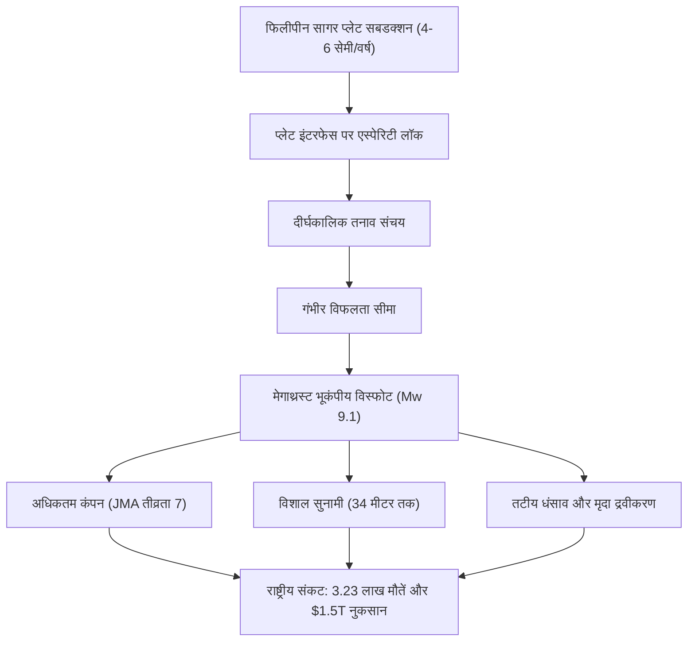

## प्रस्तावना: जापान का सबसे बड़ा अस्तित्वगत संकट
नानकाई ट्रफ (Nankai Trough) दक्षिण-पश्चिमी जापान के तट पर स्थित 700 से 800 किमी लंबी एक सबडक्शन खाई है। यहां फिलीपीन सागर प्लेट प्रति वर्ष 4 से 6 सेमी की दर से यूरेशियन प्लेट के नीचे धंस रही है। अगले 30 वर्षों में यहां 8 से 9 तीव्रता का महा-भूकंप आने की संभावना 70-80% है, जिससे 34 मीटर तक ऊंची सुनामी आ सकती है और 3,23,000 लोगों की जान जा सकती है।

## अध्याय 1: नानकाई ट्रफ का भूभौतिकी और प्लेट गतिकी
फॉल्ट घर्षण डायटरिच-रुइना नियम द्वारा नियंत्रित होता है। 10 से 30 किमी की गहराई पर स्थित लॉक क्षेत्र ऊर्जा संचित करते हैं। समुद्र तल पर जीएनएसएस-ध्वनिक (GNSS-A) सेंसर पुष्टि करते हैं कि दोनों प्लेटें 100% दृढ़ता से आपस में फंसी हुई हैं।

## अध्याय 2: 1,400 वर्षों का भूकंपीय इतिहास
प्राचीन रिकॉर्ड और सुनामी तलछट 100-150 वर्षों के आवधिक चक्र को दर्शाते हैं: 684 हाकुहो, 887 निन्ना, 1498 मेइओ, 1707 होएई (जिसने 49 दिनों बाद माउंट फ़ूजी में विस्फोट कराया), 1854 अनसेई और 1944/1946 शोवा भूकंप।

## अध्याय 3: भूकंप मॉडल और तबाही का अनुमान
Mw 9.1 का अधिकतम मॉडल 151 नगर पालिकाओं में अधिकतम तीव्रता 7, टोक्यो, नागोया और ओसाका में गगनचुंबी इमारतों का खतरनाक दोलन और 23.8 लाख इमारतों के विनाश का अनुमान लगाता है।

## अध्याय 4: 34 मीटर सुनामी की हाइड्रोडायनामिक्स
समुद्र तल के 20-30 मीटर ऊपर उठने से उत्पन्न सुनामी केवल 2 से 5 मिनट के भीतर तट पर पहुंचेगी, जो कोच्चि और वाकायामा में 34 मीटर की ऊंचाई तक पहुंच सकती है।

## अध्याय 5: द्वितीयक आपदाओं की श्रृंखला
रेतीली भूमि का द्रवीकरण, 7.5 लाख लकड़ी के घरों को भस्म करने वाली आग, रासायनिक कारखानों में विस्फोट और भूस्खलन।

## अध्याय 6: आवश्यक सेवाओं का पतन और आर्थिक संकट
3.4 करोड़ लोगों के लिए पानी की कमी, 2.7 करोड़ घरों में ब्लैकआउट और 220 ट्रिलियन येन ($1.5 ट्रिलियन) का भारी आर्थिक झटका।

## अध्याय 7: आपातकालीन पूर्व चेतावनी प्रणाली
यदि M8+ तीव्रता का कोई आंशिक भूकंप आता है, तो तटीय क्षेत्रों के लिए एक सप्ताह की अनिवार्य निकासी चेतावनी जारी की जाती है।

## अध्याय 8: महासागरीय सेंसर नेटवर्क (DONET) और फुगाकू सुपरकंप्यूटर
समुद्र तल के ऑप्टिकल फाइबर नेटवर्क सुनामी का 20 मिनट पहले पता लगाते हैं और सुपरकंप्यूटर फुगाकू वास्तविक समय में बाढ़ का 3D सिमुलेशन करता है।

## अध्याय 9: 14 दिनों की व्यक्तिगत उत्तरजीविता योजना
भूकंप-रोधी ग्रेड 3 आवास, स्वचालित सर्किट ब्रेकर, 14 दिनों के लिए प्रति व्यक्ति 3 लीटर/दिन पानी, 70 आपातकालीन शौचालय किट और स्टारलिंक उपग्रह संचार।

## अध्याय 10: पुनर्निर्माण और भविष्य की तैयारी
पूर्व-आपदा शहरी योजना और राष्ट्रीय बुनियादी ढांचे की सुरक्षा।
