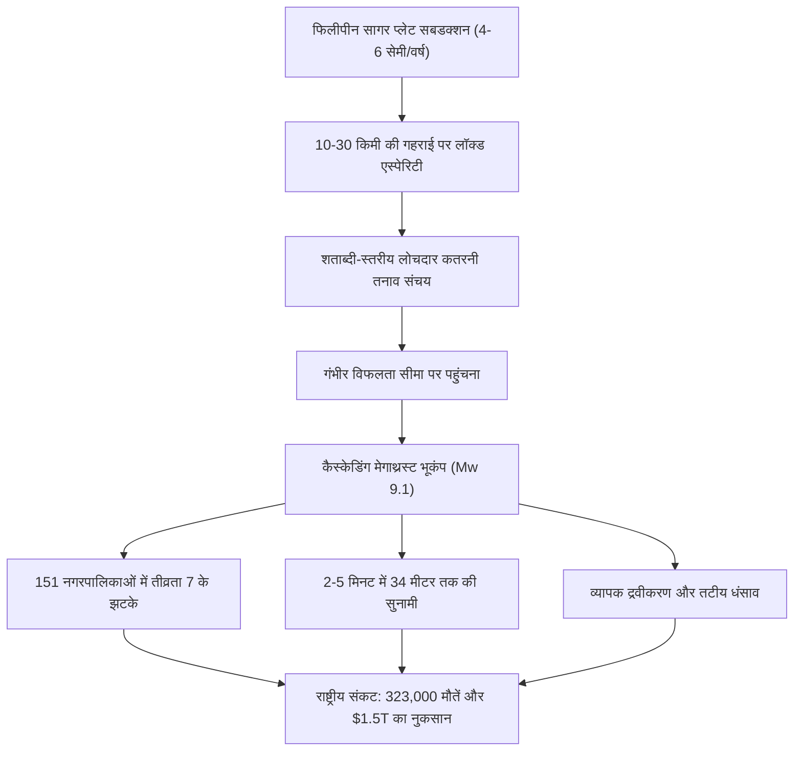

## प्रस्तावना: जापान का सबसे बड़ा अस्तित्व संकट

दक्षिण-पश्चिम जापान के प्रशांत तट के नीचे, सुरुगा खाड़ी से ह्युगा-नाडा सागर तक 700 से 800 किलोमीटर तक फैली हुई है **नानकाई ट्रफ (Nankai Trough)**। इस सबडक्शन ज़ोन में फिलीपीन सागर प्लेट प्रति वर्ष 4.0 से 6.5 सेमी की गति से यूरेशियन प्लेट के नीचे धंस रही है।

1,400 वर्षों के दर्ज इतिहास में यहां हर 100 से 150 वर्ष में 8 से 9 तीव्रता के महाविनाशकारी भूकंप आए हैं। 1944 (शोवा-तोनानकाई) और 1946 (शोवा-नानकाई) के बाद लगभग 80 वर्ष बीत चुके हैं। अगले 30 वर्षों में भूकंप की संभावना **70% से 80%** और 40 वर्षों में लगभग **90%** है।

जापान सरकार के आधिकारिक मॉडल (Mw 9.1) के अनुसार:
- 10 प्रान्तों के 151 नगर पालिकाओं में अधिकतम तीव्रता 7 (JMA पैमाना)।
- 2 से 5 मिनट में तट तक पहुँचने वाली **34 मीटर ऊंची सुनामी**।
- **323,000 मौतें**, 623,000 गंभीर रूप से घायल और 23.8 लाख इमारतें नष्ट।
- **220 ट्रिलियन येन (~$1.5 ट्रिलियन)** से अधिक का आर्थिक नुकसान।

---

## 1. नानकाई ट्रफ का भूभौतिकी और प्लेट गतिकी

भूकंपीय क्षेत्र गति-और-स्थिति निर्भर घर्षण नियम द्वारा नियंत्रित होता है:
$$\tau = \sigma_n \left[ \mu_0 + a \ln\left(\frac{V}{V_0}\right) + b \ln\left(\frac{V_0 \theta}{L}\right) \right]$$
10 से 30 किमी की गहराई में वेग-कमजोरी ($a - b < 0$) शासन करता है, जिससे अत्यधिक तनाव जमा होता है। GNSS-A ध्वनिक निगरानी 100% लॉकिंग की पुष्टि करती है।

---

## 2. 1,400 वर्षों का ऐतिहासिक भूकंप चक्र

- **684 (हाकुहो, M8.4)**: *निहोन शोकी* में सबसे पुराना दर्ज भूकंप, तोसा में 12 वर्ग किमी भूमि समुद्र में समा गई।
- **1707 (होई भूकंप, M8.6-8.7)**: सभी खंड एक साथ टूटे; 20,000 से अधिक मौतें; **49 दिनों बाद माउंट फ़ूजी का विस्फोट शुरू हुआ**।
- **1854 (अनसी तोकाई और नानकाई, M8.4)**: 32 घंटे के अंतराल पर दो बड़े भूकंप।
- **तोकाई खंड**: 1854 के बाद से **170 से अधिक वर्षों से बिना टूटे** लॉक है।

---

## 3. नुकसान और हताहतों का आकलन

- Mw 9.1 मॉडल: टोक्यो, नागोया और ओसाका के गगनचुंबी भवनों में 2 से 3 मीटर का दोलन।
- **323,000 मौतें** (71% सुनामी, 25% मलबे में दबने से, 4% आग से)।
- विस्थापित: 95 लाख तक शरणार्थी।

---

## 4. 34 मीटर सुनामी की हाइड्रोडायनामिक्स

- उथले ट्रफ में 20 से 30 मीटर का विस्थापन पानी के अरबों क्यूबिक मीटर को ऊपर उठाता है।
- कुरोशियो-चो (कोच्चि) में पानी का चढ़ाव **34.4 मीटर** तक पहुंचेगा।
- **पहली लहर 2 से 5 मिनट में**: बिना देरी किए तुरंत ऊंचे स्थानों पर पैदल भागना अनिवार्य।

---

## 5. बहु-आपदा श्रृंखला

- टोक्यो और ओसाका की पुनः प्राप्त भूमि पर व्यापक द्रवीकरण।
- घनी लकड़ी की बस्तियों में भीषण चक्रवाती आग (750,000 घर जलेंगे)।
- पेट्रोकेमिकल रिफाइनरियों में विस्फोट और जहरीली गैस का फैलाव।
- माउंट फ़ूजी के **ज्वालामुखीय विस्फोट का वास्तविक खतरा**।

---

## 6. जीवन रेखाओं का टूटना और $1.5T की आर्थिक क्षति

- **2.71 करोड़ घरों में ब्लैकआउट**, **3.44 करोड़ लोग बिना पानी के**।
- तोकाइदो बुलेट ट्रेन और हाईवे कटने से जापान दो हिस्सों में बंट जाएगा।
- वैश्विक ऑटोमोबाइल और चिप आपूर्ति श्रृंखला ठप।
- 220 ट्रिलियन येन का नुकसान (2011 की तबाही से 13 गुना अधिक)।

---

## 7. नानकाई ट्रफ असाधारण सूचना (सलाहकार प्रणाली)

- **मेगाथ्रस्ट चेतावनी (आधा टूटना M8+)**: तटीय निवासियों के लिए 1 सप्ताह की अनिवार्य पूर्व-निकासी।
- **मेगाथ्रस्ट सलाह (M7+ या स्लो स्लिप)**: उच्च सतर्कता और आपातकालीन किट की जांच।
- अगस्त 2024 में ह्युगा-नाडा (M7.1) के बाद पहली बार सफलतापूर्वक लागू किया गया।

---

## 8. समुद्र तल वेधशालाएं (DONET) और सुपरकंप्यूटर फुगाकू

समुद्र तल के सेंसर 20 मिनट पहले सुनामी का पता लगाते हैं। सुपरकंप्यूटर फुगाकू 3 मिनट से भी कम समय में 3D बाढ़ सिमुलेशन की गणना करता है।

---

## 9. 14-दिवसीय पूर्ण उत्तरजीविता मैनुअल

- भूकंप-प्रतिरोधी ग्रेड 3 आवास और स्वचालित भूकंपीय बिजली कट-ऑफ स्विच (>250 गैल)।
- 4 लोगों के परिवार के लिए 14 दिन की आपूर्ति: **168 लीटर पीने का पानी**, **112,000 किलोकैलोरी भोजन**, **280 रासायनिक शौचालय बैग**, 2,000 Wh सोलर पावर स्टेशन।
- स्वच्छता प्रोटोकॉल: टॉयलेट फ्लश न करें; बीमारी से बचने के लिए BOS गंध-अवरोधक बैग का उपयोग करें।

---

## 10. आपदा-पूर्व पुनर्निर्माण योजना (PDRP)

आपदा से पहले कानूनी और शहरी नियोजन रूपरेखा तैयार करना ताकि तबाही के बाद तेजी से पुनर्निर्माण हो सके।

---

## निष्कर्ष: विज्ञान की ढाल

नानकाई भूकंप एक भूवैज्ञानिक अनिवार्यता है। वैज्ञानिक समझ और सक्रिय तैयारी ही हमारे जीवन और समाज की रक्षा कर सकती है।
