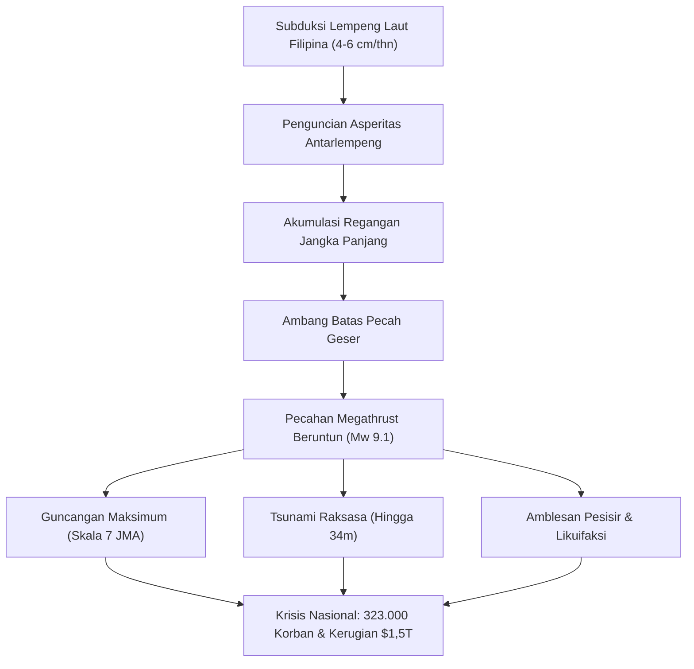

## Pendahuluan: Ancaman Eksistensial Terbesar bagi Jepang
Palung Nankai (Nankai Trough) adalah zona subduksi sepanjang 700 hingga 800 km di lepas pantai barat daya Jepang. Lempeng Laut Filipina menunjam di bawah Lempeng Eurasia sebesar 4 hingga 6 cm per tahun. Dengan probabilitas 70-80% dalam 30 tahun mendatang, gempa megathrust M8-9 diprediksi memicu tsunami setinggi 34 meter, 323.000 korban jiwa, dan kerugian ekonomi hingga 220 triliun yen ($1,5 triliun).

## Bab 1: Geofisika dan Tektonik Palung Nankai
Sifat gesekan sesar diatur oleh hukum gesekan Dieterich-Ruina. Asperitas yang terkunci menyimpan energi elastis, sedangkan zona transisi menghasilkan gempa lambat (SSE). Pengukuran akustik bawah laut (GNSS-A) mengonfirmasi penguncian lempeng hampir 100%.

## Bab 2: Paleoseismologi dan Riwayat Sejarah 1.400 Tahun
Catatan sejarah mencatat siklus gempa setiap 100-150 tahun: Gempa Hakuho (684), Ninna (887), Meio (1498), Hoei (1707, memicu letusan Gunung Fuji 49 hari kemudian), Ansei (1854), dan Showa (1944/1946).

## Bab 3: Model Patahan dan Proyeksi Kerusakan
Model Mw 9.1 memproyeksikan intensitas seismik JMA 7 di 151 wilayah, osilasi resonansi gedung tinggi di Tokyo, Nagoya, dan Osaka, serta hancurnya 2,38 juta bangunan.

## Bab 4: Hidrodinamika Tsunami 34 Meter
Pergeseran vertikal dasar laut 20-30 meter menghasilkan tsunami yang mencapai garis pantai Shizuoka, Mie, Wakayama, dan Kochi dalam 2 hingga 5 menit, dengan tinggi gelombang mencapai 34 meter di teluk sempit.

## Bab 5: Bencana Sekunder Berlapis
Likuifaksi tanah skala luas, kebakaran perkotaan yang melalap 750.000 rumah kayu, kebakaran kilang minyak, dan tanah longsor di daerah pegunungan.

## Bab 6: Kelumpuhan Infrastruktur dan Kerugian 220 Triliun Yen
34 juta orang kehilangan pasokan air bersih, 27 juta rumah padam listrik, serta terputusnya jalur transportasi vital Tokaido.

## Bab 7: Sistem Informasi Darurat Palung Nankai
Protokol darurat yang mewajibkan evakuasi dini selama 1 minggu bagi masyarakat pesisir saat terjadi gempa pendahulu M8+.

## Bab 8: Sensor Bawah Laut (DONET, N-net) dan Superkomputer Fugaku
Jaringan kabel serat optik bawah laut memberikan peringatan dini tsunami lebih cepat, sementara superkomputer Fugaku menyimulasikan genangan kota secara 3D.

## Bab 9: Panduan Lengkap Bertahan Hidup Mandiri 14 Hari
Bangunan tahan gempa Grade 3, pemutus sirkuit gempa otomatis, cadangan air 3 liter/hari/orang, 70 set toilet portabel dengan kantong antibau (BOS), dan koneksi satelit Starlink.

## Bab 10: Rekonstruksi Prabencana dan Ketangguhan Nasional
Penataan tata ruang prabencana dan perlindungan rantai pasok demi masa depan bangsa.
