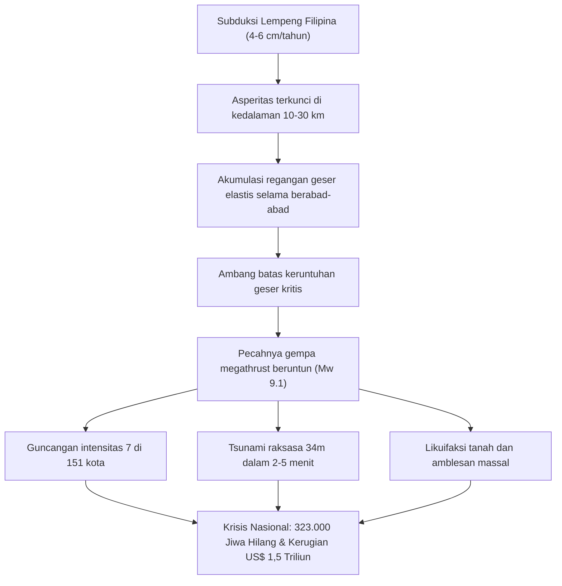

## Pendahuluan: Krisis Eksistensial Terbesar di Jepang

Membentang sepanjang 700 hingga 800 kilometer di lepas pantai Pasifik barat daya Jepang, dari Teluk Suruga hingga Laut Hyuga-nada, terbentang **Palung Nankai (Nankai Trough)**. Di batas lempeng konvergen ini, Lempeng Laut Filipina menunjam ke bawah Lempeng Eurasia dengan kecepatan 4 hingga 6,5 cm per tahun.

Catatan sejarah selama 1.400 tahun membuktikan terjadinya gempa megathrust berkekuatan M8 hingga M9 setiap 100 hingga 150 tahun. Hampir 80 tahun berlalu sejak gempa Showa-Tonankai (1944) dan Showa-Nankai (1946), probabilitas gempa besar dalam 30 tahun ke depan mencapai **70% hingga 80%**, dan sekitar **90% dalam 40 tahun**.

Skenario terburuk pemerintah Jepang untuk gempa berkekuatan Mw 9.1 memproyeksikan:
- Intensitas seismik maksimum 7 (skala JMA) di 151 kota di 10 prefektur.
- Tsunami dahsyat hingga setinggi **34 meter**, mencapai garis pantai dalam waktu 2 hingga 5 menit.
- Hingga **323.000 korban tewas dan hilang**, 623.000 luka berat, dan 2,38 juta bangunan hancur.
- Total kerugian ekonomi melampaui **220 triliun yen (~1,5 triliun USD)**.

---

## 1. Geofisika dan Tektonika Palung Nankai

Perilaku slip patahan dikendalikan oleh hukum gesekan bergantung kecepatan dan keadaan (rate-and-state friction):
$$\tau = \sigma_n \left[ \mu_0 + a \ln\left(\frac{V}{V_0}\right) + b \ln\left(\frac{V_0 \theta}{L}\right) \right]$$
Zona seismogenik (10–30 km) didominasi oleh rezim pelemahan kecepatan ($a - b < 0$), mengumpulkan tegangan hingga pecah secara instabil (stick-slip). Jaringan akustik bawah laut GNSS-A mengonfirmasi **tingkat penguncian 100%**.

---

## 2. Kronologi Paleoseismik 1.400 Tahun

- **684 (Hakuho, M8.4)**: Catatan tertua dalam *Nihon Shoki*, 12 km² daratan tenggelam di Tosa.
- **1707 (Gempa Hoei, M8.6-8.7)**: Seluruh segmen pecah bersamaan; 20.000 tewas; **memicu letusan Gunung Fuji 49 hari kemudian**.
- **1854 (Ansei Tokai & Nankai, M8.4)**: Pecah berurutan berselang 32 jam.
- **Segmen Tokai**: Belum pecah selama lebih dari **170 tahun**.

---

## 3. Estimasi Kerusakan dan Korban Manusia

- Model Mw 9.1: Gelombang gempa periode panjang (Kelas 4) mengguncang gedung pencakar langit di Tokyo, Nagoya, dan Osaka sejauh 2–3 meter.
- Korban: **323.000 tewas** (71% tsunami, 25% bangunan runtuh, 4% kebakaran).
- Pengungsi: hingga **9,5 juta orang**.

---

## 4. Hidrodinamika Tsunami 34 Meter

- Pergeseran dasar laut 20–30 meter mengangkat miliaran meter kubik air.
- Efek teluk rias: **34,4 meter di Kuroshio-cho** (Kochi).
- **Tiba dalam 2 hingga 5 menit**: Evakuasi segera tanpa menunggu air laut surut.
- Pertahanan berlapis: tanggul laut L1 dan menara evakuasi/relokasi bukit L2.

---

## 5. Bencana Sekunder Berlapis

1. Likuifaksi massal di lahan reklamasi teluk Tokyo, Ise, dan Osaka.
2. Badai api perkotaan yang menghanguskan 750.000 rumah kayu.
3. Ledakan kilang minyak pesisir dan kebocoran gas beracun.
4. Tanah longsor raksasa yang mengisolasi desa-desa di Kii dan Shikoku.
5. Risiko geofisika nyata **letusan Gunung Fuji**.

---

## 6. Kelumpuhan Infrastruktur dan Kerugian US$ 1,5 Triliun

- **27,1 juta rumah mati listrik**, **34,4 juta orang kehilangan air bersih**.
- Terputusnya jalur Tokaido membelah Jepang menjadi dua.
- Gangguan rantai pasok semikonduktor dan otomotif global.
- Kerugian 220 triliun yen (13 kali lipat gempa Tohoku 2011).

---

## 7. Sistem Informasi Luar Biasa Gempa Palung Nankai

- **Peringatan Megathrust (Separuh Pecah M8+)**: Evakuasi pra-bencana wajib selama 1 minggu di pesisir.
- **Nasihat Megathrust (M7+ atau slow slip)**: Kewaspadaan tinggi dan pemeriksaan kesiapan darurat.
- Diuji pertama kali pada Agustus 2024 pasca gempa Hyuga-nada (M7.1).

---

## 8. Jaringan Bawah Laut (DONET/N-net) dan Superkomputer Fugaku

Sensor serat optik bawah laut mendeteksi tsunami **hingga 20 menit lebih awal**. Superkomputer Fugaku memproses simulasi genangan 3D dalam waktu kurang dari 3 menit.

---

## 9. Panduan Bertahan Hidup Mandiri 14 Hari

- Bangunan Standar Gempa Tingkat 3 dan pemutus arus gempa otomatis (>250 gal).
- Pasokan 4 orang selama 14 hari: **168 L air minum**, **112.000 kkal ransum**, **280 set toilet darurat**, stasiun tenaga surya 2.000 Wh.
- Sanitasi: Jangan menyiram toilet rumah; gunakan kantong kedap bau antimikroba (BOS).

---

## 10. Perencanaan Rekonstruksi Pra-Bencana (PDRP)

Merancang zonasi dataran tinggi dan aspek hukum sebelum bencana untuk mempercepat pembangunan kembali.

---

## Kesimpulan: Perisai Ilmu Pengetahuan

Gempa Megathrust Nankai adalah keniscayaan geologis. Dengan pemahaman ilmiah dan kesiapsiagaan terencana, peradaban dapat bertahan dan bangkit lebih kuat.
