## はじめに：日本列島最大の危機「南海トラフ巨大地震」の本質

日本列島の南西沖、駿河湾から遠州灘、熊野灘、潮岬沖、室戸岬沖を経て日向灘に至る約700〜800キロメートルに及ぶ深海溝――「南海トラフ（Nankai Trough）」。ここは、海洋プレートであるフィリピン海プレートが、陸側のユーラシアプレート（西南日本弧）の下へと毎年数センチメートルの速度で着実に沈み込み続けている、地球上で最も活動的かつ危険なプレート境界沈み込み帯（Subduction Zone）である。

歴史の記録が証明するように、この海底の巨大断層は、概ね100年から150年の周期でマグニチュード8から9クラスの巨大地震を繰り返し発生させてきた。前回の発生である1944年の昭和東南海地震（M7.9）および1946年の昭和南海地震（M8.0）から、すでに80年近い歳月が経過している。現在、このプレート境界面には限界に近い剪断応力（歪みエネルギー）が蓄積されており、今後30年以内にマグニチュード8〜9クラスの地震が発生する確率は「70%〜80%」、さらに今後40年以内では「90%程度」という極めて切迫した科学的評価が下されている。

内閣府の中央防災会議および有識者検討会が策定した最新の科学的被害想定によれば、最悪のシナリオにおいて、最大震度7の極大激震が東海から九州にかけての広大な地域を襲い、発生からわずか数分で最大34メートルを超える巨大津波が太平洋沿岸を呑み込む。想定される死者・行方不明者は最大32万人を超え、全壊・焼失家屋は238万棟、経済的被害総額は日本の国家予算の2倍以上に匹敵する約220兆円という、まさに未曾有の国難的マルチハザード（複合破局災害）が予測されている。

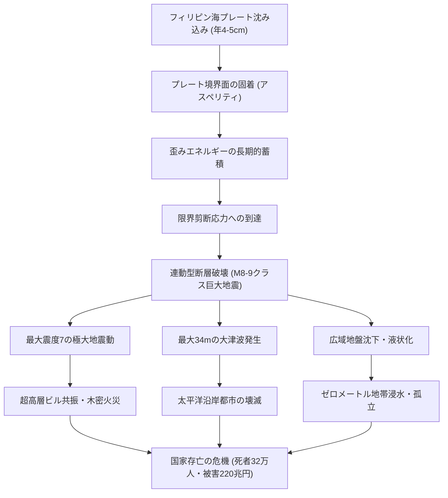

本稿は、単なる不安を煽る終末論でも、表面的な非常持出袋のチェックリストでもない。地球物理学・地震工学の最新知見に基づき、プレート境界面の摩擦力学、古地震学による1400年の活動履歴、リアルタイム海底観測網（DONET・S-net・GNSS-A）、南海トラフ地震臨時情報の運用実態、そして個人・家庭・自治体・企業が講ずべき科学的かつ実践的な生存戦略までを網羅した、極めて包括的な「南海トラフ地震の科学と防災白書」である。来るべき「その日」を生き残り、社会と未来を繋ぐための知性の羅針盤として本論を活用されたい。

## 第1章：南海トラフの地球物理学とプレート力学的メカニズム

### 1.1 沈み込み帯構造とフィリピン海プレートの動態
南海トラフ（Nankai Trough）は、本州・四国・九州の南岸に沿って延びる水深約4,000〜4,800メートルの海底凹地（トラフ）であり、プレートテクトニクス理論における古典的かつ極めて動的な収束型プレート境界（Convergent Boundary）である。

ここでは、太平洋の熱帯海域で形成された海洋プレートである「フィリピン海プレート（Philippine Sea Plate）」が、北西方向に年間約4.0〜6.5センチメートルの速度で運動し、陸側の「ユーラシアプレート（より正確にはアムールプレートまたは西南日本弧地塊）」の下方へと斜め沈み込み（Oblique Subduction）を行っている。

フィリピン海プレートの沈み込み角は一様ではない。トラフ軸近傍の浅部（深さ10km未満）では極めて緩やかな傾斜（数度から十数度）で進入し、深さ20〜30kmの seismogenic zone（地震発生帯）を経て、深さ40km以上のマントルウェッジへと徐々に傾斜を増しながら沈み込んでいく。このプレート境界の上盤（陸側）には、数百万年にわたる付加作用（Accretion）によって形成された巨大な付加体堆積物（四万十累層群などに代表される）が堆積しており、これが地震時の変形や津波発生に決定的な物理的影響を及ぼす。

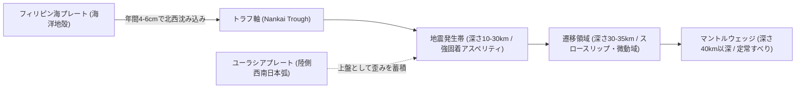

### 1.2 アスペリティ（強固着域）と遷移領域の摩擦特性
プレート境界における断層すべりの力学挙動は、境界を構成する岩石の摩擦特性によって規定される。現代の地震物理学では、Dieterich-Ruinaの「速度・状態依存摩擦構成則（Rate- and State-Dependent Friction Law）」を用いてプレート境界面の固着・すべり挙動が記述される。

摩擦係数 $\mu$ は、すべり速度 $V$ および接触面の状態変数 $	heta$ に依存し、以下の基本方程式で表される：

$$	au = \sigma_n \left[ \mu_0 + a \ln\left(rac{V}{V_0}
ight) + b \ln\left(rac{V_0 	heta}{L}
ight) 
ight]$$

ここで、$	au$ は剪断応力、$\sigma_n$ は有効垂直応力、$a$ および $b$ は無次元の摩擦パラメータ、$L$ は特性すべり距離である。この構成則において、$(a - b)$ の符号が境界の力学的性質を決定づける：

1. **速度弱化領域（Rate-Weakening: $a - b < 0$）＝「アスペリティ（強固着域）」**
   すべり速度の増加に伴って摩擦強度が低下するため、一度すべりが始まると不安定破壊（動的破壊）へと急速に遷移する。南海トラフの深さ約10kmから30kmの領域がこれに該当し、通常時は強固に固着して歪みを蓄積し、限界剪断応力に達した瞬間に数メートルから数十メートルの巨大すべりを起こして巨大地震（M8〜9）のエネルギーを解放する。
2. **速度強化領域（Rate-Strengthening: $a - b > 0$）＝「安定すべり域」**
   すべり速度の増加に伴い摩擦強度が増大するため、破壊が自発的に暴走せず、定常的または非地震性のすべり（クリープ）として歪みを逃がす。トラフ軸直下の極浅部や、深さ35km以深の高温高圧領域がこれに相当する。
3. **遷移領域（Transition Zone）**
   速度弱化と速度強化の力学的境界に位置し、通常時は固着しているものの、流体圧の上昇や微小な応力変動によって「スロースリップ」や「低周波微動」を間欠的に発生させる。

| 領域区分 | 深さ範囲 | 摩擦パラメータ | 力学的挙動 | 発生する現象 |
| :--- | :--- | :--- | :--- | :--- |
| **極浅部（トラフ近傍）** | 0 〜 10 km | $a - b > 0$ (一部弱化) | 低摩擦・高間隙水圧 | 津波地震・超低周波地震 |
| **地震発生帯（強固着域）** | 10 〜 30 km | $a - b < 0$ (速度弱化) | 強固着・高剪断応力蓄積 | M8〜9クラス巨大地震破壊 |
| **深部遷移領域** | 30 〜 35 km | $a - b pprox 0$ | 温度依存性遷移・流体移動 | 深部低周波微動・短期的SSE |
| **深部延性領域** | 35 km 以深 | $a - b > 0$ (速度強化) | 塑性流動・定常クリープ | 非地震性定常すべり |

### 1.3 スロースリップイベント（SSE）と深部低周波微動の力学
近年、高感度地震観測網（Hi-net）や傾斜計、GNSS連続観測網の整備により、通常の地震波（P波・S波）をほとんど放射せずに、数日から数ヶ月かけてゆっくりとすべり運動を行う「スロー地震（Slow Earthquake）」の存在が明らかになった。

南海トラフにおいては、地震発生帯の深部延長（深さ約30〜35km）において、以下のスロー地震ファミリーが連動して発生している：
- **深部低周波微動（Deep Low-Frequency Tremor）**: 1〜8Hzの低い周波数帯に卓越する連続的な微弱振動。プレート境界に存在する高圧間隙流体が関与していると考えられている。
- **短期的スロースリップ（Short-term SSE）**: 数日から1週間程度かけて数ミリメートルから数センチメートルすべる現象。深部低周波微動と時空間的に同期して発生することが確認されている（ETS: Episodic Tremor and Slip）。
- **長期的スロースリップ（Long-term SSE）**: 浜名湖周辺（東海地方）や豊後水道下などで数ヶ月から数年にわたり観測される大規模な緩慢すべり。モーメントマグニチュード（Mw）換算で6.5〜7.0前後に達することもある。

これらのスロースリップは、プレート沈み込みによって蓄積された歪みの一部を非破壊的に解放する側面を持つ一方で、**「すべりを生じた領域の周囲（特に直上に位置する強固着アスペリティ）に応力を再配分し、巨大地震のトリガーとなり得る」**という極めて重要な地球物理学的意味を有している。

### 1.4 海底地殻変動観測（GNSS-A）が暴く歪み蓄積の真実
従来の陸上GNSS観測（GEONET）だけでは、陸から数十キロメートル以上離れた南海トラフ軸近傍の海底で何が起きているかを正確に把握することは不可能であった。この科学的盲点を克服したのが、海上保安庁および大学研究機関が実用化した「GNSS-音響測距結合方式（GNSS-Acoustic Combination Technique: GNSS-A）」である。

GNSS-Aは、海上の測量船や自律型無人航走船（ASV）の正確な位置をGNSSで測定し、そこから海底に設置された複数の精密音響トランスポンダとの間で音波を送受信して距離を測定することで、深海底の地殻変動をミリメートル単位の精度で捉える技術である。

このGNSS-A観測によって得られた最新の知見は、防災学界に大きな衝撃を与えた：
1. **南海トラフ全域にわたる極めて高い固着率（Interplate Coupling Rate）**
   遠州灘から潮岬沖、室戸岬沖、日向灘に至る広大な海底において、プレート沈み込み速度（年間数cm）とほぼ同等の速度で陸側プレートが引きずり込まれており、境界面の固着率が100%近い「完全固着」状態にあることが定量的に証明された。
2. **強い固着域の空間的不均質性（パッチ構造）**
   固着は均一ではなく、熊野灘沖や室戸岬沖に特に強固な固着パッチ（将来の巨大アスペリティ候補）が存在し、その周辺で局所的な歪み勾配が急激に高まっていることが判明した。
3. **時間的変動の検出**
   日向灘沖や紀伊水道沖において、定常的な固着だけでなく、時折固着が部分的に緩む現象や、隣接領域への応力集中がリアルタイムで捕捉されつつある。

### 1.5 破壊伝播シミュレーションと連動の物理
南海トラフで発生する地震の最大の特徴は、単一の震源断層にとどまらず、複数のセグメント（東海、東南海、南海、日向灘）が相互に力学的に干渉し合い、時間差あるいは同時に連動して破壊する「連動型巨大地震」の挙動を示す点にある。

破壊力学シミュレーションによれば、破壊伝播は以下の物理プロセスを辿る：
1. **初期核形成（Nucleation）**: アスペリティの端部において微小破壊が累積し、臨界亀裂長 $L_c$ を超えた段階で動的破壊へ移行する。
2. **動的破壊伝播（Dynamic Rupture Propagation）**: 破壊フロントは秒速約2.5〜3.0km（S波速度の約80%）の超高速で断層面を疾走する。
3. **セグメント境界の乗り越え**: セグメント境界（例：紀伊半島潮岬沖の構造境界）に未破壊領域や幾何学的屈曲が存在しても、進入する動的応力波（Dynamic Stress Transfer）が静的応力降下量を上回る場合、障壁（Barrier）を突き破って隣接セグメントの破壊を連続的に誘発する（全領域同時連動）。
4. **浅部分岐断層（splay fault）への破壊波及**: プレート境界本震断層の破壊が、トラフ軸近くで分岐して海底面へと抜ける巨大な分岐断層（スプレイスラスト）へと駆け上がることにより、海底面が鉛直方向に10メートル以上も急激に押し上げられ、未曾有の大津波を発生させる。

## 第2章：古地震学と歴史文書が語る南海トラフの周期性

### 2.1 1400年間の古地震記録と発生履歴の全体系
南海トラフは、世界で最も長く、かつ正確な歴史記録と古地震学的調査が残されている沈み込み帯である。西暦684年の白鳳地震から1946年の昭和南海地震に至るまで、約1400年間にわたりマグニチュード8クラスの巨大地震が概ね100年から150年の間隔で反復発生してきた事実が、日本書紀をはじめとする膨大な古文書、寺社記録、そして地質学的痕跡（津波堆積物や海岸段丘）によって裏付けられている。

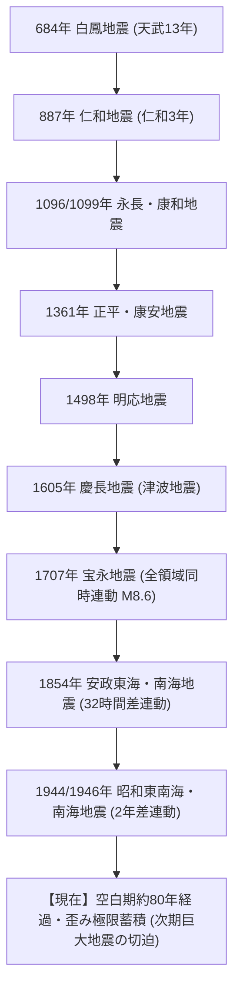

歴史地震の発生記録を時系列で整理すると、以下の極めて重要な事実が浮き彫りになる：

| 発生年（和暦） | 地震名称 | 推定規模 (M) | 連動パターン | 主な被害・歴史的記録 |
| :--- | :--- | :--- | :--- | :--- |
| **684年（天武13年）** | 白鳳地震 | M8.4 | 全領域連動？ | 『日本書紀』に記録。高知平野で約12km²が海没、山崩れ、諸国津波。日本最古の確実な南海トラフ記録。 |
| **887年（仁和3年）** | 仁和地震 | M8.6 | 全領域連動 | 『日本三代実録』に記録。京都で官舎倒壊・圧死者多数。余震が1ヶ月続く。五畿七道諸国で津波被害。 |
| **1096年（嘉保3年）** | 永長地震 | M8.0〜8.5 | 東海・東南海 | 『中右記』『後二条師通記』に記録。東大寺の巨鐘落下、伊勢湾沿岸津波。 |
| **1099年（承徳3年）** | 康和地震 | M8.0〜8.3 | 南海 | 永長地震の約2年2ヶ月後に発生。土佐で寺社倒壊・津波、田畑海没の記録。 |
| **1361年（正平16年/康安元年）** | 正平（康安）地震 | M8.2〜8.5 | 全域または時間差 | 『太平記』『愚管抄』に記述。四国沿岸、摂津（大阪）港湾に津波襲来。湯の峰温泉の湧出停止。 |
| **1498年（明応7年）** | 明応地震 | M8.4〜8.6 | 東海・東南海・南海 | 浜名湖が海と繋がり今切口が形成。鎌倉大仏殿が津波で流失（諸説あり）。志摩半島で死者数千人。 |
| **1605年（慶長9年）** | 慶長地震 | M7.9〜8.0 | 津波地震 | 揺れが極めて小さかったにもかかわらず巨大津波が発生。房総から九州に至る太平洋岸で死者数千〜1万人超。 |
| **1707年（宝永4年）** | 宝永地震 | M8.6〜8.7 | 全領域完全同時連動 | 駿河湾から九州東岸までが一体破壊。東海道全滅、死者2万人以上。49日後に富士山宝永大噴火を誘発。 |
| **1854年（嘉永7年）** | 安政東海地震 | M8.4 | 東海・東南海 | 12月23日発生。下田でロシア船ディアナ号遭難。津波が太平洋岸全域を直撃。 |
| **1854年（嘉永7年）** | 安政南海地震 | M8.4 | 南海（32時間差） | 翌12月24日発生。「稲むらの火」（濱口梧陵）の舞台。高知・徳島・和歌山で壊滅的津波。 |
| **1944年（昭和19年）** | 昭和東南海地震 | M7.9 | 東南海（単独） | 太平洋戦争末期。軍需工場地帯が直撃を受けるも軍機保護法で報道管制。死者1,223人。 |
| **1946年（昭和21年）** | 昭和南海地震 | M8.0 | 南海（2年差） | 終戦直後の混乱期に発生。四国太平洋岸を中心に死者1,330人、全壊11,591棟。 |

### 2.2 古文書解読と地質学的津波堆積物の照合
歴史地震の研究は、近年、歴史学（古文書の精緻な解読）と地球科学（津波堆積物や年輪年代測定、放射性炭素年代測定）が融合した「古地震学（Paleoseismology）」によって飛躍的な進化を遂げた。

高知県土佐市蟹ヶ池（かにがいけ）の堆積物コア試料分析では、過去数千年間にわたる津波堆積物の砂層が何層も発見されており、歴史記録にない先史時代の超巨大津波イベントの存在が確認されている。同様に、静岡県浜名湖周辺、三重県熊野市、徳島県沿岸、大分県佐伯市などの湖沼や低地における地質調査により、歴史文書の記述が極めて正確な物理的事実を反映していることが立証された。

特に、寺院の過去帳、代官所の日記、庄屋の手記に記された「潮の引き方」「津波の到達高さ」「井戸水の濁り」「地鳴りや余震の回数」などの記述は、現代の津波流体シミュレーションや断層インバージョン解析における決定的な拘束条件（Boundary Conditions）として機能している。

### 2.3 宝永型（同時連動）・安政型（時間差連動）・昭和型（部分連動）のメカニズム比較
歴史記録の分析から判明した最も重要な知見は、**「南海トラフ地震は毎回同じ形で起こるわけではない」**という事実である。その多様性は主に以下の3つの典型パターンに大別される：

1. **宝永型（全領域同時連動型・超巨大地震）**
   1707年宝永地震に代表される形態。駿河湾から日向灘に至る約700kmの全断層セグメントが、数分から数十分の間に一挙に破壊される。地震規模はM8.6〜8.7（近年の見直しではMw8.7〜9.0）に達し、揺れと津波の双方が広域にわたり極大化する最悪シナリオである。
2. **安政型（時間差連動型）**
   1854年安政地震に代表される形態。まず東側の東海・東南海セグメントが破壊（安政東海地震）し、その**「32時間後」**に応力変化を受けた西側の南海セグメントが連動破壊（安政南海地震）した。最初の本震で被災し救助・避難活動を行っている最中に、2回目の巨大本震と大津波が襲来するという極めて過酷な連鎖災害をもたらす。
3. **昭和型（部分連動・割れ残り型）**
   1944年昭和東南海地震（M7.9）が発生し、その2年後の1946年に昭和南海地震（M8.0）が発生した形態。この時、最も東端に位置する「駿河湾地域（東海地震の想定震源域）」は破壊されずに**「割れ残り（Unruptured Segment）」**となった。

現在懸念されているのは、昭和の地震から約80年が経過して東南海・南海セグメントの歪みが再蓄積しているだけでなく、1854年の安政東海地震以来**「170年間以上も破壊されていない駿河湾アスペリティ」**が存在している点である。このため、次期地震が宝永型のような全領域同時連動、あるいは未曾有の超巨大地震（M9クラス）へと発展する力学的蓋然性が極めて高いと評価されている。

### 2.4 発生周期の数理モデル（100〜150年周期の統計学的罠）
一般に「南海トラフ地震の周期は100〜150年」と語られることが多いが、地球物理学的・統計学的にこの数値を盲信することには大きな危険が伴う。

地震発生間隔を記述するモデルには、主に以下の2つが存在する：
- **時間予測可能モデル（Time-Predictable Model: Shimazaki & Nakata, 1980）**
  断層の応力蓄積率が一定であると仮定し、「直前の地震によるすべり量（変位量）が大きいほど、次回の地震までの再蓄積時間（インターバル）が長くなる」とするモデル。
- **滑り予測可能モデル（Slip-Predictable Model）**
  蓄積された時間に応じて、次に起こる地震のすべり量が決まるとするモデル。

高知大学や産業技術総合研究所などの研究グループによる海岸段丘（室戸岬の隆起量など）の再検証によれば、南海トラフにおける地震サイクルは単純な線形モデルに従っていない。宝永地震のような超巨大破壊の後には比較的長い間隔（安政まで147年）が存在したが、安政から昭和まではわずか90年しか経過していなかった。

さらに、地震発生確率の計算に用いられる「BPT分布（Brownian Passage Time distribution）」や「ワイブル分布」は、過去の限られたサンプル数（確定的なものは数回から十数回）に基づく確率モデルに過ぎず、断層面上の局所的な流体圧変動やアスペリティ間の非線形相互作用といった決定論的カオス挙動を完全には包含していない。したがって、「前回の昭和地震からまだ80年だからあと数十年は大丈夫」という解釈は科学的根拠を欠いており、**「明日発生しても物理学的に何ら矛盾しない臨界状態にある」**と捉えることが防災上不可欠である。

## 第3章：最新の震源モデルと最大級被害想定（内閣府・有識者検討会詳細）

### 3.1 M9.1クラス巨大断層モデルと震度7エリアの詳細分析
東日本大震災（2011年東北地方太平洋沖地震、Mw9.0）の発生を受け、内閣府「南海トラフの巨大地震モデル検討会」は、従来の想定を根本から見直し、「科学的に考え得る最大級（あらゆる可能性を考慮した最大クラス）」の震源断層モデルを策定した。

この最大想定モデルは、静岡県の富士川河口付近から宮崎県の日向灘南部、さらには種子島南東沖に至る長さ約750km、幅約200km、面積約15万km²におよぶ超巨大断層面を設定している。想定モーメントマグニチュードは**Mw9.1（エネルギー換算で阪神・淡路大震災の約1000倍）**である。

このモデルに基づく強震動シミュレーションでは、極めて広大な範囲で壊滅的な揺れが予測されている：
- **震度7（計測震度6.5以上：人間が立っていることが不可能、耐震性の低い木造家屋は即座に倒壊、RC構造物にも致命的破壊）**
  静岡県、愛知県、三重県、和歌山県、徳島県、高知県、宮崎県の**7県151市町村**に及ぶ。
- **震度6強（計測震度6.0〜6.4：這わないと動けない、固定していない家具のほとんどが移動・転倒、壁の亀裂やブロック塀倒壊が頻発）**
  上記7県に加え、東京都（島嶼部含む）、神奈川県、山梨県、長野県、岐阜県、滋賀県、京都府、大阪府、兵庫県、奈良県、香川県、愛媛県、大分県、熊本県、鹿児島県の**21都府県**に広がる。

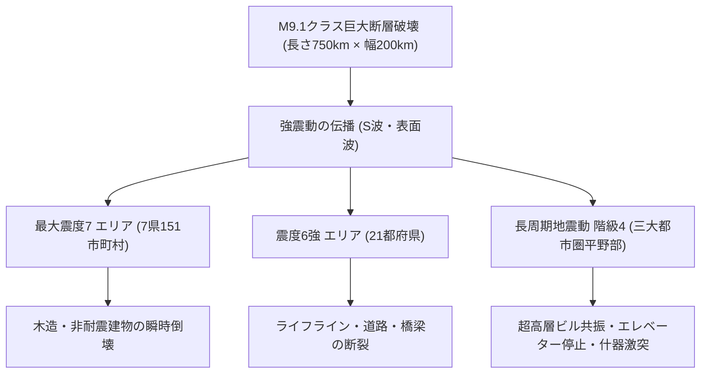

### 3.2 長周期地震動（階級4）と超高層建築・石油タンクのスロッシング
南海トラフ巨大地震において、震源から遠く離れた大都市圏（東京・名古屋・大阪）を直撃するのが「長周期地震動（Long-Period Ground Motion）」である。

プレート境界の巨大破壊に伴い、周期数秒から十数秒の周期の長い地震波（主にレイリー波・ラブ波などの表面波）が大量に励起される。この長周期波が、関東平野、濃尾平野、大阪平野といった深い堆積盆地（厚い堆積層を持つ地質構造）に進入すると、地下構造とのインピーダンス比の違いによって波が盆地内にトラップされ、多重反射を起こして振幅が増幅され、揺れが数分から十数分間にわたって継続する。

気象庁が定義する「長周期地震動階級」の最高ランクである**「階級4（人が立っていることができず、這わないと動けない。キャスター付き什器が大きく暴走・転倒し、間仕切壁の変形や天井脱落が発生）」**が、以下の領域の超高層建築物（タワーマンション、オフィスビル）の上層階を直撃する：
1. **超高層建築物の共振現象**
   高さ100m〜300mクラスの超高層ビルは、固有周期が2秒〜5秒前後に一致するため、長周期地震動と完全に共振する。頂部では片振幅で1メートル以上、往復で2〜3メートルもの周期的な水平揺れが10分以上続き、免震構造であっても免震ダンパーが許容限界（変位ストローク限界）に達して擁壁に衝突するリスク（クリアランス衝突）が指摘されている。
2. **石油コンビナートの液体スロッシング（Sloshing）**
   東京湾岸、伊勢湾岸、大阪湾岸に密集する数万キロリットル級の大型原油・石油タンク内の液体が、周期5秒〜10秒の長周期波と共振して波立ち、屋根板（浮き屋根）を突き破って溢流・摩擦火花による大火災を誘発する（2003年十勝沖地震で苫小牧のタンク火災が発生した物理現象が、首都圏・中京圏・近畿圏で同時多発する）。

### 3.3 死者最大32.3万人・物的被害238万棟の人的・物的損壊メカニズム
内閣府被害想定有識者検討会が公表した基本推計データは、極めて凄惨な数値を明示している。最悪の季節・時間帯（「冬の深夜・風速8m/s」または「冬の夕方・風速8m/s」）における被害予測の内訳は以下の通りである：

| 被害項目 | 最大被害想定値 | 主な発生要因・内訳 |
| :--- | :--- | :--- |
| **死者・行方不明者数** | **最大 323,000人** | 津波死：約230,000人（約71%） 建物倒壊死：約82,000人（約25%） 火災死：約10,000人（約4%） |
| **重傷者数** | **約 623,000人** | 家屋倒壊による圧迫・挟まれ、津波漂流物衝突、高所落下 |
| **建物全壊・焼失棟数** | **最大 2,386,000棟** | 揺れによる全壊：約1,340,000棟 津波による流失・全壊：約160,000棟 火災による焼失：約750,000棟 |
| **要救助者数** | **約 340,000人** | 倒壊家屋・土砂崩れ・孤立地域に取り残される生存者 |
| **避難所避難者数** | **最大 9,500,000人** | 発災1週間後の指定避難所・車中・親戚宅避難者の合計 |

死因の7割以上を占めるのは「大津波による水死」であり、次いで「建物の倒壊に伴う圧死・窒息死」である。特に昭和56年（1981年）以前の旧耐震基準で建築された木造住宅密集地域における瞬時倒壊が、救助困難な多数の圧死者を生み出す主因となっている。

### 3.4 三大都市圏（東京・名古屋・大阪）の地盤増幅特性と直下激震
南海トラフ巨大地震は、太平洋沿岸の過疎地や港湾部だけの問題ではない。日本の人口・経済中枢である三大都市圏が、それぞれ特有の地盤脆弱性によって激甚な被害を受ける。

- **中京圏（愛知県・三重県）の危機**
  濃尾平野は木曽三川（木曽川・長良川・揖斐川）の沖積作用によって形成された極めて軟弱なシルト・粘土層が厚く堆積している。震源域が直近の遠州灘・三河湾・熊野灘に位置するため、直下型地震に匹敵する加速度（PGA > 1000 gal）に襲われる。名古屋市南部から伊勢湾岸にかけての海抜ゼロメートル地帯は、堤防沈下と液状化によって長期間の水没を余儀なくされる。
- **近畿圏（大阪府・兵庫県）の危機**
  大阪平野は上町断層帯を挟んで東大阪・西大阪に深い堆積層が広がる。紀伊半島沖からの地震動が大阪湾岸の埋立地（夢洲・咲洲など）を直撃し、大規模な液状化が発生。淀川・大和川河口部のゼロメートル地帯堤防が決壊した場合、大阪市中心部（梅田・難波を含む低地部）への浸水被害が拡大する。
- **首都圏（東京都・神奈川県・千葉県・埼玉県）の危機**
  震源から約150〜300km離れているものの、関東造盆地運動によって形成された関東堆積盆地の深さは最大3,000〜4,000mに達する。長周期地震動の増幅率が全国で最も高くなり、超高層ビル群の長周期共振、東京湾埋立地の大規模液状化、鉄道網全線麻痺による500万人超の帰宅困難者が発生する。

## 第4章：大津波の発生メカニズムと沿岸壊滅シミュレーション

### 4.1 トラフ軸近傍浅部すべりと最大波高34mの発生要因
南海トラフ巨大地震における津波の破壊力を決定づける物理的メカニズムは、プレート境界浅部（トラフ軸近傍、水深3,000〜4,000m）における「超巨大すべり（Large Shallow Slip）」である。

2011年東北地方太平洋沖地震では、日本海溝軸付近のプレート境界浅部が50メートル以上も高速かつ大量にすべり上がったことによって、観測史上最大級の遡上高40m超の津波が生成された。南海トラフの最新断層モデルにおいても、プレート沈み込み境界の最浅部において、間隙水圧の上昇と断層ガウジの動的熱減衰（Thermal Pressurization）によって摩擦強度がゼロ近くまで失われ、最大20〜30メートルにおよぶ浅部大規模すべりが発生するシナリオが組み込まれている。

この浅部すべりによって押し上げられた深海の水柱（Water Column）は、位置エネルギーを運動エネルギーへと変換しながら全方位へと伝播する。浅水波方程式（Shallow Water Equations）によれば、津波の伝播速度 $c$ は水深 $h$ と重力加速度 $g$ によって決まる：

$$c = \sqrt{gh}$$

水深4,000mの深海では時速約700km（ジェット機並みの超高速）で疾走し、陸棚から沿岸部へと接近して水深が急激に浅くなるにつれて速度が低下する一方、波浪エネルギーの保存則（グリーンの法則: $H \propto h^{-1/4}$）に従って波高 $H$ が急激に立ち上がる。

内閣府のシミュレーションにおいて、**最大津波高34メートル**が予測されている高知県黒潮町や土佐清水市では、トラフ軸からの距離が極めて近く、かつV字型のリアス海岸地形や急峻な海底斜面が津波エネルギーを狭い湾奥へと集束・増幅（Tsunami Focusing Effect）させるため、ビル10階建てに匹敵する水の壁となって押し寄せる。

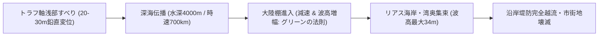

### 4.2 第1波の最短到達時間（2〜5分）と引き波の物理
南海トラフ津波の最も恐るべき脅威は、「逃げる時間的猶予が極めて短い」点にある。

震源域が陸地から100km以上離れていた東日本大震災では、地震発生から第1波が沿岸に到達するまでに約30分の猶予があった。しかし、南海トラフでは震源断層の一部が遠州灘、熊野灘、潮岬沖、土佐湾、日向灘といった**「陸地からわずか数十キロメートル沖合」**にまで迫っている。

各自治体における津波第1波（波高1メートル以上）の最短到達想定時間は以下の通りである：
- **静岡県（伊豆半島南部・駿河湾沿岸）**: 地震発生から **2分〜5分**
- **三重県（志摩半島・尾鷲・熊野沿岸）**: 地震発生から **3分〜8分**
- **和歌山県（串本町・白浜町・すさみ町）**: 地震発生から **3分〜5分**
- **高知県（室戸市・黒潮町・土佐清水市）**: 地震発生から **3分〜5分**
- **徳島県（牟岐町・美波町）**: 地震発生から **8分〜15分**
- **宮崎県・鹿児島県（日向灘沿岸）**: 地震発生から **10分〜15分**

激しい揺れ（震度6強〜7）が2分から3分間継続している最中、あるいは揺れが収まった直後には、すでに第1波が海岸線に激突している計算となる。

また、「津波の前には必ず潮が引く（引き波）」という俗説は、流体力学的に極めて危険な誤解である。震源断層の隆起域（上盤側）が陸に近い場合、最初に来るのは**「いきなりの押し波（山波）」**である。引き波を待ってから避難しようとする行動は、即座に死に直結する。

### 4.3 海底地すべりによる局所的超巨大津波の脅威
近年の海洋地質調査（白鳳丸やちきゅうによる音波探査）によって、南海トラフの陸側斜面には過去の大規模な「海底地すべり（Submarine Landslide）」の痕跡が多数発見されている。

プレート境界の断層破壊そのものによる地殻上下変動に加えて、巨大地震の激しい揺れによって海底の急斜面に堆積していた不安定な砂泥層が崩壊・地すべりを起こすと、局所的に局水面が激しく乱され、断層モデル単体から計算される予測高を大幅に上回る**「局所的巨大津波（Local Run-up Tsunami）」**が発生する。1998年のパプアニューギニア地震（M7.1）で高さ15mの津波により2000人以上が死亡した原因もこの海底地すべりであった。熊野海盆や土佐海盆の斜面崩壊が連動した場合、沿岸地域は想定を超える高さと流速の津波に襲われる危険性がある。

### 4.4 防潮堤・水門の沈降・破壊限界と「多重防御思想（L1・L2津波）」
現在、全国の海岸で建設が進められている防潮堤や水門は、津波に対して万能の防壁ではない。東日本大震災以降、国土交通省および内閣府は津波防災の基本方針を「2つのレベル」に峻別した：

1. **レベル1津波（L1津波: 発生頻度が高く、数十年に1度から百数十年に1度発生する津波）**
   堤防等の構造物によって海岸線で完全に食い止め、背後地の住民生命および経済財産を防護することを目標とする。
2. **レベル2津波（L2津波: 発生頻度は極めて低いが、発生すれば甚大な被害をもたらす最大クラスの津波）**
   防潮堤などの構造物だけでは防御不可能であることを前提とし、「構造物による粘り強い減災（倒壊・越流しても粘り強く時間を稼ぐ）」と「住民の即時避難（ハードとソフトの統合）」を組み合わせ、**「人命を絶対に失わせないこと」**を唯一絶対の至上目標とする多重防御（Multiple Defenses）思想である。

さらに深刻なのは、南海トラフ巨大地震に伴う**「地殻沈降（Crustal Subsidence）」**である。四国や紀伊半島の太平洋沿岸では、断層破壊によって地盤そのものが**1メートルから最大2メートル沈降**することが予測されている。これにより、海抜が下がった状態で防潮堤が相対的に低くなり、さらに強い揺れによって堤防の基礎地盤が液状化・破堤した場合、L1クラスの津波であっても容易に防潮堤を突破して市街地へ雪崩れ込むことになる。

### 4.5 津波避難タワー・高台移転の実効性と限界
高知県や和歌山県、静岡県などの沿岸自治体では、背後に高台のない低地市街地において、鉄骨造やRC造の「津波避難タワー」「津波避難ビル」の整備を急ピッチで進めてきた。

| 避難施設・対策手法 | メリット | 直面する物理的・運用的限界 |
| :--- | :--- | :--- |
| **津波避難タワー** | 平野部・港湾部で即時垂直避難が可能。歩行速度の遅い高齢者の生存率向上。 | 想定以上の漂流物（大型タンカー、コンテナ）の直撃破壊リスク。水没後の長期孤立（飲料水・低体温症）。 |
| **高台移転・事前移転** | 根本的な被災リスクの排除。将来の生活基盤の恒久的安全。 | 巨額の移転費用、漁業・港湾産業との職住分離問題、合意形成の難航。 |
| **避難道路・避難階段の整備** | 背後山地への迅速な徒歩アクセス確保。夜間ソーラー照明等による誘導。 | 地震動による法面崩壊、倒木、土石流による避難路の寸断。 |

津波避難タワーは「最終的な緊急人命退避場所」に過ぎず、浸水が引くまで数日間にわたり電気・水道・衛生・防寒のない過酷な環境で生き延びるための物資備蓄や救助連絡体制の確保が極めて重大な課題となっている。

## 第5章：複合災害・二次災害の連鎖（マルチハザード・カタストロフィ）

### 5.1 沿岸埋立地・ゼロメートル地帯の大規模液状化と側方流動
南海トラフ巨大地震は、単一の揺れや津波だけでなく、極めて多層的な二次災害が連鎖・重複して発生する「複合破局災害（マルチハザード・カタストロフィ）」の様相を呈する。その第一波となるのが、広域地盤の液状化（Liquefaction）である。

液状化は、地下水位の高い飽和砂質地盤が、地震動による繰り返しの剪断変形（Shear Deformation）を受けることで、土粒子間の間隙水圧が上昇し、有効応力がゼロになって砂と水が一体の液体のように挙動する物理現象である。

東京湾岸（江東区・江戸川区・浦安市・横浜市臨海部）、伊勢湾岸（名古屋港・四日市港・飛島村）、大阪湾岸（夢洲・咲洲・尼崎港）などの人工埋立地や旧河道・後背湿地において、以下の現象が広域で同時発生する：
1. **地耐力の喪失と構造物沈下・傾斜**
   杭基礎を持たない低層建築物、道路、橋台が不均一に沈下・傾斜し、基礎杭も側方流動（Lateral Spreading）によって剪断破断する。
2. **地中埋設管（ライフライン）の浮上・破断**
   下水道マンホールや地下貯水槽が浮力によって地上数メートル突き出し、ガス管、上水道管、地中電力ケーブルがことごとく引き裂かれ、都市の地下インフラが機能不全に陥る。
3. **ゼロメートル地帯の河川堤防決壊と長期冠水**
   東京の東部低地帯（荒川・江戸川流域）や名濃尾平野の海抜ゼロメートル地帯では、堤防の液状化沈下によって満潮面を下回り、ポンプ場の停電と相まって数週間にわたる広域冠水が持続する。

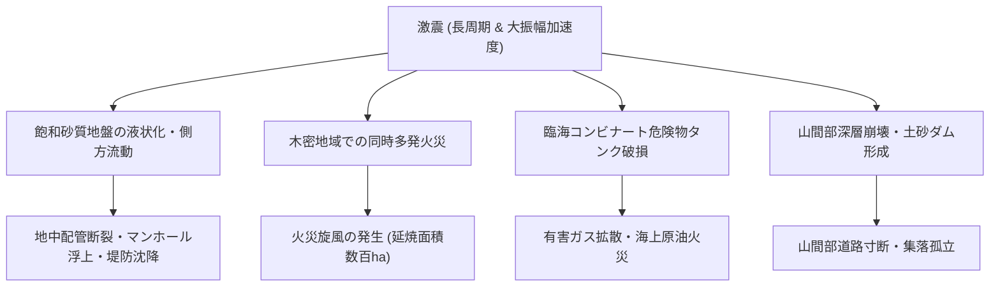

### 5.2 木造密集市街地（木密地域）の大規模火災旋風と消防機能麻痺
南海トラフの激震は、東京・大阪・名古屋の環状線周辺に今なお広大に残る「木造住宅密集市街地（木密地域）」において、都市大火災を同時多発的に発生させる。

火災発生の主因は、停電からの復電時に断線した配線や転倒した電気ストーブ等から発火する「通電火災」、ガス配管の破断、および化学薬品の混合による発火である。

被害想定では、風速8m/sの条件下で**約75万棟**が焼失すると試算されている。特に以下の要因が消防力を完全に無力化する：
- **同時多発火災による消防隊の受容量超過**
  ひとつの自治体で同時に数十〜数百件の火災が発生するため、消防車両の配備が物理的に追いつかない。
- **道路閉塞と放置車両**
  狭小道路におけるブロック塀倒壊、家屋倒壊、およびパニックによる放置車両により、緊急車両の進入路が完全に遮断される。
- **消火栓の水圧低下・断水**
  上水道管の液状化破断により、発災直後から消火栓が使用不能となる。防火水槽も倒壊瓦礫に埋没する。
- **火災旋風（Fire Whirl）の発生**
  大規模な燃焼によって超高温の巨大上昇気流が発生し、周辺から冷気が猛烈な勢いで吸い込まれることで、竜巻状の猛烈な炎の渦「火災旋風」が発生する。火災旋風は秒速数メートルで移動しながら、数百メートルの範囲の酸素を奪い尽くし、耐震RCビルをも焼き尽くしながら避難民を呑み込む。

### 5.3 臨海コンビナート火災・危険物爆発と有害物質拡散
駿河湾から伊勢湾、大阪湾、瀬戸内海、周防灘に至る太平洋ベルト地帯には、世界有数の規模を誇る重化学工業・石油コンビナート地帯が集積している。

これらの臨海施設が震度6強〜7の激震、長周期地震動によるスロッシング、そして大津波の直撃を受けた場合、以下の破局的シナリオが進行する：
- **重油・LPガスの大量流出と海上火災**
  津波によりタンクが基礎ごと浮上・流失し、配管が破断して数万トンの重油や高圧ガスが湾内に流出する。引火した場合、燃え盛る油面津波（Burning Oil Tsunami）となって沿岸市街地や船舶へ押し寄せる。
- **有毒ガス・危険化学物質の大気放出**
  化学コンビナートの反応塔や貯蔵施設が損傷し、塩素、アンモニア、ホスゲンなどの猛毒物質が風下の大都市圏へと拡散する二次被災リスクが生じる。

### 5.4 紀伊半島・四国山地の大規模山体崩壊・深層崩壊と土石流
南海トラフ地震の影響は沿岸部にとどまらない。中央構造線沿いや四国山地、紀伊半島、南アルプス（赤石山脈）などの急峻な山岳地帯では、地下数十メートル深さのすべり面から山腹全体が崩落する「深層崩壊（Deep-seated Catastrophic Landslide）」が多発する。

大量の崩壊土砂が河谷を埋め尽くすことで「天然ダム（土砂ダム）」が形成され、その後の余震や降雨によって決壊した場合、下流域の集落を壊滅的な土石流が襲う。また、山間部を結ぶ唯一の国道やトンネルが崩落・閉塞することにより、**数百箇所におよぶ山間集落が完全に孤立**し、陸路による救助・物資輸送が数ヶ月にわたり不能となる。

### 5.5 富士山連動噴火の可能性（宝永噴火の地球物理学的再検証）
南海トラフ巨大地震と火山噴火の連動性は、歴史的・物理学的に極めて強い蓋然性を持つ。

1707年10月28日の宝永地震（M8.6）が発生した**「わずか49日後」**の同年12月16日、富士山は観測史上最大規模の爆発的噴火「宝永大噴火」を起こした。噴煙高度は上空2万メートルに達し、江戸の街に数センチメートルの火山灰を降らせた。

地球物理学的メカニズムとして、プレート境界の超巨大破壊による地殻の応力解放（コサイスミックな伸張応力変化）が、富士山直下に位置するマグマ溜まり周辺の断層・割れ目を拡張させ、減圧沸騰（発泡）あるいは玄武岩質マグマとデイサイト質マグマの混合（Magma Mixing）を誘発して爆発的噴火に至ったと推定されている。

仮に南海トラフ巨大地震の直後に富士山が連動噴火した場合、首都圏および東海道ベルト地帯には以下の未曾有の災厄が重畳する：
- **降灰による全電力供給の完全停止**
  わずか数ミリメートルの降灰が雨を含むことで、超高圧送電線の碍子（がいし）が漏電・ショートし、首都圏全域が完全ブラックアウトする。
- **交通網の恒久的麻痺**
  空港の滑走路閉鎖、鉄道レールの通電不良・ポイント故障、高速道路の車両スリップ・フィルター目詰まり停止。
- **健康被害と大都市機能の窒息**
  微細な火山ガラス吸入による呼吸器疾患の急増、下水道の堆積閉塞による都市浸水。

## 第6章：ライフライン寸断・広域都市機能停止と経済被害（220兆円の衝撃）

### 6.1 長期断水・全域ブラックアウト・燃料途絶の悪循環
都市機能を支える三大ライフライン（電力・水道・通信・燃料）は、相互に極めて密接に依存し合っているため、南海トラフ巨大地震の発災直後から「破滅的な機能不全の連鎖（Cascading Failure）」を引き起こす。

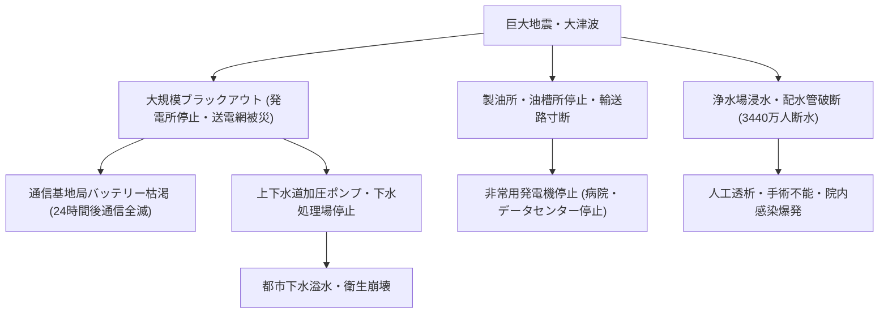

内閣府による発災後のライフライン被災想定は以下の通りである：
- **上水道の断水**: 発災翌日において**最大 3,440万人**（日本国民の約4人に1人）。1ヶ月が経過してもなお約1,000万人以上が断水状態に置かれる。
- **電力の停止（停電）**: 発災直後に**最大 2,710万軒**が停電。火力発電所（中部電力・関西電力・四国電力・九州電力・東京電力管内）の沿岸被災と超高圧変電所の損壊により、西日本全域から首都圏に及ぶ大停電（広域ブラックアウト）が発生する。
- **都市ガスの供給停止**: 沿岸のLNG受入基地の浸水、導管網の破断により**約 180万戸**が停止。復旧には数ヶ月を要する。
- **通信障害**: 基地局の倒壊・浸水に加え、非常用バッテリー（持続時間数時間〜24時間）が切れた段階で、携帯電話・スマートフォンの通話およびデータ通信が広域で完全途絶する。

特に致命的なのが**「燃料（ガソリン・軽油・重油）の枯渇」**である。製油所の停止、タンクローリーの被災・道路閉塞、給油所の停電（計量機が動かない）により、緊急車両、自衛隊トラック、そして病院の非常用自家発電機を回す燃料が数日で底をつく。

### 6.2 東海道新幹線・高速道路・港湾の寸断と「日本列島分断」
日本列島の国土構造は、東京から名古屋、大阪を結ぶ「東海道・山陽メガロポリス回廊」に人口、産業、交通インフラが極端に一極集中している。南海トラフ巨大地震は、この大動脈の心臓部をピンポイントで粉砕する。

- **東海道新幹線・在来線の壊滅**
  静岡県下の海岸線や河川橋梁、高架橋が落橋・倒壊。早期地震警報（UrEDAS）による緊急停止が間に合わない区間での脱線・転覆リスク。復旧には半年から1年以上を要する。
- **東名高速道路・新東名高速道路の寸断**
  静岡県由比地区をはじめとする海岸近接区間が津波で水没・流失。山間部の法面崩落や高架橋のジョイント破壊により、東西を結ぶ陸上輸送が完全に遮断され、日本列島は「東西に物理的分断」される。
- **主要国際港湾（名古屋港・大阪港・神戸港・四日市港）の機能停止**
  ガントリークレーンの倒壊、岸壁の沈下・側方流動、コンテナ流失により、海上貿易の玄関口が完全に閉鎖される。

これにより、食料自給率が極めて低い大都市圏（東京・大阪）へ地方から食料を運ぶ手段が断たれ、全国的な飢餓・物資枯渇危機へと発展する。

### 6.3 太平洋ベルト地帯の産業停止とグローバルサプライチェーン麻痺
被災地域である愛知、静岡、三重、大阪、兵庫などは、日本の製造業（自動車、精密機械、電子部品、素材産業）の集積地である。

トヨタ自動車をはじめとする中京圏の自動車産業サプライチェーンは、数千社に及ぶ一次・二次・三次サプライヤーが被災することで、部品供給が完全に停止する。現代の「ジャスト・イン・タイム（かんばん方式）」は在庫を持たない高効率設計であるがゆえに、たったひとつの工場（例：電子制御ユニット用マイコンや特殊ゴム部品）が被災しただけで、国内のみならず北米、欧州、アジアを含む**全世界の自動車・電機工場が操業停止に追い込まれる**。

### 6.4 経済被害額220兆円超の内訳と国家財政・通貨信用への影響
内閣府および土木学会が算出した経済被害の推計値は、近代国家が直面する被害額として世界史上最悪の規模に達する。

| 被害区分 | 推計額 | 主な内訳と影響 |
| :--- | :--- | :--- |
| **直接資産被害（ストック被害）** | **約 169.5兆円** | 建物被害：約107.1兆円 ライフライン・交通施設：約32.2兆円 生産施設・工場設備：約20.3兆円 |
| **経済活動低下被害（フロー被害）** | **約 44.7兆円** | 発災後1年間のサプライチェーン途絶による全国生産停止・取引減少 |
| **合計経済被害額** | **約 214.2兆〜220兆円** | **東日本大震災（約16.9兆円）の13倍以上、日本の一般会計国家予算の約2倍** |

さらに深刻なのは、土木学会が指摘する**「長期的な国力の衰退（約1,400兆円の減災なき場合の損失）」**である。被災インフラの復旧に20年以上を要し、その間に世界の生産拠点が海外へ恒久的に移転することにより、日本は「先進国から脱落する」という不可逆的な経済衰退リスクを背負う。

また、復興国債の天文学的増発に伴う日本国債の格下げ、円の暴落（キャピタルフライト）、ハイパーインフレーションのトリガーとなり、国家財政そのものが破綻（デフォルト）の淵に立たされる。

### 6.5 避難者950万人・帰宅困難者・災害関連死の爆発的リスク
直接的な外傷や津波を生き延びた後にも、過酷な避難生活が待ち受けている。

発災1週間後における避難者数は**最大950万人**に達する。これは全指定避難所の物理的受容能力を遥かに超えており、以下の人道危機が必然的に発生する：
1. **都市部における帰宅困難者の大滞留**
   首都圏で約500万人、近畿圏で約300万人の帰宅困難者が発生。真冬の寒冷下、屋外や駅前広場に溢れた群衆が群衆雪崩や低体温症で倒れる。
2. **避難所の生活環境崩壊と「災害関連死」の爆発**
   過密避難所における雑魚寝、暖房停止、水不足による衛生状態悪化、感染症（ノロウイルス、インフルエンザ、新型コロナ）の蔓延。
   特に下肢の深部静脈血栓症（エコノミークラス症候群）、高齢者の脱水・心筋梗塞・脳卒中、口腔ケア不足による誤嚥性肺炎により、**直接死（32万人）に匹敵する規模の災害関連死**が発生する危険性が指摘されている。

## 第7章：南海トラフ地震臨時情報（巨大地震注意・巨大地震警戒）の完全解読

### 7.1 運用制度の全体系と発令フロー（半割れ・一部割れ・ゆっくりすべり）
従来の「東海地震予知情報」が科学的限界（直前予知は現時点で不可能）から廃止され、2019年5月より運用が開始された新たな防災情報体系が**「南海トラフ地震臨時情報（Nankai Trough Earthquake Extra Information）」**である。

この情報は、南海トラフ全域の想定震源域およびその周辺において異常な現象が観測された際、気象庁が専門家による「南海トラフ沿いの地震に関する評価検討会」を緊急招集し、地震発生可能性の評価結果を国民・自治体・企業へ発表する制度である。

情報発表のトリガーとなる異常現象と、それに伴う臨時情報のキーワード区分は以下の3つに厳格に分類されている：

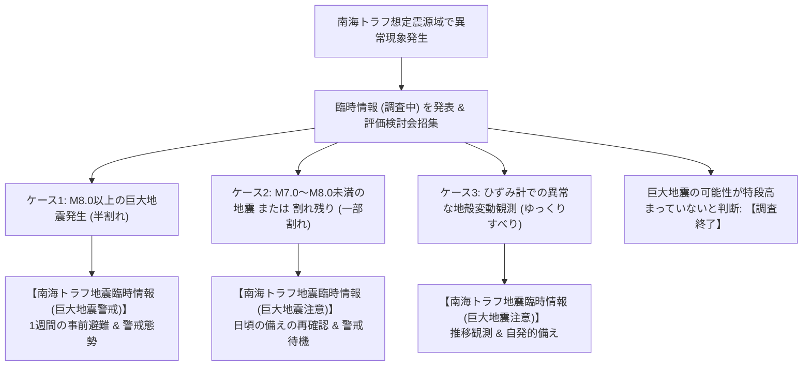

| 異常現象のケース | 判定基準・物理的状況 | 発表される臨時情報 | 国民・自治体・企業に求められる防災対応 |
| :--- | :--- | :--- | :--- |
| **半割れケース** | 想定震源域内のプレート境界で**M8.0以上**の地震が発生した場合（例：安政東海地震のように東側半分が破壊）。 | **【巨大地震警戒】** | 津波到達時間が極めて短い地域の住民・要配慮者は**1週間の事前避難**。企業は操業制限や遠隔勤務へ移行。 |
| **一部割れケース** | 想定震源域内のプレート境界で**M7.0以上M8.0未満**の地震が発生、またはプレート境界以外で**M7.0以上**の地震が発生した場合。 | **【巨大地震注意】** | 事前避難までは求めないが、日頃の備えの再確認、すぐに逃げられる態勢（靴・非常持出袋の準備）の維持。 |
| **ゆっくりすべりケース** | ひずみ計等で通常と異なる規模・速度の地殻変動（スロースリップ）が観測された場合。 | **【巨大地震注意】** | プレート境界の固着状態変化を注視し、家具固定や備蓄確認等の自主的防災行動を実施。 |

### 7.2 2024年8月「日向灘M7.1」初運用の総括と社会的混乱の教訓
2024年8月8日午後4時42分、日向灘を震源とするマグニチュード7.1（最大震度6弱）の地震が発生した。

この地震は南海トラフ想定震源域の西端で発生したM7.0以上の地震であったため、気象庁は制度運用開始以来初となる**「南海トラフ地震臨時情報（巨大地震注意）」**を発表した。これにより、日本社会は初めて「巨大地震が来るかもしれないという高確率状態での1週間」を経験することとなった。

この初運用によって浮き彫りになった教訓と課題は極めて重い：
1. **観光業・宿泊施設の大規模キャンセル被害**
   発表直後から、お盆休みを直撃したことで伊豆、白浜、四国、宮崎などの沿岸観光地で宿泊予約のキャンセルが相次ぎ、数千億円規模の経済的打撃が生じた。「警戒（事前避難）」ではなく「注意（備えの再確認）」であったにもかかわらず、行政やメディアの伝達において過剰な萎縮（パニック回避の過剰反応）が発生した。
2. **生活物資の買い占めパニック（米・水・防災グッズの消滅）**
   全国のスーパーマーケットやECサイトから、ミネラルウォーター、パックご飯、米、カセットコンロ、簡易トイレが一斉に消え去る「インフォデミック買い占め」が発生した。平時の備蓄を怠っていた層が一挙に購買行動へ走った結果、本当に備蓄を必要とする被災地や脆弱層へ物資が届かない事態が生じた。
3. **交通機関の過剰な運行規制と混乱**
   東海道新幹線が一部区間で速度を落として運行（減速運転）したためダイヤが乱れ、航空便や高速道路の利用判断にも自治体・企業間で大きなばらつきが生じた。
4. **「空振り」と「見逃し」の心理的ジレンマ（オオカミ少年効果）**
   1週間の呼びかけ期間が何事もなく終了した際、国民の間に「結局何も起きなかったではないか」という弛緩ムードが広がった。しかし統計学的事実として、M7クラスの地震の後にM8クラスの巨大地震が引き続いて発生する確率は**「数百回に1回程度（約0.5〜1%）」**である。通常の確率（千数百日に1回）と比較すれば相対的に数百倍高まっているが、絶対的確率としては99%以上の確率で「何も起きない」。この統計的リスクリテラシーを社会全体で共有できなければ、次回の発表時に警告が無視される「正常性バイアス」の罠に陥る。

### 7.3 「半割れ（警戒）」発令時の1週間事前避難の具体的行動基準
もし次に発生する地震がM8.0以上の「半割れ」であった場合、発表されるのは「巨大地震注意」ではなく**「南海トラフ地震臨時情報（巨大地震警戒）」**である。この時、社会の行動フェーズは一変する。

内閣府の防災基本計画において定められた「事前避難対象地域」の住民は、以下の行動を即座に取らなければならない：
- **津波避難困難地域の住民**: 津波到達時間が30分未満で、避難場所への移動に時間を要する沿岸低地の全住民は、安全な内陸や高台の親戚宅、ホテル、指定避難所へ**最低1週間の事前避難**を行う。
- **高齢者・障がい者・乳幼児（要配慮者）**: 自力での迅速な移動が困難な避難行動要支援者は、発災後の避難では確実に間に合わないため、警戒発令と同時に避難を開始する。
- **学校・幼稚園・保育所**: 原則として休校・休園措置を講じ、保護者への引き渡しを実施する。

### 7.4 企業・組織のBCP判断（出社統制・操業停止・サプライチェーン保全）
企業における南海トラフ地震臨時情報の対応は、企業の存続と法的責任（安全配慮義務）に直結する。

1. **「警戒（半割れ）」発令時**:
   - 沿岸被災想定地域にある工場・事業所の操業を直ちに停止し、設備を安全停止（フェイルセーフモード）へ移行。
   - 原則として全従業員の出社を禁止し、テレワーク体制へ移行。
   - 重要データのバックアップを遠隔地（北海道・東北・北陸・海外など）のデータセンターへ同期。
   - サプライチェーンにおける重要在庫の事前退避・代替調達ルートの確保。
2. **「注意（一部割れ・ゆっくりすべり）」発令時**:
   - 業務は継続するが、不要不急の沿岸地域への出張を即座に禁止。
   - 従業員の安否確認システムの動作テストを実施し、通信途絶時の連絡手段（衛星電話等）を確認。
   - 施設内の固定されていない什器・機器の緊急固定、非常用発電機の燃料再確認。

### 7.5 デマ・フェイクニュース・SNSインフォデミックへの防衛策
2024年の「注意」発表時や過去の震災時において、X（旧Twitter）やTikTokなどのSNSでは、AIが生成した偽の崩壊画像、根拠のない「○月○日に大地震が来る」といった予言デマ、特定民族に対するヘイトスピーチが猛烈な勢いで拡散した。

緊急時における情報リテラシーの原則：
- **一次情報源の固定**: 気象庁、内閣府防災、地方自治体の公式アカウント、NHKの災害報道以外の情報は一次拡散（リポスト・シェア）しない。
- **感情的な投稿に対する批判的検証**: 不安や恐怖を煽る投稿、寄付金を装った不審なリンクに対しては「立ち止まる、確認する、通報する」を徹底する。

## 第8章：最先端の地震津波観測網・科学技術と早期警報イノベーション

### 8.1 海底地震津波観測網（DONET・S-net・N-net）の構造と即時検知
日本は、世界で最も稠密かつ高度な海底リアルタイム観測網を配備している海洋大国である。南海トラフの巨大地震・大津波を秒単位で即時検知するため、防災科学技術研究所（NIED）を中心に以下の巨大海底ケーブルネットワークが展開されている。

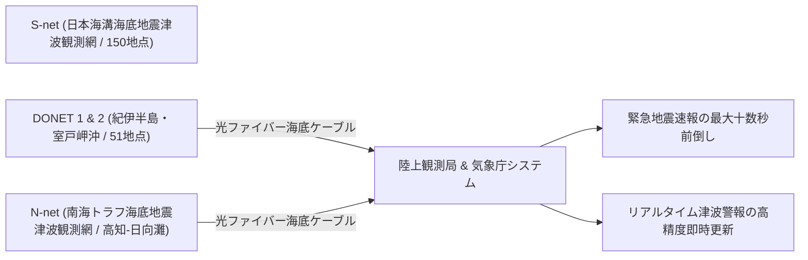

1. **DONET（Dense Oceanfloor Network System for Earthquakes and Tsunamis: DONET1・DONET2）**
   熊野灘（DONET1: 20ノード）および潮岬から室戸岬沖（DONET2: 31ノード）の水深1,900〜4,400mの海底に、全長数百kmの光海底ケーブルで結ばれた高精度観測ステーションが配備されている。
   各観測ノードには、強震計、広帯域地震計、水晶水圧計（1ミリメートルの水圧変動を検知可能）、温度計が搭載されており、プレート境界で発生する微小破壊から巨大断層破壊、津波の発生をリアルタイムで陸上へ伝送している。
2. **N-net（南海トラフ海底地震津波観測網）の構築**
   DONETの空白域であった高知県沖から宮崎県日向灘沖に至る海域をカバーするため、最新の「N-net」の整備が完了しつつある。沿岸域からトラフ軸近傍までの二重ループ構成を採用し、断線事故に対する極めて高い冗長性を備えている。

これらの海底観測網により、陸上観測点と比較して**「地震波を最大10秒〜20秒早く検知」「津波を最大20分早く直接検知」**することが可能となり、緊急地震速報および津波警報の劇的な精度向上を実現している。

### 8.2 GNSS-A海底地殻変動リアルタイム観測の最前線
前述したGNSS-A（GNSS-音響測距結合方式）は、従来の船上観測から、自律航行型洋上ブイや自律無人船（ASV: Autonomous Surface Vehicle）を用いた**「完全自動・連続リアルタイム観測」**へと技術革新を遂げている。

波浪エネルギーと太陽光発電で長期間洋上に滞在する無人ブイが、海底トランスポンダと常に音響通信を行い、プレート間の固着度合いやすべり遅れ（Slip Deficit）の変動データを衛星通信経由で陸上研究機関へ転送する。これにより、従来は数ヶ月から数年に一度しか得られなかった海底地殻変動データが、準リアルタイムで把握可能となり、プレート境界の応力臨界状態の推移を監視する精度が飛躍的に高まっている。

### 8.3 スーパーコンピュータ「富岳」によるリアルタイム浸水・避難シミュレーション
地震工学・津波工学の最前線では、理化学研究所のスーパーコンピュータ「富岳」を活用した超高速アンサンブルシミュレーションが実用化されている。

DONETやN-netの水圧計が沖合で津波の第1波を検知した瞬間、富岳上で事前計算された数万通りの津波断層パラメータデータベースとリアルタイム観測データを瞬時にマッチング（データ同化: Data Assimilation）させる。

これにより、地震発生からわずか数分以内に、**「沿岸各地点の防潮堤をいつ、何メートルの津波が越流し、市街地のどの道路が何分後に水深何メートルまで冠水するか」**という3次元都市浸水予測を数メートル四方の高解像度で計算し、自治体の防災指令本部や住民のスマートフォンへリアルタイム配信するシステムが開発されている。

### 8.4 AIを活用した地震動予測と衛星コンステレーション被災把握
1. **ディープラーニングによる強震動即時予測**
   P波の初期微動（最初の0.5〜1秒間）の波形データをディープニューラルネットワーク（DNN）に入力し、断層のすべり破壊が巨大化するか否かを瞬時に判別して、S波による主要動の震度をミリ秒単位で予測するAIモデルの導入が進んでいる。
2. **SAR（合成開口レーダ）衛星コンステレーションによる広域被害瞬時把握**
   雲や夜間を透過して地表を観測できる小型SAR衛星を多数周回させるコンステレーション（民間のSynspectiveやQPS研究所など）により、発災直後から数時間おきに被災地全体の干渉SAR画像を撮影。都市の倒壊エリア、津波浸水域、地盤沈下量、橋梁流失をAIが自動解析し、道路の啓開ルートや孤立集落の場所を地図上に自動マッピングする技術が確立されつつある。

## 第9章：個人・家庭・地域・企業がとるべき究極の生存戦略（完全実践マニュアル）

### 9.1 耐震等級3・許容応力度計算・家具固定・感震ブレーカーの工学的真実
激震（震度7）を前にして、「建物が倒壊しないこと」はすべての防災対策の絶対前提（必要条件）である。住家が倒壊すれば、圧死・窒息死するか、あるいは重傷を負って津波や火災から自力で脱出できなくなるからである。

1. **建築構造の工学的真実：耐震等級3と許容応力度計算**
   - **現行建築基準法（耐震等級1）の限界**: 震度6強から7の地震に対して「即座に倒壊せず、人命を救う（ただし建物の大規模損壊・修復不能は許容）」という最低限の基準に過ぎない。2016年熊本地震において、耐震等級1（2000年基準）の木造住宅が震度7の連続2回（前震・本震）の揺れによって倒壊した事例が多数確認された。
   - **耐震等級3（最高等級）の必須性**: 耐震等級1の1.5倍の耐力を持ち、熊本地震でも益城町中心部において耐震等級3の住宅は「倒壊ゼロ・軽微な損傷のみ」で住み続けることが可能であった。
   - **構造計算（許容応力度計算）の実施**: 木造2階建て住宅（4号建築物）で義務付けられていない壁量計算（簡易計算）ではなく、基礎、柱、梁、接合部の応力を厳密に算出する「許容応力度計算」を経た耐震等級3を確保することが極めて重要である。
2. **家具転倒防止の物理工学**
   阪神・淡路大震災における屋内死者の約8割が家具や家電の下敷きによる圧死であった。震度7の加速度下では、タンスや冷蔵庫は「倒れる」のではなく「空中をミサイルのように飛ぶ」。
   - **L字型金属金具による構造材（間柱）へのビス固定**: 最も確実な固定法。石膏ボードのみへの固定はアンカーを用いても引き抜き耐力が不足する。
   - **突っ張り棒とストッパー（耐震マット）の併用**: 壁にビスを打てない賃貸住宅等では、天井の梁がある位置に突っ張り棒を設置し、家具下部手前に転倒防止プレート（ストッパー）を敷くことで転倒モーメントを効果的に減衰させる。
3. **感震ブレーカーの義務的導入**
   地震火災の約6割を占める電気火災（通電火災）を根絶するため、設定値（震度5強以上）の加速度を感知した瞬間に主幹ブレーカーを自動遮断する「感震ブレーカー」の設置が極めて有効である。分電盤内蔵型、または後付け簡易型の導入が推奨される。

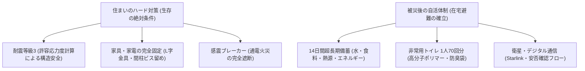

### 9.2 14日間超長期備蓄リスト（水・カロリー・エネルギー・通信）
南海トラフ巨大地震では、太平洋岸の港湾・道路が寸断され、全国的な物資枯渇が生じるため、従来の「3日分」や「7日分」の備蓄では生存できない。公的支援（プッシュ型物資支援）が末端の家庭に安定的に届くまでに**最低2週間（14日間）**を要すると想定すべきである。

以下は、4人家族が14日間、在宅避難を完全に自力で完結させるための推奨備蓄スペックである：

| 備蓄区分 | 1人あたりの必要量 | 4人家族（14日間）の必須備蓄量 | 具体的な選定基準と実践ノウハウ |
| :--- | :--- | :--- | :--- |
| **飲料水・調理水** | 1日 3リットル | **計 168リットル**（2Lペットボトル 84本 / 14箱） | 賞味期限5〜10年の長期保存水。ローリングストック法を併用し、日常消費しながら常時最低10箱以上を分散保管。 |
| **非常食（カロリー）** | 1日 2,000 kcal | **計 112,000 kcal** | アルファ化米（白米・五目・ドライカレー等）、缶詰（サバ・焼き鳥・果物）、レトルト食品、高カロリー羊羹、フリーズドライ味噌汁。 |
| **熱源（カセットガス）** | 1日 0.5本〜1本 | **計 28〜42本**（3本パック × 10〜14セット） | 断水・停電下で温かい食事・湯沸かしを行うための生命線。冬期の防寒（カセットガスストーブ）も考慮。 |
| **非常用トイレ** | 1日 5回 | **計 280回分**（70回分/人） | 凝固剤＋高密度ポリエチレン防臭袋（BOS等）のセット。 |
| **ポータブル電源** | 容量 500〜1,000 Wh | **大容量 1,500Wh〜2,000Wh × 1〜2台** | リン酸鉄リチウムイオン電池（充放電3,000回以上）。スマートフォン充電、LED照明、電気毛布、小型炊飯器を稼働。 |
| **ソーラーパネル** | 出力 100〜200W | **200W 折りたたみ式 × 1〜2枚** | 停電が長期化した場合に、ベランダや庭でポータブル電源を再充電するための自立エネルギー源。 |

### 9.3 非常時トイレ問題の完全解決（1人70回分、BOS袋・高分子凝固剤の科学）
被災地において最も深刻、かつ人間の尊厳と生命に直結するのが**「トイレ問題」**である。

「水が出ないから風呂の汲み置き水で流す」という行為は、排水管が地下で破断している場合、下階の住居に汚水が噴出・逆流する大惨事を招くため**【絶対禁止】**である。下水道管の安全が専門家によって確認されるまで、便器の水を流してはならない。

1. **化学的消臭・凝固のメカニズム**
   - **高分子吸水ポリマー（SAP）**: 自重の数百倍の水分を瞬時にゲル化し、アンモニアガスの揮発を抑制する。
   - **消臭・抗菌剤の配合**: 大腸菌や黄色ブドウ球菌の繁殖を抑え、発酵・腐敗臭（硫化水素・メチルメルカプタン）の発生を化学的に遮断する。
   - **特殊防臭袋（BOSなど）**: 通常のゴミ袋（ポリエチレン）は微小な気体分子を透過させて悪臭が漏れ出るが、共押出多層フィルム構造を持つ医療用防臭袋は気体分子をほぼ100%遮断する。
2. **備蓄計算式**
   成人の平均排泄回数は1日5〜7回である。14日間の在宅避難を想定した場合、**「1人あたり70回〜100回分」**の携帯トイレセットが最低限必要となる。

### 9.4 家族タイムライン・衛星通信（Starlink・171）・災害関連死防止プロトコル
1. **通信途絶時の家族間合意プロトコル**
   発災直後は携帯電話網が瞬時にパンク（輻輳率90%以上）し、通話・SNSは一切繋がらなくなる。
   - **第1優先**: **災害用伝言ダイヤル「171」**および**災害用伝言板「web171」**の利用方法を平時に家族全員で体験・合意しておく。
   - **第2優先**: 遠隔地（被災地域外、例えば北海道や日本海側の親戚）を「連絡ハブ」として指定し、全員がその親戚に安否を一本化して伝える。
   - **第3優先**: 衛星通信（SpaceXのStarlinkやスマートフォンの直接衛星通信機能）の活用。地上インフラが完全壊滅しても直接衛星と交信してSOSを発信可能。
2. **災害関連死（Preventable Disaster Deaths）の完全防止策**
   - **下肢の運動と水分補給**: トイレを我慢するために水分摂取を控えると、血液粘度が上昇しエコノミークラス症候群を引き起こす。十分な水分を摂り、定期的な足首の運動を行う。
   - **防寒と低体温症対策**: 断熱マット、アルミ保温シート、寝袋（スリーピングバッグ）を準備し、床からの冷気を遮断する。
   - **口腔ケア**: 水が使えなくても、液体歯磨きや口腔ケア用ウェットティッシュで口腔内を清潔に保ち、誤嚥性肺炎（高齢者死亡の主因）を防ぐ。

### 9.5 地区防災計画と自主防災組織・避難所HUG実践
個人の自助だけでは限界がある。公助（警察・消防・自衛隊）が最初の数日から1週間は機能麻痺することを前提に、「共助（地域社会の連携）」の仕組みを平時から構築しておく必要がある。

1. **地区防災計画の策定**
   行政任せの地域防災計画ではなく、町内会・自治会・マンション管理組合単位で「要支援者の避難支援個別計画」「初期消火資機材の配備」「井戸水の水質検査」を具体的に定める。
2. **避難所HUG（避難所運営ゲーム）の訓練**
   被災直後に学校の体育館等に押し寄せる避難民（妊婦、ペット同伴者、感染症患者、外国籍住民など）をどのように受け入れ、仮設トイレや物資配給を組織するかをシミュレーション訓練し、住自主運営能力を平時から養っておく。

## 第10章：事前復興と国土強靭化・未来への提言

### 10.1 被災前からの青写真「事前復興計画（Pre-Disaster Recovery）」
災害が発生してから「どう街を再建するか」を議論していては、被災住民の生活再建は絶望的に遅れ、避難先への人口流出と地域の消滅を加速させる。この教訓から生まれた近代防災思想の到達点が**「事前復興（Pre-Disaster Recovery Planning）」**である。

事前復興とは、平時（災害が起きる前）において、被災後の都市構造のあり方、高台移転の候補地、産業再生の基本方針、土地区画整理の手続きをあらかじめ住民合意のもとでデザインしておく手法である。

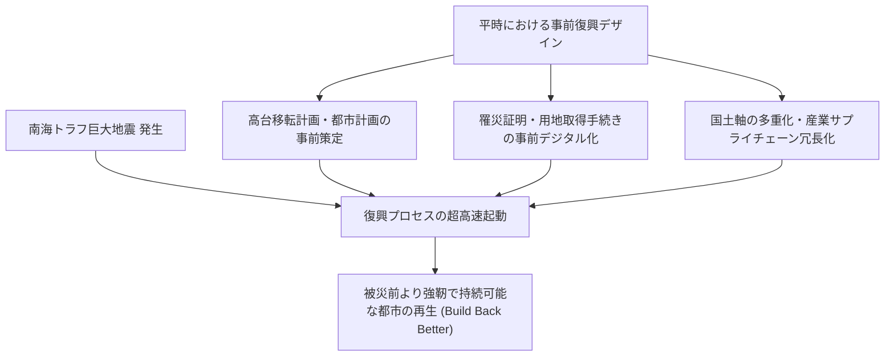

具体的には以下の取り組みが事前復興の柱となる：
- **復興都市計画の事前策定**: 被災した沿岸低地を産業・公園ゾーンへ転換し、住宅機能を安全な高台や内陸部へ集約する「事前都市マスタープラン」の作成。
- **行政手続きの事前DX**: 罹災証明書の自動交付システム、被災地台帳のクラウド化、土地境界データの法務局バックアップ。

### 10.2 都市構造の再編（コンパクト・プラス・ネットワークと国土軸二重化）
人口減少と巨大地震リスクが同時に進行する日本において、従来の「被災した場所にそのまま同じ規模で復旧する」という硬直的な復旧思想は破綻を迎えつつある。

1. **コンパクト・プラス・ネットワークによる立地適正化**
   津波浸水想定区域や土砂災害警戒区域における新規開発を厳格に制限し、医療・福祉・商業施設および住宅を「防災拠点となる安全な集約エリア」へと段階的に誘導する立地適正化計画（防災指針）の実効性を高める。
2. **国土軸の多重化（リダンダンシーの確保）**
   東海道新幹線・東名高速に過度に依存する日本の大動脈に対し、**リニア中央新幹線（内陸山岳ルート）の早期全線開業**、**日本海国土軸（北陸新幹線・日本海沿岸東北自動車道）の機能強化**を国家戦略として推進し、太平洋岸が完全被災しても日本の東西物流・交通が途絶しない多重冗長システムを完成させる。

### 10.3 3.11・阪神淡路・能登半島地震の教訓統合と未来への継承
日本は、過去の数々の破局的震災から血の滲むような教訓を学び取ってきた：
- **阪神・淡路大震災（1995年）の教訓**: 倒壊木造家屋による瞬時圧死の恐ろしさ、電気復電火災の脅威、ボランティアと市民自治の力。
- **東日本大震災（2011年）の教訓**: 想定を超える超巨大津波の破壊力、防潮堤への過信の危険性、原子力複合災害（原発過酷事故）の恐怖、津波てんでんこの精神。
- **能登半島地震（2024年）の教訓**: 半島・過疎地域における道路寸断による広域孤立、海底隆起による港湾使用不能、給水インフラ（水道管）の復旧長期化と在宅避難者の支援難。

南海トラフ巨大地震は、これら全ての災害要因（都市直下激震＋超巨大津波＋半島・山間部孤立＋原発立地地域の被災）が「一度に、かつ広域で同時発生する」究極の複合災害である。我々は過去の犠牲者が残してくれた教訓を断片としてではなく、ひとつの統合された防災知見体系として総動員しなければならない。

### 10.4 日本の防災知見が果たす国際貢献と結語
環太平洋火山帯（Ring of Fire）に位置する日本が蓄積してきた地球物理学的観測技術、免震・制震工学、津波避難システム、そして事前復興の思想は、同様の沈み込み帯巨大地震リスクを抱えるインドネシア、フィリピン、チリ、米国太平洋岸北西部（カスケード沈み込み帯）など、世界中の地震多発地域にとってかけがえのない人類共通の遺産である。

---

## 結語：科学的知性とレジリエンスが拓く未来

南海トラフ巨大地震は、もはや「いつか起こるかもしれない遠い未来の不吉な予言」ではない。地球物理学的に見れば、それはすでにカウントダウンの最終フェーズに入っている不可避の地球科学的イベントである。

しかし、我々は絶望するために科学を学ぶのではない。

科学的知性は、震源断層の破壊メカニズムを解明し、津波の到達時間を秒単位で割り出し、倒壊しない構造物の設計基準を我々に与えてくれた。観測網の技術革新は、地震の発生を直前に察知する目を授けてくれた。そして過去の教訓は、何を準備し、どう行動すれば命を繋ぎ止めることができるかを明確に教えてくれている。

巨大地震の発生そのものを人間が止めることはできない。しかし、**「被害を最小限に抑え、破滅的な国家崩壊を防ぎ、命を未来へと繋ぐこと」**は、我々の意志と準備によって完全に可能である。

「正しく恐れ、賢く備え、果敢に行動する」――この科学的合理性と不屈のレジリエンス（強靭性）こそが、来るべき南海トラフ巨大地震を乗り越え、より強靭で希望に満ちた社会を未来の世代へと受け渡すための唯一の道である。
