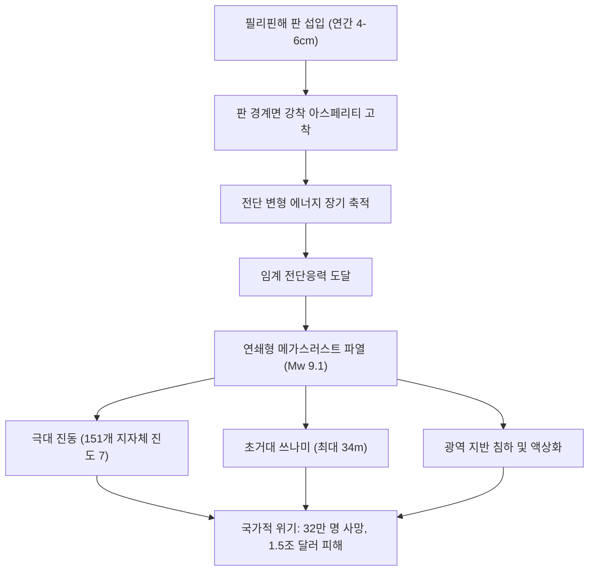

## 서론: 일본 열도 최대의 국가적 생존 위기
난카이 해곡(Nankai Trough)은 일본 혼슈, 시코쿠, 규슈 남쪽 연안에 걸쳐 약 700~800km 길이로 뻗어 있는 해구형 섭입대입니다. 필리핀해 판이 유라시아 판 밑으로 연간 4~6cm씩 침강하고 있으며, 향후 30년 이내에 규모 8~9급 대지진이 발생할 확률은 70~80%에 달합니다. 최악의 경우 최대 34m 높이의 대형 쓰나미와 함께 사망자 32만 3천 명, 경제적 피해 220조 엔(약 1.5조 달러)이라는 국난적 재앙이 예상됩니다.

## 제1장: 난카이 해곡의 지구물리학과 판 역학
단층 거동은 디터리히-루이나(Dieterich-Ruina) 마찰 법칙에 따릅니다. 10~30km 깊이의 아스페리티는 탄성 에너지를 지속 축적하며, 전이대에서는 슬로우 슬립(SSE)과 미소진동이 발생합니다. 해저 음향 측지(GNSS-A) 결과 해저 단층은 100%에 가까운 완전 고착 상태에 있습니다.

## 제2장: 고지진학과 1,400년 역사 주기
역사 문헌과 퇴적층 조사를 통해 100~150년 주기성이 확인되었습니다: 684년 하쿠호 지진, 887년 닌나 지진, 1498년 메이오 지진, 1707년 호에이 지진(전 구역 동시 파열, 49일 후 후지산 분화 유발), 1854년 안세이 지진(32시간 시차 파열), 1944/1946년 쇼와 지진. 동쪽 끝 토카이 구역은 170년 이상 미파열 상태입니다.

## 제3장: 단층 파열 모델 및 피해 시뮬레이션
Mw 9.1 모델 분석 결과:
- 151개 시정촌에 일본 기상청 계측 진도 7 도달.
- 장주기 지진동(4계급)으로 도쿄, 나고야, 오사카의 초고층 빌딩이 수십 분간 공진.
- 사망자 32만 3천 명, 중상자 62만 명, 238만 동 건물 전파.

## 제4장: 34m 대형 쓰나미 수치역학과 연안 피해
해구 축 천부의 20~30m 대변위로 발생한 쓰나미는 지진 발생 후 불과 2~5분 만에 시즈오카, 미에, 와카야마, 고치 연안을 강타하며, 만 지형에서 최대 34m까지 증폭됩니다.

## 제5장: 복합 2차 재해의 연쇄
매립지 광역 액상화, 목조 밀집 지역 75만 채 화재 소실, 연안 정유공장 폭발 및 산간지대 심층 붕괴로 인한 마을 고립.

## 제6章: 도시 기능 마비와 220조 엔 경제 충격
3,440만 명 단수, 2,710만 가구 정전. 도카이도 산업 회랑 마비로 전 세계 공급망이 타격을 입으며 220조 엔의 천문학적 경제 손실이 발생합니다.

## 제7장: 난카이 트러프 지진 임시정보 체계
M8.0 이상 반파열 발생 시 연안 취약지역에 1주일간 법적 사전 피난을 발령하는 체계적 위기관리 시스템입니다.

## 제8장: 해저 관측망(DONET, N-net) 및 후가쿠 슈퍼컴퓨터
해저 광케이블 관측망이 지진을 수십 초 앞서 감지하고, 슈퍼컴퓨터 '후가쿠'가 실시간 3D 침수 시뮬레이션을 수행합니다.

## 제9장: 14일 가정 자립 생존 매뉴얼
- 내진등급 3 주택, 가구 고정, 감진 차단기 설치.
- 14일 비축: 1인당 하루 3L 물, 고열량 비상식량, 1인당 70회의 응급 화장실 키트(고분자 응고제 및 BOS 방취봉투).
- 스타링크 위성통신 및 피난소 저체온증·혈전증 예방.

## 제10장: 사전 부흥 계획과 국토 강인화
사전 도시계획과 물류망 이중화를 통해 재해에 강한 사회를 구축해야 합니다.
