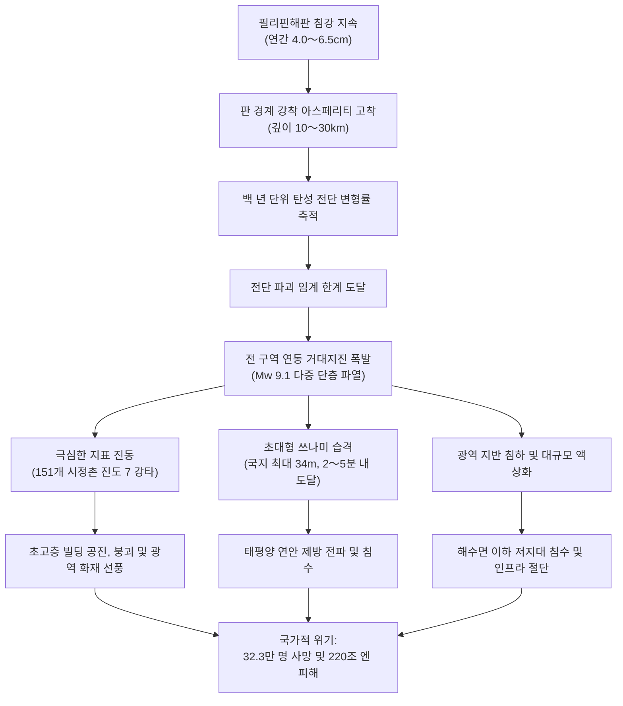
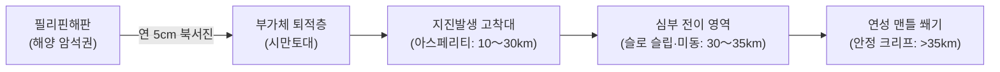
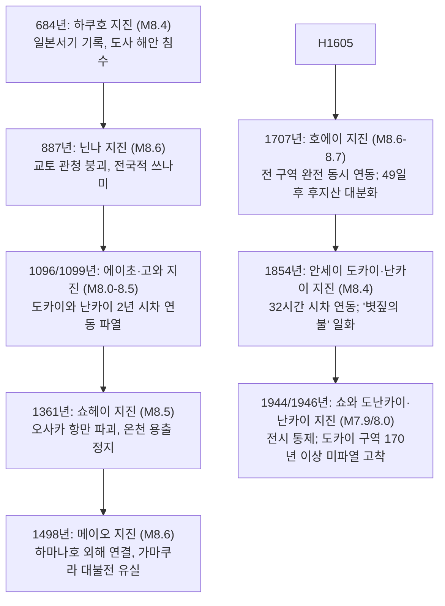

## 머리말: 일본 열도 최대의 국가적 실존 위기

일본 서남부 혼슈, 시코쿠, 규슈 남쪽 태평양 해저를 따라 시즈오카현 스루가만에서 미야자키현 휴가나다에 이르는 길이 700〜800km의 심해 단층대—바로 **난카이 트라프(Nankai Trough)** 입니다. 이곳은 대양판인 필리핀해판이 유라시아판(서남일본호) 아래로 매년 4.0〜6.5cm의 속도로 끊임없이 침강하는 수렴형 판 경계입니다.

지난 1,400년간의 기록된 역사 속에서 이 거대 단층대는 약 100〜150년 주기로 M8〜9급의 초대형 지진을 반복해 왔습니다. 1944년 쇼와 도난카이 지진(M7.9)과 1946년 쇼와 난카이 지진(M8.0) 이후 약 80년이 경과함에 따라 판 경계면의 탄성 전단 변형 에너지는 극한의 한계점에 도달했습니다. 일본 지진조사연구추진본부는 향후 30년 이내 M8〜9급 거대지진 발생 확률을 **70%〜80%**, 40년 이내 확률을 **약 90%** 로 추계하고 있습니다.

내각부 중앙방재회의 전문가 검토회의 피해 예측 모델에 따르면, 전 구역 연동 파열(Mw 9.1) 발생 시:
- 일본 기상청 진도 7의 격진이 10개 현 151개 시정촌을 강타합니다.
- 최대 **34m** 에 달하는 초대형 쓰나미가 지진 발생 후 불과 2〜5분 만에 연안에 도달합니다.
- 사망·실종자는 최대 **32만 3천 명**, 중상자는 62만 3천 명, 전파·소실 건물은 238만 동에 달합니다.
- 자산 직접 피해 169.5조 엔과 전국 공급망 마비에 따른 간접 피해를 합쳐 총 경제 피해는 **220조 엔(약 1.5조 달러)** 을 돌파하여 2011년 동일본 대지진 피해의 13배를 상회할 것으로 전망됩니다.

---

## 제1장: 난카이 트라프의 지구물리학과 판 역학 메커니즘

### 1.1 섭입대 구조와 필리핀해판의 동태
난카이 트라프는 상대적으로 젊고 온난한 시코쿠 해분 암석권이 서남일본호 아래로 북서진하며 가라앉는 경계입니다. 트라프 축 부근 천부(깊이 <10km)의 경사각은 10도 미만으로 매우 완만하며, 지진발생대(깊이 10〜30km)와 연성 맨틀 쐐기(깊이 >40km)로 갈수록 급경사를 이룹니다. 상반 판 위를 덮고 있는 수천 미터 두께의 부가체 퇴적물(시만토대)은 단층 파열의 천부 과도 미끄러짐과 쓰나미 증폭에 핵심적 영향을 미칩니다.

---

### 1.2 아스페리티와 속도-상태 의존 마찰 법칙
단층면 미끄러짐 거동은 디터리히-루이나(Dieterich-Ruina) 속도 및 상태 의존 마찰 법칙에 의해 지배됩니다.

$$\tau = \sigma_n \left[ \mu_0 + a \ln\left(\frac{V}{V_0}\right) + b \ln\left(\frac{V_0 \theta}{L}\right) \right]$$

| 영역 구분 | 깊이 범위 | 마찰 본구 파라미터 | 역학적 거동 | 대표적 지진 현상 |
| :--- | :--- | :--- | :--- | :--- |
| **트라프 천부** | 0 〜 10 km | $a - b > 0$ (조건부 불안정) | 저마찰, 초고간극수압 | 쓰나미 지진, 초저주파 지진(VLF) |
| **지진발생대** | 10 〜 30 km | $a - b < 0$ (속도 약화) | 강착 고착, 고전단 변형률 축적 | M8〜9급 거대지진 고착-미끄러짐(Stick-slip) 파열 |
| **심부 전이대** | 30 〜 35 km | $a - b \approx 0$ | 온도 의존성 전이, 유체 이동 | 심부 저주파 미동, 단주기 슬로 슬립(SSE) |
| **심부 연성대** | > 35 km | $a - b > 0$ (속도 강화) | 소성 유동, 정상 크리프 | 비지진성 정상 미끄러짐 |

$a - b < 0$ 영역에서는 미끄러짐 속도가 증가할수록 마찰 저항이 감소하여 폭발적인 지진 파열로 이어집니다.

---

### 1.3 슬로 슬립(SSE)과 심부 저주파 미동
30〜35km 깊이 전이대에서는 심부 저주파 미동과 단기 SSE(3〜6개월 주기, Mw 5.5~6.0) 및 붕고 수도 등의 장기 SSE(6〜7년 주기, Mw 6.5~7.0)가 관측됩니다. 이 현상들은 상부 고착대에 지속적으로 전단 응력을 전이시키는 지표가 됩니다.

---

### 1.4 해저 지각 변동 관측(GNSS-A)이 밝혀낸 완전 고착
일본 해상보안청의 해저 기준점 관측망(GNSS-A) 실측 결과, 스루가만에서 구마노탄, 도사만에 이르는 판 경계면 전역이 **100% 완전 고착 상태** 에 있으며, 매년 4~6cm의 미끄러짐 결손을 누적하고 있음이 확인되었습니다.

---

## 제2장: 고지진학과 1,400년 역사 주기

| 발생 연도 | 지진 명칭 | 추정 규모 | 연동 패턴 | 주요 피해 및 역사 기록 |
| :--- | :--- | :--- | :--- | :--- |
| **684년** | 하쿠호 지진 | M8.4 | 전 구역 연동(?) | 《일본서기》: 도사 평야 12km² 영구 침수, 전국 쓰나미. |
| **887년** | 닌나 지진 | M8.6 | 전 구역 연동 | 《일본삼대실록》: 교토 관청 도괴로 다수 압사, 전국 쓰나미. |
| **1096년** | 에이초 지진 | M8.0–8.5 | 도카이·도난카이 | 도다이지 거종 낙하, 이세만 쓰나미 습격. |
| **1099년** | 고와 지진 | M8.0–8.3 | 난카이 | 에이초 지진 2년 2개월 후 발생. 도사 사찰 붕괴 및 전답 침수. |
| **1361년** | 쇼헤이 지진 | M8.2–8.5 | 전 구역/시차 | 셋쓰(오사카) 항만 침수 파괴, 유노미네 온천 정지. |
| **1498년** | 메이오 지진 | M8.4–8.6 | 전 구역 연동 | 하마나호와 외해가 뚫려 입구 형성; 가마쿠라 대불전 유실. |
| **1605년** | 게이초 지진 | M7.9–8.0 | 쓰나미 지진 | 진동은 약했으나 보소~규슈 태평양 연안에 만 명 이상 익사. |
| **1707년** | 호에이 지진 | M8.6–8.7 | 전 구역 완전 동시 | 스루가만~규슈 동해안 일체 파열, 사망 2만 명 이상. **49일 후 후지산 호에이 분화 유발**. |
| **1854년** | 안세이 도카이 | M8.4 | 도카이·도난카이 | 12월 23일 발생. 시모다항 러시아 군함 조난, 쓰나미 직격. |
| **1854년** | 안세이 난카이 | M8.4 | 난카이 (32시간 차) | 12월 24일 발생. '볏짚의 불'(하마구치 고료)의 배경, 시코쿠 궤멸. |
| **1944년** | 쇼와 도난카이 | M7.9 | 도난카이 단독 | 군수공장 강타했으나 보도 관제, 사망 1,223명. |
| **1946년** | 쇼와 난카이 | M8.0 | 난카이 (2년 차) | 전후 혼란기 발생, 시코쿠 중심 사망 1,330명, 전파 11,591동. |

도카이 지역은 1854년 이후 170년 이상 미파열 상태로 남아 있어 위험도가 극도로 높습니다.

---

## 제3장: 단층 모델과 국가 피해 예측

내각부 모델(Mw 9.1)에 따른 예측 수치:
- **진도 7 강타 지역**: 시즈오카, 아이치, 미에, 와카야마, 고치 등 10개 현 151개 시정촌.
- **계급 4 장주기 지진동**: 도쿄, 나고야, 오사카 퇴적 분지에서 100〜200m 이상 초고층 빌딩이 좌우 **2〜3m 폭으로 격렬하게 공진**.
- **인명·물적 피해 집계**:

| 피해 항목 | 최악 시나리오 추계치 | 주요 발생 요인 |
| :--- | :--- | :--- |
| **사망·실종자 수** | **최대 323,000명** | 쓰나미 익사: 약 23만 명(71%) 건물 붕괴 압사: 약 8.2만 명(25%) 화재 소사: 약 1만 명(4%) |
| **중상자 수** | **약 623,000명** | 건물 압괴 및 파편 골절, 쓰나미 부유물 충돌 |
| **전파 및 소실 건물** | **최대 2,386,000동** | 진동 붕괴: 약 134만 동 쓰나미 유실: 약 16만 동 화재 연소: 약 75만 동 |
| **피난민 수(1주일 후)** | **최대 9,500,000명** | 지정 대피소, 차량 및 친척 집 피난자 총합 |

---

## 제4장: 34m 초대형 쓰나미 유체역학

- 트라프 천부의 20~30m 대변위로 인한 수조 세제곱미터 해수의 순간적 융기.
- 리아스식 해안의 V자형 만 지형 집광 효과로 **고치현 구로시오초 최고 34.4m**, 시모다시 30m 이상 기록.
- **초기파 2〜5분 내 도달**: 진동 직후 지체 없이 즉시 고지대로 피난해야 함.
- L1(방조제 방어)과 L2(다중 방어: 쓰나미 피난 타워, 고지대 이전)의 구분 운용.

---

## 제5장: 복합 연쇄 재해 (멀티 해저드)

1. 도쿄만·이세만·오사카만 매립지의 대규모 **액상화 및 측방 유동**.
2. 목조 밀집 시가지에서 동시다발 화재가 결합하여 거대 **화재 선풍** 형성(75만 동 소실).
3. 임해 석유화학 콤비나트 폭발 및 유독 물질 확산.
4. 기이반도·시코쿠 산지의 심층 붕괴로 수백 개 산간 마을 완전 고립.
5. 1707년 호에이 분화처럼 **후지산 연동 분화 가능성**.

---

## 제6장: 인프라 마비와 220조 엔 경제 타격

- **2,710만 가구 정전**, **3,440만 명 단수**.
- 도카이도 신칸센 및 도메이·신도메이 고속도로 유비 해안 붕괴로 **일본 열도 동서 단절**.
- 태평양 벨트 공업 지대 정지로 글로벌 반도체·자동차 공급망 붕괴.
- **직접 자산 손실 169.5조 엔 + 간접 경제 손실 44.7조 엔 = 총 220조 엔 타격** (동일본 대지진의 13배 이상).
- 피난민 950만 명에 따른 감염병 및 재해 관련사 폭증.

---

## 제7장: 난카이 트라프 지진 임시정보 완전 해독

2019년 도입된 새로운 방재 대응 체계:
- **【거대지진 경계 (반할 케이스)】**: 판 경계 M8.0 이상 발생 시, 쓰나미 고위험군 주민 **1주일간 법정 사전 대피**.
- **【거대지진 주의 (일부할·완만 미끄러짐 케이스)】**: M7.0~7.9 지진 또는 대규모 슬로 슬립 관측 시, 즉각 피난 태세 유지.
- 2024년 8월 휴가나다 M7.1 지진 당시 사상 최초로 '거대지진 주의'가 발령되어 실효성을 검증함.

---

## 제8장: 첨단 해저 관측망(DONET/N-net)과 슈퍼컴퓨터 후가쿠

- **DONET 1 & 2 및 N-net**: 해저 광케이블 수압계로 지진파 도달 수십 초 전, 쓰나미 최대 20분 전 조기 감지.
- 슈퍼컴퓨터 '후가쿠': 실시간 관측 데이터를 기반으로 3분 이내에 가구별 3차원 침수 동역학 시뮬레이션 완수.

---

## 제9장: 가정·기업의 완전 생존 전략 (14일 매뉴얼)

- **내진등급 3(허용응력도 계산)** 주택 및 L자형 철물 가구 고정.
- **감진 차단기(Kanshin Breaker)**: 지진 진동 250gal 감지 시 전원 차단으로 통전 화재 원천 방지.
- **14일 비축 리스트**: 4인 가족 기준 음용수 **168L(84병)**, 비상식 **112,000kcal**, 부탄가스 **28~42캔**, 비상용 간이 화장실 **280회분(인당 70회)**, 2000Wh 인산철 배터리 및 태양광 패널.
- **하수 역류 방지**: 단수 시 변기 사용 금지, 고분자 응고제와 BOS 방취 봉투 활용.

---

## 제10장: 사전 부흥과 국토 강인화

- **사전 부흥 계획(PDRP)**: 재해 발생 전 고지대 이전 부지 및 도시 구획을 법제화하여 신속한 부흥 실현.
- 3.11 동일본 대지진, 고베 대지진, 노토반도 지진의 교훈을 집약한 국토 인프라 이중화.

---

## 맺음말: 과학의 방패와 회복탄력성

난카이 트라프 거대지진은 피할 수 없는 지구물리학적 현실입니다. 물리 법칙을 정확히 인식하고 **과학의 방패** 와 **상상력의 요새** 를 갖추어 철저히 대비할 때, 우리는 이 거대한 재난을 극복하고 사회의 영속성을 지켜낼 수 있습니다.
