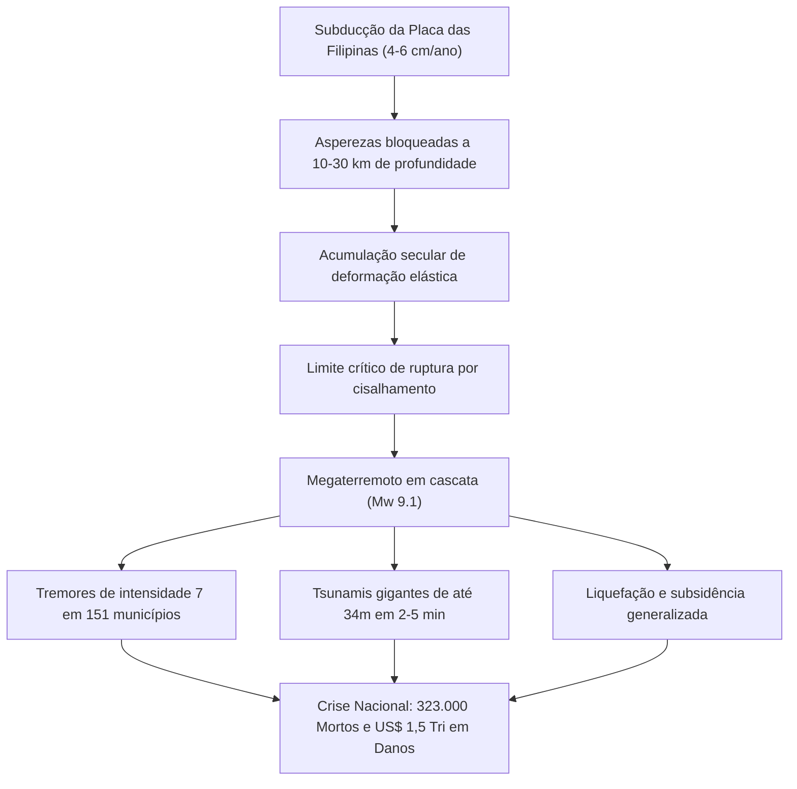

## Introdução: A Maior Crise Existencial do Japão

Ao longo da costa sul do Japão, estendendo-se por 700 a 800 km da baía de Suruga até o mar de Hyuga-nada, situa-se a **fossa de Nankai (Nankai Trough)**. Neste limite de placas convergentes, a placa do mar das Filipinas subduz sob a placa euroasiática a uma velocidade de 4 a 6,5 cm por ano.

Registros de 1.400 anos documentam megaterremotos recorrentes de magnitude 8 a 9 a cada 100 a 150 anos. Após quase 80 anos desde os eventos de Showa-Tonankai (1944) e Showa-Nankai (1946), a probabilidade de um megaterremoto nos próximos 30 anos alcança **70% a 80%**, e **cerca de 90% em 40 anos**.

Cenários oficiais do governo japonês para uma ruptura de magnitude Mw 9.1 projetam:
- Intensidade sísmica máxima 7 (escala JMA) em 151 municípios.
- Tsunamis gigantescos de até **34 metros**, atingindo o litoral em 2 a 5 minutos.
- Até **323.000 mortos e desaparecidos**, 623.000 feridos graves e 2,38 milhões de edifícios destruídos.
- Prejuízos econômicos totais superiores a **220 trilhões de ienes (~1,5 trilhão de dólares)**.

---

## 1. Geofísica e Tectônica da Fossa de Nankai

A zona sismogênica (10–30 km) obedece à lei de atrito dependente de velocidade e estado:
$$\tau = \sigma_n \left[ \mu_0 + a \ln\left(\frac{V}{V_0}\right) + b \ln\left(\frac{V_0 \theta}{L}\right) \right]$$
O regime de enfraquecimento por velocidade ($a - b < 0$) acumula tensões que se descarregam em rupturas dinâmicas violentas (stick-slip). O sistema geodésico submarino GNSS-A confirma **acoplamento de 100%** ao longo da fossa.

---

## 2. 1.400 Anos de Cronologia Paleossísmica

- **684 (Hakuho, M8.4)**: Primeiro registro confirmado no *Nihon Shoki*, 12 km² de terras submersas em Tosa.
- **1707 (Terremoto de Hoei, M8.6-8.7)**: Ruptura simultânea total de toda a fossa; 20.000 mortos; **desencadeou a erupção do monte Fuji 49 dias depois**.
- **1854 (Ansei Tokai e Nankai, M8.4)**: Rupturas consecutivas com intervalo de 32 horas.
- **Segmento de Tokai**: Permanece bloqueado sem romper há mais de **170 anos**.

---

## 3. Estimativas de Danos e Impacto Humano

- Ruptura Mw 9.1: Ressonância estrutural de longo período (Classe 4) em arranha-céus de Tóquio, Nagoia e Osaka (oscilações de 2 a 3 metros).
- Vítimas: **323.000 mortos** (71% afogamento por tsunami, 25% desabamentos, 4% incêndios).
- Desabrigados: até **9,5 milhões de refugiados**.

---

## 4. Hidrodinâmica do Tsunami de 34 Metros

- Deslocamento de 20 a 30 metros no leito marinho soergue bilhões de metros cúbicos de água.
- Efeito de funil nas baías: **34,4 metros em Kuroshio-cho** (Kochi).
- **Primeira onda em 2 a 5 minutos**: Evacuação imediata a pé para locais elevados, sem aguardar recuo do mar.
- Defesa em múltiplos níveis: barreiras físicas L1 contra megatsunamis L2 (torres de fuga e realocação).

---

## 5. Múltiplos Riscos e Efeitos Secundários

- Liquefação massiva em aterros litorâneos nas baías de Tóquio, Ise e Osaka.
- Tempestades de fogo urbanas incinerando 750.000 residências.
- Explosões em complexos petroquímicos e desastres com materiais perigosos.
- Deslizamentos profundos bloqueando comunidades em Kii e Shikoku.
- Risco geofísico real de **erupção desencadeada no monte Fuji**.

---

## 6. Colapso de Infraestrutura e Prejuízo de US$ 1,5 Trilhão

- **27,1 milhões de residências sem energia**, **34,4 milhões de pessoas sem água**.
- Rompimento do corredor de Tokaido, dividindo o Japão ao meio.
- Paralisação das cadeias de suprimentos industriais e de semicondutores.
- Danos de 220 trilhões de ienes (13 vezes o desastre de Tohoku de 2011).

---

## 7. Informação Extraordinária do Terremoto de Nankai

- **Alerta de Megaterremoto (Meia Ruptura M8+)**: Evacuação preventiva obrigatória de 1 semana nas áreas de risco extremo.
- **Aviso de Megaterremoto (M7+ ou deslizamento lento)**: Elevação imediata da vigilância e conferência dos kits de emergência.
- Aplicado com sucesso em agosto de 2024 após o tremor em Hyuga-nada (M7.1).

---

## 8. Redes Submarinas (DONET/N-net) e Supercomputador Fugaku

Sensores no fundo do oceano emitem alertas de tsunami **até 20 minutos antes** da costa. O supercomputador Fugaku processa modelos de inundação 3D em menos de 3 minutos.

---

## 9. Manual de Autonomia de 14 Dias

- Residências com padrão antissísmico Grau 3 e disjuntores automáticos por vibração (>250 gal).
- Provisões familiares (4 pessoas, 14 dias): **168 L de água**, **112.000 kcal de alimentos**, **280 kits de banheiro químico**, gerador solar de 2.000 Wh.
- Protocolo sanitário: Vedação de vasos sanitários para evitar refluxo de esgoto; uso de sacos de barreira BOS anti-odor.

---

## 10. Planejamento Prévio de Reconstrução (PDRP)

Planejamento prévio legal e urbanístico de terrenos elevados para reconstrução ágil após a catástrofe.

---

## Conclusão: O Escudo da Ciência

O megaterremoto de Nankai é um fato inevitável. Enfrentá-lo com ciência e planejamento meticuloso garantirá a preservação da sociedade.
