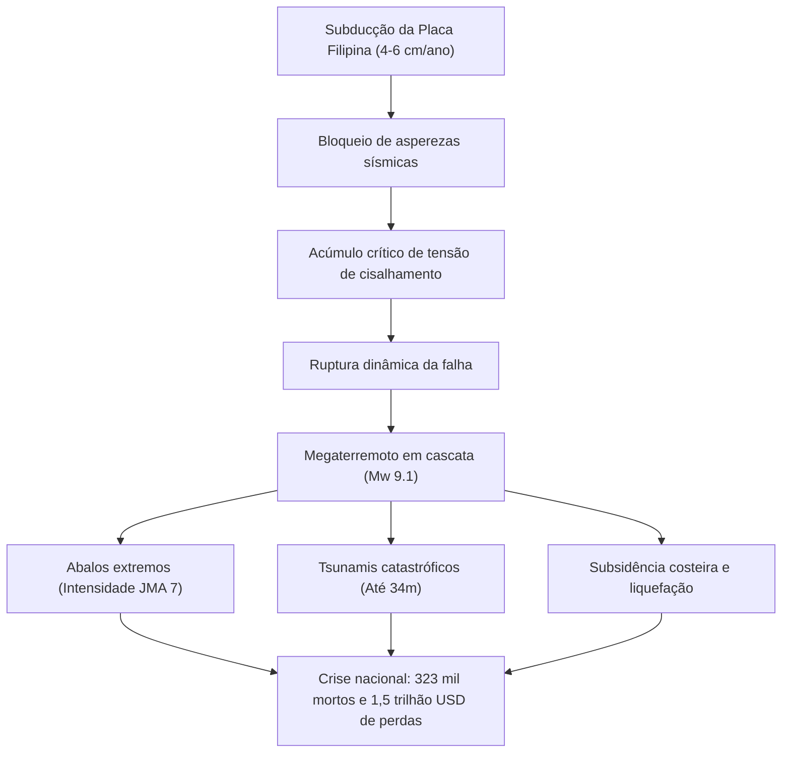

## Introdução: A maior ameaça existencial ao Japão
A Fossa de Nankai (Nankai Trough) é uma zona de subducção de 700 a 800 km ao largo da costa sul do Japão, onde a Placa do Mar das Filipinas afunda sob a Placa Euroasiática a 4-6 cm/ano. Com 70-80% de probabilidade de ocorrência nos próximos 30 anos, projeta-se um megaterremoto M8-9 gerando tsunamis de até 34 metros, 323.000 mortos e prejuízos de 220 trilhões de ienes.

## Capítulo 1: Geofísica e dinâmica das placas
As asperezas na falha acumulam energia sísmica regidas pelas leis de atrito de Dieterich-Ruina. Medições geodésicas acústicas no leito marinho (GNSS-A) comprovam acoplamento de quase 100% entre as placas.

## Capítulo 2: Paleossismologia e histórico de 1.400 anos
Grandes eventos cíclicos documentados: Hakuho (684), Ninna (887), Meio (1498), Hoei (1707, ruptura total seguida da erupção do Monte Fuji), Ansei (1854) e Showa (1944/1946).

## Capítulo 3: Modelos de ruptura e estimativas de danos
O cenário extremo (Mw 9.1) prevê intensidade máxima 7 em 151 municípios, vibrações de longo período abalando arranha-céus em Tóquio, Nagoya e Osaka, além de 323.000 mortes.

## Capítulo 4: Hidrodinâmica de tsunamis de 34 metros
O deslocamento vertical de 20-30m na fossa marinha gera ondas que atingem o litoral em 2 a 5 minutos, alcançando 34m em baías de Kochi e Wakayama.

## Capítulo 5: Cadeia de desastres secundários
Liquefação em zonas portuárias, conflagrações urbanas com 750.000 casas destruídas pelo fogo, acidentes em refinarias e deslizamentos em áreas serranas.

## Capítulo 6: Colapso de infraestruturas e prejuízo de 220 trilhões de ienes
34 milhões de pessoas sem água, 27 milhões sem eletricidade e paralisia dos principais eixos de transporte e cadeias de suprimentos globais.

## Capítulo 7: Sistema de alertas extraordinários de Nankai
Protocolos que determinam evacuação preventiva de uma semana em caso de ruptura parcial prévia (alerta M8+).

## Capítulo 8: Monitoramento submarino (DONET, N-net) e supercomputador Fugaku
Redes de cabos submarinos oferecem alertas precoces e simulações de inundação urbana em tempo real via supercomputador.

## Capítulo 9: Manual prático de sobrevivência autônoma para 14 dias
Construção nível 3 antissísmica, disjuntores automáticos, estoques para 14 dias (3L de água/dia/pessoa, 70 kits de banheiro químico com sacos BOS) e internet satelital (Starlink).

## Capítulo 10: Reconstrução preventiva e resiliência
Planejamento urbano antecipado, rotas redundantes e cultura de autoproteção.
