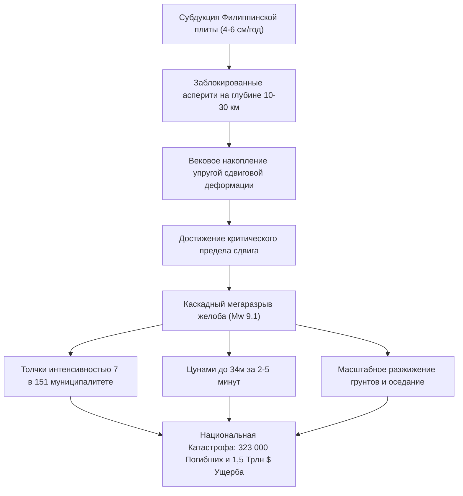

## Введение: Величайший экзистенциальный кризис Японии

Вдоль тихоокеанского побережья юго-западной Японии протянулся на 700–800 км от залива Суруга до моря Хюга-нада глубоководный **желоб Нанкай (Nankai Trough)**. В этой зоне субдукции океаническая плита Филиппинского моря погружается под Евразийскую плиту со скоростью 4–6,5 см в год.

Исторические хроники за 1400 лет фиксируют регулярные мегаземлетрясения магнитудой 8–9 каждые 100–150 лет. С момента последних событий 1944 года (Сёва-Тонанкай, M7.9) и 1946 года (Сёва-Нанкай, M8.0) прошло почти 80 лет; вероятность катастрофы в ближайшие 30 лет составляет **70–80%**, а в течение 40 лет — **около 90%**.

Официальные сценарии правительства Японии при каскадном разрыве (Mw 9.1) прогнозируют:
- Сейсмическую интенсивность 7 (шкала JMA) в 151 муниципалитете.
- Гигантские цунами высотой до **34 метров**, достигающие побережья за 2–5 минут.
- До **323 000 погибших**, 623 000 тяжелораненых и 2,38 млн разрушенных зданий.
- Совокупный экономический ущерб свыше **220 трлн иен (~1,5 трлн долларов США)**.

---

## 1. Геофизика и тектоника желоба Нанкай

Сейсмогенная зона подчиняется закону трения, зависящему от скорости и состояния:
$$\tau = \sigma_n \left[ \mu_0 + a \ln\left(\frac{V}{V_0}\right) + b \ln\left(\frac{V_0 \theta}{L}\right) \right]$$
Режим скоростного ослабления ($a - b < 0$) приводит к нестабильному срыву (stick-slip). Система донных измерений GNSS-A подтверждает **100% блокировку границы плит**.

---

## 2. 1400 лет истории палеоземлетрясений

- **684 г. (Хакухо, M8.4)**: первое упоминание в *Нихон Сёки*, опускание под воду 12 км² суши в Тоса.
- **1707 г. (Хоэй, M8.6-8.7)**: одновременный разрыв всех сегментов, свыше 20 000 погибших, **спровоцировал извержение вулкана Фудзи через 49 дней**.
- **1854 г. (Ансэй, M8.4)**: последовательные разрывы с разницей в 32 часа.
- **Сегмент Токай**: заблокирован без разрыва уже более **170 лет**.

---

## 3. Моделирование разрушений и человеческие потери

- Модель Mw 9.1: длиннопериодные колебания вызывают раскачивание небоскребов в Токио, Нагое и Осаке с амплитудой до 2–3 метров.
- Потери: **323 000 погибших** (71% — цунами, 25% — обрушения зданий, 4% — пожары).
- Эвакуированные: до **9,5 млн человек**.

---

## 4. Гидродинамика цунами высотой 34 метра

- Подвижка донного клина на 20–30 метров поднимает миллиарды кубометров воды.
- В V-образных заливах (Куросио-тё) высота заплеска достигает **34,4 метра**.
- **Приход первой волны через 2–5 минут**: немедленная пешая эвакуация на возвышенности без ожидания отхода воды.
- Многоуровневая оборона: дамбы (L1) и эвакуационные башни/перенос жилья (L2).

---

## 5. Вторичные каскадные катастрофы

1. Разжижение насыпных грунтов в портах Токио, Нагои и Осаки.
2. Огненные смерчи в кварталах деревянной застройки (уничтожение 750 000 домов).
3. Аварии на нефтехимических терминалах Тихоокеанского пояса.
4. Горные оползни, отрезающие населенные пункты на Кии и Сикоку.
5. Геофизический риск **спровоцированного извержения вулкана Фудзи**.

---

## 6. Коллапс инфраструктуры и ущерб в 1,5 трлн долларов

- **27,1 млн домов без электричества**, **34,4 млн человек без водоснабжения**.
- Разрыв транспортной артерии Токайдо делит Японию на две изолированные части.
- Паралич глобальных поставок микроэлектроники и автокомпонентов.
- Совокупный ущерб — 220 трлн иен (в 13 раз выше последствий землетрясения 2011 года).

---

## 7. Система экстренной информации о землетрясениях в желобе Нанкай

- **【Предупреждение о мегаземлетрясении (половинный разрыв M8+)】**: обязательная недельная предварительная эвакуация прибрежных зон.
- **【Внимание: мегаземлетрясение (частичный разрыв / медленный сдвиг)】**: повышенная готовность, проверка запасов.
- Успешно испытана в августе 2024 года после землетрясения в Хюга-нада (M7.1).

---

## 8. Донные сенсорные сети (DONET/N-net) и суперкомпьютер Фугаку

Оптоволоконные датчики давления на морском дне предупреждают о цунами **на 20 минут раньше**. Суперкомпьютер «Фугаку» моделирует 3D-затопление улиц менее чем за 3 минуты.

---

## 9. Руководство по выживанию и автономности на 14 дней

- Сейсмостойкость уровня 3 и автоматы отключения электричества при сотрясениях (>250 гал).
- Запасы на семью из 4 человек: **168 л воды**, **112 000 ккал продуктов**, **280 комплектов химических туалетов**, солнечная электростанция 2000 Вт·ч.
- Санитария: запрет слива воды в унитазы; герметичные антибактериальные пакеты BOS.

---

## 10. Достихийное планирование восстановления (PDRP)

Заблаговременное юридическое и градостроительное проектирование безопасных зон для немедленной отстройки инфраструктуры.

---

## Заключение: Щит науки

Мегаземлетрясение в желобе Нанкай — это неотвратимая неизбежность. Опираясь на законы физики и превентивную подготовку, цивилизация способна выстоять и минимизировать потери.
