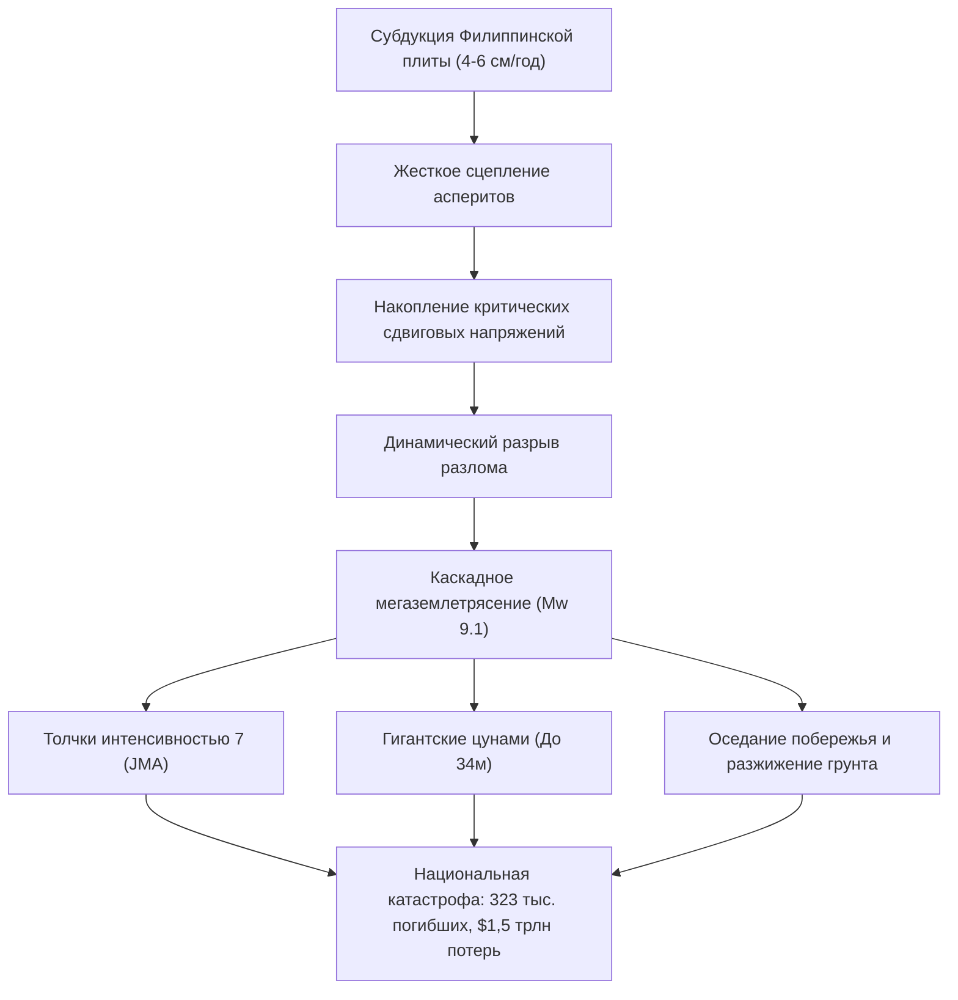

## Введение: Величайшая угроза для Японии
Желоб Нанкай (Nankai Trough) — это активная зона субдукции протяженностью 700–800 км, где Филиппинская плита погружается под Евразийскую плиту со скоростью 4–6 см в год. С вероятностью 70–80% в ближайшие 30 лет здесь произойдет мегаземлетрясение магнитудой 8–9, способное вызвать цунами высотой до 34 метров, гибель свыше 323 000 человек и ущерб более 220 трлн иен ($1,5 трлн).

## Глава 1: Геофизика и тектоника плит желоба Нанкай
Поведение разлома подчиняется законам трения Дитриха-Руины. Аспериты накапливают упругую деформацию, а переходные зоны порождают медленные землетрясения (SSE). Данные донной акустической геодезии (GNSS-A) подтверждают 100% сцепление плит.

## Глава 2: 1400 лет палеосейсмологии и периодичность
Летописи фиксируют землетрясения каждые 100–150 лет: Хакухо (684), Нинна (887), Хоэй (1707, вызвало извержение вулкана Фудзи через 49 дней), Ансэй (1854, разрыв с интервалом в 32 часа) и Сёва (1944/1946).

## Глава 3: Модели разрыва и масштаб разрушений
При магнитуде Mw 9.1 прогнозируется сотрясение силой 7 баллов (JMA) в 151 муниципалитете, опасный резонанс высотных зданий в Токио, Нагое и Осаке, гибель 323 000 человек и разрушение 2,38 млн домов.

## Глава 4: Гидродинамика цунами высотой 34 метра
Поднятие морского дна на 20–30 метров вызовет волны, достигающие побережья префектур Сидзуока, Миэ, Вакаяма и Коти всего через 2–5 минут, с высотой до 34 м в V-образных бухтах.

## Глава 5: Вторичные катастрофы
Масштабное разжижение грунта в портах, пожары, уничтожающие 750 000 деревянных домов, взрывы на нефтехимических предприятиях и оползни в горах.

## Глава 6: Коллапс инфраструктуры и экономический ущерб
34 млн человек останутся без воды, 27 млн домов без света. Разрыв транспортного коридора Токайдо парализует мировую цепочку поставок, нанеся ущерб в 220 трлн иен.

## Глава 7: Система экстренных предупреждений
Регламент объявляет обязательную недельную превентивную эвакуацию для побережий при полуразрыве разлома (землетрясение M8+).

## Глава 8: Сети глубоководных датчиков (DONET, N-net) и суперкомпьютер Fugaku
Оптоволоконные донные станции передают телеметрию, позволяя суперкомпьютеру Fugaku моделировать затопление городов в реальном времени.

## Глава 9: 14-дневный план автономного выживания
Сейсмостойкое строительство (уровень 3), автоматы защиты от пожаров, запасы на 14 дней (3 л воды/день/чел, 70 наборов химических туалетов с герметичными пакетами BOS) и спутниковая связь Starlink.

## Глава 10: Превентивное восстановление и национальная устойчивость
Заблаговременное территориальное планирование и создание дублирующих транспортных артерий.
