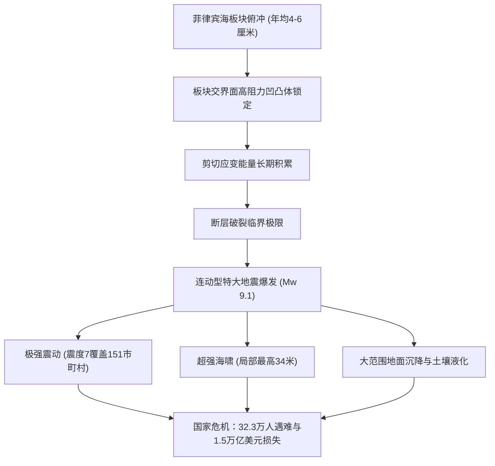

## 引言：日本面临的最大国家级生存危机
南海海槽（Nankai Trough）是位于日本本州、四国及九州南侧沿海长达700至800公里的深海俯冲带。菲律宾海板块正以每年4至6厘米的速度向西北俯冲至欧亚板块之下。根据日本地震调查研究推进本部的评估，未来30年内发生里氏8至9级特大地震的概率高达70%至80%。最严重情景下，将引发高达34米的毁灭性海啸，导致多达32.3万人遇难，238万栋建筑倒塌损毁，经济损失超过220万亿日元（约1.5万亿美元）。

## 第1章：南海海槽的地球物理机制与板块力学
断层滑动受速率与状态依赖摩擦定律支配。深处10至30公里的闭锁凹凸体积累巨大弹性能量，过渡带产生慢滑移事件（SSE）与深部低频微震。海底声学观测网（GNSS-A）证实整个断裂带处于接近100%的完全强锁定状态。

## 第2章：古地震学与1400年周期历史记录
日本历史文献与海啸沉积物证实每100至150年周期性发生特大地震：
- 684年白凤地震、887年仁和地震、1498年明应地震、1707年宝永地震（全区完全连动，49天后引发富士山宝永大喷发）、1854年安政地震（时隔32小时先后破裂）及1944/1946年昭和地震。东端东海区域已闭锁逾170年未发生破裂。

## 第3章：最新破裂断层模型与全面受灾预测
Mw 9.1特大断层模型预测：
- 日本气象厅震度7覆盖静冈、爱知、三重、和歌山、高知、宫崎等7县151个市町村。
- 长周期地震动（第4阶级）导致东京、名古屋、大阪平原的超高层建筑发生持续数十分钟的剧烈共振。
- 预计死亡32.3万人，受重伤62.3万人，全毁建筑238.6万栋。

## 第4章：34米大水头海啸流体动力学与沿海受灾
海槽轴部浅层发生20至30米剧烈位移，海啸第一波在震后2至5分钟内即可抵达静冈、三重、和歌山及高知沿海。由于峡湾地形聚焦效应，局部波高可达34米。

## 第5章：连锁复合次生灾害
沿海人工填海区大面积土壤液化、木结构密集市区75万栋房屋被火灾烧毁、临海石化基地爆炸及深部山体滑坡封锁山区交通。

## 第6章：基础设施瘫痪与220万亿日元经济打击
3440万人面临长期断水，2710万户家庭断电。东海道交通走廊全面中断切断全球汽车与电子芯片供应链，产生超过220万亿日元的毁灭性直接与间接经济损失。

## 第7章：南海海槽地震临时信息预警体系
2019年启用新机制：若发生M8.0以上半破裂事件，沿海高风险区域将执行为期一周的法定事前避难疏散。

## 第8章：海底观测网（DONET、N-net）与富岳超算实时模拟
光纤海底缆线网络将地震警报提前数十秒，海啸警报提前20分钟；超级计算机“富岳”能在数分钟内完成三维淹没动态推演。

## 第9章：14天家庭完全自主生存指南
- 耐震等级3住宅、L型金属件加固家具、感震断路器防止通电火灾。
- 14天物资储备：每人每天3升饮用水、2000大卡高能食物、每人70套配高分子凝固剂及医疗级防臭袋（BOS）的应急厕所。
- 星链卫星通信及防范避难所经济舱综合征与失温死亡。

## 第10章：事前复兴计划与国家韧性建设
提前制定高地搬迁规划与多重交通走廊备份，以科学理性守护生命。
