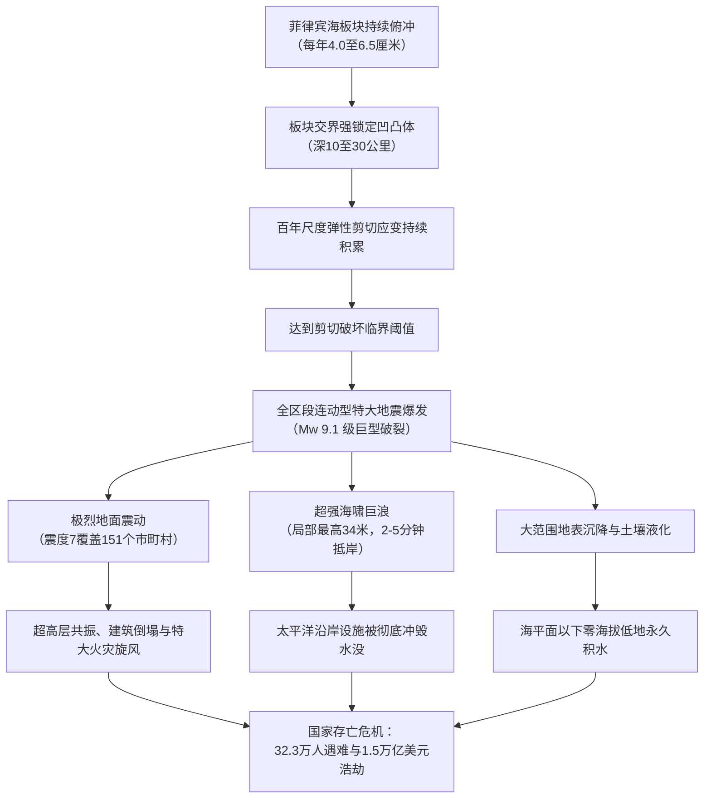
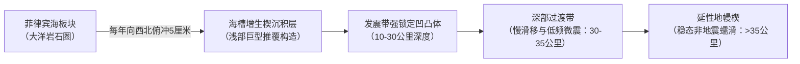
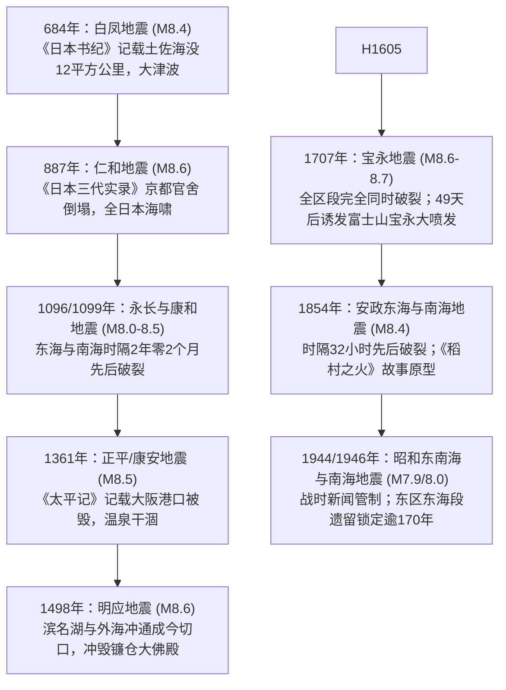
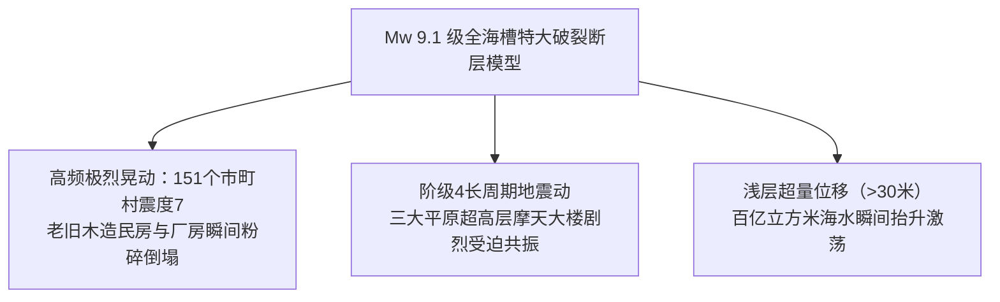
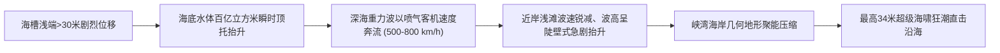
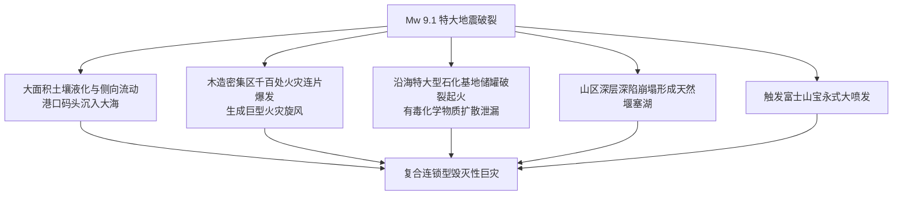
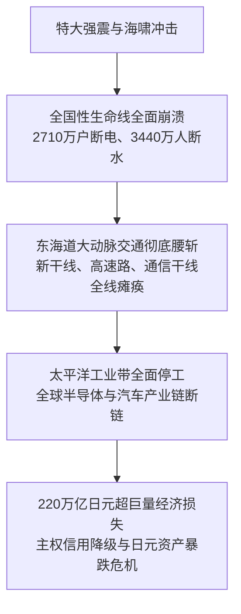
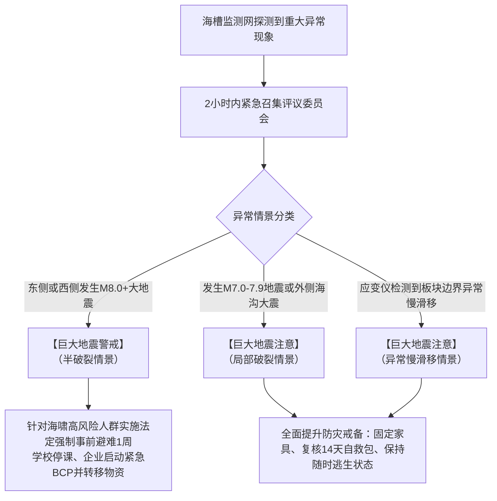
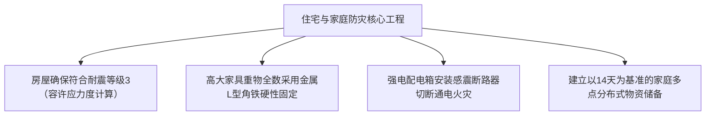
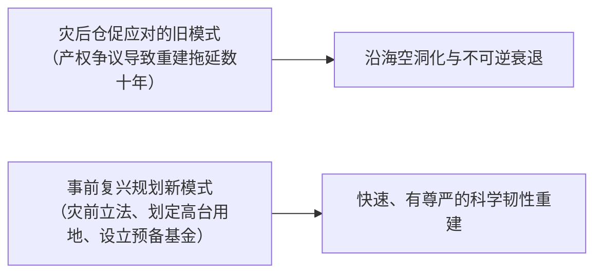

## 引言：日本面临的最大国家级生存危机

沿日本西南部的本州、四国及九州南侧太平洋海底，自静冈县骏河湾延伸至宫崎县日向滩，横亘着长达 700 至 800 公里的深海断裂带—— **南海海槽（Nankai Trough）** 。这里是大洋板块（菲律宾海板块）以每年 4.0 至 6.5 厘米的速度，持续向西北方向俯冲至大陆板块（欧亚板块西南日本弧）之下的汇聚型板块边界。

在过去 1400 年有明确文字记载的日本历史中，这一巨型俯冲带以约 100 至 150 年为周期，反复爆发里氏 8 至 9 级的特大地震。自上一次破裂——1944年昭和东南海地震（M7.9）与 1946 年昭和南海地震（M8.0）爆发以来，已过去近 80 年，板块交界面的弹性剪切应变已积聚至临界释放状态。日本政府地震调查研究推进本部评估测算：未来 30 年内发生里氏 8 至 9 级特大地震的概率高达 **70% 至 80%** ，40 年内概率更是攀升至 **90% 左右** 。

日本内阁府中央防灾会议专家委员会发布的极值受灾推演模型显示，一旦发生多区段连动破裂（Mw 9.1）：
- 日本气象厅震度 7 的毁灭性强震将席卷 10 个县的 151 个市町村。
- 最高达 **34 米** 的超级海啸将在地震发生后 2 至 5 分钟内直击沿海城镇。
- 遇难与失踪人数预计最高达 **32.3 万人** ，受伤者达 62.3 万人，全毁及烧毁建筑高达 238 万栋。
- 资产直接损失达 169.5 万亿日元，叠加全国供应链断裂造成的经济连锁反应，总经济损失将突破 **220 万亿日元（约合 1.5 万亿美元）** ——相当于日本一般会计年度国家财政预算的 2 倍以上，是 2011 年东日本大地震损失的 13 倍以上。

---

## 第1章：南海海槽的地球物理学与板块力学机制

### 1.1 俯冲带地质结构与菲律宾海板块动力学
南海海槽是地质学上极为年轻、相对温暖的四国海盆岩石圈俯冲边界。在海槽轴部浅层（深度小于 10 公里），板块俯冲倾角极缓（小于 10 度），进入发震层（深度 10–30 公里）后倾角逐步增加，最终延伸进入延性地幔楔（深度大于 40 公里）。

覆盖在上盘陆侧板块之上的是厚度达数千米的增生楔沉积层（如四万十带）。增生楔的低剪切波速与高孔隙流体压力特征，深刻影响着地震断层破裂向海沟浅部的动态过冲（Overshoot）与海啸水体抬升机制。

---

### 1.2 凹凸体（Asperity）与速率-状态依赖摩擦定律
板块俯冲断层界面的滑移行为受现代非线性 **速率-状态依赖摩擦定律（Rate-and-State Friction Law）** 严密支配：

$$\tau = \sigma_n \left[ \mu_0 + a \ln\left(\frac{V}{V_0}\right) + b \ln\left(\frac{V_0 \theta}{L}\right) \right]$$

式中 $\tau$ 为剪切应力，$\sigma_n$ 为有效正应力，$V$ 为滑移速度，$\theta$ 为断层接触状态变量，$L$ 为临界滑移距离，$a, b$ 为无量纲经验摩擦参数。

| 区域划分 | 深度范围 | 摩擦本构参数 | 力学特征与行为 | 代表性地球物理现象 |
| :--- | :--- | :--- | :--- | :--- |
| **海槽浅部** | 0 〜 10 km | $a - b > 0$（条件不稳定） | 低摩擦、超高孔隙流体压力 | 海啸地震、超低频地震（VLF） |
| **发震闭锁带** | 10 〜 30 km | $a - b < 0$（速度弱化） | 强机械锁定、高剪切弹性应变蓄积 | M8至M9级特大地震黏滑破裂 |
| **深部过渡区** | 30 〜 35 km | $a - b \approx 0$ | 温度依赖性摩擦转变、流体运移 | 深部非火山低频微震、短周期慢滑移（SSE） |
| **深部延性区** | > 35 km | $a - b > 0$（速度强化） | 高温塑性流动剪切、稳态蠕滑 | 无震连续构造蠕动 |

在 $a - b < 0$ 的速度弱化带中，滑移速度的加速会导致摩擦阻力陡降，从而引发不可逆的弹簧断裂式动态灾难性破裂。

---

### 1.3 慢滑移事件（SSE）与深部低频微震
21世纪初，日本高感度地震观测网（Hi-net）在 30 至 35 公里深度的过渡带探测到周期性脉动：
- **短周期慢滑移（Short-term SSE）** ：伴随深部低频微震，每隔 3 至 6 个月爆发一次，持续数天，等效震级 Mw 5.5 至 6.0。
- **长周期慢滑移（Long-term SSE）** ：在丰后水道和东海地区每隔 6 至 7 年发生一次，历时数月至数年缓慢释放能量（Mw 6.5 至 7.0）。
这些慢滑移扮演着应力传输介质的角色，不断将深部释放的应变能向上推挤至上方的锁定凹凸体上。

---

### 1.4 海底地壳形变声学观测网（GNSS-A）揭示的强闭锁现状
为突破陆地 GPS 网无法精确监测远海板块边界的局限，日本海上保安厅在南海海槽全线布设了 **GNSS-声学测距结合（GNSS-A）海底地壳形变基准站** 。实测数据显示，从骏河湾、远州滩、熊野滩到土佐湾外海，板块交界面的闭锁率几乎达到 **100% 完全强闭锁** ，每年产生 4 至 6 厘米的应变亏损赤字。

---

### 1.5 动力学破裂演化与级联连动破裂物理机制
超级计算机三维动力破裂数值模拟表明，一旦东海或东南海等某一区段发生起始破裂，断层尖端产生的动态应力波与静态库仑应力转移将在数十秒内激活相邻区段。若破裂穿透熊野海盆与潮岬外海的几何弯折屏障，将引发贯穿东海、东南海、南海直至日向滩的 **全区段级联连动破裂（Mw 9.1）** 。

---

## 第2章：古地震学与历史文献中的 1400 年周期规律

### 2.1 1400 年历史古地震全记录体系
日本拥有世界上最为详尽的古地震文献库。自公元 684 年飞鸟时代的白凤地震起，南海海槽特大地震展现出惊人的周期规律：

| 发震年份（和历） | 地震名称 | 推定震级 (M) | 连动破裂模式 | 关键历史文献与灾情记录 |
| :--- | :--- | :--- | :--- | :--- |
| **684年（天武13年）** | 白凤地震 | M8.4 | 全区段连动？ | 《日本书纪》：高知平原约 12 平方公里永久沉入海底，诸国海啸。日本最早确切记录。 |
| **887年（仁和3年）** | 仁和地震 | M8.6 | 全区段连动 | 《日本三代实录》：京都官舍倒塌压死无数，余震持续月余，西日本沿海遭毁灭性海啸。 |
| **1096年（嘉保3年）** | 永长地震 | M8.0–8.5 | 东海·东南海 | 《中右记》：东大寺巨钟震落，伊势湾沿岸遭巨幅海啸袭击。 |
| **1099年（承德3年）** | 康和地震 | M8.0–8.3 | 南海 | 距永长地震仅 2 年 2 个月。土佐寺庙倾塌，大批良田海没。 |
| **1361年（正平16年）** | 正平（康安）地震 | M8.2–8.5 | 全区或时差 | 《太平记》：摄津（今大阪）港口遭海啸冲毁，纪伊汤峰温泉一度停涌。 |
| **1498年（明应7年）** | 明应地震 | M8.4–8.6 | 东海·东南海·南海 | 冲开滨名湖与远州滩形成“今切口”；海啸冲毁相模镰仓大佛殿（有争议）。 |
| **1605年（庆长9年）** | 庆长地震 | M7.9–8.0 | 海啸地震 | 陆地摇晃微弱但海啸极其巨大，自房总至九州太平洋沿岸逾万人溺亡。 |
| **1707年（宝永4年）** | 宝永地震 | M8.6–8.7 | 全区段完全同时连动 | 骏河湾至九州东岸全线贯通破裂，东海道几近全灭，遇难超 2 万人。 **49天后诱发富士山宝永大喷发** 。 |
| **1854年（嘉永7年）** | 安政东海地震 | M8.4 | 东海·东南海 | 12月23日爆发。下田港俄国使舰被毁，海啸席卷太平洋东岸。 |
| **1854年（嘉永7年）** | 安政南海地震 | M8.4 | 南海（时隔32小时） | 12月24日爆发。“稻村之火”（滨口梧陵引火救民）发生地，四国纪伊半岛毁损严重。 |
| **1944年（昭和19年）** | 昭和东南海地震 | M7.9 | 东南海单区 | 二战末期重创日本中枢军工制造重镇，遭战时保密法封锁报道，遇难 1,223 人。 |
| **1946年（昭和21年）** | 昭和南海地震 | M8.0 | 南海（时隔2年） | 战后混乱期爆发，四国太平洋沿岸遇难 1,330 人，全倒房屋 11,591 栋。 |

---

### 2.2 古文献与地质海啸沉积物双重印证
静冈县白须贺低地、高知县蟹池及四国沿岸湖沼沉积物钻孔岩心分析，检测到了与上述各次历史地震严密对应的海洋侵蚀砂层。碳14与光释光测年技术证实，超越昭和地震规模的超级海啸平均每隔 100 至 150 年必然重现。

---

### 2.3 宝永型、安政型与昭和型的机理对比
- **宝永型（同时连动）** ：能量全部在数分钟内一次性爆发，海啸波幅最高，地表晃动持续长达 5 分钟以上。
- **安政型（时间差连动）** ：东侧率先破裂转移应力，时隔 32 小时后西侧跟进。
- **昭和型（局部破裂）** ：中西段破裂释放，而东端的 **东海区域自 1854 年以来已超期蓄应力达 170 余年未曾破裂** ，极具单独或引发全海槽连动破裂的巨大危险。

---

### 2.4 发生周期的统计模型陷阱
以往学者青睐的“时间可预测模型”（认为复发间隔正比于前次地震滑移量）存在严重理论缺陷。板块边界复杂的凹凸体几何分布与流体迁移，使多段破裂具备非线性混沌特征。简单机械的外推可能严重低估地震危险性。

---

## 第3章：最新破裂断层模型与全面受灾预测（内阁府详解）

### 3.1 Mw 9.1 特大破裂模型与震度 7 覆盖区
日本内阁府专家委员会综合断层浅部与深部力学特性，构建了全长 750 公里、宽 200 公里的 Mw 9.1 三维断层破裂模型：
- **震度 7（最高烈度级）** ：静冈、爱知、三重、和歌山、德岛、香川、爱媛、高知、大分、宫崎等 10 县的 151 个市町村。
- **震度 6 强与 6 弱** ：覆盖包括东京大都市圈、名古屋大都市圈与关西大都市圈在内的西日本与中日本核心城镇群。

---

### 3.2 阶级 4 长周期地震动与摩天大楼共振
厚度达数千米的关东平原、浓尾平原及大阪平原松软冲积盆地，会极度捕获并放大周期为 2 至 10 秒的地震表面波。
- **阶级 4（最高等级长周期地震动）** ：将导致高度在 100 至 200 米以上的超高层建筑及免震公寓顶层发生单向位移达 **2 至 3 米** 的剧烈来回摆动，持续时间长达数十分钟，电梯钢缆扭断、内部隔墙破裂、未固定重物横飞。
- **大型储油罐流体晃动（Sloshing）** ：低频长周期波诱发石化基地大型油罐浮顶破裂、燃油溢出并引发连锁大火。

---

### 3.3 遇难 32.3 万人与建筑物损毁 238 万栋测算

| 受灾统计指标 | 极值预测总量 | 灾因构成与致死破坏机理 |
| :--- | :--- | :--- |
| **遇难与失踪总人数** | **最高 323,000 人** | 海啸溺亡：约 230,000 人（约 71%） 建筑物压塌致死：约 82,000 人（约 25%） 地震次生火灾烧死：约 10,000 人（约 4%） |
| **重伤人员总数** | **约 623,000 人** | 建筑倒塌挤压伤、海啸瓦砾撞击骨折、高空坠物撞击 |
| **全毁及烧毁建筑总数** | **最高 2,386,000 栋** | 强烈地震晃动倒塌：约 1,340,000 栋 海啸冲毁灭失：约 160,000 栋 城市大火烧毁：约 750,000 栋 |
| **被困急需搜救人数** | **约 340,000 人** | 倒塌建筑废墟被困人员、泥石流埋压人员、孤岛被困群众 |
| **避难所灾民规模（震后1周）**| **最高 9,500,000 人** | 指定避难所、车中避难及投靠亲友总人数 |

---

### 3.4 三大都市圈的软弱地层放大与极度震害
- **名古屋（浓尾平原）** ：大面积海拔零米低地处于高度冲积粉砂土之上，极易发生全面土壤液化与侧向滑移。
- **大阪（大阪平原）** ：梅田地下街及沿海填海区面临淀川等河堤破裂与海水倒灌的双重挤压。
- **东京（关东平原）** ：江东五区（墨田、江东、足立、葛饰、江户川）的零海拔低地与密集的木造住宅街区极具群死群伤危险。

---

## 第4章：34米超强海啸流体动力学与沿海覆灭模拟

### 4.1 海槽近轴部浅层巨量滑移与 34 米波高
在 Mw 9.1 特大破裂中，断层滑移直达海槽轴部最浅端，导致松散增生楔发生超过 **20 至 30 米的水平与垂直位移** 。百亿立方米海水在几分钟内被强制顶起。

受狭长喇叭口状峡湾（溺湾）地形聚焦能量效应影响，高知县黑潮町推算最高爬升波高可达 **34.4 米** ，土佐清水市、静冈县下田市等地的波高均在 30 米以上。

---

### 4.2 第一波极短抵达时间（2至5分钟）与退潮物理
断层线距离海岸线仅 50 至 100 公里：
- **震后 2 至 5 分钟** ：第一波海啸即冲上静冈、三重、和歌山、高知沿海。
- **初始波抬升还是下陷** ：取决于海岸相对于断层抬升区与沉降区的位置。部分沿岸在海啸到来前根本不会出现“海水倒退”现象，而是初波直接以数米高的水墙奔腾涌入。民众绝不能等待视觉信号，剧烈晃动一旦平息必须 **零延迟立即向高处撤离** 。

---

### 4.3 堤防沉陷失效与多重防御思想（L1 与 L2 海啸）
地震晃动将导致大范围沿海地壳下沉 1 至 2 米，叠加液化晃动使既有混凝土防潮堤发生沉降甚至局部断裂。日本防灾工程确立了“多重防御体系”：
- **L1 级别海啸（数十年一遇，波高数米至十米）** ：依托坚固防潮堤阻挡于岸外。
- **L2 级别海啸（百年至千年一遇，波高 10 至 34 米）** ：防潮堤将被彻底翻越，必须依托 **海啸避难塔、高台迁移、立体快速逃生通道** 确保人员生命零伤亡。

| 沿海避难与防御设施 | 工程优势 | 现实物理与运行局限 |
| :--- | :--- | :--- |
| **海啸避难塔** | 在平原及渔港实现“就地垂直避难”，拯救老弱妇孺。 | 面临大型漂流物（万吨巨轮、集装箱）直接撞击断裂风险；浸水后长期孤立失温。 |
| **高台迁移与事前重建** | 彻底从物理空间根除海啸受灾风险，提供长久安全。 | 搬迁改造成本天量；渔业生产与居住空间彻底割裂；产权协调周期漫长。 |
| **避难步行阶梯与疏散林道** | 快速步行撤离至村落背靠的高地山崖，配备太阳能应急引导灯。 | 地震可能诱发山体崩塌、滑坡断路或巨树倒伏阻断通道。 |

---

## 第5章：连锁复合次生灾害（多灾种巨灾综合征）

1. **大面积土壤液化与侧向位移** ：东京湾、伊势湾、大阪湾的人工填海造地区及三角洲地区，地下水管、煤气主干线将被全面剪切破坏。大型码头岸壁整体向海滑移数米，导致救灾物资船只无法靠岸停泊。
2. **木造密集市区特大火灾旋风** ：强震震倒加热设备与电气短路引发数千处同时起火。消防水网瘫痪导致无法展开灭火救援，独立火场逐步联结，形成局部气温超 1000℃ 的巨型火灾旋风，烧毁建筑预估高达 75 万栋。
3. **石化工业区爆炸与有毒物扩散** ：骏河湾、中京工业地带、堺泉北工业基地密集的大型原油储罐将因流体晃动撕裂，形成漂浮油火灾顺着海啸潮流四处蔓延。
4. **纪伊半岛与四国山区深层崩塌** ：暴雨及强震将引发天量山体垮塌，阻塞河道形成不稳定堰塞湖，摧毁桥梁隧道，致使成百上千个山区村落彻底沦为救援绝迹的陆地孤岛。
5. **富士山连锁大喷发的现实可能** ：1707 年宝永地震 49 天后引发富士山大喷发的历史地质学证明，全海槽破裂将显著改变富士山岩浆房周围的地壳应力场。若喷发再次发生，火山灰将彻底瘫痪东京首都圈轨道交通与供水排水系统。

---

## 第6章：生命线阻断与 220 万亿日元国家经济瘫痪

### 6.1 基础设施断裂与恶性循环
- **电力系统** ：沿岸火电与核电跳闸， **2,710 万户家庭陷入大停电** 。
- **供水系统** ：输水主管网破裂， **3,440 万人面临长期断水** 。
- **通信系统** ：后备电源耗尽与海底光缆破损，使整个西日本通讯出现大面积盲区。

### 6.2 东海道大动脉瘫痪与“日本列岛东西腰斩”
东海道新干线、东名高速公路、新东名高速公路及国道1号在静冈县由比海滨交汇于极窄的咽喉走廊。特大地震滑坡与海啸将导致该走廊彻底被切断， **日本列岛东西交通全面腰斩** ，陆路救援通道受阻长达数月之久。

### 6.3 太平洋工业带停摆与全球供应链浩劫
由静冈、爱知、三重、大阪构成的太平洋沿海工业带是全球精密汽车零部件、数控机床及高阶半导体材料的核心产地。港口摧毁与工厂停摆将导致全球汽车制造及消费电子供应链发生灾难性停工。

### 6.4 220 万亿日元宏观经济损失明细

| 损失分类 | 推算金额 | 核心损失构成与影响领域 |
| :--- | :--- | :--- |
| **直接资产损失（存量损失）** | **约 169.5 万亿日元** | 建筑物倒塌与被焚：约 107.1 万亿 基础设施与交通管网：约 32.2 万亿 工商业生产厂房与设备：约 20.3 万亿 |
| **经济活动衰退损失（流量损失）** | **约 44.7 万亿日元** | 灾后 1 年内供应链阻断导致的全国减产与贸易停摆 |
| **总计经济损失金额** | **约 214.2 万亿 至 220 万亿日元** | **东日本大地震的 13 倍以上，日本年度国家预算的 2 倍以上** |

天量重建资金缺口将引发日本国家主权信用评级断崖式下调、日元剧烈贬值风险以及国债收益率的极端波动。

---

## 第7章：南海海槽地震临时信息预警体系完全解读

2019 年日本气象厅正式废除旧有的“绝对确定型地震预报机制”，转而启用全新的 **南海海槽地震临时信息（异常现象应对体系）** 。

| 异常事件分类 | 判定物理标准 | 正式发布的信息级别 | 全社会行动指南 |
| :--- | :--- | :--- | :--- |
| **半破裂情景 (Han-ware)** | 海槽内发生 **M8.0 以上** 的特大地震（如东侧先破）。 | **【巨大地震警戒】** | 海啸避难困难地区居民 **强制执行为期 1 周的事前疏散避难** ；学校停课，企业停止非必要业务。 |
| **局部破裂情景 (Ichibu-ware)** | 板块交界面发生 **M7.0 至 M7.9** 地震，或外侧海沟发生 **M7.0+** 地震。 | **【巨大地震注意】** | 日常生活照常但全面提升戒备：复查疏散路线与随身自救包，保证手机充满电。 |
| **慢滑移情景 (Yukkuri-suberi)** | 应变仪监测到板块交界面发生前所未见的大规模慢滑移。 | **【巨大地震注意】** | 密切监视后续动态，企业核查供应链安全冗余。 |

### 7.2 2024 年 8 月日向滩 M7.1 地震首度实操检验
2024 年 8 月 8 日宫崎县日向滩发生 M7.1 地震后，气象厅首度发布 **【巨大地震注意】** 。随后一周内，东海道新干线主动限速运行，全国瓶装水与防灾物资被扫荡一空。此次实操成功向全民普及了“半破裂”理念，但也暴露了跨国游客多语言指引缺失与虚假谣言泛滥的短板。

---

## 第8章：海底观测网（DONET/S-net/N-net）与超级算力创新

### 8.1 密集海底光缆观测阵列
- **DONET 1 & 2** ：在东南海与南海盆地水深达 4000 米的海底布设 50 个高精度石英压力计与宽频带地震仪节点。
- **S-net** ：覆盖东日本至关东外海的 150 个海底观测节点。
- **N-net** ：补齐四国高知至日向滩最后盲区的高速海底光缆系统。
直接在震源正上方捕捉海底水压骤变与地震波，使 **地震预警提前数秒至数十秒** ， **海啸实测预警提前多达 20 分钟** 。

### 8.2 超级计算机“富岳”三维动态淹没秒级模拟
依托理化学研究所的超级计算机“富岳”，研发团队实现了将海底 DONET 监测数据实时逆向反演为断层滑移模型，在 **3 分钟以内完成街道级精度的三维海啸浸水动态推演** ，在第一波巨浪抵岸前精准发送街区级逃生警报。

---

## 第9章：个人、家庭与企业的终极生存战略（实战全手册）

### 9.1 耐震等级 3、容许应力度计算与感震断路器
- **耐震等级 3（Taishin-Tokyu 3）** ：必须通过严密结构计算（容许应力度计算），确保在承受多次 7 度极烈余震后框架绝不倒塌。
- **机械式家具防倒固定** ：使用优质金属 L 型角铁通过螺钉穿透石膏板直锁墙体内部实木龙骨（避免仅依赖简易顶天立地伸缩杆）。
- **感震断路器（Kanshin Breaker）** ：地表震动超 250 gal 时自动切断家庭总进线电源，杜绝供电恢复时电热电器引燃杂物的“通电火灾”。

---

### 9.2 14 天家庭完全自主维生物资储备清单

| 储备类目 | 个人单日基础需求 | 4口之家（14天）极值储备量 | 选购标准与实战技术指南 |
| :--- | :--- | :--- | :--- |
| **饮用与烹饪净水** | 每日 3 升 | **共 168 升** （2L大瓶 84 瓶 / 14箱） | 保质期 5 至 10 年的高阻隔长期保存水；搭配日常滚动储备法。 |
| **应急热量食品** | 每日 2,000 千卡 | **共 112,000 千卡** | α化免煮米饭（开水即食）、高蛋白肉类罐头、高热量压缩能量棒。 |
| **卡式便携燃气罐** | 每日 0.5 至 1 罐 | **共 28 至 42 罐** （3支装 × 10至14组） | 断水断电断气环境下烧水煮食、冬日取暖的生命线。 |
| **应急化学便携厕所** | 每日 5 次 | **共 280 回份** （人均 70 回） | 高分子吸水高凝固剂 ＋ 医用级高密度聚乙烯超强防臭袋（BOS）。 |
| **离网独立储能系统** | 500 至 1000 瓦时 | **2,000 瓦时磷酸铁锂电源 ＋ 200W 折叠太阳能板** | 驱动通信终端、卫星电话、基础医疗器械与照明设备。 |

---

### 9.3 应急卫生底线：人均 70 回防臭厕所法则
下水道破裂及地表浸水会导致马桶成为污水喷涌的危险源：
- **绝对规程** ：地震停水后立即封死马桶，绝不拉动水箱冲水。套上便携应急排泄袋，撒入杀菌高分子凝固剂。
- **BOS 医用防臭袋** ：可将硫化氢与恶臭细菌彻底锁闭 30 天以上，防范避难期腹泻传染病流行。

### 9.4 家族应急联络与冗余卫星通信方案
- 熟练掌握灾害留言电话 **171** 与网络版 **Web171** 的操作。
- 添置 Starlink 或北斗/天通卫星短信手持终端，绕过全面瘫痪的地面蜂窝基站网络。

---

## 第10章：事前重建、国土强韧化与未来启示

### 10.1 事前复兴规划（Pre-Disaster Recovery Planning: PDRP）
传统灾后重建往往因土地确权、规划调整在悲痛与混乱中扯皮数年。 **“事前复兴规划”** 要求在灾难发生前，即通过法律法规预先拟定高地受灾转移规划图、产业重组蓝图及资金划拨机制，灾害爆发瞬间即可一键启动有序重建。

### 10.2 紧凑城市、网络化重构与基础设施冗余
将医院、学校等市政核心稳步移出低洼易淹平原，利用高架高速公路作为阻水堤防与应急救援走廊，构建真正具备抗冲击吸收能力的国土强韧骨架。

---

## 结语：以科学之盾守护生生不息的未来

南海海槽特大地震并非虚无缥缈的概率游戏，而是地壳板块碰撞运动中必然到来的严酷考验。在行星尺度的地质力量面前，人类绝不可抱持“自己或许能侥幸逃过”的盲目乐观。深入掌握流体力学与板块构造的严谨规律，武装以 **科学之盾** 与 **行动之砦** ，通过彻底的前置储备与制度化演练，方能将这场关乎文明存续的重大冲击转化为通向更高韧性社会的坚固阶梯。
