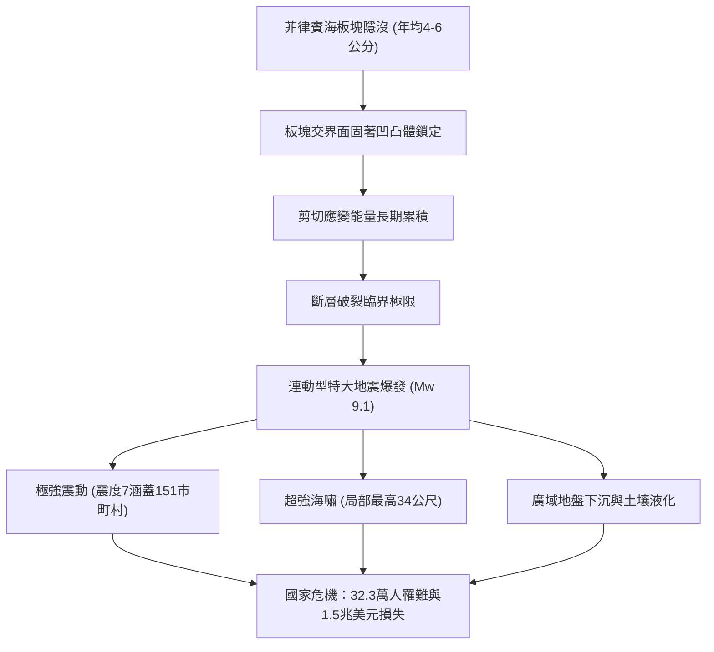

## 引言：日本面臨的最大國家級生存危機
南海海槽（Nankai Trough）是位於日本西南外海長達700至800公里的深海隱沒帶。菲律賓海板塊正以每年4至6公分的速度隱沒於歐亞板塊之下。未來30年內發生規模8至9級特大地震的機率高達70%至80%。最嚴重情景下，將引發高達34公尺的毀滅性海嘯，造成32.3萬人罹難，238萬棟建築倒塌，經濟損失超過220兆日圓。

## 第1章：南海海槽的地球物理機制與板塊力學
斷層滑移受速率與狀態相依摩擦定律規範。深度10至30公里的閉鎖凹凸體累積彈性能量，過渡帶產生慢滑移事件（SSE）與深部低頻微震。海底聲學觀測網（GNSS-A）證實整個斷裂帶處於接近100%的完全強鎖定狀態。

## 第2章：古地震學與1400年週期歷史記錄
歷史文獻與地質海嘯沉積物證實每100至150年週期性發生特大地震：
- 684年白鳳地震、887年仁和地震、1498年明應地震、1707年寶永地震（全區完全連動，49天後引發富士山寶永大噴發）、1854年安政地震（時隔32小時接連破裂）及1944/1946年昭和地震。最東端的東海區域已逾170年未發生破裂。

## 第3章：最新破裂斷層模型與全面受災預測
Mw 9.1特大斷層模型預測：
- 日本氣象廳震度7涵蓋靜岡、愛知、三重、和歌山、高知、宮崎等7縣151個市町村。
- 長週期地震動（第4等級）導致東京、名古屋、大阪平原的超高層摩天大樓發生持續十餘分鐘的劇烈共振。
- 預估死亡32.3萬人，受重傷62.3萬人，全毀建築238.6萬棟。

## 第4章：34公尺大海嘯流體力學與沿海受災
海槽軸部淺層發生20至30公尺劇烈位移，海嘯第一波在震後2至5分鐘內即可抵達靜岡、三重、和歌山及高知沿海，灣奧聚焦效應使局部浪高達34公尺。

## 第5章：連鎖複合次生災害
沿海填海造陸區嚴重液化、木造密集社區75萬棟建築遭大火焚毀、石化園區爆炸與深層山崩阻斷山區交通。

## 第6章：維生管線癱瘓與220兆日圓經濟打擊
3440萬人面臨斷水，2710萬戶停電。東海道大動脈全斷癱瘓全球供應鏈，引發220兆日圓的巨大經濟衝擊。

## 第7章：南海海槽地震臨時情報預警體系
若發生M8.0以上半破裂事件，沿海高風險區域將依法啟動為期一週的事前避難疏散。

## 第8章：海底觀測網（DONET、N-net）與富岳超級電腦
海底光纖感測網提前數十秒預警震波，並透過超級電腦「富岳」在數分鐘內完成都市淹水即時三維模擬。

## 第9章：14天家庭完全自主生存指南
- 耐震等級3住宅、L型金屬件固定家具、感震斷路器防阻通電火災。
- 14天儲備：每人每天3公升飲水、高卡路里糧食、每人70套配高分子凝固劑及醫療級防臭袋（BOS）的應急廁所。
- 星鏈衛星通信與避難所防範失溫及血栓對策。

## 第10章：事前復興計畫與國家韌性建設
推動事前國土重劃與高地遷移，落實防災科學體系。
