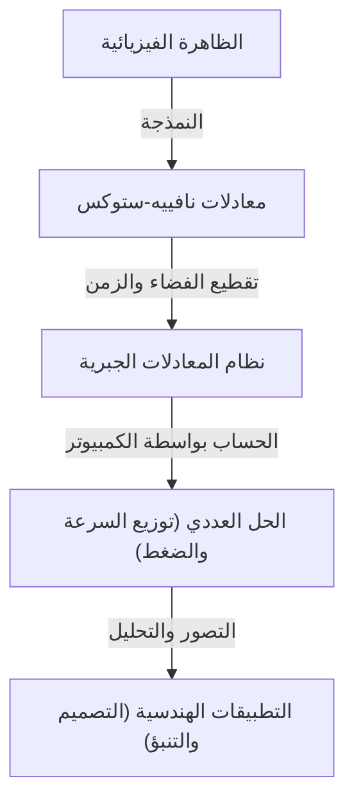

## 1. مقدمة: المعادلات التي تحكم عالم الموائع

إن تدفق الماء والهواء الذي نراه كل يوم يُظهر سلوكًا معقدًا للغاية ويصعب التنبؤ به. الأنماط الجميلة التي تنتشر عند سكب الحليب في القهوة، أو الدوامة العملاقة التي يجلبها الإعصار، أو الهواء الذي يتدفق فوق أجنحة الطائرة. يتم وصف كل هذه الحركات للموائع في إطار عمل واحد وهو **معادلات نافييه-ستوكس** (Navier-Stokes equations).

تم استنتاج هذه المعادلات في القرن التاسع عشر بواسطة كلود-لوي نافييه (Claude-Louis Navier) وجورج غابرييل ستوكس (George Gabriel Stokes). منذ ذلك الحين، لعبت دورًا لا غنى عنه في العلوم والهندسة الحديثة، من التنبؤ بالطقس وتصميم الطائرات إلى تحليل تدفق الدم. ومع ذلك، تخفي هذه المعادلات **لغزًا مطلقًا** لم يتم حله فيزيائيًا ولا رياضيًا.

وهو السؤال: "هل حلول معادلات نافييه-ستوكس للموائع غير القابلة للانضغاط في الفضاء ثلاثي الأبعاد موجودة دائمًا وناعمة؟". هذه واحدة من مسائل جائزة الألفية (Millennium Prize Problems) التي أعلن عنها معهد كلاي للرياضيات (Clay Mathematics Institute) في عام 2000، وسيُمنح من يحلها جائزة قدرها مليون دولار.

في هذا المقال، سنقوم بفك رموز معنى هذه المعادلات الرائعة ونتعمق في سبب صعوبة إثبات وجود حلول لها.

## 2. شكل ومعنى معادلات نافييه-ستوكس

أولاً، دعونا نلقي نظرة على المعادلات نفسها. سننظر هنا إلى معادلات نافييه-ستوكس الأساسية لـ "مائع غير قابل للانضغاط" ذو كثافة ثابتة.

$$
\rho \left( \frac{\partial \mathbf{u}}{\partial t} + (\mathbf{u} \cdot \nabla)\mathbf{u} \right) = -\nabla p + \mu \nabla^2 \mathbf{u} + \mathbf{f}
$$

$$
\nabla \cdot \mathbf{u} = 0
$$

هنا، يمثل كل رمز الكميات الفيزيائية التالية:
- $\mathbf{u}$ : حقل متجه السرعة (velocity vector field) للمائع
- $p$ : الضغط (pressure)
- $\rho$ : الكثافة (density, ثابتة)
- $\mu$ : معامل اللزوجة الديناميكية (dynamic viscosity)
- $\mathbf{f}$ : حقل متجه القوة الخارجية (external force, مثل الجاذبية)

### 2.1. التفسير الفيزيائي لكل حد

هذه المعادلات هي في جوهرها تطبيق لمعادلة نيوتن للحركة $F = ma$ على الموائع. الجانب الأيسر يتوافق مع "الكتلة $\times$ التسارع"، والجانب الأيمن يتوافق مع "القوة المؤثرة على المائع".

#### الجانب الأيسر: حدود القصور الذاتي (Inertial Terms)
الجانب الأيسر هو **المشتقة المادية** (material derivative) التي تمثل تسارع جسيمات المائع.
- $\frac{\partial \mathbf{u}}{\partial t}$ : حد المشتقة المحلية (Local derivative). يمثل التغير في السرعة مع مرور الوقت عند نقطة ثابتة معينة.
- $(\mathbf{u} \cdot \nabla)\mathbf{u}$ : حد الحمل الحراري (Convective term). يمثل التغير في السرعة الناتج عن حركة المائع نفسه. هذا الحد غير خطي بالنسبة للسرعة $\mathbf{u}$، وهو السبب الأكبر للصعوبة الرياضية في ديناميكا الموائع. كما أن حدوث الاضطراب (turbulence) يعود أيضًا إلى هذا الحد غير الخطي.

#### الجانب الأيمن: حدود القوة (Force Terms)
يمثل الجانب الأيمن القوى المختلفة المؤثرة على جسيمات المائع.
- $-\nabla p$ : قوة انحدار الضغط (Pressure gradient force). يُدفع المائع من المناطق ذات الضغط المرتفع إلى المناطق ذات الضغط المنخفض.
- $\mu \nabla^2 \mathbf{u}$ : قوة اللزوجة (Viscous force). هي قوة الاحتكاك الناتجة عن "لزوجة" المائع. لها تأثير في تنعيم فرق السرعة بين طبقات المائع المتجاورة واستقرار التدفق. يتم استخدام معامل لابلاس $\nabla^2$.
- $\mathbf{f}$ : قوة الجسم (Body force). قوة خارجية مؤثرة مثل الجاذبية.

#### معادلة الاستمرارية (Continuity Equation)
المعادلة الثانية $\nabla \cdot \mathbf{u} = 0$ هي "معادلة الاستمرارية" التي تمثل **قانون حفظ الكتلة** (conservation of mass). وتعني أن المائع لا ينبثق أو يختفي، ويبقى حجمه ثابتًا (غير قابل للانضغاط).

## 3. الصعوبات الرياضية: لماذا لا يمكن الإثبات؟

في مجالات الفيزياء والهندسة، يتم "حل" معادلات نافييه-ستوكس يوميًا باستخدام ديناميكا الموائع الحسابية (CFD) على أجهزة الكمبيوتر العملاقة. ومع ذلك، فإن مسألة ما إذا كان "هناك حل دقيق بالمعنى الرياضي" هي مسألة أخرى.

### 3.1. ما هو "وجود حل ناعم"؟

ما يبحث عنه علماء الرياضيات هو إثبات ما إذا كان، لأي شرط ابتدائي معطى، يوجد دائمًا حقل سرعة $\mathbf{u}(x, t)$ وحقل ضغط $p(x, t)$ قابلان للاشتقاق عددًا لا نهائيًا من المرات (ناعمان) يحققان المعادلات في أي وقت مستقبلي $t > 0$.

إذا لم يكن هناك حل ناعم، فهذا يعني أن سرعة التدفق أو الضغط ستتباعد إلى ما لا نهاية (ستحدث نقطة تفرد) في وقت معين (وقت محدود). يُطلق على هذا اسم **الانفجار في وقت محدود** (finite-time blowup).

### 3.2. اللزوجة مقابل اللاخطية: الصراع

يعتمد ما إذا كان الحل سينفجر أم لا على التوازن بين حدين في المعادلة.
- **حد اللزوجة** $\mu \nabla^2 \mathbf{u}$ : الحد "الجيد" الذي يبدد الطاقة ويحاول جعل التدفق سلسًا.
- **حد الحمل الحراري** $(\mathbf{u} \cdot \nabla)\mathbf{u}$ : الحد "السيئ" (الحد غير الخطي) الذي يركز الطاقة في منطقة ضيقة، ويمد الدوامات، ويحاول جعل انحدار السرعة حادًا.

في الفضاء ثنائي الأبعاد، تم إثبات وجود ونعومة الحلول بواسطة جان ليريه (Jean Leray) وآخرين في ثلاثينيات القرن العشرين. في الأبعاد الثنائية، لا توجد آلية لتمدد الدوامات (تمدد خيوط الدوامة)، لذلك يمكن للزوجة قمع الحد غير الخطي.

ومع ذلك، في الفضاء ثلاثي الأبعاد، تتشابك الموائع بشكل معقد، وتتمدد خيوط الدوامة، مما يتسبب في ظاهرة تتسلسل فيها الطاقة إلى مقاييس صغيرة جدًا (التسلسل الطاقي). باستخدام الطرق الرياضية الحالية، من المستحيل تقييم ما إذا كانت اللزوجة قادرة دائمًا على قمع هذا التأثير غير الخطي القوي الفريد في الأبعاد الثلاثية.

### 3.3. الحلول الضعيفة (Weak Solutions) ومساهمة ليريه

قدم جان ليريه أيضًا مفهوم **الحلول الضعيفة** (weak solutions) الذي يخفف من شروط الاشتقاق للمعادلات. أثبت ليريه أنه حتى في الفضاء ثلاثي الأبعاد، يوجد حل ضعيف (واحد على الأقل) يحقق متباينة الطاقة بشكل عام (حلول ليريه-هوبف الضعيفة).

ومع ذلك، لا يزال من غير المعروف حتى اليوم ما إذا كان هذا الحل الضعيف فريدًا (محددًا بحل واحد) وما إذا كان ناعمًا.

## 4. الصياغة كمسألة من مسائل جائزة الألفية

الإعداد الرسمي للمسألة من قبل معهد كلاي للرياضيات، بعبارات عامة، هو إثبات واحد مما يلي.

1. **إثبات الوجود والنعومة**: إثبات أنه لأي شروط ابتدائية ناعمة وقوى خارجية، يوجد حل ناعم مُعرّف في الفضاء بأكمله ويستمر إلى الأبد في المستقبل.
2. **إثبات انهيار الحل (الانفجار)**: تكوين مثال حيث يفقد الحل نعومته (يمتلك نقطة تفرد) في وقت محدود عند إعطاء شروط ابتدائية ناعمة وقوى خارجية محددة.

لقد تحدى العديد من علماء الرياضيات العباقرة هذه المسألة حتى الآن، لكن لم يتم التوصل إلى حل كامل. حتى أحد أعظم علماء الرياضيات في العصر الحديث، مثل تيرينس تاو (Terence Tao)، أظهر نتيجة مفادها أن "الحل ينفجر في وقت محدود في معادلات نافييه-ستوكس المتوسطة"، مما يبرز مدى صعوبة المسألة الأصلية.

## 5. كيف سيتغير العالم عند حلها؟

إذا تم حل هذه المسألة، فما هو التأثير الذي ستحدثه؟

### 5.1. قفزة هائلة في الرياضيات
من المحتمل أن يتطلب إثبات الوجود، أو إثبات الانفجار، أدوات رياضية جديدة تمامًا تتجاوز إطار نظرية المعادلات التفاضلية الجزئية الحالية. سيكون هذا اختراقًا هائلاً في تحليل الظواهر غير الخطية.

### 5.2. فهم الاضطراب
حتى لو تم إثبات نعومة الحلول، فلن يؤدي ذلك على الفور إلى تحسين كفاءة استهلاك الوقود في الطائرات. ومع ذلك، سيضمن ذلك أن معادلات نافييه-ستوكس هي نموذج مثالي يمكنه وصف الظاهرة المعقدة للغاية للاضطراب دون أن ينهار حتى على المقاييس المجهرية. من المرجح أن يؤدي هذا إلى تقدم كبير في فهم الآليات الفيزيائية للاضطراب.

### 5.3. اكتشاف ظواهر فيزيائية جديدة
على العكس من ذلك، ماذا سيحدث إذا تم إثبات أن الحل ينفجر في وقت محدود؟ سيعني هذا أنه عندما يصل المائع إلى حالة قاسية، تنهار معادلات نافييه-ستوكس (أي فرضية الاستمرارية)، ويجب أخذ قوانين فيزيائية جديدة على نطاق الذرات والجزيئات في الاعتبار. سيكون هذا في حد ذاته اكتشافًا مذهلاً في الفيزياء.

## 6. العلاقة مع الحساب العددي: حدود وإمكانيات CFD

على الرغم من عدم اكتمال الإثبات الرياضي، يقوم المهندسون بحل معادلات نافييه-ستوكس عدديًا وتطبيقها في العالم الحقيقي. كيف يتم سد هذه الفجوة؟

### 6.1. نهج ديناميكا الموائع الحسابية (CFD)

عند حل المعادلات باستخدام الكمبيوتر، يتم تقسيم الفضاء والزمن المستمرين إلى عدد محدود من الشبكات (الخلايا). يُطلق على هذا اسم التقطيع (Discretization).

### 6.2. الحاجة إلى نماذج الاضطراب

بسبب محدودية القدرة الحاسوبية، من المستحيل تمثيل كل شيء على شبكة وصولاً إلى أصغر مقياس للاضطراب (مقياس كولموجوروف). لذلك، يتم إدخال **نماذج الاضطراب** (Turbulence models) التي تتعامل تقريبيًا مع سلوك الدوامات الصغيرة.
من الأمثلة النموذجية RANS (Reynolds-Averaged Navier-Stokes) و LES (Large Eddy Simulation). فهم الخصائص الرياضية للمعادلات الأصلية أمر مهم لتقييم صحة هذه النماذج.

## 7. الخاتمة

تخفي معادلات نافييه-ستوكس، في صيغتها الرياضية التي تبدو بسيطة، تعقيد الكون بأسره. من الدوامة في فنجان القهوة إلى دوران الغلاف الجوي للمشتري، ينبع جمال الموائع وفوضاها من هذه المعادلات.

السبب وراء استمرار علماء الرياضيات في تحدي هذا "اللغز المطلق" ليس فقط من أجل الجائزة البالغة مليون دولار. بل هو تحدٍ لمعرفة إلى أي مدى يمكن للعقل البشري أن يفهم الظواهر المعقدة في العالم الطبيعي باستخدام لغة الرياضيات، واختبار لتلك الحدود.

إذا جاء اليوم الذي يفهم فيه علماء الرياضيات في المستقبل هذه المعادلات تمامًا، فسنتمكن من القول إننا "فهمنا" تدفق الماء والهواء بالمعنى الحقيقي. حتى ذلك اليوم، ستظل معادلات نافييه-ستوكس جبلاً جميلًا ولكنه وعر يقف على طليعة العلم.

---
*هذا المقال هو نظرة عامة على موضوع عميق يقع عند تقاطع ديناميكا الموائع والرياضيات. لأولئك الذين لديهم اهتمام أكبر، نوصي بالرجوع إلى نصوص أكثر تخصصًا حول المعادلات التفاضلية الجزئية والوثائق الرسمية لمعهد كلاي للرياضيات.*
