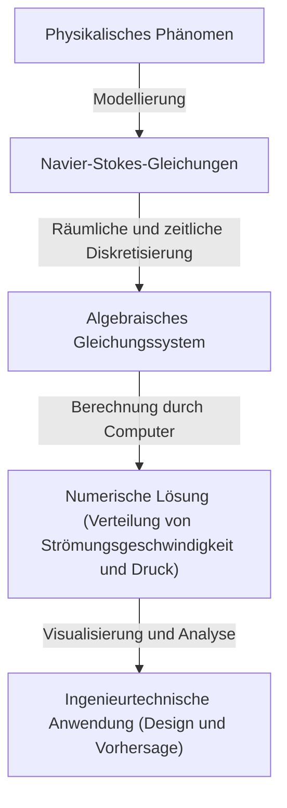

## 1. Einleitung: Die Gleichungen, die die Welt der Fluide beherrschen

Die Strömungen von Wasser und Luft, die wir alltäglich sehen, zeigen ein äußerst komplexes und schwer vorhersehbares Verhalten. Das schöne Muster, das sich ausbreitet, wenn man Milch in den Kaffee gießt, die riesigen Wirbel, die ein Taifun mit sich bringt, oder die Luft, die über die Flügel eines Flugzeugs strömt. All diese Bewegungen von Fluiden werden in einem einzigen Rahmen durch die **Navier-Stokes-Gleichungen** (Navier-Stokes equations) beschrieben.

Diese Gleichungen wurden im 19. Jahrhundert von Claude-Louis Navier und George Gabriel Stokes abgeleitet. Seitdem spielen sie in der modernen Wissenschaft und Technik eine unverzichtbare Rolle, von der Wettervorhersage über das Design von Flugzeugen bis hin zur Analyse des Blutflusses. Jedoch verbirgt sich in diesen Gleichungen ein physikalisch und mathematisch noch ungelöstes, **ultimatives Rätsel**.

Es ist die Frage: "Existieren immer glatte Lösungen für die inkompressiblen Navier-Stokes-Gleichungen im dreidimensionalen Raum?" Dies ist eines der Millennium-Probleme (Millennium Prize Problems), die das Clay Mathematics Institute im Jahr 2000 bekannt gab, und derjenige, der es löst, erhält ein Preisgeld von 1 Million Dollar.

In diesem Artikel werden wir die Bedeutung dieser faszinierenden Gleichungen entschlüsseln und tiefgehend untersuchen, warum es so schwierig ist, die Existenz ihrer Lösungen zu beweisen.

## 2. Form und Bedeutung der Navier-Stokes-Gleichungen

Schauen wir uns zunächst die Gleichungen selbst an. Hier betrachten wir die grundlegendsten Navier-Stokes-Gleichungen für ein "inkompressibles Fluid" mit konstanter Dichte.

$$
\rho \left( \frac{\partial \mathbf{u}}{\partial t} + (\mathbf{u} \cdot \nabla)\mathbf{u} \right) = -\nabla p + \mu \nabla^2 \mathbf{u} + \mathbf{f}
$$

$$
\nabla \cdot \mathbf{u} = 0
$$

Hier stehen die jeweiligen Symbole für die folgenden physikalischen Größen:
- $\mathbf{u}$ : Geschwindigkeitsvektorfeld (velocity vector field)
- $p$ : Druck (pressure)
- $\rho$ : Dichte (density, konstant)
- $\mu$ : Dynamische Viskosität (dynamic viscosity)
- $\mathbf{f}$ : Äußeres Kraftvektorfeld (external force, wie Schwerkraft)

### 2.1. Physikalische Interpretation der einzelnen Terme

Diese Gleichungen sind im Wesentlichen Newtons Bewegungsgleichung $F = ma$, angewandt auf ein Fluid. Die linke Seite entspricht der "Masse $\times$ Beschleunigung", und die rechte Seite den "auf das Fluid wirkenden Kräften".

#### Linke Seite: Trägheitsterme (Inertial Terms)
Die linke Seite ist die **materielle Ableitung** (material derivative), die die Beschleunigung eines Fluidteilchens darstellt.
- $\frac{\partial \mathbf{u}}{\partial t}$ : Lokaler Ableitungsterm (Local derivative). Er beschreibt die zeitliche Änderung der Geschwindigkeit an einem bestimmten festen Punkt.
- $(\mathbf{u} \cdot \nabla)\mathbf{u}$ : Konvektiver Term (Convective term). Er beschreibt die Änderung der Geschwindigkeit, die durch die Bewegung des Fluids selbst entsteht. Dieser Term ist in Bezug auf die Geschwindigkeit $\mathbf{u}$ nichtlinear und die größte Ursache für mathematische Schwierigkeiten in der Strömungsmechanik. Die Entstehung von Turbulenz (turbulence) geht ebenfalls auf diesen nichtlinearen Term zurück.

#### Rechte Seite: Kraftterme (Force Terms)
Die rechte Seite stellt die verschiedenen Kräfte dar, die auf ein Fluidteilchen wirken.
- $-\nabla p$ : Druckgradientenkraft (Pressure gradient force). Das Fluid wird von Bereichen mit hohem Druck in solche mit niedrigem Druck gedrückt.
- $\mu \nabla^2 \mathbf{u}$ : Viskose Kraft (Viscous force). Dies ist die Reibungskraft aufgrund der "Zähigkeit" des Fluids. Sie gleicht Geschwindigkeitsunterschiede benachbarter Fluidschichten aus und hat den Effekt, die Strömung zu stabilisieren. Hierbei wird der Laplace-Operator $\nabla^2$ verwendet.
- $\mathbf{f}$ : Äußere Kraft (Body force). Eine von außen wirkende Kraft wie die Schwerkraft.

#### Kontinuitätsgleichung (Continuity Equation)
Die zweite Gleichung $\nabla \cdot \mathbf{u} = 0$ ist die **Kontinuitätsgleichung** (conservation of mass), die den Massenerhaltungssatz ausdrückt. Sie bedeutet, dass kein Fluid entsteht oder verschwindet und das Volumen konstant bleibt (es ist inkompressibel).

## 3. Mathematische Schwierigkeiten: Warum kann man es nicht beweisen?

In der Physik und Ingenieurspraxis werden die Navier-Stokes-Gleichungen täglich durch numerische Strömungsmechanik (CFD) mit Supercomputern "gelöst". Ob jedoch im mathematischen Sinne "strikte Lösungen existieren", ist eine andere Frage.

### 3.1. Was bedeutet "die Existenz einer glatten Lösung"?

Was Mathematiker suchen, ist der Beweis, dass für eine gegebene Anfangsbedingung zu jedem zukünftigen Zeitpunkt $t > 0$ ein unendlich oft differenzierbares (glattes) Geschwindigkeitsfeld $\mathbf{u}(x, t)$ und Druckfeld $p(x, t)$, die die Gleichungen erfüllen, stets existieren.

Wenn keine glatte Lösung existiert, bedeutet dies, dass an einem bestimmten Zeitpunkt (in endlicher Zeit) Strömungsgeschwindigkeit oder Druck ins Unendliche divergieren (eine Singularität entsteht). Dies nennt man einen **Blow-up in endlicher Zeit** (finite-time blowup).

### 3.2. Viskosität vs. Nichtlinearität: Ein Konflikt

Ob eine Lösung explodiert, hängt vom Gleichgewicht zweier Terme in der Gleichung ab.
- **Viskoser Term** $\mu \nabla^2 \mathbf{u}$ : Ein "guter" Term, der Energie dissipiert und versucht, die Strömung zu glätten.
- **Konvektiver Term** $(\mathbf{u} \cdot \nabla)\mathbf{u}$ : Ein "schlechter" Term (nichtlinearer Term), der versucht, Energie in kleine Bereiche zu konzentrieren, Wirbel zu strecken und den Geschwindigkeitsgradienten drastisch zu versteilern.

Im zweidimensionalen Raum wurde die Existenz und Glattheit von Lösungen in den 1930er Jahren von Jean Leray und anderen bewiesen. In zwei Dimensionen gibt es den Mechanismus der Wirbelstreckung nicht, sodass die Viskosität den nichtlinearen Term unterdrücken kann.

Im dreidimensionalen Raum jedoch verstrickt sich das Fluid auf komplexe Weise, Wirbelfäden werden gestreckt und ein Phänomen tritt auf, bei dem Energie sukzessive auf extrem kleine Skalen kaskadiert (Energiekaskade). Mit aktuellen mathematischen Methoden lässt sich nicht bewerten, ob die Viskosität diese starke, dreidimensional-spezifische nichtlineare Wirkung stets unterdrücken kann.

### 3.3. Schwache Lösungen (Weak Solutions) und Lerays Beitrag

Jean Leray führte auch das Konzept der **schwachen Lösungen** (weak solutions) ein, das die Differenzierbarkeitsbedingungen der Gleichungen lockert. Leray bewies, dass selbst im dreidimensionalen Raum (mindestens eine) schwache Lösung, die die Energieungleichung erfüllt, global existiert (Leray-Hopf-schwache Lösung).

Jedoch bleibt bis heute ungeklärt, ob diese schwache Lösung eindeutig ist (auf eine einzige festgelegt ist) und ob sie glatt ist.

## 4. Formulierung als Millennium-Problem

Die offizielle Problemstellung des Clay Mathematics Institute lautet grob gesagt, eines der folgenden Dinge zu beweisen:

1. **Beweis der Existenz und Glattheit**: Zeigen, dass für beliebige glatte Anfangsbedingungen und äußere Kräfte eine im gesamten Raum definierte glatte Lösung für alle Zeiten existiert.
2. **Beweis des Zusammenbruchs (Blow-up) der Lösung**: Ein Beispiel konstruieren, bei dem durch Vorgabe einer bestimmten glatten Anfangsbedingung und äußerer Kraft die Lösung in endlicher Zeit ihre Glattheit verliert (eine Singularität aufweist).

Bisher haben viele geniale Mathematiker dieses Problem in Angriff genommen, aber es kam nicht zu einer vollständigen Lösung. Selbst einer der größten zeitgenössischen Mathematiker wie Terence Tao zeigte ein Ergebnis, dass "bei einer gemittelten Navier-Stokes-Gleichung die Lösung in endlicher Zeit explodiert", was die Schwierigkeit des ursprünglichen Problems hervorhob.

## 5. Wie wird sich die Welt verändern, wenn es gelöst ist?

Welche Auswirkungen hätte es, wenn dieses Problem gelöst würde?

### 5.1. Ein dramatischer Fortschritt in der Mathematik
Für den Beweis der Existenz oder des Blow-ups einer Lösung werden völlig neue mathematische Werkzeuge benötigt, die den Rahmen der aktuellen Theorie der partiellen Differentialgleichungen überschreiten. Dies wäre ein gewaltiger Durchbruch für die Analyse nichtlinearer Phänomene.

### 5.2. Verständnis von Turbulenz
Nur weil die Glattheit der Lösungen bewiesen wird, bedeutet das nicht, dass Flugzeuge sofort sparsamer werden. Es würde jedoch garantiert werden, dass die Navier-Stokes-Gleichungen ein perfektes Modell sind, das das extrem komplexe Phänomen der Turbulenz bis hinab in die mikroskopische Welt ohne Zusammenbruch beschreiben kann. Dies könnte das Verständnis der physikalischen Mechanismen der Turbulenz erheblich voranbringen.

### 5.3. Entdeckung neuer physikalischer Phänomene
Was passiert umgekehrt, wenn bewiesen wird, dass die Lösung in endlicher Zeit explodiert? Das würde bedeuten, dass bei Erreichen eines Extremzustands des Fluids die Navier-Stokes-Gleichungen (also die Kontinuumshypothese) zusammenbrechen und neue physikalische Gesetze auf der Ebene von Atomen und Molekülen in Betracht gezogen werden müssen. Auch das wäre eine erstaunliche Entdeckung in der Physik.

## 6. Die Beziehung zu numerischen Berechnungen: Grenzen und Möglichkeiten von CFD

Obwohl der mathematische Beweis nicht abgeschlossen ist, lösen Ingenieure die Navier-Stokes-Gleichungen numerisch und wenden sie in der Praxis an. Wie wird diese Lücke geschlossen?

### 6.1. Der Ansatz der numerischen Strömungsmechanik (CFD)

Wenn Gleichungen mit einem Computer gelöst werden, werden der kontinuierliche Raum und die Zeit in eine endliche Anzahl von Gittern (Grids) unterteilt. Dies wird als Diskretisierung bezeichnet.

### 6.2. Die Notwendigkeit von Turbulenzmodellen

Da die Kapazität von Computern begrenzt ist, ist es unmöglich, alles bis zur kleinsten Skala der Turbulenz (Kolmogorow-Skala) in Gittern darzustellen. Daher werden **Turbulenzmodelle** (Turbulence models) eingeführt, die das Verhalten kleiner Wirbel näherungsweise behandeln.
Typische Beispiele sind RANS (Reynolds-Averaged Navier-Stokes) und LES (Large Eddy Simulation). Auch um die Gültigkeit dieser Modelle zu bewerten, ist es wichtig, die mathematischen Eigenschaften der ursprünglichen Gleichungen zu verstehen.

## 7. Fazit

Die Navier-Stokes-Gleichungen bergen die Komplexität des Universums in einer scheinbar einfachen Formel. Von den Wirbeln in einer Kaffeetasse bis hin zur atmosphärischen Zirkulation auf dem Jupiter entspringen die Schönheit und das Chaos von Fluiden allein dieser Gleichung.

Der Grund, warum Mathematiker dieses "ultimative Rätsel" weiterhin herausfordern, ist nicht nur das Preisgeld von einer Million Dollar. Es ist eine Herausforderung an die Grenzen dessen, wie weit die menschliche Vernunft die komplexen Phänomene der Natur mit der Sprache der Mathematik erfassen kann.

Wenn der Tag kommt, an dem ein zukünftiger Mathematiker diese Gleichung vollständig versteht, werden wir sagen können, dass wir die Strömungen von Wasser und Luft im wahren Sinne "verstanden" haben. Bis zu diesem Tag werden die Navier-Stokes-Gleichungen wie ein wunderschöner, aber steiler Berg an vorderster Front der Wissenschaft stehen bleiben.

---
*Dieser Artikel bietet einen Überblick über ein tiefgreifendes Thema an der Schnittstelle von Strömungsmechanik und Mathematik. Für Interessierte empfiehlt es sich, spezialisiertere Texte zu partiellen Differentialgleichungen oder die offiziellen Dokumente des Clay Mathematics Institute heranzuziehen.*
