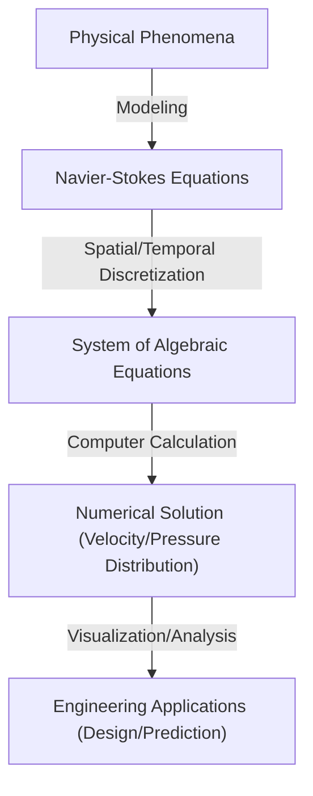

## 1. Introduction: The Equations Governing the World of Fluids

The flows of water and air we see every day exhibit extremely complex and unpredictable behavior. The beautiful patterns that spread when milk is poured into coffee, the massive vortices brought by typhoons, or the air flowing over an airplane's wings. Describing the motion of all these fluids in a single framework is the **Navier-Stokes equations**.

These equations were derived in the 19th century by Claude-Louis Navier and George Gabriel Stokes. Since then, they have played an indispensable role in modern science and engineering, from weather forecasting to aircraft design, and even blood flow analysis. However, an **ultimate mystery** that has not yet been unraveled, both physically and mathematically, lies hidden within these equations.

The question is, "Do solutions to the incompressible Navier-Stokes equations in three-dimensional space always exist and are they smooth?" This is one of the Millennium Prize Problems announced by the Clay Mathematics Institute in 2000, and a prize of $1 million will be awarded to whoever solves it.

In this article, we will unravel the meaning of these fascinating equations and dig deep into why proving the existence of their solutions is so difficult.

## 2. Form and Meaning of the Navier-Stokes Equations

First, let's look at the equations themselves. Here, we consider the Navier-Stokes equations for the most basic "incompressible fluid" with a constant density.

$$
\rho \left( \frac{\partial \mathbf{u}}{\partial t} + (\mathbf{u} \cdot \nabla)\mathbf{u} \right) = -\nabla p + \mu \nabla^2 \mathbf{u} + \mathbf{f}
$$

$$
\nabla \cdot \mathbf{u} = 0
$$

Here, each symbol represents the following physical quantities:
- $\mathbf{u}$ : Velocity vector field
- $p$ : Pressure
- $\rho$ : Density (constant)
- $\mu$ : Dynamic viscosity
- $\mathbf{f}$ : External force vector field (gravity, etc.)

### 2.1. Physical Interpretation of Each Term

These equations are essentially Newton's equation of motion $F = ma$ applied to a fluid. The left side corresponds to "mass $\times$ acceleration," and the right side corresponds to "forces acting on the fluid."

#### Left Side: Inertial Terms
The left side is the **material derivative** representing the acceleration of fluid particles.
- $\frac{\partial \mathbf{u}}{\partial t}$ : Local derivative. Represents the time variation of velocity at a fixed point.
- $(\mathbf{u} \cdot \nabla)\mathbf{u}$ : Convective term. Represents the change in velocity caused by the fluid itself moving. This term is nonlinear with respect to the velocity $\mathbf{u}$, and is the greatest cause of mathematical difficulties in fluid dynamics. The occurrence of turbulence is also attributed to this nonlinear term.

#### Right Side: Force Terms
The right side represents various forces acting on fluid particles.
- $-\nabla p$ : Pressure gradient force. The fluid is pushed from higher pressure to lower pressure.
- $\mu \nabla^2 \mathbf{u}$ : Viscous force. The frictional force due to the "stickiness" of the fluid. It smooths out velocity differences between adjacent fluid layers and has the effect of stabilizing the flow. The Laplacian $\nabla^2$ is used.
- $\mathbf{f}$ : Body force. External forces applied, such as gravity.

#### Continuity Equation
The second equation $\nabla \cdot \mathbf{u} = 0$ is the "continuity equation" representing the **conservation of mass**. It means that the fluid does not spring forth or disappear, and its volume remains constant (it is incompressible).

## 3. Mathematical Difficulties: Why Can't It Be Proved?

In the fields of physics and engineering, the Navier-Stokes equations are "solved" every day using computational fluid dynamics (CFD) with supercomputers. However, whether a "strict solution exists" in a mathematical sense is another problem.

### 3.1. What is the "Existence of Smooth Solutions"?

What mathematicians are seeking is a proof of whether, for a given initial condition, an infinitely differentiable (smooth) velocity field $\mathbf{u}(x, t)$ and pressure field $p(x, t)$ that satisfy the equations at any arbitrary future time $t > 0$ always exist.

If a smooth solution does not exist, the flow velocity or pressure would diverge to infinity (a singularity occurs) at a certain time (in finite time). This is called **finite-time blowup**.

### 3.2. Viscosity vs Nonlinearity: The Struggle

Whether the solution blows up or not is determined by the balance of two terms in the equations.
- **Viscous force** $\mu \nabla^2 \mathbf{u}$ : A "good" term that attempts to dissipate energy and make the flow smooth.
- **Convective term** $(\mathbf{u} \cdot \nabla)\mathbf{u}$ : A "bad" term (nonlinear term) that attempts to concentrate energy in narrow areas, stretch vortices, and steepen velocity gradients.

In two-dimensional space, the existence and smoothness of solutions were proved by Jean Leray and others in the 1930s. In two dimensions, there is no mechanism for vortices to stretch (vortex stretching), so viscosity can suppress the nonlinear term.

However, in three-dimensional space, the fluid entangles complexly, and a phenomenon (energy cascade) occurs where vortex tubes are stretched and energy cascades into infinitesimally small scales one after another. With current mathematical techniques, it cannot be evaluated whether viscosity can always suppress this powerful nonlinear effect peculiar to three dimensions.

### 3.3. Weak Solutions and Leray's Contribution

Jean Leray also introduced the concept of **weak solutions**, which relaxes the differential conditions of the equations. Leray proved that even in three-dimensional space, weak solutions that satisfy the energy inequality (Leray-Hopf weak solutions) exist globally (at least one exists).

However, whether this weak solution is unique (whether it is uniquely determined) and whether it is smooth remains unknown to this day.

## 4. Formulation as a Millennium Prize Problem

The official problem setting by the Clay Mathematics Institute is, roughly speaking, to prove one of the following.

1. **Proof of Existence and Smoothness**: Show that for any smooth initial conditions and external forces, smooth solutions defined over the entire space exist eternally into the future.
2. **Proof of Breakdown (Blowup) of Solutions**: Construct an example where, given certain smooth initial conditions and external forces, the solution loses its smoothness (has a singularity) in finite time.

Many genius mathematicians have tackled this problem so far, but a complete resolution has not been reached. Even Terence Tao, one of the greatest modern mathematicians, showed a result that "solutions blow up in finite time in the averaged Navier-Stokes equations," highlighting the difficulty of the original problem.

## 5. How Will the World Change When Unraveled?

What impact would there be if this problem were solved?

### 5.1. Dramatic Progress in Mathematics
Proving the existence or blowup of solutions will require entirely new mathematical tools that go beyond the framework of current partial differential equation theory. It would be a massive breakthrough for analyzing nonlinear phenomena.

### 5.2. Understanding Turbulence
Just because the smoothness of solutions is proven does not mean airplanes will immediately get better fuel efficiency. However, it will guarantee that the Navier-Stokes equations are a perfect model capable of flawlessly describing the extremely complex phenomenon of turbulence down to the microscopic world. This could greatly advance the understanding of the physical mechanisms of turbulence.

### 5.3. Discovery of New Physical Phenomena
Conversely, what happens if it is proved that solutions blow up in finite time? It means that when a fluid reaches an extreme state, the Navier-Stokes equations (that is, the continuum hypothesis) break down, and new physical laws at the atomic or molecular scale must be considered. This in itself would be an astonishing discovery in physics.

## 6. Relationship with Numerical Calculations: Limits and Possibilities of CFD

Even though the mathematical proof is incomplete, engineers solve the Navier-Stokes equations numerically and put them to use in the real world. How is this gap bridged?

### 6.1. Computational Fluid Dynamics (CFD) Approach

When solving equations using a computer, continuous space and time are divided into a finite number of grids. This is called discretization.

### 6.2. Necessity of Turbulence Models

Because there is a limit to computer capabilities, it is impossible to represent everything down to the smallest scale of turbulence (Kolmogorov scale) with grids. Therefore, **turbulence models** are introduced to approximately handle the behavior of small vortices.
Representative models include RANS (Reynolds-Averaged Navier-Stokes) and LES (Large Eddy Simulation). Understanding the mathematical properties of the original equations is also important for evaluating the validity of these models.

## 7. Conclusion

The Navier-Stokes equations hide the complexity of the universe within seemingly simple formulas. From the vortex in a coffee cup to the atmospheric circulation of Jupiter, the beauty and chaos of fluids are all born from these equations.

The reason mathematicians continue to challenge this "ultimate mystery" is not simply for the $1 million prize. It is a challenge to the limits of how far human reason can grasp the complex phenomena of the natural world in the language of mathematics.

If the day comes when a mathematician of the future completely understands these equations, we will be able to say that we have "understood" the flow of water and air in the truest sense. Until that day, the Navier-Stokes equations will remain a beautiful yet rugged mountain towering at the forefront of science.

---
*This article is an overview of profound themes at the intersection of fluid dynamics and mathematics. For those who are interested, we recommend referring to more specialized texts on partial differential equations and the official documents of the Clay Mathematics Institute.*
