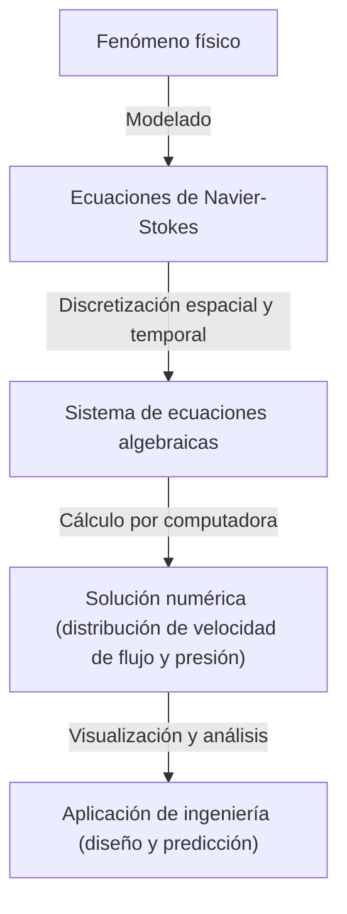

## 1. Introducción: Las ecuaciones que rigen el mundo de los fluidos

El flujo de agua y aire que vemos todos los días se comporta de manera extremadamente compleja e impredecible. Los hermosos patrones que se extienden al verter leche en el café, los vórtices gigantes traídos por los tifones, o el aire fluyendo sobre las alas de un avión. El marco único que describe el movimiento de todos estos fluidos son las **ecuaciones de Navier-Stokes** (Navier-Stokes equations).

Estas ecuaciones fueron derivadas en el siglo XIX por Claude-Louis Navier y George Gabriel Stokes. Desde entonces, han jugado un papel indispensable en la ciencia y la ingeniería modernas, desde la predicción del tiempo hasta el diseño de aeronaves y el análisis del flujo sanguíneo. Sin embargo, estas ecuaciones esconden un **misterio definitivo** que aún no ha sido resuelto ni física ni matemáticamente.

La pregunta es: "¿Las soluciones de las ecuaciones de Navier-Stokes incompresibles en un espacio tridimensional siempre existen y son suaves?". Este es uno de los Problemas del Milenio (Millennium Prize Problems) anunciados por el Instituto de Matemáticas Clay (Clay Mathematics Institute) en el año 2000, y se otorga un premio de un millón de dólares a quien lo resuelva.

En este artículo, desentrañaremos el significado de estas fascinantes ecuaciones y profundizaremos en por qué es tan difícil demostrar la existencia de sus soluciones.

## 2. La forma y el significado de las ecuaciones de Navier-Stokes

Primero, echemos un vistazo a las ecuaciones en sí. Aquí consideraremos las ecuaciones de Navier-Stokes más básicas para un "fluido incompresible" con densidad constante.

$$
\rho \left( \frac{\partial \mathbf{u}}{\partial t} + (\mathbf{u} \cdot \nabla)\mathbf{u} \right) = -\nabla p + \mu \nabla^2 \mathbf{u} + \mathbf{f}
$$

$$
\nabla \cdot \mathbf{u} = 0
$$

Aquí, cada símbolo representa las siguientes cantidades físicas:
- $\mathbf{u}$ : Campo vectorial de velocidad (velocity vector field)
- $p$ : Presión (pressure)
- $\rho$ : Densidad (density, constante)
- $\mu$ : Coeficiente de viscosidad dinámica (dynamic viscosity)
- $\mathbf{f}$ : Campo vectorial de fuerza externa (external force, gravedad, etc.)

### 2.1. Interpretación física de cada término

Estas ecuaciones son esencialmente una aplicación de la ecuación de movimiento de Newton $F = ma$ a los fluidos. El lado izquierdo corresponde a la "masa $\times$ aceleración" y el lado derecho a la "fuerza que actúa sobre el fluido".

#### Lado izquierdo: Términos inerciales (Inertial Terms)
El lado izquierdo es la **derivada material** (material derivative) que representa la aceleración de una partícula de fluido.
- $\frac{\partial \mathbf{u}}{\partial t}$ : Término de derivada local (Local derivative). Representa el cambio de velocidad a lo largo del tiempo en un punto fijo.
- $(\mathbf{u} \cdot \nabla)\mathbf{u}$ : Término convectivo (Convective term). Representa el cambio de velocidad causado por el movimiento del propio fluido. Este término es no lineal con respecto a la velocidad $\mathbf{u}$ y es la mayor causa de dificultad matemática en la dinámica de fluidos. La aparición de turbulencias (turbulence) también se debe a este término no lineal.

#### Lado derecho: Términos de fuerza (Force Terms)
El lado derecho representa las diversas fuerzas que actúan sobre una partícula de fluido.
- $-\nabla p$ : Término de fuerza de gradiente de presión (Pressure gradient force). El fluido es empujado desde un área de alta presión hacia un área de baja presión.
- $\mu \nabla^2 \mathbf{u}$ : Término de fuerza viscosa (Viscous force). Es la fuerza de fricción debida a la "pegajosidad" del fluido. Tiene el efecto de suavizar la diferencia de velocidad de las capas de fluido adyacentes y estabilizar el flujo. Se utiliza el laplaciano $\nabla^2$.
- $\mathbf{f}$ : Término de fuerza externa (Body force). Son las fuerzas aplicadas desde el exterior, como la gravedad.

#### Ecuación de continuidad (Continuity Equation)
La segunda ecuación $\nabla \cdot \mathbf{u} = 0$ es la "ecuación de continuidad" que representa la **ley de conservación de la masa** (conservation of mass). Significa que el fluido no brota ni desaparece y el volumen se mantiene constante (es incompresible).

## 3. Dificultad matemática: ¿Por qué no se puede demostrar?

En el campo de la física y la ingeniería, las ecuaciones de Navier-Stokes se "resuelven" diariamente mediante la dinámica de fluidos computacional (CFD) utilizando supercomputadoras. Sin embargo, si existe una "solución estricta" en un sentido matemático es un problema completamente diferente.

### 3.1. ¿Qué es la "existencia de soluciones suaves"?

Lo que buscan los matemáticos es demostrar si, dada una condición inicial, un campo de velocidad $\mathbf{u}(x, t)$ y un campo de presión $p(x, t)$ que sean infinitamente diferenciables (suaves) y que satisfagan las ecuaciones en cualquier momento futuro $t > 0$ siempre existen.

Si no existe una solución suave, la velocidad del flujo o la presión divergirán al infinito (ocurrirá una singularidad) en un momento determinado (tiempo finito). A esto se le llama **explosión en tiempo finito** (finite-time blowup).

### 3.2. Viscosidad vs No linealidad: Un tira y afloja

Si la solución explota o no depende del equilibrio de los dos términos de la ecuación.
- **Término viscoso** $\mu \nabla^2 \mathbf{u}$ : Un "buen" término que intenta disipar la energía y suavizar el flujo.
- **Término convectivo** $(\mathbf{u} \cdot \nabla)\mathbf{u}$ : Un "mal" término (término no lineal) que intenta concentrar la energía en un área pequeña, estirar los vórtices y hacer que el gradiente de velocidad sea agudo.

En el espacio bidimensional, la existencia y suavidad de las soluciones fue demostrada en la década de 1930 por Jean Leray y otros. En dos dimensiones, como no existe el mecanismo por el cual los vórtices se estiran (estiramiento de filamentos de vórtice), la viscosidad puede suprimir el término no lineal.

Sin embargo, en el espacio tridimensional, el fluido se entrelaza de manera compleja y ocurre un fenómeno en el que los filamentos de vórtice se estiran y la energía se desplaza en cascada hacia escalas microscópicas sucesivas (cascada de energía). Con los métodos matemáticos actuales, es imposible evaluar si la viscosidad siempre puede suprimir este poderoso efecto no lineal exclusivo de las tres dimensiones.

### 3.3. Soluciones débiles (Weak Solutions) y la contribución de Leray

Jean Leray también introdujo el concepto de **soluciones débiles** (weak solutions), que relaja las condiciones diferenciales de las ecuaciones. Leray demostró que incluso en el espacio tridimensional, las soluciones débiles que satisfacen la desigualdad de energía (al menos una) existen globalmente (soluciones débiles de Leray-Hopf).

Sin embargo, todavía se desconoce si esta solución débil es única (se determina unívocamente) y si es suave.

## 4. Formulación como Problema del Milenio

La configuración oficial del problema por parte del Instituto de Matemáticas Clay requiere, a grandes rasgos, que se demuestre una de las siguientes afirmaciones.

1. **Demostración de existencia y suavidad**: Mostrar que para cualquier condición inicial suave y fuerza externa, una solución suave definida en todo el espacio existirá para siempre en el futuro.
2. **Demostración de ruptura (explosión) de la solución**: Demostrar que, dada una condición inicial suave y una fuerza externa específicas, se puede construir un ejemplo en el que la solución pierda su suavidad (tenga una singularidad) en un tiempo finito.

Hasta ahora, muchos matemáticos genios han intentado resolver este problema, pero no se ha llegado a una solución completa. Incluso uno de los mejores matemáticos contemporáneos, como Terence Tao, mostró un resultado en el que "las soluciones explotan en tiempo finito en las ecuaciones de Navier-Stokes promediadas", lo que subraya la dificultad del problema original.

## 5. ¿Cómo cambiará el mundo cuando se resuelva?

Si se resuelve este problema, ¿cuál sería el impacto?

### 5.1. Avance espectacular en matemáticas
La demostración de la existencia o la explosión de las soluciones requerirá herramientas matemáticas completamente nuevas que van más allá del marco actual de la teoría de ecuaciones diferenciales parciales. Será un gran avance para el análisis de fenómenos no lineales.

### 5.2. Comprensión de las turbulencias
Que se demuestre la suavidad de las soluciones no significa que la eficiencia del combustible de los aviones mejorará inmediatamente. Sin embargo, garantizaría que las ecuaciones de Navier-Stokes sean un modelo perfecto capaz de describir un fenómeno extremadamente complejo como la turbulencia hasta el mundo microscópico sin fallas. Esto podría avanzar significativamente nuestra comprensión de los mecanismos físicos de la turbulencia.

### 5.3. Descubrimiento de nuevos fenómenos físicos
Por el contrario, ¿qué pasaría si se demostrara que la solución explota en un tiempo finito? Eso significaría que cuando un fluido alcanza una condición extrema, las ecuaciones de Navier-Stokes (es decir, la hipótesis del medio continuo) se rompen, y se deben tener en cuenta nuevas leyes físicas a escala atómica o molecular. Esto, por sí mismo, sería un descubrimiento sorprendente en física.

## 6. Relación con el cálculo numérico: Límites y posibilidades de la CFD

A pesar de que no se ha completado la demostración matemática, los ingenieros están resolviendo las ecuaciones de Navier-Stokes numéricamente y utilizándolas en el mundo real. ¿Cómo se cierra esta brecha?

### 6.1. El enfoque de la dinámica de fluidos computacional (CFD)

Al resolver ecuaciones usando una computadora, el espacio y el tiempo continuos se dividen en un número finito de celdas (cuadrículas). A esto se le llama discretización.

### 6.2. La necesidad de modelos de turbulencia

Debido a que la capacidad de las computadoras es limitada, es imposible representar todo hasta la escala más pequeña de turbulencia (la escala de Kolmogorov) utilizando una cuadrícula. Por lo tanto, se introducen **modelos de turbulencia** (Turbulence models) que tratan el comportamiento de pequeños vórtices de forma aproximada.
Los ejemplos típicos incluyen RANS (Reynolds-Averaged Navier-Stokes) y LES (Large Eddy Simulation). Comprender las propiedades matemáticas de las ecuaciones originales también es importante para evaluar la validez de estos modelos.

## 7. Conclusión

A primera vista, las ecuaciones de Navier-Stokes ocultan la complejidad del universo en fórmulas matemáticas simples. Desde un vórtice en una taza de café hasta la circulación atmosférica de Júpiter, toda la belleza y el caos de los fluidos provienen de estas ecuaciones.

La razón por la que los matemáticos continúan desafiando este "misterio definitivo" no es solo por el premio de un millón de dólares. Es un desafío a los límites de hasta dónde la razón humana puede captar los complejos fenómenos del mundo natural utilizando el lenguaje de las matemáticas.

Si llega el día en que un futuro matemático entienda completamente estas ecuaciones, seremos capaces de decir que hemos "entendido" verdaderamente el flujo de agua y aire. Hasta ese día, las ecuaciones de Navier-Stokes seguirán siendo una montaña hermosa pero escarpada que se eleva a la vanguardia de la ciencia.

---
*Este artículo es una descripción general de un tema profundo en la intersección de la dinámica de fluidos y las matemáticas. Para aquellos interesados, recomendamos consultar textos más especializados sobre ecuaciones diferenciales parciales y los documentos oficiales del Instituto de Matemáticas Clay.*
