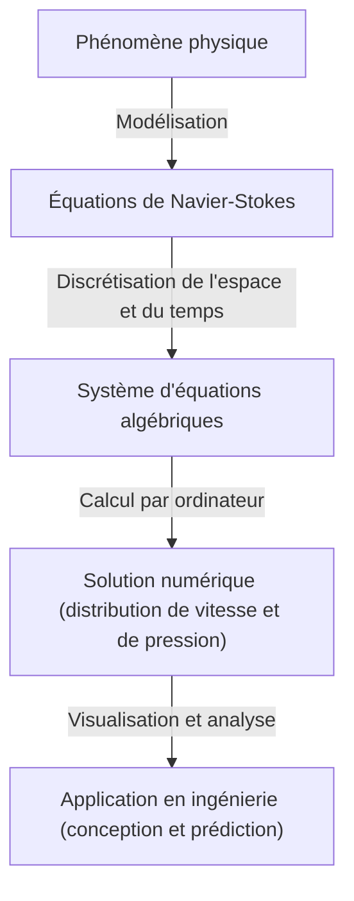

## 1. Introduction : Les équations qui régissent le monde des fluides

Les écoulements d'eau et d'air que nous observons au quotidien ont un comportement extrêmement complexe et imprévisible. Les magnifiques motifs qui se forment lorsqu'on verse du lait dans du café, les gigantesques tourbillons créés par les typhons, ou encore l'air qui s'écoule sur les ailes d'un avion. Tous ces mouvements de fluides sont décrits par un cadre unique : les **équations de Navier-Stokes** (Navier-Stokes equations).

Ces équations ont été dérivées au 19ème siècle par Claude-Louis Navier et George Gabriel Stokes. Depuis lors, elles jouent un rôle indispensable dans la science et l'ingénierie modernes, allant des prévisions météorologiques à la conception d'avions, en passant par l'analyse de la circulation sanguine. Cependant, ces équations cachent une **énigme ultime** qui n'a pas encore été résolue, tant d'un point de vue physique que mathématique.

Il s'agit du problème suivant : "Les solutions des équations de Navier-Stokes incompressibles en trois dimensions existent-elles toujours et sont-elles régulières (lisses) ?". C'est l'un des problèmes du prix du millénaire (Millennium Prize Problems) annoncés par l'Institut de mathématiques Clay (Clay Mathematics Institute) en 2000, dont la résolution sera récompensée d'un million de dollars.

Dans cet article, nous allons décrypter la signification de ces équations fascinantes et explorer en profondeur pourquoi il est si difficile de prouver l'existence de leurs solutions.

## 2. Forme et signification des équations de Navier-Stokes

Regardons d'abord les équations elles-mêmes. Nous considérons ici les équations de Navier-Stokes pour un "fluide incompressible" de densité constante, qui sont les plus fondamentales.

$$
\rho \left( \frac{\partial \mathbf{u}}{\partial t} + (\mathbf{u} \cdot \nabla)\mathbf{u} \right) = -\nabla p + \mu \nabla^2 \mathbf{u} + \mathbf{f}
$$

$$
\nabla \cdot \mathbf{u} = 0
$$

Ici, chaque symbole représente les grandeurs physiques suivantes :
- $\mathbf{u}$ : Champ de vecteurs vitesse (velocity vector field)
- $p$ : Pression (pressure)
- $\rho$ : Densité (density, constante)
- $\mu$ : Viscosité dynamique (dynamic viscosity)
- $\mathbf{f}$ : Champ de vecteurs des forces extérieures (external force, gravité, etc.)

### 2.1. Interprétation physique de chaque terme

Ces équations sont essentiellement l'application de la deuxième loi de Newton $F = ma$ aux fluides. Le côté gauche correspond à "masse $\times$ accélération", et le côté droit aux "forces agissant sur le fluide".

#### Côté gauche : Termes d'inertie (Inertial Terms)
Le côté gauche est la **dérivée particulaire** (material derivative) représentant l'accélération d'une particule de fluide.
- $\frac{\partial \mathbf{u}}{\partial t}$ : Terme de dérivée locale (Local derivative). Représente le changement de vitesse au cours du temps en un point fixe.
- $(\mathbf{u} \cdot \nabla)\mathbf{u}$ : Terme convectif (Convective term). Représente le changement de vitesse causé par le déplacement du fluide lui-même. Ce terme est non linéaire par rapport à la vitesse $\mathbf{u}$ et constitue la cause principale des difficultés mathématiques en dynamique des fluides. L'apparition de la turbulence est également due à ce terme non linéaire.

#### Côté droit : Termes de force (Force Terms)
Le côté droit représente les diverses forces agissant sur les particules de fluide.
- $-\nabla p$ : Force de gradient de pression (Pressure gradient force). Le fluide est poussé des zones de haute pression vers les zones de basse pression.
- $\mu \nabla^2 \mathbf{u}$ : Force visqueuse (Viscous force). Force de frottement due à la "viscosité" du fluide. Elle a pour effet d'adoucir les différences de vitesse entre les couches de fluide adjacentes et de stabiliser l'écoulement. Le Laplacien $\nabla^2$ est utilisé.
- $\mathbf{f}$ : Force volumique (Body force). Force externe appliquée, comme la gravité.

#### Équation de continuité (Continuity Equation)
La deuxième équation $\nabla \cdot \mathbf{u} = 0$ est l'"équation de continuité" représentant la **loi de conservation de la masse** (conservation of mass). Elle signifie que le fluide ne jaillit ni ne disparaît, et que son volume est maintenu constant (incompressibilité).

## 3. Difficultés mathématiques : Pourquoi ne peut-on pas les prouver ?

Dans le domaine de la physique et de l'ingénierie, les équations de Navier-Stokes sont quotidiennement "résolues" grâce à la mécanique des fluides numérique (CFD) sur des superordinateurs. Cependant, savoir si "une solution stricte existe au sens mathématique" est une autre question.

### 3.1. Qu'est-ce que "l'existence d'une solution régulière" ?

Ce que les mathématiciens cherchent à prouver, c'est si, pour une condition initiale donnée, il existe toujours un champ de vitesse $\mathbf{u}(x, t)$ et un champ de pression $p(x, t)$ indéfiniment différentiables (réguliers/lisses) qui satisfont les équations à tout instant futur $t > 0$.

S'il n'existe pas de solution régulière, cela signifierait qu'à un certain moment (en un temps fini), la vitesse du fluide ou la pression exploserait vers l'infini (apparition d'une singularité). C'est ce qu'on appelle une **explosion en temps fini** (finite-time blowup).

### 3.2. Viscosité vs Non-linéarité : Le conflit

Le fait que la solution explose ou non dépend de l'équilibre entre deux termes de l'équation.
- **Terme visqueux** $\mu \nabla^2 \mathbf{u}$ : Le "bon" terme qui dissipe l'énergie et tente de lisser l'écoulement.
- **Terme convectif** $(\mathbf{u} \cdot \nabla)\mathbf{u}$ : Le "mauvais" terme (terme non linéaire) qui concentre l'énergie dans des régions étroites, étire les tourbillons et rend les gradients de vitesse abrupts.

Dans l'espace en 2 dimensions, l'existence et la régularité des solutions ont été prouvées dans les années 1930 par Jean Leray et d'autres. En 2D, comme le mécanisme d'étirement des tourbillons (élongation des tubes tourbillonnaires) n'existe pas, la viscosité peut supprimer les termes non linéaires.

Cependant, dans l'espace en 3 dimensions, le fluide s'enchevêtre de manière complexe, et un phénomène se produit où les tubes tourbillonnaires sont étirés et l'énergie se dissipe en cascade vers des échelles de plus en plus petites (cascade d'énergie). Avec les méthodes mathématiques actuelles, il est impossible d'évaluer si la viscosité peut toujours supprimer ces puissants effets non linéaires spécifiques à la 3D.

### 3.3. Solutions faibles (Weak Solutions) et la contribution de Leray

Jean Leray a également introduit le concept de **solutions faibles** (weak solutions), qui assouplit les conditions différentielles des équations. Leray a prouvé que, même dans l'espace tridimensionnel, il existe globalement (au moins une) solution faible satisfaisant l'inégalité d'énergie (les solutions faibles de Leray-Hopf).

Cependant, on ignore encore aujourd'hui si cette solution faible est unique, et si elle est régulière (lisse).

## 4. Formulation en tant que problème du prix du millénaire

La définition officielle du problème par l'Institut de mathématiques Clay consiste grosso modo à prouver l'une des propositions suivantes :

1. **Preuve d'existence et de régularité** : Montrer que pour toutes conditions initiales et forces extérieures régulières, une solution régulière définie sur tout l'espace existe pour l'éternité.
2. **Preuve de rupture de la solution (explosion)** : Construire un exemple où, pour certaines conditions initiales et forces extérieures régulières, la solution perd sa régularité (acquiert une singularité) en un temps fini.

De nombreux mathématiciens de génie se sont attaqués à ce problème, mais aucun n'est parvenu à une résolution complète. Même Terence Tao, l'un des plus grands mathématiciens contemporains, a démontré un résultat selon lequel "dans les équations de Navier-Stokes moyennées, les solutions explosent en temps fini", mettant ainsi en évidence la difficulté du problème d'origine.

## 5. Comment le monde changera-t-il lorsque ce sera résolu ?

Quels seraient les impacts si ce problème était résolu ?

### 5.1. Avancées fulgurantes en mathématiques
La preuve de l'existence ou de l'explosion des solutions nécessitera de tout nouveaux outils mathématiques qui dépassent le cadre actuel de la théorie des équations aux dérivées partielles. Cela constituerait une avancée majeure pour l'analyse des phénomènes non linéaires.

### 5.2. Compréhension de la turbulence
Prouver la régularité des solutions ne rendra pas immédiatement les avions plus économes en carburant. Cependant, cela garantira que les équations de Navier-Stokes sont un modèle parfait, capable de décrire sans faille un phénomène aussi complexe que la turbulence, jusqu'à l'échelle microscopique. Cela pourrait faire progresser considérablement notre compréhension des mécanismes physiques de la turbulence.

### 5.3. Découverte de nouveaux phénomènes physiques
À l'inverse, que se passerait-il si l'on prouvait que les solutions explosent en temps fini ? Cela signifierait que lorsque le fluide atteint un état extrême, les équations de Navier-Stokes (c'est-à-dire l'hypothèse des milieux continus) s'effondrent, et qu'il faut tenir compte de nouvelles lois physiques à l'échelle atomique ou moléculaire. Ce serait, en soi, une découverte phénoménale en physique.

## 6. Relation avec le calcul numérique : Les limites et le potentiel de la CFD

Bien que la preuve mathématique ne soit pas achevée, les ingénieurs résolvent numériquement les équations de Navier-Stokes et les utilisent dans le monde réel. Comment comble-t-on cet écart ?

### 6.1. L'approche de la mécanique des fluides numérique (CFD)

Lorsqu'on résout les équations à l'aide d'un ordinateur, on divise l'espace et le temps continus en un nombre fini de grilles. C'est ce qu'on appelle la discrétisation.

### 6.2. La nécessité des modèles de turbulence

Comme la puissance de calcul des ordinateurs est limitée, il est impossible de représenter sur une grille toute l'échelle de la turbulence jusqu'à sa taille minimale (échelle de Kolmogorov). Par conséquent, des **modèles de turbulence** (Turbulence models) sont introduits pour traiter de manière approchée le comportement des petits tourbillons.
Les plus représentatifs sont RANS (Reynolds-Averaged Navier-Stokes) et LES (Large Eddy Simulation). Comprendre les propriétés mathématiques des équations d'origine est également important pour évaluer la validité de ces modèles.

## 7. Conclusion

Les équations de Navier-Stokes cachent, sous des formules apparemment simples, toute la complexité de l'univers. Du tourbillon dans une tasse de café à la circulation atmosphérique de Jupiter, la beauté et le chaos des fluides sont tous générés par ces équations.

La raison pour laquelle les mathématiciens continuent de relever le défi de cette "énigme ultime" n'est pas seulement pour le prix d'un million de dollars. C'est un défi aux limites de la raison humaine, pour voir jusqu'où elle peut appréhender les phénomènes complexes de la nature avec le langage des mathématiques.

Si le jour vient où un futur mathématicien comprendra parfaitement ces équations, nous pourrons alors dire que nous avons "compris" dans le vrai sens du terme le flux de l'eau et de l'air. Jusqu'à ce jour, les équations de Navier-Stokes resteront une montagne magnifique mais abrupte, se dressant à la pointe de la science.

---
*Cet article donne un aperçu d'un thème profond à la croisée de la dynamique des fluides et des mathématiques. Si vous êtes intéressé, nous vous recommandons de consulter des textes plus spécialisés sur les équations aux dérivées partielles ou les documents officiels de l'Institut de mathématiques Clay.*
