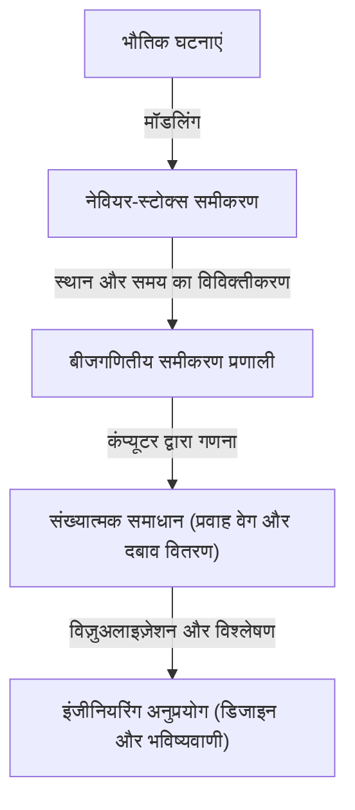

## 1. परिचय: वह समीकरण जो द्रवों की दुनिया को नियंत्रित करता है

पानी और हवा का प्रवाह जिसे हम रोज़ देखते हैं, वह अत्यंत जटिल और अप्रत्याशित व्यवहार करता है। जब आप कॉफी में दूध डालते हैं तो बनने वाले सुंदर पैटर्न, टाइफून द्वारा लाए गए विशाल भंवर, या हवाई जहाज के पंखों के ऊपर बहने वाली हवा। इन सभी द्रव गतियों को एक ही ढांचे में वर्णित करने वाला है **नेवियर-स्टोक्स समीकरण** (Navier-Stokes equations)।

यह समीकरण 19वीं सदी में क्लाउड-लुई नेवियर (Claude-Louis Navier) और जॉर्ज गेब्रियल स्टोक्स (George Gabriel Stokes) द्वारा प्राप्त किया गया था। तब से, यह आधुनिक विज्ञान और इंजीनियरिंग में अपरिहार्य भूमिका निभा रहा है, मौसम की भविष्यवाणी से लेकर विमान डिजाइन, और यहां तक कि रक्त प्रवाह विश्लेषण तक। हालाँकि, यह समीकरण भौतिक और गणितीय दोनों रूप से एक अनसुलझा **परम रहस्य** छुपाता है।

समस्या यह है: "क्या 3-आयामी अंतरिक्ष में असंपीड्य नेवियर-स्टोक्स समीकरणों के समाधान हमेशा मौजूद और सुगम होते हैं?" यह 2000 में क्ले मैथमेटिक्स इंस्टीट्यूट (Clay Mathematics Institute) द्वारा घोषित मिलेनियम पुरस्कार समस्याओं (Millennium Prize Problems) में से एक है, जिसे हल करने वाले को 1 मिलियन डॉलर का पुरस्कार दिया जाएगा।

इस लेख में, हम इस आकर्षक समीकरण के अर्थ को उजागर करेंगे और गहराई से जानेंगे कि इसके समाधान के अस्तित्व को साबित करना इतना कठिन क्यों है।

## 2. नेवियर-स्टोक्स समीकरण का आकार और अर्थ

आइए पहले समीकरण को ही देखें। यहाँ, हम निरंतर घनत्व वाले "असंपीड्य द्रव" के लिए सबसे बुनियादी नेवियर-स्टोक्स समीकरण पर विचार करते हैं।

$$
\rho \left( \frac{\partial \mathbf{u}}{\partial t} + (\mathbf{u} \cdot \nabla)\mathbf{u} \right) = -\nabla p + \mu \nabla^2 \mathbf{u} + \mathbf{f}
$$

$$
\nabla \cdot \mathbf{u} = 0
$$

यहाँ, प्रत्येक प्रतीक निम्नलिखित भौतिक राशियों का प्रतिनिधित्व करता है:
- $\mathbf{u}$ : द्रव का वेग सदिश क्षेत्र (velocity vector field)
- $p$ : दबाव (pressure)
- $\rho$ : घनत्व (density, स्थिरांक)
- $\mu$ : श्यानता गुणांक (dynamic viscosity)
- $\mathbf{f}$ : बाह्य बल सदिश क्षेत्र (external force, जैसे गुरुत्वाकर्षण)

### 2.1. प्रत्येक पद की भौतिक व्याख्या

यह समीकरण अनिवार्य रूप से द्रवों पर लागू न्यूटन के गति के नियम $F = ma$ का ही रूप है। बायां पक्ष "द्रव्यमान $\times$ त्वरण" के अनुरूप है, और दायां पक्ष "द्रव पर कार्य करने वाले बलों" के अनुरूप है।

#### बायां पक्ष: जड़त्वीय पद (Inertial Terms)
बायां पक्ष **पदार्थ व्युत्पन्न** (material derivative) है, जो द्रव कणों के त्वरण को दर्शाता है।
- $\frac{\partial \mathbf{u}}{\partial t}$ : स्थानीय व्युत्पन्न (Local derivative)। यह एक निश्चित बिंदु पर वेग के समय परिवर्तन को दर्शाता है।
- $(\mathbf{u} \cdot \nabla)\mathbf{u}$ : संवहनी पद (Convective term)। यह द्रव के स्वयं की गति के कारण वेग में परिवर्तन को दर्शाता है। यह पद वेग $\mathbf{u}$ के संबंध में गैर-रैखिक है, और यह द्रव गतिकी में सबसे बड़ी गणितीय कठिनाई का कारण है। अशांति (turbulence) की घटना भी इसी गैर-रैखिक पद के कारण होती है।

#### दायां पक्ष: बल पद (Force Terms)
दायां पक्ष द्रव कणों पर कार्य करने वाले विभिन्न बलों को दर्शाता है।
- $-\nabla p$ : दबाव प्रवणता बल (Pressure gradient force)। द्रव को उच्च दबाव से निम्न दबाव की ओर धकेला जाता है।
- $\mu \nabla^2 \mathbf{u}$ : श्यान बल (Viscous force)। यह द्रव के "चिपचिपेपन" के कारण होने वाला घर्षण बल है। यह आसन्न द्रव परतों के बीच वेग के अंतर को सुचारू करता है और प्रवाह को स्थिर करता है। इसमें लाप्लासियन $\nabla^2$ का उपयोग किया जाता है।
- $\mathbf{f}$ : बाह्य बल (Body force)। यह बाहर से लगाया जाने वाला बल है, जैसे कि गुरुत्वाकर्षण।

#### सांतत्य समीकरण (Continuity Equation)
दूसरा समीकरण $\nabla \cdot \mathbf{u} = 0$ **द्रव्यमान संरक्षण के नियम** (conservation of mass) को दर्शाने वाला "सांतत्य समीकरण" है। इसका अर्थ है कि द्रव न तो बनता है और न ही गायब होता है, और इसकी मात्रा स्थिर रहती है (यह असंपीड्य है)।

## 3. गणितीय कठिनाइयाँ: इसे साबित क्यों नहीं किया जा सकता?

भौतिकी और इंजीनियरिंग के क्षेत्र में, नेवियर-स्टोक्स समीकरणों को सुपर कंप्यूटरों का उपयोग करके कम्प्यूटेशनल द्रव गतिकी (CFD) द्वारा प्रतिदिन "हल" किया जाता है। हालाँकि, गणितीय अर्थों में "क्या वास्तव में कोई सटीक समाधान मौजूद है", यह एक अलग मुद्दा है।

### 3.1. "सुगम समाधान के अस्तित्व" का क्या अर्थ है?

गणितज्ञ जो खोज रहे हैं वह यह प्रमाण है कि, दी गई प्रारंभिक स्थितियों के लिए, क्या हमेशा भविष्य के किसी भी समय $t > 0$ पर अनंत रूप से अवकलनीय (सुगम) वेग क्षेत्र $\mathbf{u}(x, t)$ और दबाव क्षेत्र $p(x, t)$ मौजूद रहता है जो समीकरण को संतुष्ट करता है।

यदि कोई सुगम समाधान मौजूद नहीं है, तो किसी निश्चित समय (सीमित समय) पर प्रवाह वेग या दबाव अनंत हो जाएगा (एक विलक्षणता उत्पन्न होगी)। इसे **सीमित समय का विस्फोट** (finite-time blowup) कहा जाता है।

### 3.2. श्यानता बनाम गैर-रैखिकता: एक संघर्ष

समाधान में विस्फोट होगा या नहीं, यह समीकरण के दो पदों के संतुलन से निर्धारित होता है।
- **श्यानता पद** $\mu \nabla^2 \mathbf{u}$ : एक "अच्छा" पद जो ऊर्जा को नष्ट करता है और प्रवाह को सुगम बनाने की कोशिश करता है।
- **संवहनी पद** $(\mathbf{u} \cdot \nabla)\mathbf{u}$ : एक "बुरा" पद (गैर-रैखिक पद) जो ऊर्जा को एक छोटे से क्षेत्र में केंद्रित करता है, भंवरों को खींचता है, और वेग प्रवणता को तीव्र बनाने की कोशिश करता है।

2-आयामी अंतरिक्ष में, 1930 के दशक में जीन लेरे (Jean Leray) और अन्य द्वारा समाधानों के अस्तित्व और सुगमता को साबित किया गया था। 2-आयाम में, भंवरों के खिंचाव का कोई तंत्र नहीं है, इसलिए श्यानता गैर-रैखिक पद को दबा सकती है।

हालाँकि, 3-आयामी अंतरिक्ष में, द्रव जटिल रूप से उलझ जाते हैं, भंवर खिंच जाते हैं, और ऊर्जा बहुत छोटे पैमानों (ऊर्जा कास्केड) पर क्रमिक रूप से प्रवाहित होती है। वर्तमान गणितीय तरीकों से, यह मूल्यांकन करना असंभव है कि क्या श्यानता हमेशा इस शक्तिशाली 3-आयामी विशिष्ट गैर-रैखिक प्रभाव को दबा सकती है।

### 3.3. कमजोर समाधान (Weak Solutions) और लेरे का योगदान

जीन लेरे ने **कमजोर समाधान** (weak solutions) की अवधारणा भी पेश की, जिससे समीकरण की अवकलनीयता की स्थिति में ढील दी गई। लेरे ने साबित किया कि 3-आयामी अंतरिक्ष में भी ऊर्जा असमानता को संतुष्ट करने वाला कम से कम एक वैश्विक रूप से मौजूद कमजोर समाधान होता है (लेरे-हॉप का कमजोर समाधान)।

हालाँकि, यह कमजोर समाधान अद्वितीय है या नहीं (क्या यह केवल एक है), और क्या यह सुगम है, यह आज भी अज्ञात है।

## 4. मिलेनियम पुरस्कार समस्या के रूप में निर्माण

क्ले मैथमेटिक्स इंस्टीट्यूट द्वारा निर्धारित आधिकारिक समस्या का लक्ष्य मोटे तौर पर निम्नलिखित में से किसी एक को साबित करना है:

1. **अस्तित्व और सुगमता का प्रमाण**: यह दिखाना कि मनमानी सुगम प्रारंभिक स्थितियों और बाह्य बलों के लिए, पूरे अंतरिक्ष में परिभाषित एक सुगम समाधान अनंत भविष्य तक मौजूद रहता है।
2. **समाधान के टूटने (विस्फोट) का प्रमाण**: यह दिखाना कि विशिष्ट सुगम प्रारंभिक स्थितियों और बाह्य बलों के लिए, समाधान एक सीमित समय में अपनी सुगमता खो देता है (एक विलक्षणता होती है)।

कई प्रतिभाशाली गणितज्ञों ने इस समस्या का प्रयास किया है, लेकिन कोई पूर्ण समाधान नहीं मिला है। टेरेंस ताओ (Terence Tao) जैसे सबसे महान समकालीन गणितज्ञों में से एक ने भी दिखाया कि "औसत नेवियर-स्टोक्स समीकरणों में सीमित समय में समाधान का विस्फोट होता है", जो मूल समस्या की कठिनाई को उजागर करता है।

## 5. जब यह हल हो जाएगा तो दुनिया कैसे बदलेगी?

यदि इस समस्या का समाधान हो जाए, तो इसका क्या प्रभाव होगा?

### 5.1. गणित में महत्वपूर्ण प्रगति
समाधान के अस्तित्व, या विस्फोट के प्रमाण के लिए पूरी तरह से नए गणितीय उपकरणों की आवश्यकता होगी जो आंशिक अवकल समीकरणों के वर्तमान ढांचे से आगे निकल जाएं। यह गैर-रैखिक घटनाओं का विश्लेषण करने के लिए एक बड़ी सफलता होगी।

### 5.2. अशांति की समझ
समाधान की सुगमता साबित होने का यह अर्थ नहीं है कि हवाई जहाज की ईंधन दक्षता तुरंत सुधर जाएगी। हालाँकि, यह गारंटी देगा कि नेवियर-स्टोक्स समीकरण एक आदर्श मॉडल है जो अशांति जैसी अत्यंत जटिल घटनाओं का बिना टूटे वर्णन कर सकता है। यह अशांति के भौतिक तंत्र की समझ को बहुत आगे बढ़ा सकता है।

### 5.3. नई भौतिक घटनाओं की खोज
इसके विपरीत, यदि यह साबित हो जाता है कि समाधान एक सीमित समय में विस्फोट करता है तो क्या होगा? इसका मतलब यह होगा कि जब द्रव चरम स्थितियों में पहुंचता है, closing, तो नेवियर-स्टोक्स समीकरण (यानी निरंतरता परिकल्पना) टूट जाता है, और हमें परमाणु और आणविक पैमाने पर नए भौतिक नियमों पर विचार करना होगा। भौतिकी में यह अपने आप में एक आश्चर्यजनक खोज होगी।

## 6. संख्यात्मक गणना से संबंध: CFD की सीमाएँ और संभावनाएँ

यद्यपि गणितीय प्रमाण पूरा नहीं हुआ है, इंजीनियर नेवियर-स्टोक्स समीकरणों को संख्यात्मक रूप से हल करते हैं और उन्हें वास्तविक दुनिया में लागू करते हैं। इस अंतर को कैसे पाटा गया है?

### 6.1. कम्प्यूटेशनल द्रव गतिकी (CFD) दृष्टिकोण

कंप्यूटर का उपयोग करके समीकरणों को हल करते समय, निरंतर अंतरिक्ष और समय को परिमित ग्रिड में विभाजित किया जाता है। इसे विविक्तीकरण कहा जाता है।

### 6.2. अशांति मॉडल की आवश्यकता

चूंकि कंप्यूटर की क्षमता सीमित है, ग्रिड के साथ अशांति (कोलमोगोरोव पैमाने) के सबसे छोटे पैमाने तक सब कुछ प्रस्तुत करना असंभव है। इसलिए, **अशांति मॉडल** (Turbulence models) पेश किए जाते हैं जो छोटे भंवरों के व्यवहार का अनुमानित रूप से इलाज करते हैं।
विशिष्ट उदाहरणों में RANS (Reynolds-Averaged Navier-Stokes) और LES (Large Eddy Simulation) शामिल हैं। इन मॉडलों की वैधता का मूल्यांकन करने के लिए मूल समीकरणों के गणितीय गुणों को समझना भी महत्वपूर्ण है।

## 7. निष्कर्ष

पहली नज़र में, नेवियर-स्टोक्स समीकरण एक सरल सूत्र लगता है, लेकिन इसमें ब्रह्मांड की जटिलता छिपी है। एक कॉफी कप में भंवर से लेकर बृहस्पति के वायुमंडलीय संचलन तक, द्रवों की सुंदरता और अराजकता इस समीकरण से उत्पन्न होती है।

गणितज्ञ इस "परम रहस्य" को सुलझाने की चुनौती क्यों लेते रहते हैं, इसका कारण केवल 1 मिलियन डॉलर का पुरस्कार नहीं है। यह इस सीमा की ओर एक चुनौती है कि मानव तर्क कितनी दूर तक प्रकृति की जटिल घटनाओं को गणित की भाषा के माध्यम से समझ सकता है।

जब भविष्य के गणितज्ञ इस समीकरण को पूरी तरह से समझ लेंगे, तो हम यह कह सकेंगे कि हम वास्तव में पानी और हवा के प्रवाह को "समझ" गए हैं। उस दिन तक, नेवियर-स्टोक्स समीकरण विज्ञान के अग्रभाग में खड़ा एक सुंदर लेकिन ऊबड़-खाबड़ पहाड़ बना रहेगा।

---
 *यह लेख द्रव गतिकी और गणित के चौराहे पर गहरे विषयों का अवलोकन है। यदि आप रुचि रखते हैं, तो हम अनुशंसा करते हैं कि आप अधिक विशेष आंशिक अवकल समीकरण ग्रंथों और क्ले गणित संस्थान के आधिकारिक दस्तावेजों का संदर्भ लें।*
