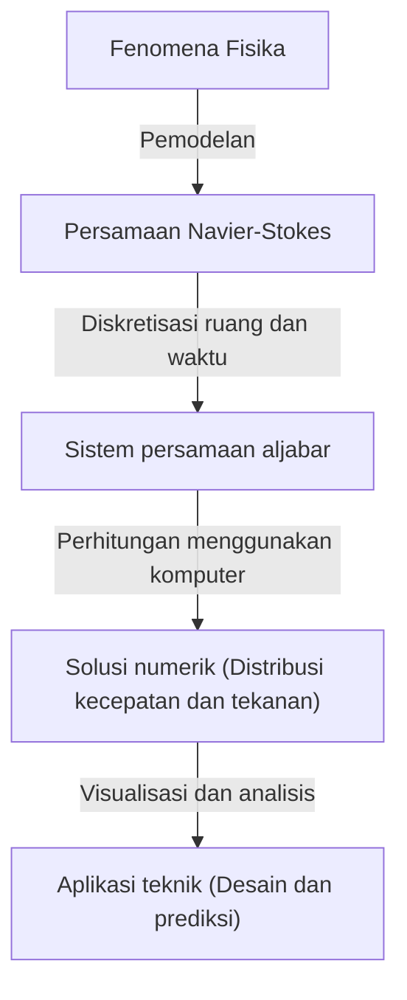

## 1. Pendahuluan: Persamaan yang Mengatur Dunia Fluida

Aliran air dan udara yang kita lihat setiap hari menunjukkan perilaku yang sangat kompleks dan sulit diprediksi. Pola indah yang menyebar saat menuangkan susu ke dalam kopi, pusaran air raksasa yang dibawa oleh topan, atau udara yang mengalir di atas sayap pesawat terbang. Semua gerakan fluida ini dijelaskan dalam satu kerangka kerja tunggal oleh **Persamaan Navier-Stokes** (Navier-Stokes equations).

Persamaan ini diturunkan pada abad ke-19 oleh Claude-Louis Navier dan George Gabriel Stokes. Sejak saat itu, persamaan ini telah memainkan peran yang sangat penting dalam sains dan teknik modern, dari prediksi cuaca hingga desain pesawat terbang, dan bahkan analisis aliran darah. Namun, ada **misteri pamungkas** yang belum terpecahkan, baik secara fisika maupun matematika, yang tersembunyi di dalam persamaan ini.

Misteri itu adalah: "Apakah solusi untuk persamaan Navier-Stokes inkompresibel dalam ruang 3 dimensi selalu eksis dan mulus (smooth)?" Ini adalah salah satu dari *Millennium Prize Problems* yang diumumkan oleh *Clay Mathematics Institute* pada tahun 2000, dan bagi siapa saja yang dapat menyelesaikannya akan diberikan hadiah sebesar satu juta dolar.

Dalam artikel ini, kita akan mengungkap makna dari persamaan yang menarik ini dan menyelami lebih dalam mengapa membuktikan eksistensi solusinya sangatlah sulit.

## 2. Bentuk dan Makna Persamaan Navier-Stokes

Pertama-tama, mari kita lihat persamaan itu sendiri. Di sini kita mempertimbangkan persamaan Navier-Stokes yang paling dasar untuk "fluida inkompresibel" (tak termampatkan) di mana massa jenisnya konstan.

$$
\rho \left( \frac{\partial \mathbf{u}}{\partial t} + (\mathbf{u} \cdot \nabla)\mathbf{u} \right) = -\nabla p + \mu \nabla^2 \mathbf{u} + \mathbf{f}
$$

$$
\nabla \cdot \mathbf{u} = 0
$$

Di sini, setiap simbol mewakili besaran fisika berikut:
- $\mathbf{u}$ : Medan vektor kecepatan (velocity vector field)
- $p$ : Tekanan (pressure)
- $\rho$ : Massa jenis (density, konstan)
- $\mu$ : Viskositas dinamis (dynamic viscosity)
- $\mathbf{f}$ : Medan vektor gaya eksternal (external force, gravitasi dll.)

### 2.1. Interpretasi Fisika dari Setiap Suku

Persamaan ini, pada dasarnya, adalah penerapan dari hukum gerak Newton $F = ma$ pada fluida. Sisi kiri sesuai dengan "massa $\times$ percepatan", dan sisi kanan sesuai dengan "gaya yang bekerja pada fluida".

#### Sisi Kiri: Suku Inersia (Inertial Terms)
Sisi kiri adalah turunan material (material derivative) yang mewakili percepatan partikel fluida.
- $\frac{\partial \mathbf{u}}{\partial t}$ : Turunan lokal (Local derivative). Ini mewakili perubahan kecepatan terhadap waktu pada suatu titik tetap.
- $(\mathbf{u} \cdot \nabla)\mathbf{u}$ : Suku konvektif (Convective term). Ini mewakili perubahan kecepatan yang disebabkan oleh pergerakan fluida itu sendiri. Suku ini non-linear terhadap kecepatan $\mathbf{u}$, dan merupakan penyebab terbesar dari kesulitan matematis dalam mekanika fluida. Terjadinya turbulensi (turbulence) juga disebabkan oleh suku non-linear ini.

#### Sisi Kanan: Suku Gaya (Force Terms)
Sisi kanan mewakili berbagai gaya yang bekerja pada partikel fluida.
- $-\nabla p$ : Suku gradien tekanan (Pressure gradient force). Fluida terdorong keluar dari area bertekanan tinggi menuju ke area bertekanan rendah.
- $\mu \nabla^2 \mathbf{u}$ : Suku gaya viskos (Viscous force). Ini adalah gaya gesek akibat "kekentalan" fluida. Gaya ini memiliki efek meratakan perbedaan kecepatan dari lapisan-lapisan fluida yang bersebelahan, sehingga menstabilkan aliran. Di sini digunakan Laplacian $\nabla^2$.
- $\mathbf{f}$ : Suku gaya benda (Body force). Ini adalah gaya yang diberikan dari luar, seperti gravitasi.

#### Persamaan Kontinuitas (Continuity Equation)
Persamaan kedua $\nabla \cdot \mathbf{u} = 0$ adalah "persamaan kontinuitas" yang mewakili **hukum kekekalan massa** (conservation of mass). Ini berarti bahwa fluida tidak muncul atau menghilang dengan sendirinya, dan volumenya dipertahankan konstan (inkompresibel).

## 3. Kesulitan Matematis: Mengapa Tidak Bisa Dibuktikan?

Dalam bidang fisika dan teknik, persamaan Navier-Stokes setiap hari "dipecahkan" melalui komputasi dinamika fluida (CFD) menggunakan superkomputer. Namun, apakah "solusi pasti ada dalam arti matematis yang ketat" adalah masalah lain.

### 3.1. Apa Itu "Eksistensi Solusi yang Mulus"?

Apa yang dicari oleh para matematikawan adalah pembuktian tentang apakah, untuk suatu kondisi awal yang diberikan, selalu ada medan kecepatan $\mathbf{u}(x, t)$ dan medan tekanan $p(x, t)$ yang dapat didiferensialkan tanpa batas (mulus) dan memenuhi persamaan tersebut pada sembarang waktu di masa depan $t > 0$.

Jika solusi mulus tidak ada, ini berarti bahwa pada titik waktu tertentu (waktu yang berhingga), kecepatan aliran atau tekanan akan menyimpang menuju ketakterhinggaan (timbulnya singularitas). Ini disebut sebagai **ledakan dalam waktu berhingga** (finite-time blowup).

### 3.2. Viskositas vs Non-linearitas: Persaingan

Apakah solusi akan mengalami "blowup" atau tidak, ditentukan oleh keseimbangan dari dua suku pada persamaan.
- **Suku viskos** $\mu \nabla^2 \mathbf{u}$ : Suku "baik" yang mencoba untuk mendisipasikan energi dan membuat aliran menjadi mulus.
- **Suku konvektif** $(\mathbf{u} \cdot \nabla)\mathbf{u}$ : Suku "buruk" (suku non-linear) yang mencoba untuk memusatkan energi di area yang sempit, meregangkan pusaran, dan membuat gradien kecepatan menjadi curam.

Dalam ruang 2 dimensi, pada tahun 1930-an, Jean Leray dan kolega-koleganya membuktikan eksistensi dan kelancaran solusinya. Dalam 2 dimensi, karena tidak adanya mekanisme peregangan pusaran (vortex stretching), viskositas mampu menekan suku non-linear.

Namun, dalam ruang 3 dimensi, fluida akan saling terjalin dengan sangat kompleks, filamen pusaran akan diregangkan, dan terjadilah fenomena di mana energi ditransfer secara berjenjang ke skala yang lebih kecil (kaskade energi / energy cascade). Dengan metode matematika saat ini, masih belum bisa dievaluasi apakah viskositas akan selalu mampu menahan efek non-linear yang sangat kuat dan unik untuk 3 dimensi ini.

### 3.3. Solusi Lemah (Weak Solutions) dan Kontribusi Leray

Jean Leray juga memperkenalkan konsep **solusi lemah** (weak solutions) dengan melonggarkan syarat diferensiasi dari persamaan tersebut. Leray membuktikan bahwa bahkan dalam ruang 3 dimensi, terdapat (setidaknya satu) solusi lemah yang memenuhi pertidaksamaan energi dan eksis secara global (Solusi lemah Leray-Hopf).

Namun, apakah solusi lemah ini unik (hanya ada satu) dan apakah mulus, sampai saat ini masih belum diketahui.

## 4. Perumusan sebagai Millennium Prize Problem

Rumusan masalah resmi oleh *Clay Mathematics Institute*, secara garis besar adalah untuk membuktikan salah satu dari hal-hal berikut:

1. **Pembuktian eksistensi dan kelancaran**: Menunjukkan bahwa untuk sembarang kondisi awal yang mulus dan gaya eksternal, solusi yang mulus serta terdefinisi di seluruh ruang akan eksis hingga selamanya.
2. **Pembuktian pecahnya solusi (ledakan / blowup)**: Menyusun suatu contoh di mana apabila diberikan kondisi awal dan gaya eksternal yang mulus tertentu, solusi akan kehilangan kemulusannya (memiliki singularitas) dalam waktu yang berhingga.

Banyak matematikawan jenius telah mencoba memecahkan masalah ini, namun belum ada penyelesaian yang tuntas. Bahkan salah satu matematikawan terhebat di era modern seperti Terence Tao telah menunjukkan hasil bahwa "persamaan Navier-Stokes yang dirata-ratakan akan mengalami ledakan solusi dalam waktu berhingga", yang justru semakin menyoroti betapa sulitnya masalah aslinya.

## 5. Bagaimana Dunia Akan Berubah Jika Dipecahkan?

Jika masalah ini diselesaikan, apa dampaknya?

### 5.1. Lompatan Besar dalam Matematika
Pembuktian eksistensi solusi, atau pembuktian dari *blowup*, kemungkinan akan membutuhkan perangkat matematika yang benar-benar baru dan di luar kerangka teori persamaan diferensial parsial saat ini. Ini akan menjadi terobosan luar biasa untuk menganalisis berbagai fenomena non-linear.

### 5.2. Pemahaman tentang Turbulensi
Hanya karena kelancaran solusi telah dibuktikan, bukan berarti efisiensi bahan bakar pesawat akan langsung meningkat. Namun, ini akan menjamin bahwa persamaan Navier-Stokes adalah model yang sempurna dan mampu menjelaskan fenomena turbulensi yang sangat kompleks hingga ke tingkat mikroskopis tanpa cacat. Ini memiliki potensi untuk memajukan pemahaman tentang mekanisme fisika di balik turbulensi secara signifikan.

### 5.3. Penemuan Fenomena Fisika Baru
Sebaliknya, bagaimana jika dibuktikan bahwa solusi akan meledak dalam waktu berhingga? Itu berarti bahwa ketika fluida mencapai keadaan ekstrem, persamaan Navier-Stokes (dengan kata lain, hipotesis kontinum) akan rusak, dan mengharuskan kita mempertimbangkan hukum fisika baru pada skala atomik dan molekuler. Hal ini tentunya juga akan menjadi sebuah penemuan yang menakjubkan dalam ilmu fisika.

## 6. Hubungannya dengan Perhitungan Numerik: Batas dan Potensi CFD

Walaupun belum ada pembuktian matematis yang rampung, para insinyur sehari-hari menyelesaikan persamaan Navier-Stokes secara numerik dan menerapkannya untuk kebutuhan praktis di dunia nyata. Bagaimana kesenjangan ini dijembatani?

### 6.1. Pendekatan Komputasi Dinamika Fluida (CFD)

Ketika memecahkan persamaan menggunakan komputer, ruang dan waktu yang kontinu dibagi-bagi menjadi sejumlah titik grid (kisi-kisi) yang berhingga. Ini disebut diskretisasi (discretization).

### 6.2. Kebutuhan akan Model Turbulensi

Karena keterbatasan dari kemampuan komputasi, mustahil untuk merepresentasikan seluruh aliran hingga skala terkecil turbulensi (skala Kolmogorov) dengan menggunakan grid. Oleh karena itu, diperkenalkan **model turbulensi** (Turbulence models) yang menangani perilaku pusaran-pusaran kecil secara aproksimasi.
Contoh umum dari model turbulensi adalah RANS (Reynolds-Averaged Navier-Stokes) dan LES (Large Eddy Simulation). Untuk mengevaluasi keabsahan model-model ini pun, pemahaman tentang sifat-sifat matematis dari persamaan aslinya sangatlah penting.

## 7. Penutup

Persamaan Navier-Stokes, yang pada pandangan pertama terlihat sebagai formula matematis sederhana, sesungguhnya menyembunyikan kompleksitas dari alam semesta. Dari pusaran di dalam cangkir kopi hingga sirkulasi atmosfer di planet Jupiter, keindahan sekaligus kekacauan dari aliran fluida semuanya berasal dari persamaan ini.

Alasan mengapa para matematikawan terus tertantang oleh "misteri pamungkas" ini bukan hanya demi hadiah satu juta dolar. Ini adalah tantangan untuk mencari tahu sampai sejauh mana batas kemampuan akal manusia dalam merumuskan fenomena alam yang rumit dengan menggunakan bahasa matematika.

Ketika tiba harinya di mana seorang matematikawan di masa depan mampu memahami persamaan ini dengan sempurna, barulah kita dapat mengatakan bahwa kita telah "memahami" aliran air dan udara yang sesungguhnya. Hingga hari itu tiba, persamaan Navier-Stokes akan tetap berdiri kokoh sebagai gunung yang indah namun terjal di garis depan ilmu sains.

---
*Artikel ini menyajikan ikhtisar dari tema mendalam di persimpangan antara mekanika fluida dan matematika. Bagi Anda yang tertarik, disarankan untuk merujuk ke buku teks spesifik tentang persamaan diferensial parsial atau dokumen resmi dari Clay Mathematics Institute.*
