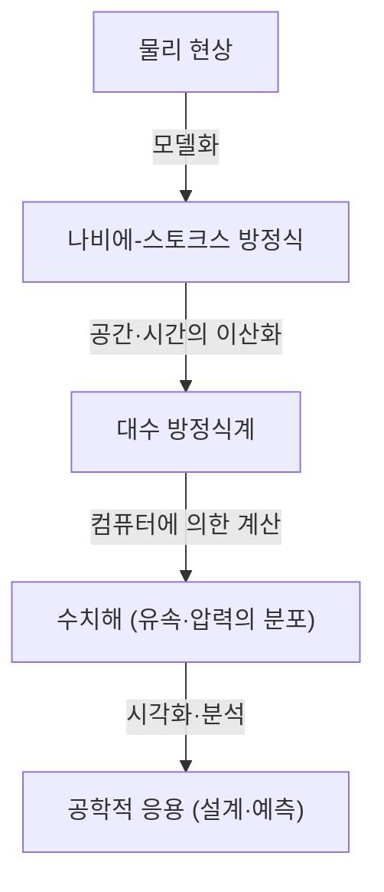

## 1. 시작하며：유체의 세계를 지배하는 방정식

우리가 일상적으로 접하는 물이나 공기의 흐름은 극히 복잡하고 예측하기 어려운 행동을 보입니다. 커피에 우유를 부었을 때 퍼지는 아름다운 무늬, 태풍이 가져오는 거대한 소용돌이, 혹은 비행기 날개를 흐르는 공기. 이 모든 유체의 운동을 단일한 틀로 기술하는 것이 **나비에-스토크스 방정식** (Navier-Stokes equations) 입니다.

이 방정식은 19세기에 클로드 루이 나비에 (Claude-Louis Navier) 와 조지 가브리엘 스토크스 (George Gabriel Stokes) 에 의해 도출되었습니다. 그 이후로 기상 예측부터 항공기 설계, 심지어 혈류 분석에 이르기까지 현대 과학과 공학에서 필수불가결한 역할을 하고 있습니다. 하지만 이 방정식에는 물리학적으로도 수학적으로도 아직 규명되지 않은 **궁극의 수수께끼** 가 숨겨져 있습니다.

그것은 "3차원 공간에서 비압축성 나비에-스토크스 방정식의 해는 항상 존재하며 매끄러운가?"라는 문제입니다. 이것은 클레이 수학연구소 (Clay Mathematics Institute) 가 2000년에 발표한 밀레니엄 문제 (Millennium Prize Problems) 중 하나로, 해결한 사람에게는 100만 달러의 상금이 주어집니다.

본 기사에서는 이 매력적인 방정식의 의미를 밝히고, 왜 그 해의 존재를 증명하는 것이 그토록 어려운 것인지 깊이 파헤쳐 보겠습니다.

## 2. 나비에-스토크스 방정식의 형태와 의미

먼저 방정식 그 자체를 살펴보겠습니다. 여기서는 가장 기본적인, 밀도가 일정한 "비압축성 유체"에 대한 나비에-스토크스 방정식을 생각해보겠습니다.

$$
\rho \left( \frac{\partial \mathbf{u}}{\partial t} + (\mathbf{u} \cdot \nabla)\mathbf{u} \right) = -\nabla p + \mu \nabla^2 \mathbf{u} + \mathbf{f}
$$

$$
\nabla \cdot \mathbf{u} = 0
$$

여기서 각 기호는 다음의 물리량을 나타냅니다：
- $\mathbf{u}$ : 유체의 속도 벡터장 (velocity vector field)
- $p$ : 압력 (pressure)
- $\rho$ : 밀도 (density, 상수)
- $\mu$ : 점성 계수 (dynamic viscosity)
- $\mathbf{f}$ : 외력 벡터장 (external force, 중력 등)

### 2.1. 각 항의 물리적 해석

이 방정식은 본질적으로 뉴턴의 운동 방정식 $F = ma$ 를 유체에 적용한 것입니다. 좌변이 "질량 $\times$ 가속도"에, 우변이 "유체에 작용하는 힘"에 대응합니다.

#### 좌변：관성항 (Inertial Terms)
좌변은 유체 입자의 가속도를 나타내는 **물질 도함수** (material derivative) 입니다.
- $\frac{\partial \mathbf{u}}{\partial t}$ : 국소 미분항 (Local derivative). 어떤 고정된 점에서의 속도의 시간 변화를 나타냅니다.
- $(\mathbf{u} \cdot \nabla)\mathbf{u}$ : 이류항 (Convective term). 유체 자체가 이동함에 따라 발생하는 속도의 변화를 나타냅니다. 이 항은 속도 $\mathbf{u}$ 에 대해 비선형적이며, 유체역학에 있어 수학적 어려움의 가장 큰 원인이 되고 있습니다. 난류 (turbulence) 의 발생도 이 비선형항에 기인합니다.

#### 우변：힘의 항 (Force Terms)
우변은 유체 입자에 작용하는 여러 가지 힘을 나타냅니다.
- $-\nabla p$ : 압력 기울기 항 (Pressure gradient force). 유체는 압력이 높은 곳에서 낮은 곳으로 밀려납니다.
- $\mu \nabla^2 \mathbf{u}$ : 점성항 (Viscous force). 유체의 "끈적임"에 의한 마찰력입니다. 인접한 유체 층의 속도 차이를 부드럽게 만들고 흐름을 안정화시키는 효과가 있습니다. 라플라시안 $\nabla^2$ 이 사용됩니다.
- $\mathbf{f}$ : 외력항 (Body force). 중력 등 외부에서 가해지는 힘입니다.

#### 연속 방정식 (Continuity Equation)
두 번째 식 $\nabla \cdot \mathbf{u} = 0$ 은 **질량 보존의 법칙** (conservation of mass) 을 나타내는 "연속 방정식"입니다. 유체가 솟아나거나 사라지지 않고 체적이 일정하게 유지됨(비압축성임)을 의미합니다.

## 3. 수학적인 어려움：왜 증명할 수 없는가?

물리학이나 공학 현장에서는 나비에-스토크스 방정식이 슈퍼컴퓨터를 이용한 전산 유체 역학 (CFD) 에 의해 매일 "풀리고" 있습니다. 하지만 수학적인 의미에서 "엄밀한 해가 존재하는가"는 별개의 문제입니다.

### 3.1. "매끄러운 해의 존재"란?

수학자들이 요구하는 것은 주어진 초기 조건에 대해 미래의 임의의 시간 $t > 0$ 에서 방정식을 만족하는, 무한 번 미분 가능(매끄러운)한 속도장 $\mathbf{u}(x, t)$ 와 압력장 $p(x, t)$ 가 항상 존재하는가 하는 증명입니다.

만약 매끄러운 해가 존재하지 않는다면, 어느 시간(유한 시간)에 유속이나 압력이 무한대로 발산해 버리는(특이점이 발생하는) 일이 생깁니다. 이를 **유한 시간 내의 폭발** (finite-time blowup) 이라고 부릅니다.

### 3.2. 점성 vs 비선형성：치열한 대립

해가 폭발할지 여부는 방정식의 두 항의 균형에 의해 결정됩니다.
- **점성항** $\mu \nabla^2 \mathbf{u}$ : 에너지를 흩어지게 하여 흐름을 매끄럽게 만들려는 "좋은" 항.
- **이류항** $(\mathbf{u} \cdot \nabla)\mathbf{u}$ : 에너지를 좁은 영역에 집중시키고 소용돌이를 늘려 속도의 기울기를 급격하게 만들려는 "나쁜" 항(비선형항).

2차원 공간에서는 1930년대에 장 르레 (Jean Leray) 등에 의해 해의 존재와 매끄러움이 증명되었습니다. 2차원에서는 소용돌이가 늘어나는 메커니즘(와류선의 신장)이 존재하지 않기 때문에, 점성이 비선형항을 억누를 수 있는 것입니다.

하지만 3차원 공간에서는 유체가 복잡하게 얽히고 소용돌이가 늘어나 에너지가 아주 작은 규모로 계속해서 연쇄적으로 전달되는 현상(에너지 캐스케이드)이 발생합니다. 현재의 수학적 기법으로는 이 3차원 특유의 강력한 비선형 효과를 점성이 항상 억누를 수 있을지 평가할 수 없습니다.

### 3.3. 약해 (Weak Solutions) 와 르레의 공헌

장 르레는 또한 방정식의 미분 조건을 완화한 **약해** (weak solutions) 라는 개념을 도입했습니다. 르레는 3차원 공간에서도 에너지 부등식을 만족하는 약해가 (적어도 1개는) 대역적으로 존재함을 증명했습니다 (르레-호프의 약해).

하지만 이 약해가 유일한지 (하나로 정해지는지), 그리고 매끄러운지는 현재도 불명인 채로 남아 있습니다.

## 4. 밀레니엄 문제로서의 정식화

클레이 수학연구소에 의한 공식 문제 설정은 대략적으로 말해 다음 중 하나를 증명하는 것입니다.

1. **존재와 매끄러움의 증명** ：임의의 매끄러운 초기 조건과 외력에 대해, 공간 전체에서 정의된 매끄러운 해가 미래 영구히 존재함을 보인다.
2. **해의 붕괴 (폭발) 의 증명** ：어떤 특정한 매끄러운 초기 조건과 외력을 주면, 유한 시간에 해가 매끄러움을 잃는 (특이점을 가지는) 예를 구성한다.

지금까지 많은 천재 수학자들이 이 문제에 도전해 왔지만, 완전한 해결에는 이르지 못했습니다. 테렌스 타오 (Terence Tao) 와 같은 현대 최고의 수학자 중 한 명조차도 "평균화된 나비에-스토크스 방정식에서는 유한 시간에 해가 폭발한다"는 결과를 보여주어 원래 문제의 어려움을 부각시켰습니다.

## 5. 해명되었을 때 세계는 어떻게 변할까?

만약 이 문제가 해결된다면 어떤 영향이 있을까요?

### 5.1. 수학의 비약적인 진보
해의 존재, 혹은 폭발의 증명에는 현재의 편미분 방정식론의 틀을 넘어서는 전혀 새로운 수학적 도구가 필요할 것입니다. 그것은 비선형 현상을 분석하기 위한 거대한 돌파구가 될 것입니다.

### 5.2. 난류의 이해
해의 매끄러움이 증명되었다고 해서 바로 비행기의 연비가 좋아지는 것은 아닙니다. 하지만 나비에-스토크스 방정식이 난류라는 극히 복잡한 현상을 극미의 세계에 이르기까지 모순 없이 기술할 수 있는 완벽한 모델임이 보장됩니다. 이로 인해 난류의 물리적 메커니즘에 대한 이해가 크게 전진할 가능성이 있습니다.

### 5.3. 새로운 물리 현상의 발견
반대로 만약 해가 유한 시간에 폭발한다는 것이 증명된다면 어떻게 될까요? 그것은 유체가 극한 상태에 달했을 때 나비에-스토크스 방정식(즉, 연속체 가설)이 무너지고, 원자나 분자 단위에서의 새로운 물리 법칙을 고려해야 함을 의미합니다. 이것은 그 자체로 물리학에 있어 경이로운 발견이 될 것입니다.

## 6. 수치 계산과의 관계：CFD 의 한계와 가능성

수학적인 증명이 완료되지 않았음에도 불구하고, 엔지니어들은 나비에-스토크스 방정식을 수치적으로 풀어 실제 사회에 유용하게 쓰고 있습니다. 이 격차는 어떻게 메워지고 있을까요?

### 6.1. 전산 유체 역학 (CFD) 의 접근

컴퓨터를 이용해 방정식을 풀 때, 연속적인 공간과 시간을 유한 개의 격자(그리드)로 나눕니다. 이를 이산화라고 부릅니다.

### 6.2. 난류 모델의 필요성

계산기의 능력에는 한계가 있기 때문에 난류의 최소 규모(콜모고로프 스케일)까지 전부를 격자로 표현하는 것은 불가능합니다. 때문에 작은 소용돌이의 움직임을 근사적으로 다루는 **난류 모델** (Turbulence models) 이 도입됩니다.
대표적인 것으로 RANS (Reynolds-Averaged Navier-Stokes) 나 LES (Large Eddy Simulation) 가 있습니다. 이러한 모델의 타당성을 평가하는 데 있어서도 원래 방정식의 수학적 성질을 이해하는 것은 중요합니다.

## 7. 마치며

나비에-스토크스 방정식은 언뜻 보면 단순한 수식 안에 우주의 복잡성을 숨기고 있습니다. 커피잔 속의 소용돌이부터 목성의 대기 순환에 이르기까지, 유체의 아름다움과 혼돈은 모두 이 방정식에서 비롯됩니다.

수학자들이 이 "궁극의 수수께끼"에 계속 도전하는 이유는 단순히 100만 달러의 상금 때문만은 아닙니다. 인간의 이성이 자연계의 복잡한 현상을 어디까지 수학이라는 언어로 파악해낼 수 있는지, 그 한계에 대한 도전인 것입니다.

미래의 수학자가 이 방정식을 완전히 이해하는 날이 오면, 우리는 물이나 공기의 흐름을 진정한 의미에서 "이해했다"고 말할 수 있게 될 것입니다. 그날까지 나비에-스토크스 방정식은 과학의 최전선에 우뚝 솟아 있는 아름답고도 험난한 산으로 남아 있을 것입니다.

---
*본 기사는 유체역학과 수학의 교차점에 있는 심오한 주제를 개관한 것입니다. 흥미가 생기신 분은 더욱 전문적인 편미분 방정식 교재나 클레이 수학연구소의 공식 문서를 참조하시길 권장합니다.*
