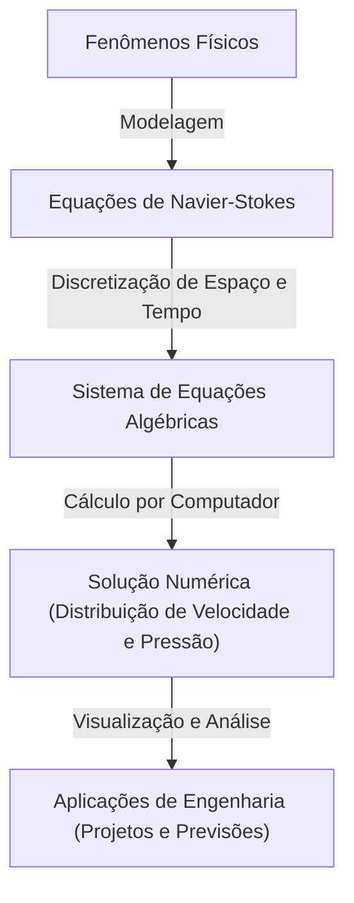

## 1. Introdução: As Equações que Governam o Mundo dos Fluidos

O fluxo da água e do ar que vemos no nosso dia a dia apresenta um comportamento extremamente complexo e difícil de prever. Os belos padrões que se espalham quando despejamos leite no café, os enormes vórtices trazidos por tufões ou o ar fluindo pelas asas de um avião. As **equações de Navier-Stokes** (Navier-Stokes equations) descrevem todo o movimento desses fluidos dentro de uma única estrutura.

Essas equações foram derivadas no século 19 por Claude-Louis Navier e George Gabriel Stokes. Desde então, elas têm desempenhado um papel indispensável na ciência e engenharia modernas, desde a previsão do tempo até o projeto de aeronaves e até a análise do fluxo sanguíneo. No entanto, essas equações escondem um **mistério supremo** que ainda não foi resolvido física e matematicamente.

O problema é: "As soluções para as equações incompressíveis de Navier-Stokes no espaço tridimensional sempre existem e são suaves?". Este é um dos Problemas do Prêmio Millennium (Millennium Prize Problems) anunciados pelo Clay Mathematics Institute no ano 2000, e quem o resolver receberá um prêmio de 1 milhão de dólares.

Neste artigo, desvendaremos o significado dessas equações fascinantes e nos aprofundaremos em por que provar a existência de suas soluções é tão incrivelmente difícil.

## 2. A Forma e o Significado das Equações de Navier-Stokes

Primeiro, vamos olhar para as próprias equações. Aqui, consideraremos as equações de Navier-Stokes mais básicas para um "fluido incompressível" com densidade constante.

$$
\rho \left( \frac{\partial \mathbf{u}}{\partial t} + (\mathbf{u} \cdot \nabla)\mathbf{u} \right) = -\nabla p + \mu \nabla^2 \mathbf{u} + \mathbf{f}
$$

$$
\nabla \cdot \mathbf{u} = 0
$$

Aqui, cada símbolo representa as seguintes quantidades físicas:
- $\mathbf{u}$ : campo vetorial de velocidade (velocity vector field)
- $p$ : pressão (pressure)
- $\rho$ : densidade (density, constante)
- $\mu$ : viscosidade dinâmica (dynamic viscosity)
- $\mathbf{f}$ : campo vetorial de força externa (external force, como a gravidade)

### 2.1. Interpretação Física de Cada Termo

Essas equações são essencialmente a aplicação da equação de movimento de Newton, $F = ma$, aos fluidos. O lado esquerdo corresponde a "massa $\times$ aceleração", e o lado direito corresponde à "força atuando no fluido".

#### Lado Esquerdo: Termos Inerciais (Inertial Terms)
O lado esquerdo é a **derivada material** (material derivative) que representa a aceleração das partículas de fluido.
- $\frac{\partial \mathbf{u}}{\partial t}$ : Termo de derivada local (Local derivative). Representa a mudança temporal da velocidade em um ponto fixo.
- $(\mathbf{u} \cdot \nabla)\mathbf{u}$ : Termo convectivo (Convective term). Representa a mudança na velocidade causada pelo movimento do próprio fluido. Este termo é não linear em relação à velocidade $\mathbf{u}$ e é a maior causa das dificuldades matemáticas na dinâmica dos fluidos. A ocorrência da turbulência (turbulence) também se deve a este termo não linear.

#### Lado Direito: Termos de Força (Force Terms)
O lado direito representa as várias forças que atuam sobre as partículas do fluido.
- $-\nabla p$ : Força do gradiente de pressão (Pressure gradient force). O fluido é empurrado das áreas de alta pressão para as de baixa pressão.
- $\mu \nabla^2 \mathbf{u}$ : Termo viscoso (Viscous force). A força de atrito devido à "viscosidade" do fluido. Ele tem o efeito de suavizar a diferença de velocidade entre as camadas adjacentes de fluido e estabilizar o fluxo. O Laplaciano $\nabla^2$ é usado.
- $\mathbf{f}$ : Força externa (Body force). Força aplicada do exterior, como a gravidade.

#### Equação da Continuidade (Continuity Equation)
A segunda equação, $\nabla \cdot \mathbf{u} = 0$, é a "equação de continuidade" representando a **lei da conservação de massa** (conservation of mass). Isso significa que o fluido não aparece nem desaparece, e que seu volume é mantido constante (é incompressível).

## 3. Dificuldades Matemáticas: Por que Não Pode ser Provado?

Nas áreas de física e engenharia, as equações de Navier-Stokes são "resolvidas" diariamente por dinâmica dos fluidos computacional (CFD) usando supercomputadores. No entanto, saber se "existe uma solução exata" em sentido matemático é um problema diferente.

### 3.1. O que é a "Existência de uma Solução Suave"?

O que os matemáticos procuram é a prova de que, para uma dada condição inicial, um campo de velocidade $\mathbf{u}(x, t)$ e um campo de pressão $p(x, t)$ infinitamente diferenciáveis (suaves) que satisfaçam a equação sempre existirão em qualquer momento futuro $t > 0$.

Se tal solução suave não existir, significa que em algum momento (tempo finito), a velocidade do fluxo ou a pressão irão divergir ao infinito (ocorrerá uma singularidade). Isso é chamado de **explosão em tempo finito** (finite-time blowup).

### 3.2. Viscosidade vs. Não Linearidade: O Conflito

Se a solução explode ou não, é determinado pelo equilíbrio entre dois termos na equação.
- **Termo viscoso** $\mu \nabla^2 \mathbf{u}$ : O termo "bom" que tenta dissipar energia e tornar o fluxo suave.
- **Termo convectivo** $(\mathbf{u} \cdot \nabla)\mathbf{u}$ : O termo "ruim" (termo não linear) que concentra energia em áreas estreitas, estica vórtices e tenta tornar o gradiente de velocidade acentuado.

No espaço bidimensional, a existência e a suavidade da solução foram comprovadas por Jean Leray e outros na década de 1930. Em 2D, o mecanismo onde os vórtices se estendem (alongamento do tubo de vórtice) não existe, por isso a viscosidade consegue suprimir o termo não linear.

No entanto, no espaço tridimensional, ocorre um fenômeno onde o fluido se emaranha de forma complexa, os tubos de vórtice são alongados e a energia desce continuamente (efeito cascata) para escalas extremamente pequenas (cascata de energia). Com os métodos matemáticos atuais, é impossível avaliar se a viscosidade sempre consegue suprimir esses poderosos efeitos não lineares específicos das 3 dimensões.

### 3.3. Soluções Fracas (Weak Solutions) e a Contribuição de Leray

Jean Leray também introduziu o conceito de **soluções fracas** (weak solutions), que relaxa as condições diferenciais da equação. Leray provou que, mesmo no espaço 3D, existe (pelo menos uma) solução fraca globalmente que satisfaz a desigualdade de energia (solução fraca de Leray-Hopf).

No entanto, se essa solução fraca é única (se resolve apenas em uma) e se é suave ainda permanece desconhecido hoje.

## 4. Formulação como um Problema do Prêmio Millennium

O cenário oficial do problema do Clay Mathematics Institute é, grosso modo, provar uma das seguintes afirmações:

1. **Prova de existência e suavidade**: Mostrar que, para condições iniciais e forças externas suaves arbitrárias, existe uma solução suave definida em todo o espaço que dura para toda a eternidade.
2. **Prova de quebra (explosão) da solução**: Construir um exemplo onde, ao fornecer uma condição inicial e força externa suaves específicas, a solução perde sua suavidade (tem uma singularidade) em tempo finito.

Muitos matemáticos brilhantes tentaram este problema, mas não chegaram a uma solução completa. Até mesmo Terence Tao, um dos maiores matemáticos modernos, mostrou que "as equações de Navier-Stokes promediadas explodem em tempo finito", destacando a dificuldade do problema original.

## 5. Como o Mundo Mudará Quando For Resolvido?

Se este problema for resolvido, quais serão as consequências?

### 5.1. Avanço Drástico na Matemática
A prova de existência ou de explosão das soluções vai precisar de ferramentas matemáticas completamente novas que vão além do atual escopo da teoria das equações diferenciais parciais. Isso seria um grande avanço para a análise de fenômenos não lineares.

### 5.2. Compreensão da Turbulência
O simples fato de se provar a suavidade da solução não melhorará imediatamente a eficiência de combustível de aviões. No entanto, garantirá que as equações de Navier-Stokes sejam um modelo perfeito capaz de descrever perfeitamente o fenômeno extremamente complexo da turbulência no nível microscópico, sem falhas. Isso pode impulsionar grandemente a nossa compreensão do mecanismo físico por trás da turbulência.

### 5.3. Descoberta de Novos Fenômenos Físicos
Por outro lado, o que acontece se for provado que a solução explode em tempo finito? Isso significará que, quando o fluido atingir um estado extremo, as equações de Navier-Stokes (ou seja, a hipótese do contínuo) quebrarão, e novas leis físicas no nível atômico e molecular precisarão ser consideradas. Isso, por si só, será uma descoberta espetacular para a física.

## 6. Relação com os Cálculos Numéricos: Limites e Possibilidades da CFD

Mesmo que a prova matemática não tenha sido concluída, os engenheiros resolvem numericamente as equações de Navier-Stokes todos os dias e as usam no mundo real. Como essa lacuna está sendo preenchida?

### 6.1. Abordagem da Dinâmica de Fluidos Computacional (CFD)

Ao usar computadores para resolver as equações, dividimos o espaço e o tempo contínuos em um número finito de células (grades). Isso se chama discretização.

### 6.2. A Necessidade dos Modelos de Turbulência

Devido às limitações de capacidade do computador, é impossível expressar a menor escala de turbulência (escala de Kolmogorov) através de malhas de grade de forma completa. Portanto, **modelos de turbulência** (Turbulence models) são introduzidos para aproximar o comportamento desses pequenos vórtices.
Os mais representativos incluem RANS (Reynolds-Averaged Navier-Stokes) e LES (Large Eddy Simulation). Compreender as propriedades matemáticas das equações originais também é fundamental para avaliar a precisão e a validade desses modelos.

## 7. Conclusão

À primeira vista, as equações de Navier-Stokes ocultam a complexidade do universo em uma fórmula bastante simples. Do vórtice em uma xícara de café à circulação atmosférica de Júpiter, a beleza e o caos dos fluidos são criados por essa equação.

A razão pela qual os matemáticos continuam a desafiar esse "mistério supremo" não é apenas pelo prêmio de um milhão de dólares. Trata-se de um desafio aos limites da razão humana em compreender quão longe fenômenos naturais complexos podem ser capturados pela linguagem da matemática.

Se chegar o dia em que matemáticos do futuro entenderem completamente esta equação, poderemos dizer que finalmente "entendemos" o fluxo da água e do ar em um sentido real. Até lá, as equações de Navier-Stokes permanecerão como uma montanha bela, mas íngreme, elevando-se nas fronteiras da ciência.

---
*Este artigo fornece uma visão geral de um tema profundo na intersecção da dinâmica dos fluidos e da matemática. Para aqueles interessados, recomendamos consultar textos mais especializados em equações diferenciais parciais e a documentação oficial do Clay Mathematics Institute.*
