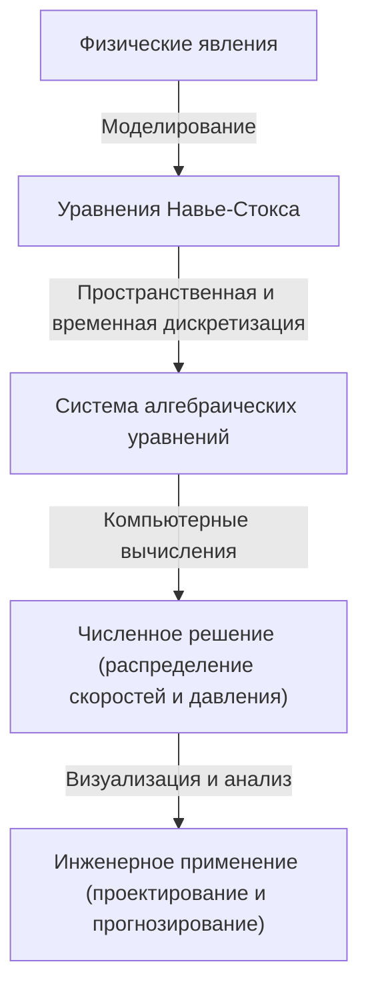

## 1. Введение: Уравнения, управляющие миром жидкостей

Потоки воды и воздуха, которые мы видим каждый день, демонстрируют чрезвычайно сложное и непредсказуемое поведение. Красивые узоры, расходящиеся при добавлении молока в кофе, гигантские водовороты тайфунов или воздух, обтекающий крылья самолета. Все эти движения жидкостей и газов описываются в единой структуре **уравнениями Навье-Стокса** (Navier-Stokes equations).

Эти уравнения были выведены в 19 веке Клодом-Луи Навье (Claude-Louis Navier) и Джорджем Габриелем Стоксом (George Gabriel Stokes). С тех пор они играют незаменимую роль в современной науке и технике, от прогнозирования погоды до проектирования самолетов и даже анализа кровотока. Однако эти уравнения скрывают в себе **величайшую загадку**, до сих пор не разгаданную ни физически, ни математически.

Вопрос звучит так: "Всегда ли существуют и являются ли гладкими решения уравнений Навье-Стокса для несжимаемой жидкости в трехмерном пространстве?". Это одна из Задач тысячелетия (Millennium Prize Problems), объявленных Математическим институтом Клэя (Clay Mathematics Institute) в 2000 году, за решение которой назначена награда в 1 миллион долларов.

В этой статье мы раскроем смысл этих захватывающих уравнений и углубимся в то, почему доказать существование их решений так невероятно сложно.

## 2. Форма и значение уравнений Навье-Стокса

Сначала давайте посмотрим на сами уравнения. Здесь мы рассмотрим самые базовые уравнения Навье-Стокса для "несжимаемой жидкости" с постоянной плотностью.

$$
\rho \left( \frac{\partial \mathbf{u}}{\partial t} + (\mathbf{u} \cdot \nabla)\mathbf{u} \right) = -\nabla p + \mu \nabla^2 \mathbf{u} + \mathbf{f}
$$

$$
\nabla \cdot \mathbf{u} = 0
$$

Здесь каждый символ обозначает следующую физическую величину:
- $\mathbf{u}$ : Векторное поле скорости жидкости (velocity vector field)
- $p$ : Давление (pressure)
- $\rho$ : Плотность (density, константа)
- $\mu$ : Динамическая вязкость (dynamic viscosity)
- $\mathbf{f}$ : Векторное поле внешних сил (external force, например, гравитация)

### 2.1. Физическая интерпретация каждого члена

Эти уравнения, по сути, являются применением второго закона Ньютона $F = ma$ к жидкостям. Левая часть соответствует "масса $\times$ ускорение", а правая часть — "силам, действующим на жидкость".

#### Левая часть: Инерционные члены (Inertial Terms)
Левая часть представляет собой **материальную производную** (material derivative), выражающую ускорение частиц жидкости.
- $\frac{\partial \mathbf{u}}{\partial t}$ : Локальная производная (Local derivative). Представляет изменение скорости со временем в фиксированной точке.
- $(\mathbf{u} \cdot \nabla)\mathbf{u}$ : Конвективный член (Convective term). Представляет изменение скорости, вызванное движением самой жидкости. Этот член нелинеен относительно скорости $\mathbf{u}$ и является главной причиной математических трудностей в гидродинамике. Возникновение турбулентности (turbulence) также связано с этим нелинейным членом.

#### Правая часть: Силовые члены (Force Terms)
Правая часть представляет различные силы, действующие на частицы жидкости.
- $-\nabla p$ : Сила градиента давления (Pressure gradient force). Жидкость выталкивается из области высокого давления в область низкого.
- $\mu \nabla^2 \mathbf{u}$ : Сила вязкости (Viscous force). Это сила трения, обусловленная "липкостью" жидкости. Она сглаживает разницу скоростей между соседними слоями жидкости и стабилизирует поток. Здесь используется оператор Лапласа $\nabla^2$.
- $\mathbf{f}$ : Объемная сила (Body force). Внешние силы, такие как гравитация.

#### Уравнение непрерывности (Continuity Equation)
Второе уравнение $\nabla \cdot \mathbf{u} = 0$ — это "уравнение непрерывности", выражающее **закон сохранения массы** (conservation of mass). Оно означает, что жидкость не возникает и не исчезает, а ее объем остается постоянным (она несжимаема).

## 3. Математические трудности: Почему это нельзя доказать?

В практической физике и инженерии уравнения Навье-Стокса ежедневно "решаются" с помощью вычислительной гидродинамики (CFD) на суперкомпьютерах. Однако "существует ли точное решение" в математическом смысле — это совсем другой вопрос.

### 3.1. Что означает "существование гладкого решения"?

Математики ищут доказательство того, что для заданных начальных условий всегда существуют бесконечно дифференцируемые (гладкие) поле скоростей $\mathbf{u}(x, t)$ и поле давления $p(x, t)$, которые удовлетворяют уравнениям в любой будущий момент времени $t > 0$.

Если гладкого решения не существует, это означает, что в некоторый момент (за конечное время) скорость потока или давление будут стремиться к бесконечности (возникнет сингулярность). Это называется **разрушением решения за конечное время** (finite-time blowup).

### 3.2. Вязкость против нелинейности: Противостояние

Произойдет ли разрушение решения, зависит от баланса между двумя членами уравнения.
- **Вязкий член** $\mu \nabla^2 \mathbf{u}$ : "Хороший" член, который рассеивает энергию и стремится сделать поток гладким.
- **Конвективный член** $(\mathbf{u} \cdot \nabla)\mathbf{u}$ : "Плохой" (нелинейный) член, который концентрирует энергию в узких областях, растягивает вихри и делает градиенты скорости резкими.

Для двумерного пространства существование и гладкость решений были доказаны Жаном Лере (Jean Leray) и другими в 1930-х годах. В 2D нет механизма растяжения вихрей (удлинения вихревых нитей), поэтому вязкость может подавить нелинейный член.

Однако в трехмерном пространстве жидкости сложно переплетаются, вихревые нити растягиваются, и происходит явление, при котором энергия каскадирует ко все меньшим масштабам (энергетический каскад). С помощью современных математических методов невозможно оценить, всегда ли вязкость может подавить этот мощный нелинейный эффект, характерный для 3D.

### 3.3. Слабые решения (Weak Solutions) и вклад Лере

Жан Лере также ввел понятие **слабых решений** (weak solutions), которое ослабляет условия дифференцируемости уравнений. Лере доказал, что глобально существует (по крайней мере одно) слабое решение, удовлетворяющее энергетическому неравенству, даже в трехмерном пространстве (слабые решения Лере-Хопфа).

Однако до сих пор остается неизвестным, является ли это слабое решение единственным и является ли оно гладким.

## 4. Формулировка в качестве Задачи тысячелетия

Официальная постановка задачи Математическим институтом Клэя заключается, грубо говоря, в доказательстве одного из следующих утверждений:

1. **Доказательство существования и гладкости**: Показать, что для любых гладких начальных условий и внешних сил существует гладкое решение, определенное во всем пространстве для любого момента времени в будущем.
2. **Доказательство разрушения решения (взрыва)**: Построить пример, в котором при заданных гладких начальных условиях и внешних силах решение теряет гладкость (появляется сингулярность) за конечное время.

Многие гениальные математики пытались решить эту задачу, но полного решения пока не найдено. Даже один из величайших современных математиков, Теренс Тао (Terence Tao), показал, что "в усредненных уравнениях Навье-Стокса решение разрушается за конечное время", что подчеркивает сложность исходной задачи.

## 5. Как изменится мир, когда задача будет решена?

Если эта проблема будет решена, какими будут последствия?

### 5.1. Экспоненциальный прогресс в математике
Для доказательства существования или разрушения потребуются совершенно новые математические инструменты, выходящие за рамки современной теории уравнений в частных производных. Это станет огромным прорывом в анализе нелинейных явлений.

### 5.2. Понимание турбулентности
Доказательство гладкости решений не означает, что самолеты сразу же станут более экономичными. Однако оно гарантирует, что уравнения Навье-Стокса являются идеальной моделью, способной без сбоев описывать чрезвычайно сложное явление турбулентности вплоть до микроскопического уровня. Это может значительно продвинуть наше понимание физических механизмов турбулентности.

### 5.3. Открытие новых физических явлений
И наоборот, что произойдет, если будет доказано, что решение разрушается за конечное время? Это будет означать, что когда жидкость достигает экстремальных состояний, уравнения Навье-Стокса (то есть гипотеза сплошной среды) перестают работать, и мы должны учитывать новые физические законы на атомном или молекулярном масштабе. Само по себе это стало бы поразительным открытием в физике.

## 6. Связь с численными расчетами: Ограничения и возможности CFD

Несмотря на отсутствие полного математического доказательства, инженеры численно решают уравнения Навье-Стокса и применяют их в реальном мире. Как заполняется этот пробел?

### 6.1. Подход вычислительной гидродинамики (CFD)

При решении уравнений с помощью компьютера непрерывное пространство и время делятся на конечное число ячеек (сетку). Это называется дискретизацией.

### 6.2. Необходимость моделей турбулентности

Поскольку вычислительные мощности ограничены, невозможно представить все на сетке вплоть до наименьших масштабов турбулентности (масштаб Колмогорова). Поэтому вводятся **модели турбулентности** (Turbulence models), которые приближенно описывают поведение малых вихрей.
Среди наиболее распространенных — RANS (Reynolds-Averaged Navier-Stokes) и LES (Large Eddy Simulation). Понимание математических свойств исходных уравнений также важно для оценки достоверности этих моделей.

## 7. Заключение

На первый взгляд простые уравнения Навье-Стокса скрывают в себе сложность всей Вселенной. От водоворота в кофейной чашке до атмосферной циркуляции на Юпитере — вся красота и хаос жидкостей порождаются этими уравнениями.

Причина, по которой математики продолжают биться над этой "величайшей загадкой", заключается не только в миллионе долларов. Это вызов границам того, насколько человеческий разум может охватить сложные явления природы с помощью языка математики.

Если когда-нибудь настанет день, когда математики будущего полностью поймут эти уравнения, мы сможем сказать, что мы "поняли" потоки воды и воздуха в истинном смысле этого слова. А до тех пор уравнения Навье-Стокса останутся прекрасной, но неприступной горой, возвышающейся на передовой науки.

---
*Эта статья представляет собой обзор глубокой темы на пересечении гидродинамики и математики. Тем, кто заинтересовался, мы рекомендуем обратиться к более специализированным текстам по уравнениям в частных производных и официальной документации Математического института Клэя.*
