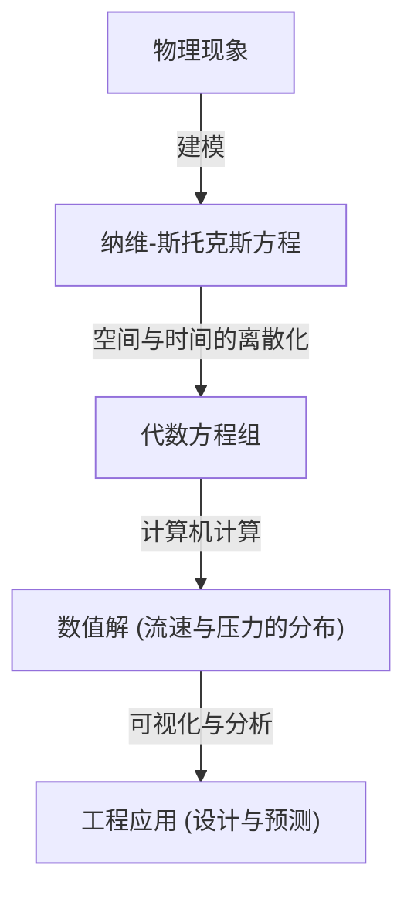

## 1. 引言：支配流体世界的方程

我们日常看到的水和空气的流动，表现出极其复杂且难以预测的行为。倒入咖啡中扩散的牛奶形成的优美图案、台风带来的巨大漩涡，亦或是流过飞机机翼的空气。所有这些流体的运动，都由一个单一的框架来描述，那就是 **纳维-斯托克斯方程** (Navier-Stokes equations)。

该方程在19世纪由克劳德-路易·纳维 (Claude-Louis Navier) 和乔治·加布里埃尔·斯托克斯 (George Gabriel Stokes) 导出。自那时起，从天气预报到飞机设计，乃至血流分析，它在现代科学和工程学中发挥了不可或缺的作用。然而，在物理学和数学上，这个方程仍然隐藏着一个尚未被解开的 **终极之谜** 。

那就是“在三维空间中，不可压缩纳维-斯托克斯方程的解，是否总是存在且平滑？”这个问题。这是克雷数学研究所 (Clay Mathematics Institute) 于2000年公布的千禧年大奖难题 (Millennium Prize Problems) 之一，解决该问题的人将获得100万美元的奖金。

在本文中，我们将揭开这个迷人方程的含义，并深入探讨为什么证明其解的存在性会如此困难。

## 2. 纳维-斯托克斯方程的形式与含义

首先，让我们看看方程本身。在这里，我们考虑针对密度恒定的“不可压缩流体”的最基本的纳维-斯托克斯方程。

$$
\rho \left( \frac{\partial \mathbf{u}}{\partial t} + (\mathbf{u} \cdot \nabla)\mathbf{u} \right) = -\nabla p + \mu \nabla^2 \mathbf{u} + \mathbf{f}
$$

$$
\nabla \cdot \mathbf{u} = 0
$$

这里，各个符号代表以下物理量：
- $\mathbf{u}$ : 流体的速度向量场 (velocity vector field)
- $p$ : 压力 (pressure)
- $\rho$ : 密度 (density, 常数)
- $\mu$ : 动力粘度系数 (dynamic viscosity)
- $\mathbf{f}$ : 外力向量场 (external force, 如重力等)

### 2.1. 各项的物理学解释

这个方程本质上是将牛顿运动方程 $F = ma$ 应用于流体。左边对应于“质量 $\times$ 加速度”，右边对应于“作用在流体上的力”。

#### 左边：惯性项 (Inertial Terms)
左边是表示流体粒子加速度的 **物质导数** (material derivative)。
- $\frac{\partial \mathbf{u}}{\partial t}$ : 局部导数项 (Local derivative)。表示在某个固定点的速度随时间的变化。
- $(\mathbf{u} \cdot \nabla)\mathbf{u}$ : 对流项 (Convective term)。表示由于流体自身移动而产生的速度变化。该项对于速度 $\mathbf{u}$ 是非线性的，并且是流体力学中数学上最大的困难原因。湍流 (turbulence) 的产生也归因于这个非线性项。

#### 右边：力的项 (Force Terms)
右边表示作用在流体粒子上的各种力。
- $-\nabla p$ : 压力梯度项 (Pressure gradient force)。流体会从高压处被推向低压处。
- $\mu \nabla^2 \mathbf{u}$ : 粘性项 (Viscous force)。由于流体的“粘性”引起的摩擦力。它具有平滑相邻流体层之间的速度差并稳定流动的效果。使用了拉普拉斯算子 $\nabla^2$。
- $\mathbf{f}$ : 外力项 (Body force)。如重力等从外部施加的力。

#### 连续性方程 (Continuity Equation)
第二个公式 $\nabla \cdot \mathbf{u} = 0$ 是表示 **质量守恒定律** (conservation of mass) 的“连续性方程”。这意味着流体不会涌出或消失，体积保持恒定（不可压缩）。

## 3. 数学上的困难：为什么无法证明？

在物理学和工程学的现场，纳维-斯托克斯方程每天都在通过使用超级计算机的计算流体力学 (CFD) 被“求解”。但是，在数学意义上的“是否存在严格解”则是另一回事。

### 3.1. 什么是“平滑解的存在性”？

数学家们寻求的是一种证明，即对于给定的初始条件，在未来的任意时刻 $t > 0$，总是存在满足方程的、无限次可导（平滑）的速度场 $\mathbf{u}(x, t)$ 和压力场 $p(x, t)$。

如果不存在平滑的解，那么在某个时刻（有限时间内），流速和压力将发散到无穷大（出现奇点）。这被称为 **有限时间内的爆破** (finite-time blowup)。

### 3.2. 粘性与非线性：相互较量

解是否会发生爆破，取决于方程中两项之间的平衡。
- **粘性项** $\mu \nabla^2 \mathbf{u}$ : 耗散能量并试图使流动平滑的“好”项。
- **对流项** $(\mathbf{u} \cdot \nabla)\mathbf{u}$ : 将能量集中在狭窄区域，拉伸漩涡，并试图使速度梯度变得陡峭的“坏”项（非线性项）。

在二维空间中，让·勒雷 (Jean Leray) 等人在20世纪30年代证明了解的存在性与平滑性。在二维中，不存在漩涡被拉伸的机制（涡丝的拉伸），因此粘性可以抑制非线性项。

但在三维空间中，流体错综复杂地交织在一起，涡丝被拉伸，能量随之级联到极小尺度（能量级联）的现象会发生。目前的数学方法无法评估粘性是否能始终抑制这种三维特有的强烈的非线性效应。

### 3.3. 弱解 (Weak Solutions) 与勒雷的贡献

让·勒雷还引入了放宽方程微分条件的 **弱解** (weak solutions) 概念。勒雷证明了即使在三维空间中，满足能量不等式的弱解（至少存在一个）全局存在（勒雷-霍普夫弱解）。

然而，这个弱解是否唯一（是否只确定一个），以及是否平滑，至今仍然未知。

## 4. 作为千禧年大奖难题的表述

克雷数学研究所的官方问题设定，大致上是为了证明以下两项之一：

1. **存在性与平滑性的证明** ：证明对于任意平滑的初始条件和外力，在整个空间定义的平滑解在未来的永恒中都存在。
2. **解的破裂（爆破）的证明** ：构造一个例子，使得在给定的特定平滑初始条件和外力下，解在有限时间内失去平滑性（具有奇点）。

迄今为止，许多天才数学家都挑战过这个问题，但仍未得出完全的解答。甚至像陶哲轩 (Terence Tao) 这样的现代最伟大的数学家之一，也得出了“在平均化的纳维-斯托克斯方程中，解会在有限时间内爆破”的结论，凸显了原问题的难度。

## 5. 解开谜题后世界将如何改变？

如果这个问题被解决，会有什么影响呢？

### 5.1. 数学的飞跃性进步
解的存在性或爆破的证明，将需要一套超越当前偏微分方程论框架的全新数学工具。这将成为分析非线性现象的巨大突破。

### 5.2. 对湍流的理解
即使证明了解的平滑性，也不会立刻提高飞机的燃油效率。但是，这将保证纳维-斯托克斯方程是一个完美的模型，能够毫无破绽地描述湍流这种极其复杂的现象，甚至细微到微观世界。这可能会使对湍流物理机制的理解取得重大进展。

### 5.3. 新物理现象的发现
相反，如果证明了解会在有限时间内爆破，那又会怎样呢？这意味着，当流体达到极限状态时，纳维-斯托克斯方程（即连续体假设）将会破裂，必须考虑在原子或分子尺度上的新物理定律。这本身也将是物理学上的一项惊人发现。

## 6. 与数值计算的关系：CFD 的局限性与可能性

尽管数学上的证明尚未完成，但工程师们仍在通过数值方法求解纳维-斯托克斯方程，并将其应用于现实社会。这个差距是如何弥补的呢？

### 6.1. 计算流体力学 (CFD) 的方法

在使用计算机求解方程时，连续的空间和时间被划分为有限个网格 (grid)。这被称为离散化。

### 6.2. 湍流模型的必要性

由于计算机能力的限制，不可能将湍流的最小尺度（柯尔莫哥洛夫尺度）全部用网格表示。因此，引入了近似处理小漩涡行为的 **湍流模型** (Turbulence models)。
具有代表性的有 RANS (Reynolds-Averaged Navier-Stokes) 和 LES (Large Eddy Simulation)。在评估这些模型的有效性时，理解原方程的数学性质也很重要。

## 7. 结语

乍看之下，纳维-斯托克斯方程在简单的数学公式中隐藏着宇宙的复杂性。从咖啡杯中的漩涡到木星的大气环流，流体的所有美丽和混沌都源于这个方程。

数学家们不断挑战这个“终极之谜”的原因，绝不仅仅是为了那100万美元的奖金。这是对人类理性的极限的挑战，探究我们到底能在多大程度上用数学这门语言捕捉自然界的复杂现象。

如果有一天，未来的数学家能够完全理解这个方程，我们就能说真正地“理解了”水和空气的流动。直到那一天，纳维-斯托克斯方程将继续作为科学最前沿的一座既美丽又险峻的高山屹立着。

---
*本文概述了位于流体力学与数学交汇处的深奥主题。如果您感兴趣，建议您参考更专业的偏微分方程教材或克雷数学研究所的官方文件。*
